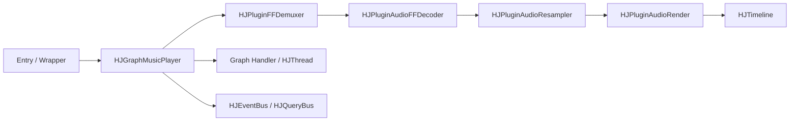

# HJGraphMusicPlayer 架构

## 目的
本文档描述 `HJGraphMusicPlayer` 的实际架构和控制语义。

它面向：
- 需要在修改播放器代码前建立稳定上下文的 LLM
- 需要快速恢复设计理解的维护者
- 想理解纯音频播放器 graph 的其他读者

## 一句话总结
`HJGraphMusicPlayer` 是 `hjmedia` 中的纯音频播放 graph。它组装 demux、decode、resample 和 render 链路，并协调 graph 层策略，例如 seek 串行化、repeat 处理、timeline 访问和最终 EOF 投递。

## 范围
本模块负责：
- 打开音频源
- 控制 pause、resume、seek、mute、volume 和 track switch 等播放状态
- 通过 `HJTimeline` 暴露播放时间
- 在插件之间协调 repeat 和最终 EOF 行为

本模块不负责：
- 视频渲染
- 复杂 UI 状态管理
- 强可复用的 `close()` / stop 契约

## 代码位置
核心实现：
- [HJGraphMusicPlayer.h](/f:/Source/hjmedia/src/graphs/HJGraphMusicPlayer.h)
- [HJGraphMusicPlayer.cpp](/f:/Source/hjmedia/src/graphs/HJGraphMusicPlayer.cpp)

关键依赖：
- [HJTimeline.md](/f:/Source/hjmedia/src/plugins/doc/HJTimeline.md)
- [HJPluginDemuxer.md](/f:/Source/hjmedia/src/plugins/doc/HJPluginDemuxer.md)
- [HJPluginAudioFFDecoder.md](/f:/Source/hjmedia/src/plugins/doc/HJPluginAudioFFDecoder.md)
- [HJPluginAudioResampler.md](/f:/Source/hjmedia/src/plugins/doc/HJPluginAudioResampler.md)
- [HJPluginAudioRender.md](/f:/Source/hjmedia/src/plugins/doc/HJPluginAudioRender.md)
- [HJThread README](/f:/Source/hjmedia/src/utils/HJThread/doc/README.md)

## 组件图

## 初始化流程
高层初始化顺序如下：

1. 初始化 graph 层基础设施
2. 注册 event 和 query handler
3. 创建 graph 自己的控制线程和 handler
4. 创建 render 线程和 audio worker 线程
5. 创建 `HJTimeline`
6. 创建 demuxer、decoder、resampler 和 audio render 插件
7. 连接插件链
8. 初始化插件，并传入所需的 thread / timeline / audio-format 状态

graph 自己的 handler 主要用于串行化 seek 请求，避免 seek 直接在调用方线程上执行。

## 核心数据路径
主路径：

`openURL -> demux -> decode -> resample -> render -> timeline`

每一步的含义：
- demuxer 从媒体源读取压缩 packet
- audio decoder 把 packet 转换为解码后的音频帧
- resampler 把音频转换或重新打包为目标输出格式
- audio render 消费 PCM，并驱动实际播放头
- timeline 向 graph 和调用方暴露当前播放进度

## 核心控制路径
重要控制操作：

- `openURL()`
  - 转发给 demuxer
- `pause()`
  - 暂停 timeline 推进，并暂停 render 侧播放
- `resume()`
  - 恢复 render 侧播放，并重启 timeline 推进
- `seek()`
  - 投递到 graph 自己的 handler，而不是直接驱动 demuxer
- `switchAudioTrack()`
  - 当前使用轻量级的 demuxer 侧直接切换
- `setRepeats()`
  - 更新 graph 层 repeat 策略，后续 EOF 处理时使用

## 线程模型
这里至少有三个重要线程角色：

### Graph control thread
由 graph 自己持有。

用于：
- graph handler
- 串行化 seek 请求
- 把 graph 层控制时序从任意调用方线程中隔离出来

### Audio worker thread
供 decoder 和 resampler 等音频处理插件使用。

### Render thread
用于支持 render 侧异步行为。具体细节仍取决于平台 render 实现。

## 重要线程约束
- 从 API 调用方角度看，`seek()` 是异步的。
- 快速重复 seek 请求会通过 handler 侧清理语义合并，而不是无限排队。
- 播放时间戳的含义取决于 render 侧进度，而不是 decode 侧进度。
- teardown 和延迟任务推理必须结合 `HJThread` weak-target 语义一起检查。

## Timeline 语义
`getCurrentTimestamp()` 主要由 `HJTimeline` 支撑。

对这个 graph 来说，关键解释是：
- 可见播放头实际上由 audio render 驱动
- graph 不发明自己独立的播放时钟

这是一个关键设计选择。如果 render 侧 pause、buffering 或 teardown 语义发生变化，时间戳行为也可能跟着变化。

## Repeat 和 EOF 策略
这个 graph 中有两个不同的 EOF 概念。

### Demuxer EOF
Demuxer EOF 表示源已经没有更多上游输入可提供。

此时 graph 决定：
- 重置以进入下一轮 repeat
- 或标记最终 EOF 已经 pending

### Final playback EOF
Final playback EOF 只会在 render 侧消费达到终止条件后上报。

这个区别是有意设计的：
- demuxer EOF 表示“没有更多源数据”
- final playback EOF 表示“用户实际上已经播放到结尾”

后续重构时应保留这种区分。

## Final EOF 后的时间戳钳制
最终音频播放完成后，graph 会保存最后一个有效播放时间，并把后续 `getCurrentTimestamp()` 结果钳制到这个最大值。

这样做的原因：
- 防止播放时间在终止完成后继续漂移
- 让 EOF 后的 UI 和状态查询保持稳定

## 音轨切换
当前音轨切换是轻量级的：
- 校验请求的 track
- 如果已经选中，则不做任何操作
- 否则要求 demuxer 切换

代码库仍然暗示未来可能需要更重的设计，涉及 seek / flush / resume 协调。因此这个区域应被视为可演进，而不是已经完全封闭。

## 生命周期说明

### `close()`
当前 `close()` 行为较弱，不应被理解为完整 teardown 契约。

实际影响：
- wrapper 层不应假设 `close()` 会完全释放播放 pipeline
- 更强的 stop/reuse 语义需要额外设计，而不是只改 wrapper 命名

### `done()` / internal release
实际 teardown 发生在面向 release 的路径中，这些路径会清理 plugins、threads、timeline 和 graph 持有的基础设施。

## 已知风险
- `close()` 语义较弱，容易被过度假设。
- seek 是异步的，wrapper 或调用方容易误解。
- timeline 含义依赖 render 行为。
- final EOF 依赖多个 graph 层状态变量和插件侧进度。
- track switching 未来可能仍有细化空间。

## LLM 下一步应该读什么
读完本文档后，推荐阅读顺序：
1. [HJGraphMusicPlayer_AudioContextGuide.md](/f:/Source/hjmedia/docs/architecture/HJGraphMusicPlayer_AudioContextGuide.md)
2. [HJThread README](/f:/Source/hjmedia/src/utils/HJThread/doc/README.md)
3. [HJTimeline.md](/f:/Source/hjmedia/src/plugins/doc/HJTimeline.md)
4. [HJPluginDemuxer.md](/f:/Source/hjmedia/src/plugins/doc/HJPluginDemuxer.md)
5. [HJPluginAudioFFDecoder.md](/f:/Source/hjmedia/src/plugins/doc/HJPluginAudioFFDecoder.md)
6. [HJPluginAudioResampler.md](/f:/Source/hjmedia/src/plugins/doc/HJPluginAudioResampler.md)
7. [HJPluginAudioRender.md](/f:/Source/hjmedia/src/plugins/doc/HJPluginAudioRender.md)

## 推荐审查重点
审查这个 graph 周边代码时，重点关注：
- 控制动作的线程所有权是否仍然正确
- seek 语义是否仍然保持串行化和异步
- timeline 含义是否仍然匹配 render 侧进度
- demux EOF 和最终播放 EOF 是否仍然保持区分
- teardown 后是否留下延迟任务或陈旧回调
