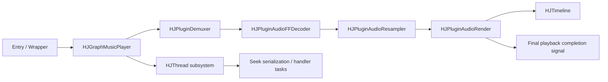

# HJGraphMusicPlayer 音频上下文指南

## 目的
本指南用于衔接两组文档：
- `HJThread` 子系统文档
- `HJGraphMusicPlayer` 音频链路文档

它的目标是在读者修改 music player 栈代码之前，为 LLM 和人工读者提供一条稳定的阅读路径。

## 什么时候应该先读这份文档
如果你的任务涉及以下任何内容，请先阅读本指南：
- 不冷读所有源码，先理解播放器整体结构
- 调试 seek、EOF、repeat 或 teardown 行为
- 复查线程所有权或延迟任务投递
- 修改音频链路中的某个插件，并想理解它对上游/下游的影响

## 心智模型
理解 music player 最简单的方式，是把它看成两层协同工作：

1. 控制 / 调度层  
由 `HJThread` 基础组件驱动：
- `HJLooperThread`
- `HJLooper`
- `HJHandler`
- `HJMessageQueue`
- `HJMessage`

2. 音频数据路径层  
由 graph/plugin 组合驱动：
- `HJPluginDemuxer`
- `HJPluginAudioFFDecoder`
- `HJPluginAudioResampler`
- `HJPluginAudioRender`
- `HJTimeline`
- `HJGraphMusicPlayer`

第一层回答：
- 哪个线程拥有这个动作
- 工作是立即执行、延迟执行，还是同步执行
- shutdown 和陈旧任务投递如何表现

第二层回答：
- 音频数据在哪里流动
- 播放时间从哪里来
- EOF 在哪里被观察到并最终确认
- seek 和 repeat 策略在哪里协调

## 关系图



## 推荐阅读顺序

### 路径 A：你是第一次阅读播放器
1. [HJGraphMusicPlayer.md](/f:/Source/hjmedia/docs/architecture/HJGraphMusicPlayer.md)
2. [HJThread README](/f:/Source/hjmedia/src/utils/HJThread/doc/README.md)
3. [HJLooperThread.md](/f:/Source/hjmedia/src/utils/HJThread/doc/HJLooperThread.md)
4. [HJHandler.md](/f:/Source/hjmedia/src/utils/HJThread/doc/HJHandler.md)
5. [HJTimeline.md](/f:/Source/hjmedia/src/plugins/doc/HJTimeline.md)
6. [HJPluginDemuxer.md](/f:/Source/hjmedia/src/plugins/doc/HJPluginDemuxer.md)
7. [HJPluginAudioFFDecoder.md](/f:/Source/hjmedia/src/plugins/doc/HJPluginAudioFFDecoder.md)
8. [HJPluginAudioResampler.md](/f:/Source/hjmedia/src/plugins/doc/HJPluginAudioResampler.md)
9. [HJPluginAudioRender.md](/f:/Source/hjmedia/src/plugins/doc/HJPluginAudioRender.md)
10. [HJGraphMusicPlayer.cpp](/f:/Source/hjmedia/src/graphs/HJGraphMusicPlayer.cpp)

### 路径 B：你在调试线程或 teardown 问题
1. [HJThread README](/f:/Source/hjmedia/src/utils/HJThread/doc/README.md)
2. [HJLooperThread.md](/f:/Source/hjmedia/src/utils/HJThread/doc/HJLooperThread.md)
3. [HJLooper.md](/f:/Source/hjmedia/src/utils/HJThread/doc/HJLooper.md)
4. [HJHandler.md](/f:/Source/hjmedia/src/utils/HJThread/doc/HJHandler.md)
5. [HJMessageQueue.md](/f:/Source/hjmedia/src/utils/HJThread/doc/HJMessageQueue.md)
6. [HJMessage.md](/f:/Source/hjmedia/src/utils/HJThread/doc/HJMessage.md)
7. [HJGraphMusicPlayer.md](/f:/Source/hjmedia/docs/architecture/HJGraphMusicPlayer.md)
8. [HJGraphMusicPlayer.cpp](/f:/Source/hjmedia/src/graphs/HJGraphMusicPlayer.cpp)

### 路径 C：你在调试音频输出或 EOF 行为
1. [HJGraphMusicPlayer.md](/f:/Source/hjmedia/docs/architecture/HJGraphMusicPlayer.md)
2. [HJTimeline.md](/f:/Source/hjmedia/src/plugins/doc/HJTimeline.md)
3. [HJPluginAudioRender.md](/f:/Source/hjmedia/src/plugins/doc/HJPluginAudioRender.md)
4. [HJPluginAudioResampler.md](/f:/Source/hjmedia/src/plugins/doc/HJPluginAudioResampler.md)
5. [HJPluginAudioFFDecoder.md](/f:/Source/hjmedia/src/plugins/doc/HJPluginAudioFFDecoder.md)
6. [HJPluginDemuxer.md](/f:/Source/hjmedia/src/plugins/doc/HJPluginDemuxer.md)

## 每份文档提供什么
- [HJThread README](/f:/Source/hjmedia/src/utils/HJThread/doc/README.md)
  - 整体 looper/handler 心智模型
- [HJLooperThread.md](/f:/Source/hjmedia/src/utils/HJThread/doc/HJLooperThread.md)
  - 线程所有权、生命周期和 shutdown 约束
- [HJHandler.md](/f:/Source/hjmedia/src/utils/HJThread/doc/HJHandler.md)
  - async、delayed 和 sync 调用语义
- [HJTimeline.md](/f:/Source/hjmedia/src/plugins/doc/HJTimeline.md)
  - 这个播放器中的播放时间含义
- [HJPluginDemuxer.md](/f:/Source/hjmedia/src/plugins/doc/HJPluginDemuxer.md)
  - 异步 open/reset/seek 行为，以及 demuxer generation 控制
- [HJPluginAudioFFDecoder.md](/f:/Source/hjmedia/src/plugins/doc/HJPluginAudioFFDecoder.md)
  - 基于 codec 基类逻辑的音频解码特化
- [HJPluginAudioResampler.md](/f:/Source/hjmedia/src/plugins/doc/HJPluginAudioResampler.md)
  - 格式转换、打包节奏和 FIFO 语义
- [HJPluginAudioRender.md](/f:/Source/hjmedia/src/plugins/doc/HJPluginAudioRender.md)
  - 实际播放完成、缓冲和 timeline 更新
- [HJGraphMusicPlayer.md](/f:/Source/hjmedia/docs/architecture/HJGraphMusicPlayer.md)
  - graph 层策略：seek 串行化、repeats、最终 EOF 和生命周期协调

## 关键横切事实
- `HJGraphMusicPlayer` 中的 `seek()` 不是立即完成；它会通过 graph 自己的 handler/thread 串行化。
- `HJTimeline` 实际上由 audio render 进度驱动，不由 demux 或 decode 进度驱动。
- demuxer EOF 不等于最终播放完成。
- final EOF 只会在 render 侧消费达到终止条件后上报。
- 陈旧任务投递和 teardown 竞态必须结合 `HJThread` 的 weak-target 语义一起评估。

## 建议的 Codex 工作流
在这个栈中修改代码前，使用以下工作流：

1. 阅读本指南。
2. 阅读 graph 的架构文档。
3. 只阅读当前任务需要的线程文档。
4. 只阅读当前路径上的插件文档。
5. 然后再检查源码，确认精确代码位置。

## Prompt 模板

### Prompt：建立上下文
```text
先阅读 MusicPlayer 音频主链路相关文档，不要修改代码。
阅读顺序：
1. docs/architecture/HJGraphMusicPlayer_AudioContextGuide.md
2. docs/architecture/HJGraphMusicPlayer.md
3. src/utils/HJThread/doc/README.md
4. src/plugins/doc/HJTimeline.md
5. src/plugins/doc/HJPluginDemuxer.md
6. src/plugins/doc/HJPluginAudioFFDecoder.md
7. src/plugins/doc/HJPluginAudioResampler.md
8. src/plugins/doc/HJPluginAudioRender.md
输出：
1. 这条链路的线程模型
2. 关键控制流
3. 关键数据流
4. 最容易改坏的 5 个点
要求：先基于文档建立上下文，再在必要时回到源码确认。
```

### Prompt：线程 + 音频联合审查
```text
请联合阅读 HJThread 文档和 MusicPlayer 音频主链文档，不修改代码。
目标：审查一个改动是否会破坏线程语义或音频链路语义。
输出：
1. 涉及哪些线程/handler/queue
2. 涉及音频链路的哪个节点
3. 是否影响 seek / EOF / repeat / timeline
4. 需要重点检查的 teardown 风险
5. 建议回到哪些源码位置确认
```

## 推荐审查重点
审查这个栈中的改动时，重点关注：
- 每个控制动作的线程所有权
- teardown 后的陈旧延迟任务
- timeline 语义是否被保留
- demux EOF 和最终播放 EOF 是否仍然被区分
- 单个插件改动是否会隐式改变 graph 层策略
