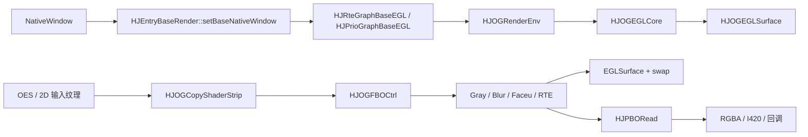

# HJMedia OpenGL 三天学习计划

## 1. 学习定位

这不是一套通用 OpenGL 入门课程，而是一条面向 HJMedia 现有渲染代码的最短学习路径。三天结束后，应具备以下能力：

- 能从 `HJEntryBaseRender` 追踪 NativeWindow、EGLContext、EGLSurface 的创建与销毁；
- 能读懂项目中的纹理、VAO/VBO、Shader、FBO 和 PBO 封装；
- 能解释 `GL_TEXTURE_2D` 与 `GL_TEXTURE_EXTERNAL_OES` 在媒体链路中的用途差异；
- 能在 Prio/RTE 管线中定位一帧图像经过复制、灰度、模糊、显示或回读的路径；
- 能排查黑屏、花屏、方向错误、透明度异常、Surface 切换失败和 GPU 回读卡顿等常见问题。

学习以 **HarmonyOS 的 EGL + OpenGL ES 3 主链路**为重点，因为对应实现最完整；Windows、Android、iOS 代码只用于比较平台差异。建议每天投入 4～5 小时，按“源码阅读 → 链路图 → 小练习 → 笔记复述 → 验收”执行。

## 2. 项目 OpenGL 全景



核心认识：EGL 负责把 OpenGL ES 上下文连接到平台窗口；Shader 完成采样与像素处理；FBO 把中间结果留在 GPU；PBO 把结果异步搬回 CPU；Prio/RTE Graph 负责线程、组件顺序和生命周期。

## 3. 三天总览

| 天数 | 主题 | 当天主线 | 最终能力 |
|---|---|---|---|
| Day 1 | EGL、纹理与第一帧 | Window → Context/Surface → Shader → 屏幕 | 看懂渲染环境和一次 draw call |
| Day 2 | FBO 与多 Pass 特效 | 输入纹理 → FBO → 灰度/模糊 → 输出纹理 | 看懂并设计 GPU 后处理组件链 |
| Day 3 | PBO、图调度与排障 | Graph 线程 → 多 Surface → GPU 回读 → CPU | 追踪完整链路并定位渲染问题 |

---

## Day 1：EGL、纹理与第一帧

### 当日目标

建立 HJMedia 中“平台窗口如何变成一帧 OpenGL 输出”的完整心智模型，能读懂项目 Shader 封装中的一次标准绘制。

### 必须掌握

1. EGLDisplay、EGLConfig、EGLContext、EGLSurface 的关系；
2. `makeCurrent` 为什么必须发生在执行 GL 命令的线程；
3. VAO、VBO、顶点属性、纹理坐标、uniform 和 `GL_TRIANGLE_STRIP`；
4. `GL_TEXTURE_2D` 与 `GL_TEXTURE_EXTERNAL_OES` 的来源和采样方式；
5. `uMVPMatrix`、`uSTMatrix`、Y Flip/X Mirror、CLIP/FIT/FILL 的职责；
6. 预乘 Alpha 与 `glBlendFunc(GL_ONE, GL_ONE_MINUS_SRC_ALPHA)` 的匹配关系。

### 源码阅读顺序

1. `src/entry/hsys/HJEntryBaseRender.cpp`
   - `setBaseNativeWindow()`：NativeWindow 如何序列化后交给 Graph；
2. `src/comp/rte/HJRteGraphBaseEGL.cpp`
   - `init()`、`eglSurfaceProc()`、`done()`：GL 上下文与 Graph 线程的边界；
3. `src/comp/graphic/hsys/HJOGEGLCore.h/.cpp`
   - `init()`、`EGLSurfaceCreate()`、`makeCurrent()`、`swap()`、`done()`；
4. `src/comp/graphic/HJOGEGLSurface.h/.cpp` 与 `hsys/HJOGRenderEnv.h/.cpp`
   - Surface 元数据、多渲染目标和逐目标绘制；
5. `src/comp/graphic/HJOGShaderProgram.h/.cpp`
   - Shader 编译、Program 链接、属性和 uniform 查询；
6. `src/comp/graphic/HJOGShaderCommon.h/.cpp`、`HJOGCopyShaderStrip.cpp`
   - 矩形顶点、2D/OES Shader、VAO/VBO 初始化和 `draw()`。

### 实践任务

- 画出从 `HJEntryBaseRender::setBaseNativeWindow()` 到 `HJOGEGLCore::swap()` 的控制流图；
- 手工标注 `HJOGCopyShaderStrip::draw()` 中每条关键 GL 调用对状态机的影响；
- 设计一个最小练习：上传 2×2 RGBA 测试纹理，用 2D Shader 绘制到离屏 Surface；记录四个像素的预期颜色和坐标方向；
- 对比项目 2D/OES Fragment Shader，说明 OES 纹理为什么不能直接按普通 2D 纹理处理。

### 当日产出

- `day01-egl-first-frame.md`：源码路径、EGL 生命周期图、绘制调用表和问题记录；
- `demo/day01_egl_first_frame.cpp`：最小 EGL/Shader 验证代码或可编译伪实现，使用中文注释映射 HJMedia 类；
- 一段 2 分钟复述：解释 Window、EGL、OpenGL ES 和 Shader 如何共同产出第一帧。

### 验收标准

- 不看资料说清 EGL 四个核心对象及 `makeCurrent` 的线程约束；
- 能指出 Shader 编译/链接错误在 `HJOGShaderProgram` 的检查位置；
- 能解释画面倒置、拉伸和透明边缘发黑分别优先检查什么；
- 能按 `init → render → done` 顺序说明 GL 资源为何必须在有效 Context 中创建和销毁。

---

## Day 2：FBO 与多 Pass 后处理

### 当日目标

理解 HJMedia 如何把每个特效包装成“输入纹理 → FBO 输出纹理”的组件，并能独立设计一个可插入 Prio 管线的简单效果。

### 必须掌握

1. Framebuffer、Color Attachment 与 Texture 的关系；
2. 离屏渲染、`attach()/detach()` 和前一个 FBO 状态恢复；
3. 分辨率变化时 FBO 的重建策略；
4. Ping-Pong FBO 与多 Pass 算法；
5. 灰度点积和高斯模糊横向/纵向拆分；
6. 组件之间传递的 texture、width、height、matrix 和 transparency 信息。

### 源码阅读顺序

1. `src/comp/graphic/HJOGFBOCtrl.h/.cpp`
   - `init()`、`attach()`、`detach()`、纹理附件与完整性检查；
2. `src/comp/prio/HJPrioComFBOBase.h/.cpp`
   - `check()` 的尺寸重建逻辑，以及 `draw()` 对 FBO 生命周期的封装；
3. `src/comp/prio/HJPrioComFBOGray.cpp`
   - `update()` 准备资源、`render()` 执行 Shader、`done()` 释放资源；
4. `src/comp/prio/HJPrioComFBOBlur.h/.cpp`
   - 横向和纵向两个 Pass 如何串联；
5. `src/comp/prio/HJPrioComSourcePingPongFBO.h/.cpp`
   - 多组件串联时如何轮换中间纹理；
6. `src/comp/prio/HJPrioGraphBaseEGL.cpp`
   - `foreachRender()` 中 update/render 两阶段如何驱动组件；
7. 对照 `src/comp/utils/HJFBOCtrlPool.h/.cpp`
   - RTE 管线如何复用 FBO，减少频繁创建销毁。

### 实践任务

- 画出 `输入纹理 → 灰度 FBO → 横向模糊 FBO → 纵向模糊 FBO → 输出` 数据流；
- 逐项记录每个 Pass 的输入 texture、输出 texture、viewport、矩阵和透明属性；
- 设计一个“颜色反相”Fragment Shader，并仿照 `HJPrioComFBOGray` 写出组件骨架；
- 用 720p、1080p 和尺寸动态变化三种情况检查 FBO 重建、纹理复用及资源释放策略；
- 说明为何二维高斯模糊通常拆成水平、垂直两个 Pass。

### 当日产出

- `day02-fbo-multipass.md`：FBO 状态、数据流/控制流图、组件生命周期与风险清单；
- `demo/day02_fbo_invert_chain.cpp`：2D 纹理 → 反相 FBO → 输出的最小练习，带中文注释；
- 一份“新增 Prio FBO 特效”检查表：初始化、尺寸变化、Shader、矩阵、Alpha、错误码和释放顺序。

### 验收标准

- 能解释 `HJOGFBOCtrl::attach()/detach()` 为什么要保存并恢复前一个 framebuffer；
- 能从 `HJPrioComFBOGray::render()` 追踪输入和输出纹理；
- 能说清模糊为何需要 Ping-Pong，而不是在同一纹理上边读边写；
- 能指出分辨率变化、FBO 不完整和 GL 状态泄漏的日志/断点位置。

---

## Day 3：PBO、Graph 线程与工程排障

### 当日目标

把底层 GL 对象放回 HJMedia 的 Graph、线程和生命周期中，掌握 GPU → CPU 回读，并形成可执行的渲染故障排查方法。

### 必须掌握

1. `glReadPixels` 的同步风险与 Pixel Pack Buffer 的作用；
2. 双 PBO 的 N/N-1 帧流水线，以及首帧返回 `HJ_WOULD_BLOCK` 的原因；
3. RGBA 回读后的 Y Flip、ABGR/RGBA 语义和 I420 转换；
4. Graph 的 `sync/async` 调度为什么要与 EGLContext 所在线程对齐；
5. 多 EGLSurface 的创建、切换、销毁和无窗口离屏 Surface；
6. 黑屏、GL error、花屏、方向/Alpha 错误、Surface 丢失和回读卡顿的定位顺序。

### 源码阅读顺序

1. `src/comp/graphic/HJPBORead.h/.cpp`
   - 两个 PBO 的创建、轮换、`glReadPixels()`、`glMapBufferRange()` 和回调；
2. `src/comp/graphic/HJPBOReadWrapper.h/.cpp`
   - 尺寸变化、延迟一帧和数据回调封装；
3. `src/entry/hsys/HJEntryBaseRender.cpp`
   - `openNativeSource()` 中 PBO/ImageReceiver 两种 GPU → RAM 路径；
4. `src/comp/rte/HJRteGraphBaseEGL.h/.cpp`
   - `syncOverride()`、`asyncOverride()`、`runRender()`、thread-local FBO Pool 和释放顺序；
5. `src/comp/prio/HJPrioGraphBaseEGL.cpp`
   - Timer/Graph 线程、逐 Surface 渲染、错误通知和 `done()`；
6. `src/comp/graphic/hsys/HJOGRenderWindowBridge.cpp`
   - 目标 Surface 上的最后一次 Shader 绘制和交换缓冲。

### 实践任务

- 用表格模拟前 4 帧在 PBO0/PBO1 中的“提交读取、映射上一帧、回调”状态；
- 对比直接 `glReadPixels` 与双 PBO 回读的 CPU/GPU 等待点，列出应采集的耗时指标；
- 追踪 `openNativeSource(true)` 到 CPU Buffer 回调的完整调用链；
- 为以下四类故障写排查步骤：Surface 创建后黑屏、画面上下颠倒、透明区域发黑、回读偶发卡顿；
- 检查 `done()` 路径，确认 Shader/FBO/PBO/EGLSurface/EGLContext 的释放发生在正确线程且顺序正确。

### 当日产出

- `day03-pbo-graph-debug.md`：PBO 时序、Graph 控制流、性能指标和故障排查手册；
- `demo/day03_double_pbo_readback.cpp`：双缓冲回读状态机练习，首帧明确返回 WOULD_BLOCK，带中文注释；
- 一段 3 分钟复述：从媒体纹理进入 GPU，到屏幕输出和 CPU 回读的完整链路。

### 验收标准

- 能准确说出第 N 帧 `glReadPixels` 与第 N-1 帧 `glMapBufferRange` 分别操作哪个 PBO；
- 能解释为何 Context、GL 资源和 Graph 线程不能随意分离；
- 面对黑屏时，能按“Surface/Context → Shader → FBO → Texture/Matrix → swap/error”顺序定位；
- 能给出至少三项可量化指标：帧耗时、Shader/FBO Pass 耗时、PBO map 等待、实际 FPS 或丢帧数。

## 4. 每日执行与记录规范

每天都按以下顺序执行，不把源码阅读停留在“看懂了”的主观判断上：

```text
阅读指定源码 → 画真实数据流/控制流 → 完成最小练习 → 编译或静态验证 → 写问题与答案 → 脱稿复述 → 按验收项打勾
```

每日笔记至少包含：

- 实际阅读过的源码路径与关键函数；
- 一张 Mermaid 数据流图和一张 Mermaid 控制流图；
- 实践代码或伪代码，以及它与 HJMedia 类的映射；
- 观察结果、风险、错误日志和验证结论；
- `问题解答` 小节，持续记录学习过程中的提问；
- 一段不过度夸大参与程度的面试复述，表述为源码分析、链路梳理和小型验证实践。

## 5. 三天完成判定

只有同时满足以下条件，才算完成本计划：

- 三份每日笔记和三个最小练习均已落盘；
- 每个练习有中文注释，并完成编译/运行验证，或记录无法运行的具体环境原因；
- 能独立画出 HJMedia 的 EGL → Shader → FBO → Surface/PBO 主链路；
- 能仿照 `HJPrioComFBOGray` 设计一个简单特效组件；
- 能解释多 Pass、双 PBO、Context 线程归属和 GL 资源释放顺序；
- 能使用第三天的排障清单分析一个具体黑屏或性能问题。
