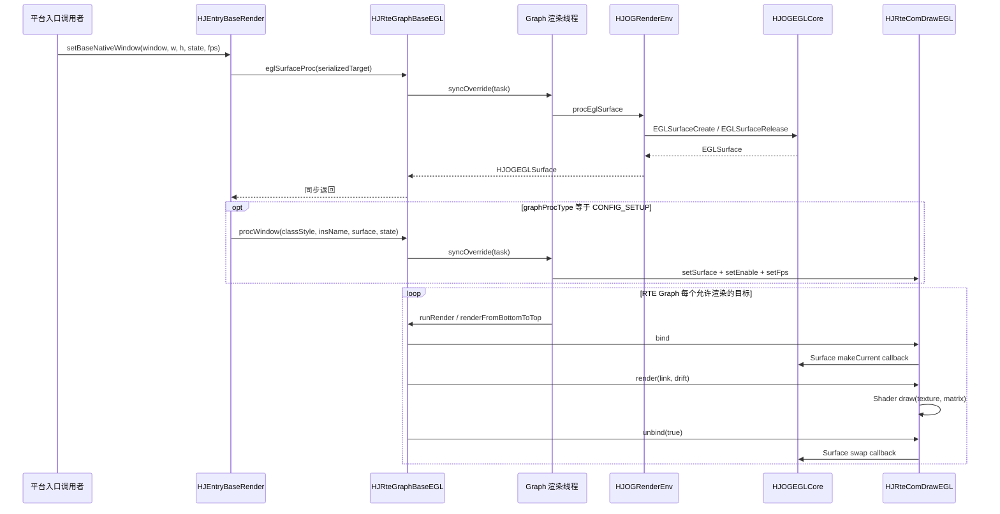

# Day 1：EGL、纹理与第一帧

- 日期：2026-07-15
- 学习计划：`openGL_Study/00-hjmedia-opengl-three-day-study-plan.md`
- 学习主线：`NativeWindow → EGLSurface/Context → OES/2D Shader → swap`
- 实践代码：`openGL_Study/demo/day01_egl_first_frame.cpp`
- 结论范围：HarmonyOS 分支；跨平台实现不在本日结论内。

## 今日阅读

- `src/entry/hsys/HJEntryBaseRender.cpp`
- `src/comp/rte/HJRteGraphBaseEGL.cpp`
- `src/comp/rte/HJRteGraphProcConfigSetup.cpp`
- `src/comp/rte/HJRteGraphProcPlaceHolderDefault.cpp`
- `src/comp/rte/HJRteComDraw.cpp`
- `src/comp/graphic/hsys/HJOGEGLCore.cpp`
- `src/comp/graphic/hsys/HJOGRenderEnv.cpp`
- `src/comp/graphic/HJOGEGLSurface.h/.cpp`
- `src/comp/graphic/hsys/HJOGRenderWindowBridge.cpp`
- `src/comp/graphic/HJOGShaderProgram.cpp`
- `src/comp/graphic/HJOGShaderCommon.cpp`
- `src/comp/graphic/HJOGCopyShaderStrip.cpp`

## 源码依据

| 结论 | 源码证据 | 分类 |
|---|---|---|
| 入口把 window、宽高、state、fps 序列化后交给 Graph | `src/entry/hsys/HJEntryBaseRender.cpp:249` — `HJEntryBaseRender::setBaseNativeWindow` | 源码确认 |
| Surface 创建/销毁通过 Graph 的同步任务进入渲染线程 | `src/comp/rte/HJRteGraphBaseEGL.cpp:161` — `eglSurfaceProc`；`:202` — `syncOverride` | 源码确认 |
| 配置型 Graph 才把得到的 Surface 设置到指定 Draw 节点并启用 | `src/comp/rte/HJRteGraphProcConfigSetup.cpp:523` — `procWindow` | 条件路径：`graphProcType=CONFIG_SETUP`；基类 `procWindow` 是空实现 |
| RenderEnv 初始化 Core、1×1 Pbuffer，并将它设为 current | `src/comp/graphic/hsys/HJOGRenderEnv.cpp:58` — `priCoreInit` | HarmonyOS 条件路径 |
| EGLDisplay、Config、Context 的实际创建顺序 | `src/comp/graphic/hsys/HJOGEGLCore.cpp:45` — `init` | HarmonyOS 条件路径 |
| Window Surface 创建后立即 `makeCurrent` | `src/comp/graphic/hsys/HJOGEGLCore.cpp:189` — `EGLSurfaceCreate` | HarmonyOS 条件路径 |
| 默认 RTE 图把 OES Source 连到 2D FBO，再把处理链连到 UI Target | `src/comp/rte/HJRteGraphProcPlaceHolderDefault.cpp:10` — `constructGraph` | HarmonyOS 默认占位图；PBO/Blur 等节点有各自 enable 条件 |
| RTE 从 Target 反向递归上游，并按 `bind → render → unbind` 驱动每个 Draw 组件 | `src/comp/rte/HJRteGraph.cpp:590` — `priRenderFromBottomToTop` | 源码确认 |
| RTE UI Target 的真实边界是 `bind/makeCurrent → render/Shader → unbind/swap` | `src/comp/rte/HJRteComDraw.cpp:213` — `HJRteComDrawEGL::bind`；`:238` — `unbind`；`:260` — `render` | 源码确认 |
| Prio 逐目标路径的边界是 `makeCurrent → clear/draw → swap` | `src/comp/graphic/hsys/HJOGRenderEnv.cpp:282` — `priDrawEveryTarget`；`src/comp/prio/HJPrioGraphBaseEGL.cpp:35` — `run` | 条件路径：Prio Graph，不与 RTE 调用链混画 |
| 2D 与 OES 使用不同 target 和 Fragment Shader sampler | `src/comp/graphic/HJOGCopyShaderStrip.cpp:18` — `init`；`src/comp/graphic/HJOGShaderCommon.cpp:54`、`:68` | 源码确认 |
| OES 输入来自 `OH_NativeImage` 创建的外部纹理 | `src/comp/graphic/hsys/HJOGRenderWindowBridge.cpp:76` — `init`；`:158` — `priDraw` | HarmonyOS 条件路径 |
| Shader 编译、链接错误分别读取 shader/program info log | `src/comp/graphic/HJOGShaderProgram.cpp:19` — `init`；`:65` — `priCheckCompileErrors` | 源码确认 |
| 绘制使用 VAO/VBO、矩阵 uniform、混合和 `GL_TRIANGLE_STRIP` | `src/comp/graphic/HJOGCopyShaderStrip.cpp:101` — VAO/VBO 初始化；`:126`、`:185` — `draw` | 源码确认 |
| 预乘输出与 `GL_ONE, GL_ONE_MINUS_SRC_ALPHA` 配套 | `src/comp/graphic/HJOGShaderCommon.cpp:25`；`src/comp/graphic/HJOGCopyShaderStrip.cpp:138` | 源码确认 |

### 一个必须保留的源码差异

README 把主线描述为 OpenGL ES 3，但 `HJOGEGLCore::init` 在 `src/comp/graphic/hsys/HJOGEGLCore.cpp:89` 明确请求 `EGL_CONTEXT_CLIENT_VERSION = 2`；同时 `HJOGShaderCommon` 拼接的版本常量和 OES Shader 使用 ESSL3 扩展。源码未确认运行设备最终得到的 Context 版本，不能仅凭 include 或课程标题断言“Context 一定是 ES3”。实际排查应记录 `glGetString(GL_VERSION)` 与 `GL_SHADING_LANGUAGE_VERSION`。

## 核心对象与职责

| 对象 | 在本项目中的职责 | 先查什么 |
|---|---|---|
| `EGLDisplay` | 连接默认显示系统，承载初始化和终止 | `eglGetDisplay`、`eglInitialize` 错误 |
| `EGLConfig` | 选择 Window、RGBA8 和可渲染类型 | `eglChooseConfig` 返回数和属性 |
| `EGLContext` | 保存 GL 状态与资源所属环境 | 当前线程、Context 是否丢失 |
| `EGLSurface` | Window 或 Pbuffer 的绘制目标 | Surface 状态、尺寸、`eglMakeCurrent` |

`makeCurrent` 不是“初始化时调用一次就结束”。EGL Context/Surface 是线程当前状态；HJMedia 用 Graph 的 `sync/async` 把创建、绘制和释放收敛到渲染线程。RTE 由 `HJRteComDrawEGL::bind/unbind` 调用 Surface 中保存的 makeCurrent/swap 回调；Prio 则由 `HJOGRenderEnv::foreachRender` 逐目标调用。执行 `glUseProgram`、`glBindTexture`、`glDrawArrays` 前，必须保证该线程已有正确的 current Context 和目标 Surface。

## Mermaid 图

### 数据流

```mermaid
flowchart LR
    NativeImage["OH_NativeImage<br/>HJOGRenderWindowBridge::init"]
    OES["GL_TEXTURE_EXTERNAL_OES"]
    Source["HJRteComSourceBridge"]
    FBO["HJRteComDrawCopyOESFBO<br/>输出 GL_TEXTURE_2D"]
    Custom["HJRteComCustomSourceFilter<br/>enable 由 useCustomFilter 决定"]
    Blur["HJRteComDrawBlurCascadeFBO<br/>初始 disabled"]
    Target["HJRteComDrawEGL::render<br/>2D Copy Shader"]
    Current["当前 EGLSurface framebuffer<br/>HJRteComDrawEGL::bind"]
    Swap["HJOGEGLCore::swap"]
    Window["NativeWindow 显示"]

    NativeImage -->|外部视频帧| OES
    OES --> Source
    Source -->|默认图 connectCom| FBO
    FBO -->|connectCom| Custom
    Custom -->|connectCom| Blur
    Blur -->|2D texture link| Target
    Target -->|Fragment 输出| Current
    Current --> Swap
    Swap --> Window
```

主路径依据：`HJOGRenderWindowBridge::init/priDraw`、`HJRteGraphProcPlaceHolderDefault::constructGraph`、`HJRteComDrawEGL::bind/render/unbind`、`HJOGCopyShaderStrip::init/draw`、`HJOGEGLCore::swap`。

### 控制流

## 一次 draw 的状态变化

| 调用 | 关键状态影响 | 对应源码 |
|---|---|---|
| `glUseProgram` | 选择当前 Program | `HJOGCopyShaderStrip::draw` |
| `glEnable(GL_BLEND)` + `glBlendFunc` | 使用预乘 Alpha 混合 | 同上 |
| `glBindVertexArray` | 选择矩形顶点与纹理坐标描述 | `HJOGCopyShaderStrip::init/draw` |
| `glActiveTexture` + `glBindTexture` | 绑定 2D 或 OES 纹理到单元 0 | `HJOGCopyShaderStrip::draw` |
| `glUniformMatrix4fv` | `uMVPMatrix` 管几何缩放/翻转，`uSTMatrix` 管采样坐标 | `HJOGShaderCommon::s_vertexCopyShader` |
| `glDrawArrays(GL_TRIANGLE_STRIP, 0, 4)` | 用四顶点生成矩形 | `HJOGCopyShaderStrip::draw` |
| 解绑定/禁用 | 降低状态泄漏到下一组件的风险 | `HJOGCopyShaderStrip::draw` 尾部 |

## 2×2 测试纹理

demo 明确按 OpenGL 左下原点记录四个 texel：

| 坐标 | 输入颜色 | 无 Y Flip 输出 | Y Flip 输出位置 |
|---|---|---|---|
| `(0, 0)` | 红 | 左下红 | 左上红 |
| `(1, 0)` | 绿 | 右下绿 | 右上绿 |
| `(0, 1)` | 蓝 | 左上蓝 | 左下蓝 |
| `(1, 1)` | 白 | 右上白 | 右下白 |

这只是坐标验证样本，不等同于真实 GLES 光栅化器。真实路径仍需在 Harmony 设备上把 2×2 RGBA 上传到 `GL_TEXTURE_2D`，绘制到 Pbuffer/FBO 后读回确认。

## 常见问题定位

- 画面倒置：先记录 `uSTMatrix`、`i_bYFlip/i_bXFlip` 和 NativeImage 变换矩阵；源码中翻转写入 MVP，外部纹理还传入 `m_matrix`。
- 拉伸或裁剪错误：检查 `HJOGShaderCommon::GetScaleFromMode` 的 FIT/CLIP/FULL 分支以及目标 viewport。
- 透明边缘发黑：确认纹理是否已经预乘；若 Shader 又乘一次 alpha，会重复预乘；若未预乘却使用 `GL_ONE`，混合也会错误。
- 黑屏：按 Surface/Context → Shader 编译链接 → texture target/sampler → matrix/viewport → `eglSwapBuffers` 和错误码顺序查。

## Demo 与验证

`demo/day01_egl_first_frame.cpp` 是状态模型，映射 `HJOGEGLCore`、`HJOGRenderEnv`、`HJOGCopyShaderStrip`：

- 编译：Visual Studio 2022 / MSVC 19.44，C++17，成功；
- 运行：成功；
- 断言：2×2 原样复制、Y Flip、OES/2D sampler 选择、错误线程拒绝均通过；
- 限制：没有调用真实 Harmony EGL、NativeWindow 或 GPU Shader。

## 问题解答

本节用于记录后续学习过程中的提问和回答；当前尚无用户追问。

## 面试复述

我基于 HJMedia 源码梳理了 Harmony 渲染入口：窗口信息先序列化并同步投递到 Graph 线程，由 RenderEnv 创建和管理 EGLSurface；每个目标绘制前切换 current Surface，再通过 CopyShader 采样 OES 或 2D 纹理，最后 swap 到窗口。我还用 2×2 C++ 状态模型验证了坐标翻转和线程约束，但没有把这个模型描述成真实 GPU 运行结果。

## 结论

第一帧不是单独一个 `draw` 调用，而是窗口目标有效、Context 在正确线程 current、Shader/纹理 target 匹配、矩阵和 viewport 正确、最终 swap 成功这一整条链同时成立。
