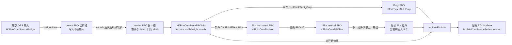
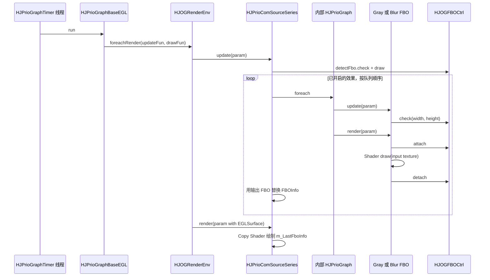

# Day 2：FBO 与多 Pass 后处理

- 日期：2026-07-15
- 学习计划：`openGL_Study/00-hjmedia-opengl-three-day-study-plan.md`
- 学习主线：`输入纹理 → Color Attachment → Gray/Blur Pass → 输出纹理`
- 实践代码：`openGL_Study/demo/day02_fbo_invert_chain.cpp`
- 结论范围：Prio 的 FBO 效果实现以 HarmonyOS 条件分支为主；RTE FBO Pool 仅作对照。

## 今日阅读

- `src/comp/graphic/HJOGFBOCtrl.h/.cpp`
- `src/comp/prio/HJPrioComFBOBase.h/.cpp`
- `src/comp/prio/HJPrioComFBOGray.cpp`
- `src/comp/prio/HJPrioComFBOBlur.h/.cpp`
- `src/comp/prio/HJPrioComSourcePingPongFBO.h/.cpp`
- `src/comp/prio/HJPrioComSourceSeries.h/.cpp`
- `src/comp/prio/HJPrioGraph.cpp`
- `src/comp/prio/HJPrioGraphBaseEGL.cpp`
- `src/comp/utils/HJFBOCtrlPool.h/.cpp`

## 源码依据

| 结论 | 源码证据 | 分类 |
|---|---|---|
| FBO 持有一张 RGBA `GL_TEXTURE_2D`，挂到 `GL_COLOR_ATTACHMENT0` 并检查完整性 | `src/comp/graphic/HJOGFBOCtrl.cpp:51` — `HJOGFBOCtrl::init` | 源码确认 |
| `attach` 保存前一个 framebuffer，设置 viewport/clear；`detach` 恢复它 | `src/comp/graphic/HJOGFBOCtrl.cpp:110`、`:137` | 源码确认 |
| Prio FBO 只在宽高变化时创建新 FBO | `src/comp/prio/HJPrioComFBOBase.cpp:81` — `check` | HarmonyOS 条件路径 |
| 即使效果回调失败，`HJPrioComFBOBase::draw` 也会先执行 `detach` | `src/comp/prio/HJPrioComFBOBase.cpp:109` — `draw` | HarmonyOS 条件路径 |
| Gray Pass 读取 `HJPrioComBaseFBOInfo::m_texture`，输出是自身 FBO texture | `src/comp/prio/HJPrioComFBOGray.cpp:52` — `update`；`:70` — `render`；`HJPrioComFBOBase::texture` | HarmonyOS 条件路径 |
| 灰度公式是 `dot(rgb, vec3(0.299, 0.587, 0.114))`，alpha 原样保留 | `src/comp/prio/HJPrioComFBOGray.cpp:27` — `s_fragmentShaderGray` | 源码确认 |
| 一个 Blur 组件先水平绘制，再用水平输出替换参数，最后垂直绘制 | `src/comp/prio/HJPrioComFBOBlur.cpp:252` — `update`；`:290` — `render` | HarmonyOS 条件路径 |
| Blur 横/纵 Shader 分别只沿 x/y 方向取样 | `src/comp/prio/HJPrioComFBOBlur.cpp:72`、`:112` | 源码确认 |
| SourceSeries 在每个效果后把 FBO 的 texture/width/height/matrix 写回参数，供下一效果使用 | `src/comp/prio/HJPrioComSourceSeries.cpp:200` — `update` 内的嵌套 Graph 遍历 | HarmonyOS 条件路径 |
| Gray 与 Blur 不是默认必经路径，而是由 `HJPrioEffectType` 开启；Blur 当前一次插入 5 个组件 | `src/comp/prio/HJPrioComSourceSeries.cpp:31` — `openEffect` | 条件路径：`Gray` 或 `Blur` |
| SourceSeries 自身的两个 FBO 按 index 轮换 detect/render 角色 | `src/comp/prio/HJPrioComSourcePingPongFBO.cpp:24` — `getDetectFBO/getRenderFBO/submit` | 源码确认 |
| RTE 可按宽高和透明标志从池中复用 FBO | `src/comp/utils/HJFBOCtrlPool.cpp:6` — `acquire/recovery` | RTE 对照路径，不等同于 Prio Base 的持有策略 |

## FBO 心智模型

Framebuffer 是“写到哪里”的状态对象，Texture 是可被后续 Shader 采样的数据对象。HJMedia 的 `HJOGFBOCtrl` 把两者绑定为：

```text
HJOGFBOCtrl
├── m_framebuffer  -> GL_FRAMEBUFFER
└── m_texture      -> GL_COLOR_ATTACHMENT0 / 下一 Pass 的 sampler2D
```

一次效果 Pass 的稳定步骤是：

1. 根据输入宽高检查或创建输出 FBO；
2. 保存旧 framebuffer，绑定效果 FBO，设置 viewport 并 clear；
3. Shader 采样输入 texture，输出到 color attachment；
4. 恢复旧 framebuffer；
5. 把效果 FBO 的 texture、宽高和 matrix 交给下一 Pass。

同一张纹理不能同时作为当前 Pass 的采样输入和 color attachment 输出。这样做会形成反馈环，结果未定义；多 Pass 需要至少两张可轮换的中间纹理。

## Mermaid 图

### 数据流



图中 Gray 和 Blur 是配置分支，不代表默认图一定同时经过灰度和模糊。若连续调用开放两种效果，实际顺序还取决于 `HJPrioGraph::insert` 按 priority/index 生成的队列；本笔记不把未配置的组合画成默认路径。

### 控制流



## Gray 与 Blur 对比

| 项目 | Gray | Blur |
|---|---|---|
| Pass 数 | 1 | 每个 `HJPrioComFBOBlur` 为水平+垂直 2 Pass |
| 输入 | 2D texture + matrix + width/height | 同左 |
| 输出 | Gray 组件自己的 FBO texture | 垂直 Pass 的 FBO texture |
| 额外 uniform | 无 | `uStride = stride / width,height` |
| 当前 SourceSeries 行为 | `effectType=Gray` 插入 1 个 | `effectType=Blur` 插入 5 个，即总计 10 Pass |

二维高斯核若直接做 `K×K` 取样，采样次数是平方级；可分离高斯先横向再纵向，只需约 `2K` 次采样。HJMedia 源码中的两个 Shader 正是沿 x 和 y 分开采样。

## 颜色反相组件练习

Fragment Shader 骨架：

```glsl
in vec2 v_texcood;
uniform sampler2D sTexture;
out vec4 FragColor;

void main()
{
    vec4 color = texture(sTexture, v_texcood);
    FragColor = vec4(vec3(1.0) - color.rgb, color.a);
}
```

映射 `HJPrioComFBOGray` 时应保持：

- `update` 取得 `HJPrioComBaseFBOInfo` 并按宽高 `check`；
- `render` 用 `HJPrioComFBOBase::draw` 包住 Shader draw；
- Shader 使用 `OGCopyShaderStripFlag_2D`，因为上游 FBO 输出是 2D texture；
- `done` 先释放 Shader，再调用 Base 释放 FBO；
- RGB 反相但 alpha 不变，避免破坏后续预乘/混合语义。

### 新增 Prio FBO 特效检查表

- [ ] 输入 texture target 与 Shader sampler 匹配；
- [ ] 输入/输出不是同一 texture；
- [ ] 宽高为正，变化时重建；
- [ ] `glCheckFramebufferStatus` 为 `GL_FRAMEBUFFER_COMPLETE`；
- [ ] viewport 与输出 FBO 尺寸一致；
- [ ] matrix、Y Flip、crop mode 语义未丢失；
- [ ] alpha 是否预乘有明确约定；
- [ ] 失败路径仍恢复旧 framebuffer；
- [ ] `done` 在有效 Context 的 Graph 线程执行；
- [ ] 记录 FBO 创建/销毁计数和每 Pass 耗时。

## 风险与断点

- 分辨率变化：断在 `HJPrioComFBOBase::check` 和 `HJOGFBOCtrl::init`，确认新尺寸及旧对象析构。
- 同尺寸透明属性改变：源码 `check` 只比较宽高，不比较 `i_bTransparency`；若业务会动态切换透明性，需要补充重建条件或保证配置不变。
- FBO 不完整：看 `HJOGFBOCtrl::init` 的 status、宽高和 object 日志。
- 状态泄漏：在 `attach/detach` 前后读取 `GL_FRAMEBUFFER_BINDING`、viewport、blend 状态。
- Ping-Pong 错位：记录每帧 `m_index`、detect FBO texture、render FBO texture；第 0 次两者均返回 slot 0，后续才交替。

## Demo 与验证

`demo/day02_fbo_invert_chain.cpp` 用四个样本像素验证“2D 输入 → 反相 FBO → 输出”：

- 编译：Visual Studio 2022 / MSVC 19.44，C++17，成功；
- 运行：成功；
- 像素：红→青、绿→品红、蓝→黄，alpha 保留；
- 状态：外层 framebuffer 77 在 `detach` 后恢复；
- 尺寸：重复 720p 复用，切换 1080p 后重建一次；
- 限制：模型在 CPU 上处理 4 个样本，不是实际 GPU/FBO 性能测试。

## 问题解答

本节用于记录后续学习过程中的提问和回答；当前尚无用户追问。

## 面试复述

我通过源码分析确认，HJMedia 的 Prio 特效把每个 Pass 封装为“读取上游 2D texture，写入自己的 FBO color texture”，然后把 texture、尺寸和 matrix 交给下一组件。灰度是单 Pass，模糊组件内部先水平后垂直；SourceSeries 当前打开 Blur 会插入 5 个模糊组件。我用独立 C++ 状态模型验证了反相、FBO 状态恢复和分辨率重建，但实际 GPU 耗时仍需在 Harmony 设备测量。

## 结论

理解多 Pass 的关键不是背 FBO API，而是始终回答三个问题：本 Pass 从哪张 texture 读、向哪个 attachment 写、结束后把哪张 texture 交给谁。只要这三项和 framebuffer 状态恢复清楚，灰度、模糊、反相等效果都能用同一框架审查。
