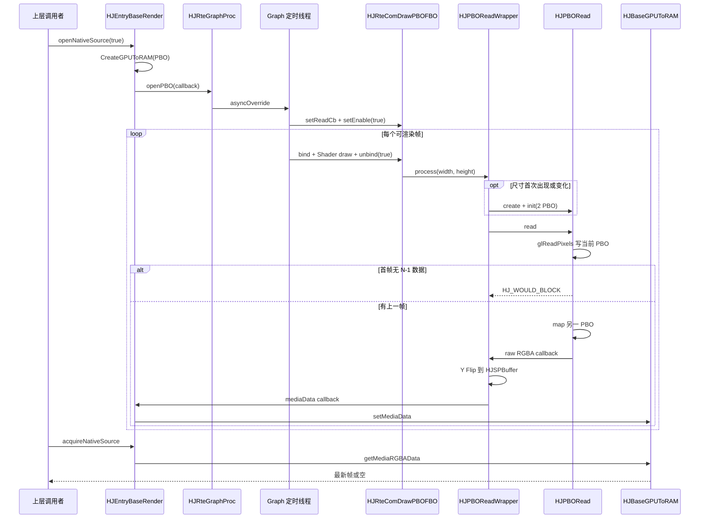

# Day 3：PBO、Graph 线程与工程排障

- 日期：2026-07-15
- 学习计划：`openGL_Study/00-hjmedia-opengl-three-day-study-plan.md`
- 学习主线：`Graph 线程 → FBO → 双 PBO → Y Flip/callback → CPU 最新帧队列`
- 实践代码：`openGL_Study/demo/day03_double_pbo_readback.cpp`
- 结论范围：默认 RTE Graph 的 HarmonyOS PBO 路径；Prio `HJPrioComSourceSeries` 是另一条条件路径。

## 今日阅读

- `src/entry/hsys/HJEntryBaseRender.cpp`
- `src/comp/graphic/hsys/HJGPUToRAM.h/.cpp`
- `src/comp/graphic/HJPBORead.h/.cpp`
- `src/comp/graphic/HJPBOReadWrapper.h/.cpp`
- `src/comp/rte/HJRteGraphProcPlaceHolderDefault.cpp`
- `src/comp/rte/HJRteGraphProc.cpp`
- `src/comp/rte/HJRteGraphBaseEGL.h/.cpp`
- `src/comp/rte/HJRteGraph.h/.cpp`
- `src/comp/rte/HJRteComDraw.h/.cpp`
- `src/comp/graphic/hsys/HJOGRenderWindowBridge.cpp`
- `src/comp/graphic/hsys/HJOGRenderEnv.cpp`
- `src/utils/base/HJComUtils.h`
- `src/utils/base/HJThreadPool.cpp`

## 源码依据

| 结论 | 源码证据 | 分类 |
|---|---|---|
| 默认 RTE 图存在 `video2D → detectPBO` 连接，但 PBO Target 初始禁用 | `src/comp/rte/HJRteGraphProcPlaceHolderDefault.cpp:55` — `constructGraph` | 源码确认 |
| `openNativeSource(true)` 创建 PBO 类型 GPUToRAM，并注册回调后调用 `openPBO` | `src/entry/hsys/HJEntryBaseRender.cpp:335` — `openNativeSource` | 条件路径：参数为 `true` |
| `openPBO` 通过 Graph async 任务设置回调并启用 `HJRteComDrawPBOFBODetect` | `src/comp/rte/HJRteGraphProc.cpp:787` — `openPBO` | 源码确认 |
| Graph 定时器按 fps 在专用线程调用 `run` | `src/comp/rte/HJRteGraph.cpp:1159` — `HJRteGraphDrive::init` | 源码确认 |
| RTE 从 Target 反向递归上游，并按 `bind → render → unbind` 驱动 PBO Target | `src/comp/rte/HJRteGraph.cpp:590` — `priRenderFromBottomToTop` | 源码确认 |
| `sync` 在 Graph 线程直接执行，否则入队并等待 future | `src/utils/base/HJThreadPool.cpp:423` — `HJThreadPool::sync`；`src/utils/base/HJComUtils.h:35` — `HJThreadFuncDef` | 源码确认 |
| PBO Target 在 FBO 仍绑定时调用回读，之后才执行 Base `unbind/detach` | `src/comp/rte/HJRteComDraw.cpp:1059` — `HJRteComDrawPBOFBO::unbind` | 源码确认 |
| 两个 PBO 都按 `width × height × 4` 分配 | `src/comp/graphic/HJPBORead.cpp:27` — `init` | 源码确认 |
| 每帧写当前 PBO、映射另一个 PBO；首帧返回 `HJ_WOULD_BLOCK` | `src/comp/graphic/HJPBORead.cpp:83` — `read` | 源码确认 |
| 尺寸变化重建 Reader；回调前用负高度 `ARGBCopy` 做 Y Flip | `src/comp/graphic/HJPBOReadWrapper.cpp:46` — `process` | 源码确认 |
| Entry 回调把 `HJSPBuffer` 写入 GPUToRAM；队列只保留最新一帧 | `src/entry/hsys/HJEntryBaseRender.cpp:379`；`src/comp/graphic/hsys/HJGPUToRAM.cpp:32` — `setMediaData` | 源码确认 |
| 大于等于 720×1280 或 1280×720 的输入会在入队前缩小为一半宽高 | `src/comp/graphic/hsys/HJGPUToRAM.cpp:14`、`:43` | 源码确认 |
| 释放在 Graph `sync` 内先完成组件、FBO Pool、RenderEnv，再停止 Timer | `src/comp/rte/HJRteGraphBaseEGL.cpp:212` — `done`；`src/comp/rte/HJRteGraph.cpp:1092`、`:1206` | 源码确认 |
| Prio SourceSeries 也可在 detect FBO 绘制后调用 PBO Wrapper | `src/comp/prio/HJPrioComSourceSeries.cpp:107`、`:147` | 条件路径：使用 Prio SourceSeries 且 `openPBO` |

## 双 PBO 时序

`HJPBORead` 的 `m_index` 初始为 0，每次 `read` 先执行 `(m_index + 1) % 2`。因此前四帧是：

| 调用帧 N | `glReadPixels` 写入 | `glMapBufferRange` 映射 | CPU 回调内容 | 返回值 |
|---|---|---|---|---|
| 0 | PBO1 | 无 | 无 | `HJ_WOULD_BLOCK` |
| 1 | PBO0 | PBO1 | 帧 0 | `HJ_OK` |
| 2 | PBO1 | PBO0 | 帧 1 | `HJ_OK` |
| 3 | PBO0 | PBO1 | 帧 2 | `HJ_OK` |

PBO 把“发起 GPU 拷贝”和“CPU 访问上一帧”错开，但不保证完全无等待。若 GPU 尚未完成 N-1 帧，`glMapBufferRange` 仍可能阻塞；所以应分别统计 read 提交和 map 等待，不能只看整个函数平均值。

## Mermaid 图

### 数据流

```mermaid
flowchart LR
    OES["OES 媒体纹理<br/>HJRteComSourceBridge"]
    Video2D["video2D FBO<br/>HJRteComDrawCopyOESFBO"]
    PboTarget["detect PBO FBO<br/>默认禁用"]
    Write["glReadPixels<br/>写当前 PBO N"]
    Map["glMapBufferRange<br/>读另一 PBO N-1"]
    Flip["HJPBOReadWrapper<br/>ARGBCopy 负高度 Y Flip"]
    Callback["HJEntryBaseRender 回调"]
    Queue["HJBaseGPUToRAM<br/>只保留最新 RGBA"]
    Acquire["acquireNativeSource"]

    OES --> Video2D
    Video2D -->|条件：openPBO 后启用| PboTarget
    PboTarget --> Write
    Write -.同一 read 调用内错开一帧.-> Map
    Map --> Flip
    Flip --> Callback
    Callback --> Queue
    Queue --> Acquire
```

PBO 回调是 CPU 侧支路，不是“写回原媒体纹理”。主边由默认图 `connectCom(video2D, detectPBO)`、`HJRteComDrawPBOFBO::unbind/priReadPBO`、`HJPBOReadWrapper::process` 和 Entry callback 证明。

### 控制流

## RGBA、Y Flip 与 I420

- 主回调路径：`glReadPixels(GL_RGBA, GL_UNSIGNED_BYTE)` → `HJPBOReadWrapper` 的 `ARGBCopy(..., -height)` → `HJSPBuffer` callback。
- 调试写文件路径：`HJPBORead::priWrite` / `HJPBOReadWrapper::priWrite` 还调用 `ABGRToI420`。
- libyuv 的 ARGB/ABGR 命名和内存端序容易混淆。源码显示了所调用的函数，但不能只凭函数名断言所有平台上 CPU buffer 的视觉通道顺序；应使用纯红/绿/蓝/白测试图读回，并记录每字节值后确认。

## 线程与释放顺序

`HJRteGraphBaseEGL::done` 使用 `HJRteGraphDrive::sync`，源码顺序是：

1. `setCanRun(false)`；
2. `HJRteGraph::comDone()`，逐组件 `done` 并清空 Graph 持有；
3. 清空 thread-local FBO Pool；
4. `HJOGRenderEnv::done()`，释放窗口 Surface，再释放 offscreen Surface、Context 和 Display；
5. 同步任务返回后 `HJRteGraphDrive::done()` 停止 Timer 线程。

这保证项目持有的 GL 组件资源在 EGL 环境之前进入释放流程。若外部还持有某个 GL 对象的 shared_ptr，其析构时刻可能延后，因此新增跨 Graph 所有权时仍需审计最后一个引用在哪个线程释放。

## 性能指标

至少采集以下指标，并使用 P50/P95/P99 而不是只看平均值：

- Graph 单帧 `runRender` 耗时与实际 FPS；
- 每个 Shader/FBO Pass 的 GPU/CPU 提交耗时；
- `glReadPixels` 调用耗时；
- `glMapBufferRange` 等待耗时；
- Y Flip/内存复制和可选缩放耗时；
- WOULD_BLOCK、回调帧数、消费帧数和丢弃/覆盖数量。

## 排障手册

### 现象

| 现象 | 第一检查方向 |
|---|---|
| Surface 创建后黑屏 | Surface/Context → Target enable/link → Shader → FBO/Texture → swap/error |
| 画面上下颠倒 | NativeImage matrix、`uSTMatrix`、Y Flip 是否重复 |
| 透明区域发黑 | 输入是否预乘、Shader 是否再次乘 alpha、blend func 是否匹配 |
| 回读偶发卡顿 | `glMapBufferRange` P95/P99、复制/缩放、分辨率重建、消费速度 |

### 可疑模块

- EGL：`HJOGEGLCore`、`HJOGRenderEnv`、`HJOGEGLSurface`；
- Graph：PBO Target 是否在默认图中连接、是否已 enable、分辨率是否传播；
- FBO：`HJRteComDrawFBO::bind/unbind`、FBO Pool、viewport；
- 回读：`HJPBORead` index/valid、`HJPBOReadWrapper` 尺寸重建；
- CPU：`HJBaseGPUToRAM::setMediaData` 的 Y Flip 后复制、缩放和最新帧覆盖。

### 源码入口

- 打开回读：`HJEntryBaseRender::openNativeSource(true)`；
- 启用节点：`HJRteGraphProc::openPBO`；
- FBO 到 PBO：`HJRteComDrawPBOFBO::unbind/priReadPBO`；
- 双缓冲：`HJPBORead::read`；
- CPU 入队：`HJBaseGPUToRAM::setMediaData`；
- 释放：`HJRteGraphBaseEGL::done`。

### 日志点

- Surface：window 指针、state、width/height、surface handle、`eglGetError`；
- Target：class/instance、enable、fps、实际 target render 次数；
- FBO：id、texture id、尺寸、完整性、前后 framebuffer binding；
- PBO：frame、`m_index`、write/map PBO id、WOULD_BLOCK、map 等待毫秒；
- CPU：原尺寸/缩放尺寸、回调次数、队列覆盖次数、消费间隔。

### 预期现象

- 第一次回读明确为 `HJ_WOULD_BLOCK`，第二次回调的是前一帧；
- 640×360 连续帧在 PBO1/PBO0 之间交替；
- 分辨率改变后新 Reader 再次预热一帧；
- Entry 的 CPU 队列最多保存当前最新一帧，而不是无限积压。

### 可能原因

- 黑屏：Surface 未 current、配置型 Target 未启用、Shader 编译失败、纹理 target/sampler 错、FBO 尺寸 0、未 swap；
- 上下颠倒：GPU matrix 和 CPU `ARGBCopy(-height)` 同时翻转或都未翻转；
- 透明发黑：直通/预乘 Shader 选错，或 blend func 与输入约定不一致；
- 卡顿：map 等 GPU、每帧大分辨率复制/缩放、频繁尺寸变化导致重建、CPU 消费者过慢。

### 修复思路

- 先用纯色 2×2 和固定尺寸隔离 Shader/矩阵问题，再恢复媒体输入；
- 为每个阶段增加稳定的 frame id，区分 GPU 提交帧与 CPU 回调帧；
- 尺寸只在真正变化时重建 PBO/FBO，并把变化次数纳入指标；
- 若 map 长尾明显，评估更多缓冲、Fence、降低回读频率/分辨率，但必须先测量；
- 明确全链路 alpha 与通道格式，避免靠肉眼反复改 Shader。

### 新风险

- 增加 PBO 数会增加显存并扩大延迟；
- 降低回读频率可能使检测使用更旧的帧；
- 降分辨率会影响检测精度；
- 把回调搬到别的线程时，必须先复制 mapped buffer，不能在 unmap 后继续持有裸指针；
- 外部 shared_ptr 延长 GL 对象寿命可能破坏 Graph 线程上的释放顺序。

### 验证方式

- 独立 demo 验证前四帧索引表和尺寸变化后的重新预热；
- Harmony 设备用 RGBA 四色图验证通道和方向；
- Surface 创建/切换/销毁循环测试，检查 EGL/GL error；
- 720p/1080p 分别运行并记录 P50/P95/P99；
- 关闭 CPU 消费者做压力测试，确认最新帧策略不会导致队列增长。

## Demo 与验证

`demo/day03_double_pbo_readback.cpp` 精确模拟源码索引：

- 编译：Visual Studio 2022 / MSVC 19.44，C++17，成功；
- 运行：成功；
- 640×360：帧 0 写 PBO1 并 WOULD_BLOCK；帧 1～3 分别回调帧 0～2；
- 1920×1080 尺寸变化：Reader 重建，首帧再次 WOULD_BLOCK；
- 限制：没有实际 GPU 同步，所以不能用 demo 的时间评价 PBO 性能。

## 问题解答

本节用于记录后续学习过程中的提问和回答；当前尚无用户追问。

## 面试复述

我沿 HJMedia 默认 RTE 图追踪了 PBO 回读：2D FBO 连接到默认禁用的 PBO Target，`openNativeSource(true)` 通过 Graph 异步任务设置回调并启用它。每帧在 FBO 仍绑定时，`glReadPixels` 写当前 PBO，CPU 映射另一只 PBO 的上一帧，所以首帧 WOULD_BLOCK；Wrapper 再做 Y Flip 并把最新 RGBA 交给 CPU 队列。我用四帧状态机 demo 验证了索引和尺寸重建，但实际 map 长尾仍需在 Harmony GPU 上测量。

## 结论

PBO 的价值是把 GPU 拷贝与 CPU 访问错开一帧，不是消除同步。工程上必须同时守住 Graph/Context 线程归属、首帧与尺寸重建状态、mapped 内存生命周期，以及可量化的 map 等待和复制成本。
