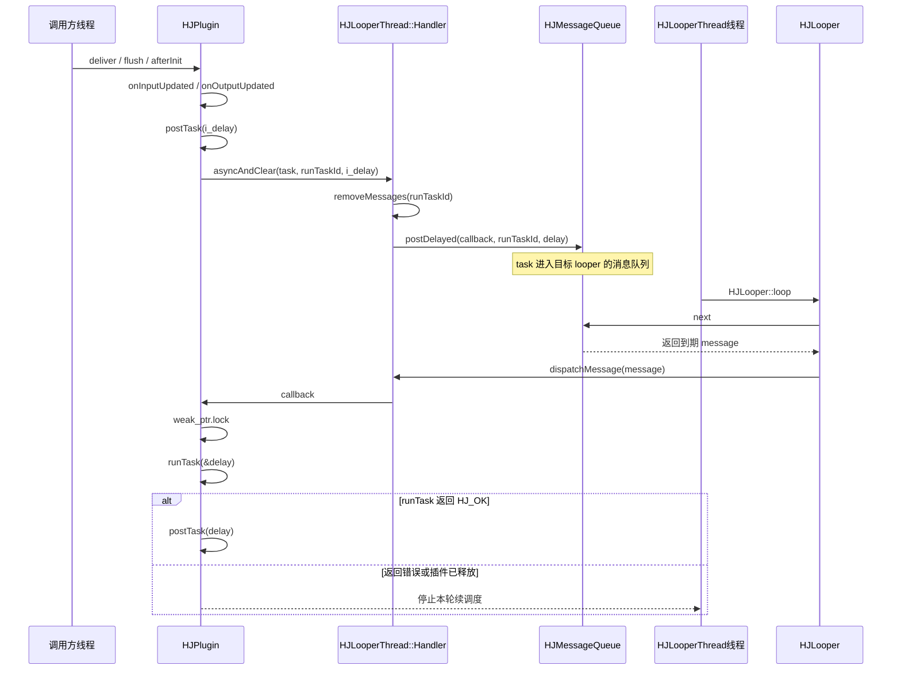
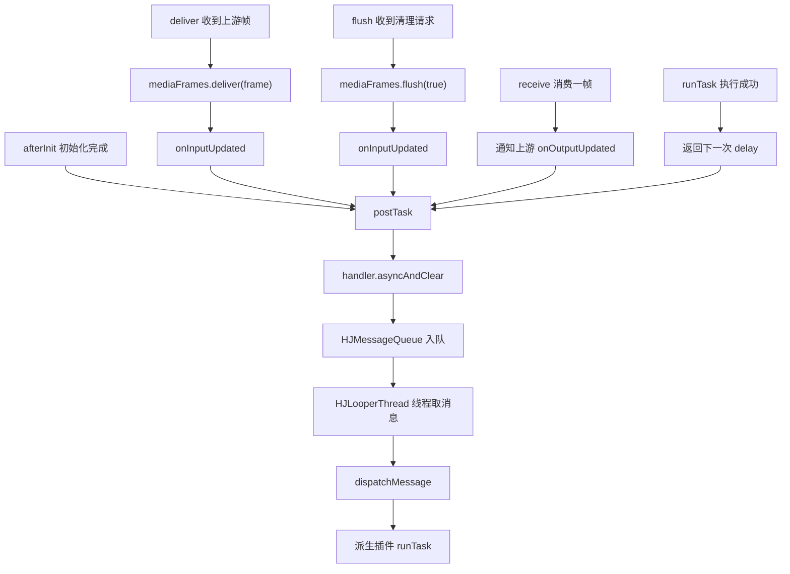
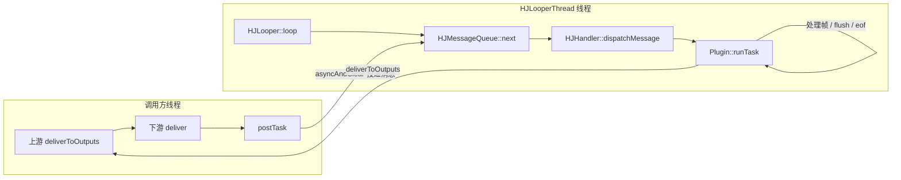
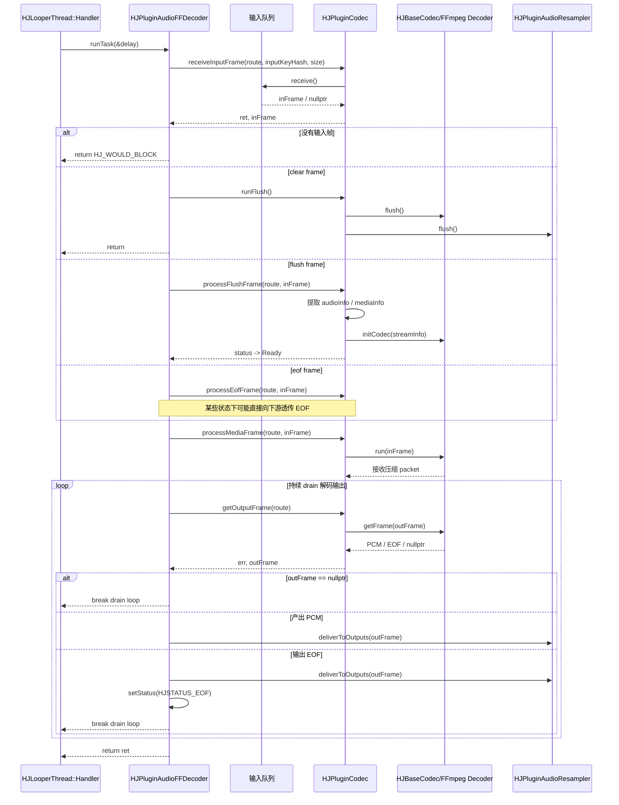
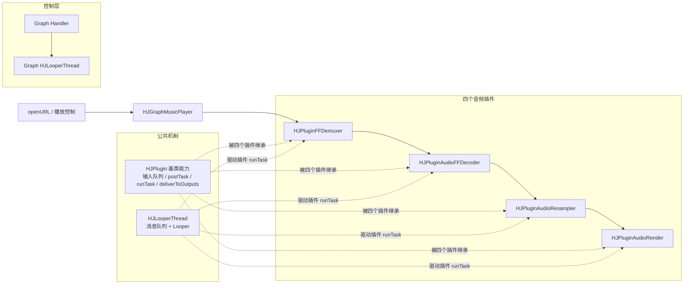
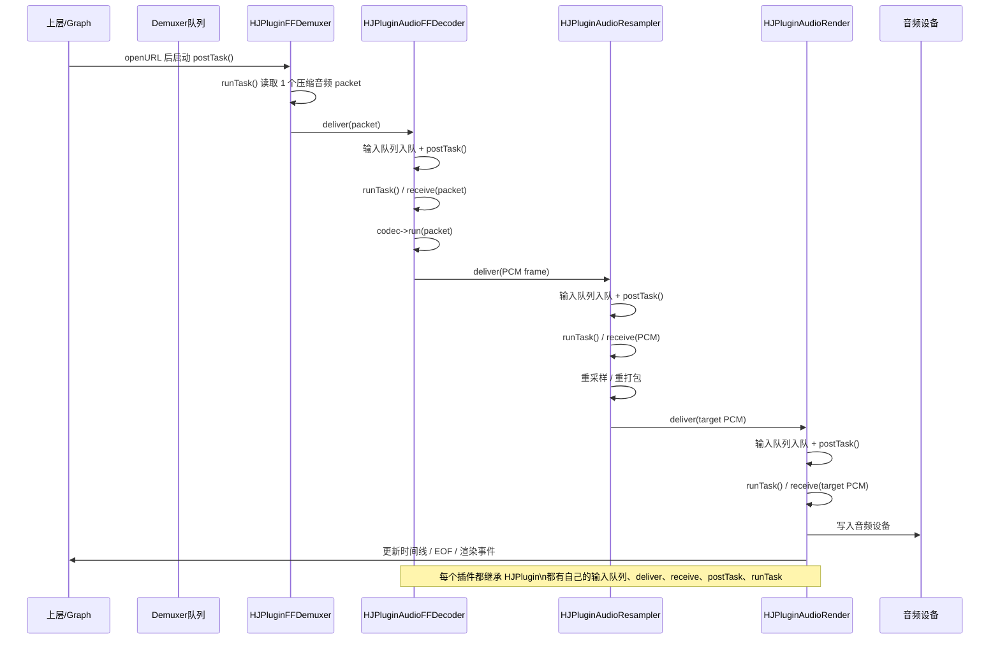
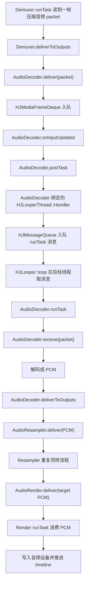
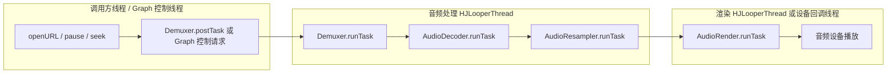

# Day 10：Plugin 生命周期和日志点设计

对应计划：`study/week2-thread-plugin-player-practice.md`

## 今日目标

- 读懂 `HJPlugin` 如何管理输入队列、输出插件、handler 调度和生命周期。
- 理解 `deliver()`、`receive()`、`flush()`、`runTask()`、`deliverToOutputs()` 在插件链路里的协作关系。
- 为插件链路卡住、队列堆积、flush 不生效、EOF 不传播这些问题设计日志点。
- 用 `studyDemo/day10_plugin_lifecycle_logging.cpp` 模拟插件链路日志。

## 阅读记录

- [x] `src/plugins/doc/HJPlugin.md`
- [x] `src/plugins/doc/HJPluginCodec.md`
- [x] `src/plugins/doc/HJMediaFrameDeque.md`
- [x] `src/plugins/HJPlugin.h`
- [x] `src/plugins/HJPlugin.cpp`
- [x] `src/plugins/HJMediaFrameDeque.cpp`

## 核心关系

```text
upstream plugin
  -> downstream.deliver(srcKeyHash, frame)
    -> HJMediaFrameDeque::deliver(frame)
    -> downstream.onInputUpdated()
    -> downstream.postTask()
      -> handler asyncAndClear(runTaskId)
        -> downstream.runTask()
          -> receive(srcKeyHash)
          -> process / flush / eof
          -> deliverToOutputs(frame)
```

最短理解：

- `deliver()` 是上游把帧推入下游输入队列。
- `receive()` 是下游在自己的 `runTask()` 里从输入队列取帧。
- `postTask()` 把 `runTask()` 投递到插件 handler，并用 `asyncAndClear` 避免同一插件重复堆积调度任务。
- `flush()` 清空输入队列，并插入 clear frame 语义，随后触发调度。
- `deliverToOutputs()` 把处理后的帧继续投递给所有下游插件。

## postTask / runTask 调度图

### 调度时序



关键点：

- `postTask()` 可以由调用方线程触发，但 `runTask()` 不在调用方线程直接执行。
- `handler->asyncAndClear()` 把任务投递到 `HJLooperThread` 绑定的消息队列。
- `HJLooper::loop()` 在 `HJLooperThread` 的 OS 线程上取消息并分发。
- lambda 里先 `weak_ptr.lock()`，插件还活着才调用派生类的 `runTask()`。

### 四类入口汇入 postTask



源码入口：

| 入口 | 位置 | 说明 |
|---|---|---|
| `afterInit()` | `src/plugins/HJPlugin.cpp:176` | 插件初始化完成后先调度一次 |
| `deliver()` | `src/plugins/HJPlugin.cpp:254` | 上游帧进入当前插件输入队列后触发 |
| `flush()` | `src/plugins/HJPlugin.cpp:278` | 清理输入队列并触发 flush 语义处理 |
| `onInputUpdated()` | `src/plugins/HJPlugin.cpp:314` | 输入变化后统一调用 `postTask()` |
| `receive()` | `src/plugins/HJPlugin.cpp:401` | 当前插件消费输入后，通知上游 `onOutputUpdated()` |
| `onOutputUpdated()` | `src/plugins/HJPlugin.cpp:294` | 下游腾出空间后唤醒上游 |
| `postTask()` | `src/plugins/HJPlugin.cpp:364` | 投递 `runTask()` 到 handler 线程 |
| `HJLooperThread::run()` | `src/utils/HJThread/HJLooperThread.cpp:223` | looper 线程入口 |
| `HJLooper::loop()` | `src/utils/HJThread/HJLooper.cpp:42` | 在 looper 线程循环取消息 |
| `HJHandler::dispatchMessage()` | `src/utils/HJThread/HJHandler.cpp:7` | 执行消息里的 callback |

### 线程归属



结论：`postTask()` 是调度请求入口，可能从调用方线程触发；`runTask()` 是插件业务执行入口，最终运行在插件绑定的 `HJLooperThread` 线程上。这个线程可能是外部传入的共享线程，也可能是 `createThread=true` 时由插件自己创建的私有线程。

## HJPluginAudioFFDecoder::runTask 图解

`HJPluginAudioFFDecoder::runTask()` 的职责是：从输入队列取一帧压缩音频，处理 clear/flush/EOF 控制语义，把普通压缩包交给 codec 解码，再把解码后的 PCM 往下游投递。

### 时序图



### 读图顺序

1. `receiveInputFrame()` 先从 decoder 的输入队列里拿一帧。
2. 如果拿到的是 `clear/flush/eof` 控制帧，优先走控制分支，不直接按普通音频包处理。
3. 普通压缩音频包会进入 `processMediaFrame()`，内部调用 `m_codec->run(inFrame)`。
4. 解码并不是一进一出，所以后面要循环 `getOutputFrame()`，持续把 codec 里已经解出的 PCM 拉出来。
5. 每个输出 PCM 都通过 `deliverToOutputs()` 送给 `HJPluginAudioResampler`。
6. 真正进入 `HJSTATUS_EOF` 的时机，不是“收到输入 EOF”，而是“输出 drain 到 EOF 帧”。

### 关键结论

- `runTask()` 一次只消费一个输入帧，但可能产出多个输出 PCM 帧。
- flush 的重点不是清队列，而是重建或刷新 codec 内部状态。
- EOF 要分输入 EOF 和输出 EOF，两者时机不同。
- `HJPluginAudioFFDecoder.cpp` 看起来不长，但 flush、error、EOF 的核心状态机大量依赖 `HJPluginCodec.cpp`。

## 一帧音频数据流动图

这里以 `HJGraphMusicPlayer` 的典型四插件链路为例：

```text
HJPluginFFDemuxer -> HJPluginAudioFFDecoder -> HJPluginAudioResampler -> HJPluginAudioRender
```

对应语义：

- `Demuxer`：从媒体源读出压缩音频 packet。
- `AudioDecoder`：把压缩 packet 解码成 PCM。
- `AudioResampler`：把 PCM 转成目标采样率、格式、声道布局。
- `AudioRender`：消费最终 PCM，写入音频设备并推进 timeline。

### 结构关系图



### 一帧音频的时序图



### 把 HJPlugin 和 HJLooperThread 放进数据流



### 线程视角



关键理解：

- 一帧音频不是在一个同步调用栈里从 `Demuxer` 直接跑到 `Render`。
- 每到下游插件，都会先 `deliver()` 入队，再由下游自己的 `postTask()` 把 `runTask()` 投递到它绑定的 `HJLooperThread`。
- `HJPlugin` 提供统一机制：输入队列、`deliver()`、`receive()`、`postTask()`、`deliverToOutputs()`。
- 具体业务由各派生插件各自的 `runTask()` 完成：demux 读包、decoder 解码、resampler 转换、render 播放。
- `AudioRender` 是最接近真实播放头的位置，所以 timeline 应由 render 推进，而不是由 demuxer 或 decoder 推进。

## 生命周期状态图

```text
NONE
  -> init()
    -> Inited
      -> postTask()
        -> runTask()
          -> Ready / Running
            -> setPause(true)  -> Paused
            -> setPause(false) -> Ready
            -> flush()         -> Ready + clear frame
            -> EOF frame       -> EOF
            -> error           -> Exception
      -> done()
        -> Done
        -> internalRelease()
```

注意：状态图不是严格的单线状态机。不同插件可能在 `runTask()` 中根据 codec、timeline、队列、EOF 调整为 `Ready`、`Running`、`EOF`、`Stoped` 或 `Exception`。排查时要看具体插件实现。

## 日志点设计

| 函数 | 建议字段 | 用于定位 |
|---|---|---|
| `init()` / `afterInit()` | plugin name、status、thread id、handler 是否存在、createThread、输入/输出数量 | 插件是否完成初始化，是否拥有调度线程 |
| `deliver()` | plugin name、srcKeyHash、src plugin、media type、track id、pts/dts、duration、frame type、queue size before/after、status、thread id | 上游是否真的把帧推到了下游；队列是否持续增长 |
| `receive()` | plugin name、srcKeyHash、pts/dts、frame type、queue size after、status、thread id | `runTask()` 是否在消费输入队列；消费速度是否跟得上 |
| `flush()` | plugin name、srcKeyHash、queue size before/after、是否 store clear frame、status、thread id | seek/切流后旧帧是否被清掉；flush 是否到达目标插件 |
| `runTask()` enter | plugin name、status、paused、input size、delay、thread id、route | handler 是否调度到了插件；是否因为 pause/status/空队列退出 |
| `runTask()` exit | plugin name、ret、next delay、status、processed frame pts、output count、cost ms | 插件是否卡在处理、是否反复返回 delay、是否进入异常 |
| `deliverToOutputs()` | plugin name、output plugin、media type、track id、pts/dts、frame type、output count、ret | 下游是否收到了帧；某个输出插件是否 deliver 失败 |
| `done()` / `internalRelease()` | plugin name、status、queue size、handler/thread 是否释放、thread id | teardown 顺序是否正确；旧任务是否仍可能访问插件 |

字段优先级：先打印能串起链路的字段，再打印性能字段。

```text
第一优先级：plugin name、action、status、thread id、frame pts、frame type、queue size
第二优先级：src/dst plugin、srcKeyHash、track id、media type、ret、delay
第三优先级：duration、sample count、video key frame、cost ms、route
```

## 卡住位置判断

### 1. 有 `deliver()`，没有 `runTask()`

常见原因：

- 插件没有 handler，或者 `init()` 时没有传 `thread/createThread`。
- `postTask()` 没有被触发。
- 插件已经 `Done`，`getInput()` 返回空。
- handler 已退出或被 `internalRelease()` 置空。

排查重点：`init/afterInit/postTask` 日志、handler 是否存在、status 是否已 `Done`。

### 2. 有 `runTask()`，没有 `receive()`

常见原因：

- `srcKeyHash` 不匹配，输入队列找不到。
- 状态小于 `Inited` 或已经 `Done/EOF/Stoped`。
- 插件 pause 后直接跳过。

排查重点：`runTask()` enter 的 status、paused、inputKeyHash，`receiveInputFrame()` 的 route/ret。

### 3. 有 `receive()`，没有 `deliverToOutputs()`

常见原因：

- codec 处理失败，状态进入 `Exception`。
- 输入帧是 flush/eof 控制帧，走了特殊分支。
- 输出暂时不可用，需要下一轮 `runTask()` drain。

排查重点：`processMediaFrame()` ret、`getOutputFrame()` ret、flush/eof 分支日志。

### 4. 有 `deliverToOutputs()`，下游没收到

常见原因：

- 输出插件 weak_ptr 已失效。
- 下游 `deliver()` 返回错误。
- media type / track id 对应关系不一致。

排查重点：output plugin name、output key、deliver ret、下游 `deliver()` 是否出现。

### 5. flush 后仍播放旧帧

常见原因：

- flush 没有传播到所有下游。
- 某个插件只清了输入队列，内部 codec/FIFO/timeline 没清。
- flush 期间旧的 delayed task 仍然执行。

排查重点：每个插件的 `flush()`、`runFlush()`、内部缓存清理、旧任务 message id。

## 今日 Demo

文件：`studyDemo/day10_plugin_lifecycle_logging.cpp`

编译运行：

```powershell
cd D:\PROJECT\temp\HJMedia
cmake -S studyDemo -B studyDemo/output
cmake --build studyDemo/output --target day10_plugin_lifecycle_logging
.\studyDemo\output\Debug\day10_plugin_lifecycle_logging.exe
```

如果使用单配置生成器，产物可能在：

```powershell
.\studyDemo\output\day10_plugin_lifecycle_logging.exe
```

demo 模拟了一条简化链路：

```text
demuxer -> audio-decoder -> audio-render
```

观察点：

1. 正常媒体帧先进入 `audio-decoder.deliver()`，再由 `runTask()` 调用 `receive()` 消费。
2. `audio-decoder.deliverToOutputs()` 会触发 `audio-render.deliver()` 和 `audio-render.runTask()`。
3. pause 后，输入帧仍可入队，但 `runTask()` 会跳过消费。
4. flush 会清空旧帧，插入 flush 控制帧，并向下游传播。
5. EOF 会从 decoder 继续传到 render。

## 面试表达

问：`deliver()` 和 `receive()` 是什么关系？

答：`deliver()` 是上游调用下游插件的入口，它把帧写入下游插件按源插件区分的输入队列，并触发下游 `postTask()`。`receive()` 是下游插件在自己的 `runTask()` 中从输入队列取帧消费。也就是说，队列归消费者插件管理，上游只负责投递。

问：如何通过日志判断插件链路卡在哪里？

答：按链路顺序看日志断点。只有 `deliver()` 没有 `runTask()`，优先查 handler/postTask/status；有 `runTask()` 没有 `receive()`，查 inputKeyHash、pause、Done/EOF 状态；有 `receive()` 没有 `deliverToOutputs()`，查 codec/process/flush/eof 分支；有 `deliverToOutputs()` 但下游没有 `deliver()`，查输出 weak_ptr、media type/track id 和 deliver 返回值。

问：插件日志最少应该打印哪些字段？

答：最少要有 plugin name、action、status、thread id、frame pts、frame type、queue size、src/dst plugin 和 ret。这样可以同时串起“帧在哪里”“队列是否堆积”“在哪个线程执行”“状态是否允许继续处理”这几条线索。

## 今日总结

Plugin 的核心不是单个处理函数，而是输入队列、handler 调度和输出转发组成的一条链路。`deliver()` 证明上游推到了下游，`receive()` 证明下游开始消费，`runTask()` 证明调度线程在工作，`deliverToOutputs()` 证明处理结果继续向后流动，`flush()` 和 EOF 则验证控制帧是否沿链路传播。排查卡顿时不要只看某一个插件，要按这些日志点从上游到下游逐段找第一个断点。
