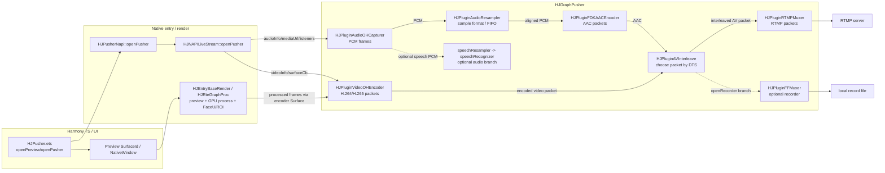
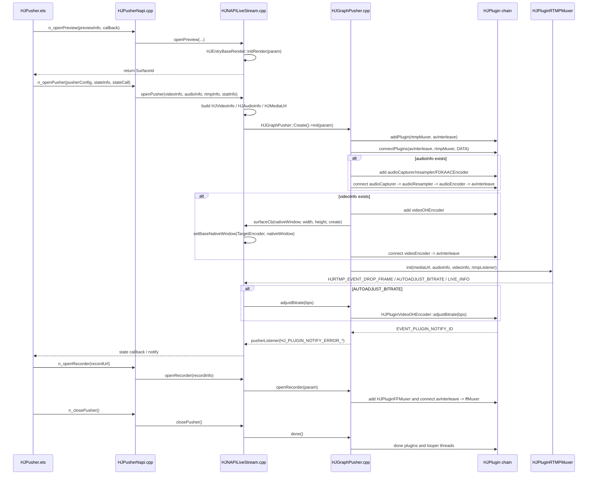

# Day 15：Pusher Graph 总览

对应计划：`study/week3-pusher-codec-rtmp-practice.md`

## 今日目标

- 从源码讲清 HJMedia 推流端的基本架构。
- 把 Harmony API、NAPI bridge、`HJGraphPusher` 和插件链路串起来。
- 理解推流端为什么优先保证实时性，而不是像点播播放器一样追求完整播放。

## 今日阅读

| 路径 | 关注点 |
|---|---|
| `study/week3-pusher-codec-rtmp-practice.md` | Day 15 的阅读范围、实践任务和验收要求 |
| `src/graphs/HJGraphPusher.h` | Pusher graph 成员：RTMP、AVInterleave、audio capturer/resampler/encoder、video encoder、录制和语音识别分支 |
| `src/graphs/HJGraphPusher.cpp` | `internalInit` 如何按 `audioInfo/videoInfo/mediaUrl/surfaceCb` 组装插件链 |
| `src/graphs/HJGraph.h` / `src/graphs/HJGraph.cpp` | `connectPlugins` 同时登记上游 output 和下游 input，`removePlugin` 会 `done()` 插件 |
| `src/entry/pusher/HJPusherInterface.h` | 产品层配置结构和 `HJPusherNofityType` |
| `src/entry/pusher/hsys/bridge/HJPusherNapi.cpp` | Harmony NAPI 入口：解析 JSON，调用 `openPreview/openPusher/setMute/openRecorder` |
| `src/entry/pusher/hsys/verify/HJNAPILiveStream.h/.cpp` | 把 API 参数转成 `HJAudioInfo/HJVideoInfo/HJMediaUrl/HJKeyStorage`，创建 `HJGraphPusher` |
| `examples/harmony/API.md` | HJPusher 对外 API：`contextInit/create/openPreview/setWindow/openPusher/closePusher/setMute/openRecorder` |
| `examples/harmony/hjpusher/src/main/ets/native/HJPusher.ets` | TS 封装如何调用 `libHJPusher.so` 的 NAPI 方法 |
| `src/plugins/HJPluginAVInterleave.cpp` | 按 audio/video DTS 选择下一包，输出到 RTMP/录制 muxer |
| `src/plugins/HJPluginMuxer.cpp` / `src/plugins/HJPluginRTMPMuxer.cpp` | muxer 初始化、写帧、关键帧前丢弃、RTMP listener |
| `src/plugins/hsys/HJPluginAudioOHCapturer.cpp` | Harmony 音频采集和静音控制 |
| `src/plugins/hsys/HJPluginVideoOHEncoder.cpp` | Harmony 视频硬编 Surface、取编码帧、动态调码率 |

## 数据流

```text
Harmony TS API
  -> HJPusherNapi::openPusher
  -> HJNAPILiveStream::openPusher
  -> HJGraphPusher::init/internalInit

audio:
  HJPluginAudioOHCapturer
  -> HJPluginAudioResampler
  -> HJPluginFDKAACEncoder
  -> HJPluginAVInterleave

video:
  HJEntryBaseRender / HJRteGraphProc preview + GPU process
  -> HJPluginVideoOHEncoder surface
  -> HJPluginAVInterleave

output:
  HJPluginAVInterleave
  -> HJPluginRTMPMuxer
  -> RTMP server

optional record:
  HJPluginAVInterleave
  -> HJPluginFFMuxer
  -> local file
```

这里的“处理”主要分两层：预览、GPU 后处理、FaceU、ROI 等图像链路在 `HJEntryBaseRender/HJRteGraphProc` 侧；`HJGraphPusher` 自己负责把编码、音视频交织、RTMP、录制和语音识别这些插件链路连起来。

## 控制流

1. `HJPusher.contextInit` 调到 `HJPusherNapi::contextInit`，最终初始化 `HJEntryContext` 和日志环境。
2. `createPusher` 在 native 层创建 `HJPusherBridge`，它继承 `HJNAPILiveStream`。
3. `openPreview` 先初始化渲染/预览图，拿到 SurfaceId，给 UI 绑定预览窗口。
4. `setWindow` 把 Harmony Surface 绑定到渲染目标。
5. `openPusher` 解析 `PusherConfig` 和 `MediaStateInfo`，创建 `HJVideoInfo`、`HJAudioInfo`、`HJMediaUrl`，再把 `surfaceCb`、RTMP listener、plugin listener 和 stat context 填进 `HJKeyStorage`。
6. `HJGraphPusher::internalInit` 按参数建插件：先建 `rtmpMuxer` 和 `avInterleave`，再按是否有音频/视频参数接入音频链和视频链。
7. `closePusher` 调 `m_graphPusher->done()`，图释放插件和线程。

## Mermaid 图

### 数据流



### 控制流



## HJGraphPusher 组装要点

| 条件 | 插件链路 | 源码语义 |
|---|---|---|
| 基础必备 | `avInterleave -> rtmpMuxer` | 推流总出口，`AVInterleave` 输出有序 packet，`RTMPMuxer` 写网络 |
| 有音频 | `audioCapturer -> audioResampler -> audioEncoder -> avInterleave` | OH 采集 PCM，重采样/FIFO 对齐，FDK AAC 编码 |
| 有视频 | `videoEncoder -> avInterleave` | OH 视频编码器从 Surface 取硬编 packet |
| 打开录制 | `avInterleave -> ffMuxer` | 运行中新增本地封装分支，不重建 RTMP 主链 |
| 打开语音识别 | `audioCapturer -> speechResampler -> speechRecognizer` | 从同一音频采集源分出 16k/mono/320 samples 的识别输入 |

`connectPlugins(src, dst, type)` 会调用 `src->addOutputPlugin(dst, type, trackId)` 和 `dst->addInputPlugin(src, type, trackId)`，所以它既建立数据方向，也让下游知道自己的输入来源。`removePlugin` 会从图里移除插件并调用插件 `done()`，这就是 `closeRecorder/closeSpeechRecognizer` 能动态拆分支的基础。

## 线程与生命周期

- `HJGraphPusher` 继承 `HJGraph`，生命周期仍是 `init -> running plugin tasks -> done/release`。
- 音频链会创建 `HJLooperThread::quickStart("audioThread")`，并传给 AAC encoder/resampler；`AVInterleave`、muxer 等插件没有外部 thread 时会按插件逻辑创建或使用自己的 worker。
- 视频编码的输入不是普通 CPU queue，而是 `HJPluginVideoOHEncoder` 创建编码器 Surface 后，通过 `surfaceCb` 交给渲染链路写入。
- `setMute` 使用 `SYNC_CONS_LOCK` 到音频采集插件；`openRecorder/openSpeechRecognizer` 使用 `SYNC_PROD_LOCK` 动态改生产侧拓扑。
- `internalRelease` 清空插件智能指针、线程、媒体参数、listener 和状态位，最后调用 `HJGraph::internalRelease()` 让所有插件和线程 `done()`。

## 实时性与反压观察

推流端和播放器的核心目标不同：

| 维度 | Pusher | Player |
|---|---|---|
| 数据方向 | 设备/渲染链产生数据，编码后发往网络 | 网络/文件输入，解码后渲染 |
| 核心目标 | 低延迟、稳定输出、弱网下可降级 | 正确播放、A/V 同步、seek/EOF 语义完整 |
| 队列风险 | 网络慢会导致 packet 堆积、延迟和内存上涨 | 解码或渲染慢会导致卡顿、追帧或丢帧 |
| EOF 语义 | 通常由停止推流、网络关闭或 muxer done 驱动 | 文件/流结尾需要沿解码/渲染链完整传播 |
| 失败策略 | 丢帧、调码率、重试、断线通知 | seek/flush、重连、等待缓冲或结束播放 |

`HJPluginMuxer::dropping` 在视频存在时会先丢到关键帧，避免从非关键帧开始写导致下游不可解码。`HJRTMP_EVENT_DROP_FRAME` 和 `HJRTMP_EVENT_AUTOADJUST_BITRATE` 会被 `HJNAPILiveStream::openPusher` 转成产品层通知，其中自动调码率会回调 `m_graphPusher->adjustBitrate(bps)`，最终落到 `HJPluginVideoOHEncoder::adjustBitrate`。

## 今日 Demo

文件：`studyDemo/day15_pusher_graph.cpp`

demo 做了四件事：

- 打印 `HJGraphPusher` 的插件组装：基础 RTMP 出口、音频链、视频链。
- 打印 Harmony API 到 native graph 的控制流。
- 模拟 `HJPluginAVInterleave` 按 DTS 交织音视频 packet，并在中途打开录制分支。
- 打印 RTMP/Plugin 事件到产品层 notify 的映射。

构建运行：

```powershell
cd D:\PROJECT\temp\HJMedia
cmake -S studyDemo -B studyDemo/output
cmake --build studyDemo/output --target day15_pusher_graph
.\studyDemo\output\Debug\day15_pusher_graph.exe
```

如果使用单配置生成器，运行路径可能是：

```powershell
.\studyDemo\output\day15_pusher_graph.exe
```

本次验证：当前环境 `cmake` 不在 PATH，已使用 `C:\Program Files\JetBrains\CLion 2026.1.2\bin\cmake\win\x64\bin\cmake.exe` 完成配置和构建；`studyDemo/output/Debug/day15_pusher_graph.exe` 运行成功，输出包含插件组装、API 控制流、DTS 交织、录制分支和通知映射。Windows 下 demo 公共输出 helper 会在打印前设置 UTF-8 控制台代码页，避免中文输出乱码。

## 风险与排查点

| 现象 | 可疑模块 | 日志点 | 可能原因 | 验证方式 |
|---|---|---|---|---|
| 开推失败 | `HJNAPILiveStream::openPusher` / `HJGraphPusher::internalInit` | video/audio/url 参数、`surfaceCb`、各插件 init 返回值 | 配置缺失、Surface 未准备、编码器初始化失败 | 从 API 参数日志一路跟到 `m_graphPusher->init(param)` |
| 有音频无视频或相反 | audio/video 分支条件 | `audioInfo/videoInfo` 是否为空、`connectPlugins` 是否成功 | 产品层配置未传、平台宏下插件未启用 | 检查 `HJGraphPusher` 是否创建对应插件 |
| 推流延迟越来越大 | `AVInterleave` / muxer / RTMP | audio/video DTS、muxer queue、RTMP drop/bitrate event | 网络发送慢，packet 堆积，未及时丢帧或降码率 | 观察 `HJRTMP_EVENT_DROP_FRAME/AUTOADJUST_BITRATE/LIVE_INFO` |
| 录制失败 | `openRecorder` / `HJPluginFFMuxer` | `mediaUrl`、`m_inRecording`、`connect avInterleave -> muxer` | 重复打开、文件路径错误、muxer init 失败 | 确认主 RTMP 不重建，只有录制分支新增 |
| 静音无效 | `setMute` / `HJPluginAudioOHCapturer` | `m_audioCapturer` 是否存在、`setMute` 调用线程 | 没有音频分支，或采集插件未初始化 | 开推前后分别测试 mute 状态 |
| 自动调码率无效 | RTMP listener / `adjustBitrate` | `HJRTMP_EVENT_AUTOADJUST_BITRATE`、bps 值、encoder ret | 事件未到达、视频编码器为空、平台不支持 | 看通知映射和 `HJPluginVideoOHEncoder::adjustBitrate` 返回值 |

## 面试复述

可以这样说：

> 我把 HJMedia 的推流端理解成一个实时生产型 Graph。Harmony 侧先通过 `openPreview` 搭好预览和 GPU 处理链路，`openPusher` 再把音频参数、视频参数和 RTMP URL 传到 native。`HJGraphPusher` 里固定有 `AVInterleave -> RTMPMuxer`，有音频时接 `AudioOHCapturer -> AudioResampler -> FDKAACEncoder -> AVInterleave`，有视频时接 `VideoOHEncoder -> AVInterleave`。视频编码器通过 Surface 接收渲染链路处理后的画面，音频从设备采集后重采样并编码。`AVInterleave` 按 DTS 交织音视频 packet，RTMP muxer 负责写网络；录制是在 `AVInterleave` 后动态加一个 `FFMuxer` 分支。推流端的重点是实时性，弱网时要关注丢帧、降码率、重试和队列堆积，不能无限缓存。

## 今日结论

第15天的关键不是背插件名，而是能从产品 API 一路讲到图内拓扑：TS API 负责传配置和 Surface，NAPI/bridge 负责转成 C++ 参数，`HJGraphPusher` 负责组装音频、视频、交织、RTMP 和可选分支。推流端和播放端的最大差异是目标不同：播放器偏向完整消费和 EOF/seek 语义，推流器偏向实时输出和弱网降级。
