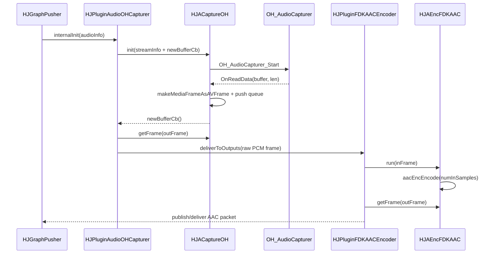

# Day 16：PCM、采样率与 AAC 输入帧

日期：2026-07-05

## 今日目标

把“PCM 字节数怎么算”和 HJMedia 推流端的真实代码对应起来：Harmony 音频采集先产出 S16 PCM，AAC-LC 编码器按 1024 samples/channel 消费输入，编码后输出 AAC packet 给后续 interleave / mux / RTMP 链路。

## 基础概念解释

先把这篇笔记里反复出现的词拆开理解。音频链路可以先记成一句话：麦克风采到的是 PCM 原始样本，编码器把一段 PCM 压缩成 AAC packet，后面的 mux / RTMP 再把 AAC packet 和视频 packet 按时间戳交织发送。

| 概念 | 通俗理解 | 在本文 / HJMedia 里的对应 |
|---|---|---|
| PCM | Pulse Code Modulation，未压缩的原始音频数据。可以理解为“每隔很短时间记录一次声音波形的数值”。 | `HJACaptureOH::OnReadData` 从麦克风拿到的 buffer 就是 S16 PCM。 |
| AAC | 一种有损音频压缩编码格式。它不是原始声音，而是把 PCM 压缩后的码流。 | `HJAEncFDKAAC::run` 把 PCM AVFrame 编成 AAC AVPacket。 |
| AAC-LC | AAC 的常见规格，LC 是 Low Complexity。直播、短视频里很常见。 | `HJAEncFDKAAC::init` 里设置 `AOT_AAC_LC`，并使用 1024 samples/channel 作为一帧输入节奏。 |
| FDK-AAC | Fraunhofer FDK AAC 编码库，负责真正执行 AAC 编码。 | HJMedia 的 `HJAEncFDKAAC` 是对 FDK-AAC 的封装。 |
| sample | 一个采样点。对单声道来说，就是某一瞬间的一个声音数值；对双声道来说，同一时刻左右声道各有一个 sample。 | 笔记里的 `samples/channel` 指“每个声道各有多少采样点”。 |
| sample rate | 采样率，每秒采多少个 sample，单位 Hz。 | 48000Hz 表示每个声道每秒 48000 个采样点。 |
| channel | 声道。mono 是 1 声道，stereo 是 2 声道。 | 双声道 PCM 计算字节数时要乘以 2。 |
| bit depth / bytesPerSample | 每个 sample 用多少位存储。16bit 等于 2 bytes。 | S16 PCM 的 `bytesPerSample = 2`。 |
| S16 / S16LE | signed 16-bit PCM，LE 是 little-endian。 | `HJACaptureOH` 设置 `AUDIOSTREAM_SAMPLE_S16LE`，`HJMediaFrame` 当前也只支持 S16 音频输入路径。 |
| blockAlign | 一个采样时刻里所有声道占用的字节数。 | stereo S16 的 `blockAlign = 2 channels * 2 bytes = 4 bytes`。 |
| chunk | 一次采集回调交给我们的“一小块”PCM。大小由系统音频回调决定。 | demo 里模拟每次采集 480 samples/channel，也就是 48k 下 10ms PCM。 |
| frame | 音视频处理中为了处理方便切出来的一帧数据。音频 frame 通常表示一段连续 samples。 | AAC-LC 编码常按 1024 samples/channel 作为一个输入 frame。 |
| packet | 编码后的压缩数据包。packet 通常比 raw frame 更适合交给 mux / 网络发送。 | `HJMediaFrame::makeMediaFrameAsAVPacket` 生成 AAC packet。 |
| PTS / DTS | 时间戳。PTS 表示什么时候展示/播放，DTS 表示什么时候解码。音频通常 PTS/DTS 差异不大，视频有 B 帧时更明显。 | demo 用 sample 数推导 PTS；真实采集路径里 `HJACaptureOH` 使用 `HJCurrentSteadyMS()`。 |
| mux / interleave | mux 是封装，interleave 是把音频和视频按时间戳交错排列。 | AAC packet 后续会进入 AV interleave / mux / RTMP 链路。 |

最容易混淆的是 PCM frame 和 AAC packet：PCM frame 是编码器输入，大小可以按公式算；AAC packet 是编码器输出，大小由码率、编码器状态和声音内容决定，不能简单认为等于 PCM 输入大小。比如 48k、双声道、S16、1024 samples/channel 的 PCM 输入固定是 4096 字节，但压缩后的 AAC packet 可能远小于 4096 字节。

## 今日阅读

- `study/week3-pusher-codec-rtmp-practice.md`
- `studyDemo/day16_pcm_aac_frame_calc.cpp`
- `src/media/capture/hsys/HJACaptureOH.h`
- `src/media/capture/hsys/HJACaptureOH.cc`
- `src/plugins/hsys/HJPluginAudioOHCapturer.h`
- `src/plugins/hsys/HJPluginAudioOHCapturer.cpp`
- `src/plugins/HJPluginCapturer.cpp`
- `src/media/codec/HJAEncFDKAAC.h`
- `src/media/codec/HJAEncFDKAAC.cc`
- `src/plugins/HJPluginFDKAACEncoder.h`
- `src/plugins/HJPluginFDKAACEncoder.cpp`
- `src/media/HJMediaInfo.h`
- `src/media/HJMediaFrame.cc`
- `src/media/render/HJARenderMini.cc`

## 今日实践

Demo：`studyDemo/day16_pcm_aac_frame_calc.cpp`

这个 demo 做三件事：

1. 计算 S16 stereo 48k PCM 的 `blockAlign`、每秒字节数、10ms/20ms 字节数。
2. 模拟采集端每次推入 480 samples/channel，即 48k 下 10ms PCM chunk。
3. 模拟编码前拼帧：累计到 1024 samples/channel 后，才输出一帧 AAC-LC 编码输入，并打印 `bytes` 和 FDK-AAC 的 `numInSamples`。

## 源码观察

`HJACaptureOH::init` 使用 Harmony `OH_AudioStreamBuilder` 设置采样率、声道数、S16LE、RAW encoding 和 mic source。`HJACaptureOH::OnReadData` 收到系统采集回调后，如果静音就把 buffer 清零，然后用 `HJMediaFrame::makeMediaFrameAsAVFrame` 把原始 PCM 包成音频 AVFrame 并塞进 `m_outputQueue`。

`HJPluginAudioOHCapturer::internalInit` 把 `HJAudioInfo` 转成 `streamInfo` 传给 `HJPluginCapturer`。`HJPluginCapturer::initCapturer` 给 `streamInfo` 写入 `newBufferCb`，采集层有新帧时会触发 `runTask()`，再由 `HJPluginCapturer::runTask` 调 `m_capturer->getFrame(outFrame)` 并 `deliverToOutputs(outFrame)`。

`HJAEncFDKAAC::init` 打开 FDK-AAC encoder，AAC-LC 下 `m_samplePerFrame = 1024`。它设置 AOT、sample rate、channel mode、bitrate、transmux 后，通过 `aacEncInfo` 拿到 codec header，并构造 `m_keyCodecParams`。

`HJAEncFDKAAC::run` 从输入 AVFrame 取出 PCM 数据，`m_inElemSize` 固定为 2 字节，`inArgs.numInSamples = m_inSize / m_inElemSize`。因此 stereo S16、1024 samples/channel 时：PCM 字节数是 `1024 * 2 channels * 2 bytes = 4096`，FDK-AAC 看到的 `numInSamples` 是 `4096 / 2 = 2048`。

`HJARenderMini.cc` 是 miniaudio 的使用点之一。它把 `HJAudioInfo` 映射到 `ma_device_config`：format、channels、sampleRate、`periodSizeInFrames = info->m_samplesPerFrame`。这说明同一套 `samplesPerFrame` / `sampleRate` / `channels` 元数据也会影响渲染回调粒度。

## PCM 参数换算

公式：

```text
blockAlign = channels * bytesPerSample
bytesPerSecond = sampleRate * blockAlign
bytesForSamples = samplesPerChannel * blockAlign
durationMs = samplesPerChannel * 1000 / sampleRate
```

| 格式 | 每秒字节数 | 10ms 字节数 | 20ms 字节数 | AAC-LC 1024 samples/channel 输入字节数 | AAC-LC 单帧时长 |
|---|---:|---:|---:|---:|---:|
| 44100Hz / stereo / S16 | 176400 | 1764 | 3528 | 4096 | 23.220ms |
| 48000Hz / stereo / S16 | 192000 | 1920 | 3840 | 4096 | 21.333ms |

注意：AAC-LC 的 1024 是每声道 sample 数；双声道 S16 输入字节数仍然要乘以 2 个声道和 2 字节位深。

## AAC 拼帧伪代码

```cpp
// 采集回调给到的是一小块 PCM chunk，这个 chunk 不一定刚好等于 AAC 编码器需要的 1024 samples/channel。
// 所以先把本次 chunk 的“每声道采样点数”累加到缓存计数里。
bufferedSamplesPerChannel += captureChunk.samplesPerChannel;

// AAC-LC 通常每次编码需要 1024 samples/channel。
// 只要缓存里的 PCM 够 1024，就可以取出一帧送给编码器；不够就继续等下一次采集回调。
while (bufferedSamplesPerChannel >= 1024) {
    // 计算这一帧 AAC 输入需要消耗多少 PCM 字节。
    // 例：48k / 双声道 / S16 => 1024 * 2 * 2 = 4096 bytes。
    inputBytes = 1024 * channels * bytesPerSample;

    // FDK-AAC 的 numInSamples 按“单个 interleaved sample 元素”计数。
    // S16 每个 sample 元素是 2 字节，所以 stereo S16 的 4096 bytes 会变成 2048 个输入 sample。
    fdkaacNumInSamples = inputBytes / bytesPerSample;

    // 把凑够的 1024 samples/channel PCM 送入 AAC 编码器。
    // pts 表示这帧音频在时间轴上的起点。
    encodeOneAacFrame(inputBytes, fdkaacNumInSamples, pts);

    // 已经送去编码的 1024 samples/channel 从缓存计数里扣掉。
    // 如果本次 chunk 多出来一部分，会留在 bufferedSamplesPerChannel 里等待下一帧。
    bufferedSamplesPerChannel -= 1024;

    // 下一帧 AAC 输入的 pts 往后推进一帧音频时长。
    // 48k 下 1024 samples/channel 的时长是 1024 * 1000 / 48000 = 21.333ms。
    pts += 1024 * 1000.0 / sampleRate;
}
```

## Mermaid 图

### 数据流


### 控制流



## 风险与排查点

| 风险 | 可疑位置 | 排查方式 |
|---|---|---|
| 字节数算错，AAC 输入长度不对 | `HJAEncFDKAAC::run` 的 `m_inSize`、`m_inElemSize`、`numInSamples` | 打印 channels、bytesPerSample、sampleCnt、m_inSize、numInSamples |
| 采集 chunk 与 AAC 1024 不对齐 | `HJACaptureOH::OnReadData` 输出帧粒度、编码插件输入队列 | 统计每次 callback 的 bufferLen 和累计 samples |
| sample format 不支持 | `HJMediaFrame::makeMediaFrameAsAVFrame`、`getDataFromAVFrame` 目前只接受 S16 | 确认 `m_sampleFmt == AV_SAMPLE_FMT_S16` |
| 时间戳漂移 | 采集 PTS 使用 `HJCurrentSteadyMS`，AAC packet 沿用输入 PTS | 对比累计 sample 推导时间和实际 PTS 差值 |
| 声道数不支持 | `HJAEncFDKAAC::init` channel mode switch | 确认 channels 在 1-6 范围内 |

## 实践结果

新增/更新：

- `studyDemo/day16_pcm_aac_frame_calc.cpp`
- `studyNote/16-audio-capture-aac.md`

预期运行输出会看到：

```text
blockAlign=4
bytesPerSecond=192000
bytesPer10ms=1920
bytesPer20ms=3840
aac1024Bytes=4096
fdkaacNumInSamples=2048
```

连续推入 5 个 10ms chunk，共 2400 samples/channel，会输出 2 个可编码 AAC 输入帧，并剩余 352 samples/channel。

## 结论

PCM 大小不是“一个 AAC packet 多大”，而是编码器输入的原始样本体积。AAC-LC 常见输入节奏是 1024 samples/channel；压缩后的 AAC packet 大小由码率、编码器和内容决定，不等于 4096 字节。

更准确地说，AAC-LC 的一帧节奏按“每个声道 1024 个采样点”来理解：单声道就是 1024 个 sample 元素，双声道就是 2048 个 sample 元素。声道数不会改变这一帧代表的音频时长，时长只由 `1024 / sampleRate` 决定；但声道数会改变编码器每帧需要读取的 PCM 数据量。也就是说，AAC 一帧的时间长度由 `1024 samples/channel` 和 `sampleRate` 决定，而一帧输入字节数由 `1024 samples/channel * channels * bytesPerSample` 决定。

## 面试复述

我通过阅读 HJMedia 的 Harmony 音频采集和 FDK-AAC 编码路径，做了一个小 demo 验证 PCM 到 AAC 输入帧的换算。以 48k、双声道、S16 为例，PCM 每秒是 `48000 * 2 * 2 = 192000` 字节，AAC-LC 一帧通常吃 1024 samples/channel，所以输入 PCM 是 4096 字节；在 HJMedia 的 `HJAEncFDKAAC::run` 里会转成 FDK-AAC 的 `numInSamples = 2048`。采集回调的 chunk 不一定天然等于 1024，需要在编码前按 sample 数聚合，同时注意 sample format、声道数和时间戳。
