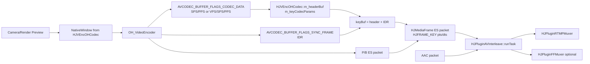
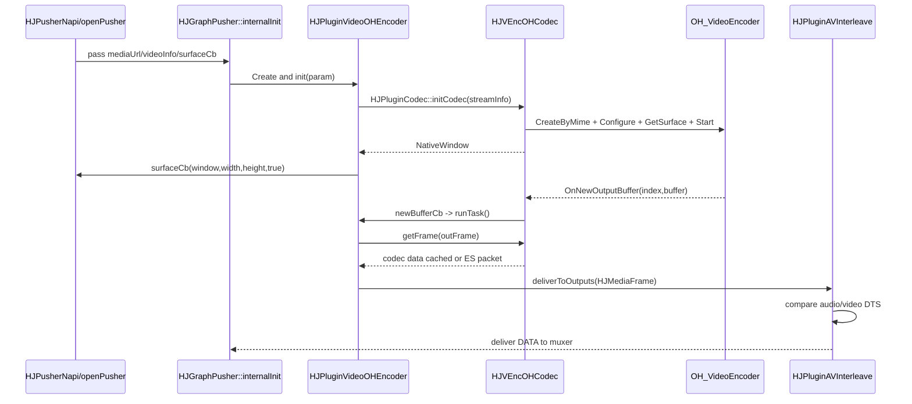

# Day 17 - 视频编码基础

## 今日目标

第 17 天聚焦 Pusher 里的视频编码链路：从上游把画面写入编码 Surface，到 Harmony 硬编码器输出 H.264/H.265 ES packet，再交给音视频交织和 RTMP/录制输出。今天要能解释 SPS/PPS/VPS、IDR、PTS/DTS，以及 HJMedia 中硬编插件的接口边界。

## 阅读源码

- `.agents/skills/hjmedia-daily-study/references/28-day-plan.md`
- `studyDemo/day17_video_codec_headers.cpp`
- `studyDemo/study_demo_common.h`
- `src/graphs/HJGraphPusher.cpp`
- `src/graphs/HJGraphPusher.h`
- `src/plugins/hsys/HJPluginVideoOHEncoder.cpp`
- `src/plugins/hsys/HJPluginVideoOHEncoder.h`
- `src/plugins/HJPluginCodec.cpp`
- `src/plugins/HJPluginCodec.h`
- `src/plugins/HJPluginAVInterleave.cpp`
- `src/media/codec/HJBaseCodec.cc`
- `src/media/codec/HJBaseCodec.h`
- `src/media/codec/hsys/HJVEncOHCodec.cc`
- `src/media/codec/hsys/HJVEncOHCodec.h`
- `src/media/codec/hsys/HJOHCodecUtils.cc`
- `src/media/codec/hsys/HJOHCodecUtils.h`
- `src/media/codec/hsys/HJOHAEncoder.cc`
- `src/media/codec/hsys/HJOHAEncoder.h`
- `src/media/HJMediaFrame.h`
- `src/media/HJMediaInfo.h`

## 源码观察

`HJGraphPusher::internalInit` 是推流图的装配入口。视频存在时，Harmony 分支创建 `HJPluginVideoOHEncoder`，并把 `m_videoEncoder -> m_avInterleave` 以 `HJMEDIA_TYPE_VIDEO` 连接起来。音频链路会从 capturer/resampler/encoder 进入同一个 `HJPluginAVInterleave`，因此视频编码输出不是直接写 RTMP，而是先交给交织插件。

`HJPluginVideoOHEncoder::internalInit` 要求 `surfaceCb` 和 `HJVideoInfo`。它把 `HJVideoInfo` 转成 `streamInfo`，设置 `createThread=false`，初始化 codec 后从 `HJVEncOHCodec` 取 `NativeWindow`，再通过 `surfaceCb(m_nativeWindow, width, height, true)` 暴露给上游。也就是说，视频输入不是普通 `run(rawFrame)`，而是上游渲染/采集把图像写进硬编码器 Surface。

`HJVEncOHCodec::init` 根据 `HJVideoInfo::m_codecID` 选择 `video/avc` 或 `video/hevc`，配置宽高、帧率、NV12、CBR、码率、I 帧间隔，然后 `OH_VideoEncoder_GetSurface` 获取 `NativeWindow`。编码器通过 `OnNewOutputBuffer` 把输出 buffer 放入 `m_outputQueue`，并调用 `m_newBufferCb()`，这个回调由 `HJPluginVideoOHEncoder::initCodec` 填入，最终触发插件 `runTask()` 继续拉取编码输出。

`HJVEncOHCodec::getFrame` 里有三个关键分支：`AVCODEC_BUFFER_FLAGS_CODEC_DATA` 缓存 codec header 到 `m_headerBuf` 并生成 `m_keyCodecParams`；`AVCODEC_BUFFER_FLAGS_SYNC_FRAME` 表示关键帧，此时把 header 和当前 IDR 数据拼成 `keyBuf`；普通输出直接封装为 `HJMediaFrame::makeMediaFrameAsAVPacket`。这就是推流端必须让关键帧携带 SPS/PPS 或 VPS/SPS/PPS 的原因。

`HJMediaInfo.h` 定义了 H.264 NAL 类型：IDR=5、SPS=7、PPS=8；也定义了 H.265 的 IDR、VPS=32、SPS=33、PPS=34。`HJMediaFrame.h` 中 `HJFRAME_KEY` 表示关键帧，`m_pts/m_dts/m_timeBase` 保存时间戳。`HJPluginAVInterleave::runTask` 通过预览 audio/video 的 DTS 决定哪个 packet 先输出，因此推流发送顺序应看 DTS，播放展示时间才看 PTS。

## Mermaid 图

### 数据流

### 控制流

## 关键概念

| 概念 | HJMedia 对应点 | 面试解释 |
|---|---|---|
| SPS/PPS | H.264 参数集，`HJ_NAL_SPS/HJ_NAL_PPS` | 解码器初始化所需的序列/图像参数，关键帧前缺失会导致接收端无法从该点开始解码 |
| VPS/SPS/PPS | H.265 参数集，`HJ_HEVC_NAL_VPS/SPS/PPS` | H.265 比 H.264 多 VPS，用于更复杂的视频参数层级 |
| IDR | H.264 `HJ_NAL_SLICE_IDR`，H.265 IDR 类型 | 关键帧的一种，之后的帧不依赖 IDR 之前的参考帧，适合首帧、重连、切片边界 |
| PTS | `HJMediaFrame::m_pts` | 展示时间，播放器按它做音画同步和渲染 |
| DTS | `HJMediaFrame::m_dts` | 解码/发送顺序，`HJPluginAVInterleave` 用它排序音视频 packet |
| codec data | `AVCODEC_BUFFER_FLAGS_CODEC_DATA` | 硬编码器独立输出的 header，需要缓存并贴到关键帧或写入 codec params |
| key frame | `HJFRAME_KEY` / `AVCODEC_BUFFER_FLAGS_SYNC_FRAME` | 推流端通常要求关键帧携带参数集，方便首帧播放和断线重连 |

## Demo 说明

`studyDemo/day17_video_codec_headers.cpp` 模拟了三件事：

1. `CodecHeaderCache` 先缓存 H.264 的 `SPS/PPS` 或 H.265 的 `VPS/SPS/PPS`，对应 `HJVEncOHCodec::m_headerBuf`。
2. 遇到 key frame 但 packet 没带 header 时，把 header 拼到 `IDR` 前面，对应 `HJVEncOHCodec::getFrame` 里 `keyBuf = m_headerBuf + source`。
3. `DtsMonotonicChecker` 检查 DTS 不倒退，对应 `HJPluginAVInterleave::runTask` 依赖 DTS 排序发送。

## 风险与排查点

- 如果 `codec data` 没有先到，第一帧 IDR 不能直接发给 muxer，应记录日志并等待 header，否则观众端或录制文件可能黑屏。
- 如果 H.265 只携带 SPS/PPS 而缺 VPS，部分解码器无法初始化 HEVC 参数。
- 如果 DTS 倒退，`HJPluginAVInterleave` 的音视频交织顺序会混乱，RTMP 接收端可能报时间戳异常。
- 如果 `surfaceCb` 没有及时关闭，`HJPluginVideoOHEncoder::internalRelease` 需要用 `surfaceCb(window,0,0,false)` 释放上游窗口引用。
- 当前 `HJVEncOHCodec::priOnNewOutputBuffer` 使用 `HJCurrentSteadyMS()` 作为输出 timestamp，排查音画同步时要确认该 timestamp 是否符合上游采集/渲染时间线预期。

## 验证方式

- 编译：`cmake --build studyDemo/build --target day17_video_codec_headers`
- 运行：`studyDemo/output/day17_video_codec_headers.exe`
- 预期：H.264/H.265 的第一个关键帧输出时都带 header；缺 header 的首个 IDR 被丢弃或等待；DTS 倒退的 packet 被拒绝。

## 结论

视频硬编码链路的核心不是“把图像变成字节”这么简单，而是要保证编码参数集、关键帧、时间戳和交织顺序都正确。HJMedia 在 Harmony 推流链路里把 Surface 输入、硬编输出、header 缓存、关键帧合成、SEI 注入和 AV interleave 分在不同层完成：Graph 负责装配，Plugin 负责调度和生命周期，Codec 负责对接 OH 编码器和生成 ES packet。

## 面试复述

我阅读并用 demo 复盘了 HJMedia Harmony 推流的视频编码链路。`HJGraphPusher` 创建 `HJPluginVideoOHEncoder`，插件初始化 `HJVEncOHCodec` 后把 `NativeWindow` 通过 surface 回调交给上游渲染；硬编码器输出 buffer 时触发插件拉取数据。`HJVEncOHCodec` 会先缓存 codec data，H.264 是 SPS/PPS，H.265 是 VPS/SPS/PPS，遇到同步帧时把这些 header 拼到 IDR 前，再封装成 `HJMediaFrame` 给 AV interleave。交织阶段主要看 DTS 决定发送顺序，PTS 用于展示时间。这个练习主要是源码分析和小 demo 验证，不夸大为独立实现完整编码器。
