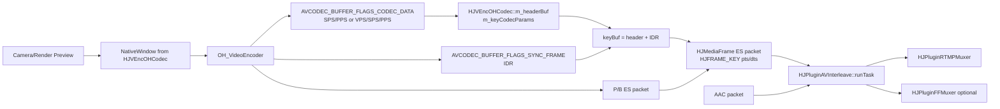
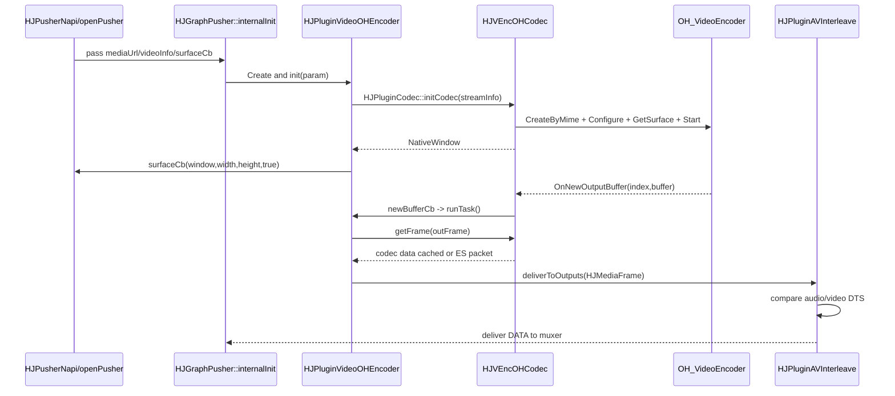

# Day 17 - 视频编码基础

## 今日目标

第 17 天聚焦 Pusher 里的视频编码链路：从上游把画面写入编码 Surface，到 Harmony 硬编码器输出 H.264/H.265 ES packet，再交给音视频交织和 RTMP/录制输出。今天要能解释 SPS/PPS/VPS、IDR、PTS/DTS，以及 HJMedia 中硬编插件的接口边界。

## 阅读源码

- `.agents/skills/hjmedia-daily-study/references/28-day-plan.md`
- `studyDemo/day17_video_codec_headers.cpp`
- `studyDemo/study_demo_common.h`
- `src/graphs/HJGraphPusher.cpp`
- `src/graphs/HJGraphPusher.h`
- `src/plugins/hsys/HJPluginVideoOHEncoder.cpp`
- `src/plugins/hsys/HJPluginVideoOHEncoder.h`
- `src/plugins/HJPluginCodec.cpp`
- `src/plugins/HJPluginCodec.h`
- `src/plugins/HJPluginAVInterleave.cpp`
- `src/media/codec/HJBaseCodec.cc`
- `src/media/codec/HJBaseCodec.h`
- `src/media/codec/hsys/HJVEncOHCodec.cc`
- `src/media/codec/hsys/HJVEncOHCodec.h`
- `src/media/codec/hsys/HJOHCodecUtils.cc`
- `src/media/codec/hsys/HJOHCodecUtils.h`
- `src/media/codec/hsys/HJOHAEncoder.cc`
- `src/media/codec/hsys/HJOHAEncoder.h`
- `src/media/HJMediaFrame.h`
- `src/media/HJMediaInfo.h`

## 源码观察

`HJGraphPusher::internalInit` 是推流图的装配入口。视频存在时，Harmony 分支创建 `HJPluginVideoOHEncoder`，并把 `m_videoEncoder -> m_avInterleave` 以 `HJMEDIA_TYPE_VIDEO` 连接起来。音频链路会从 capturer/resampler/encoder 进入同一个 `HJPluginAVInterleave`，因此视频编码输出不是直接写 RTMP，而是先交给交织插件。

`HJPluginVideoOHEncoder::internalInit` 要求 `surfaceCb` 和 `HJVideoInfo`。它把 `HJVideoInfo` 转成 `streamInfo`，设置 `createThread=false`，初始化 codec 后从 `HJVEncOHCodec` 取 `NativeWindow`，再通过 `surfaceCb(m_nativeWindow, width, height, true)` 暴露给上游。也就是说，视频输入不是普通 `run(rawFrame)`，而是上游渲染/采集把图像写进硬编码器 Surface。

`HJVEncOHCodec::init` 根据 `HJVideoInfo::m_codecID` 选择 `video/avc` 或 `video/hevc`，配置宽高、帧率、NV12、CBR、码率、I 帧间隔，然后 `OH_VideoEncoder_GetSurface` 获取 `NativeWindow`。编码器通过 `OnNewOutputBuffer` 把输出 buffer 放入 `m_outputQueue`，并调用 `m_newBufferCb()`，这个回调由 `HJPluginVideoOHEncoder::initCodec` 填入，最终触发插件 `runTask()` 继续拉取编码输出。

`HJVEncOHCodec::getFrame` 里有三个关键分支：`AVCODEC_BUFFER_FLAGS_CODEC_DATA` 缓存 codec header 到 `m_headerBuf` 并生成 `m_keyCodecParams`；`AVCODEC_BUFFER_FLAGS_SYNC_FRAME` 表示关键帧，此时把 header 和当前 IDR 数据拼成 `keyBuf`；普通输出直接封装为 `HJMediaFrame::makeMediaFrameAsAVPacket`。这就是推流端必须让关键帧携带 SPS/PPS 或 VPS/SPS/PPS 的原因。

`HJMediaInfo.h` 定义了 H.264 NAL 类型：IDR=5、SPS=7、PPS=8；也定义了 H.265 的 IDR、VPS=32、SPS=33、PPS=34。`HJMediaFrame.h` 中 `HJFRAME_KEY` 表示关键帧，`m_pts/m_dts/m_timeBase` 保存时间戳。`HJPluginAVInterleave::runTask` 通过预览 audio/video 的 DTS 决定哪个 packet 先输出，因此推流发送顺序应看 DTS，播放展示时间才看 PTS。

## Mermaid 图

### 数据流

数据流中文说明：

- `Camera/Render Preview -> NativeWindow`：上游采集或渲染模块不直接把 CPU 内存帧塞给视频编码插件，而是把画面绘制到 `HJVEncOHCodec` 暴露出来的 `NativeWindow`，这对应 Harmony 硬编码的 Surface 输入模式。
- `NativeWindow -> OH_VideoEncoder`：`OH_VideoEncoder` 从 Surface 消费图像并输出压缩后的 H.264/H.265 码流 buffer。
- `OH_VideoEncoder -> CODEC_DATA`：编码器可能先输出一段 codec data。H.264 通常是 `SPS/PPS`，H.265 通常是 `VPS/SPS/PPS`，这些不是普通视频帧，而是解码器初始化参数。
- `CODEC_DATA -> m_headerBuf/m_keyCodecParams`：`HJVEncOHCodec::getFrame` 遇到 `AVCODEC_BUFFER_FLAGS_CODEC_DATA` 时不会立刻向下游发送视频帧，而是缓存到 `m_headerBuf`，并生成 `m_keyCodecParams`。
- `SYNC_FRAME + header -> keyBuf`：遇到 `AVCODEC_BUFFER_FLAGS_SYNC_FRAME` 时，当前输出是关键帧/IDR。HJMedia 会把已缓存的 header 拼到 IDR 前面，形成 `keyBuf = header + IDR`，保证下游从这个关键帧开始也能初始化解码。
- `keyBuf/P/B packet -> HJMediaFrame`：关键帧和普通 P/B 帧都会被封装成 `HJMediaFrame`，数据类型是 ES packet，并携带 `pts/dts`、关键帧标记和 codec 参数。
- `HJMediaFrame -> HJPluginAVInterleave`：视频 packet 不直接发 RTMP，而是先进入 `HJPluginAVInterleave::runTask`，和 AAC 音频 packet 按 DTS 做交织。
- `Interleave -> RTMP/Recorder`：交织后的统一 DATA 流进入 `HJPluginRTMPMuxer` 推流；如果打开录制，也会并行进入 `HJPluginFFMuxer` 写文件。

### 控制流

## 关键概念

| 概念 | HJMedia 对应点 | 面试解释 |
|---|---|---|
| SPS/PPS | H.264 参数集，`HJ_NAL_SPS/HJ_NAL_PPS` | 解码器初始化所需的序列/图像参数，关键帧前缺失会导致接收端无法从该点开始解码 |
| VPS/SPS/PPS | H.265 参数集，`HJ_HEVC_NAL_VPS/SPS/PPS` | H.265 比 H.264 多 VPS，用于更复杂的视频参数层级 |
| IDR | H.264 `HJ_NAL_SLICE_IDR`，H.265 IDR 类型 | 关键帧的一种，之后的帧不依赖 IDR 之前的参考帧，适合首帧、重连、切片边界 |
| PTS | `HJMediaFrame::m_pts` | 展示时间，播放器按它做音画同步和渲染 |
| DTS | `HJMediaFrame::m_dts` | 解码/发送顺序，`HJPluginAVInterleave` 用它排序音视频 packet |
| codec data | `AVCODEC_BUFFER_FLAGS_CODEC_DATA` | 硬编码器独立输出的 header，需要缓存并贴到关键帧或写入 codec params |
| key frame | `HJFRAME_KEY` / `AVCODEC_BUFFER_FLAGS_SYNC_FRAME` | 推流端通常要求关键帧携带参数集，方便首帧播放和断线重连 |

## PTS / DTS 与交织顺序

“交织阶段主要看 DTS 决定发送顺序，PTS 用于展示时间”可以拆成两层理解：

第一层，`DTS` 回答“编码后的 packet 应该按什么顺序写入 muxer、发送到网络，并最终交给接收端解码链路”。第 17 天这里确实使用的是编码器，不是本地解码器；但编码器输出的是压缩码流，码流里仍然存在“解码顺序”这个语义。muxer/RTMP 发送端如果把 packet 顺序写乱，下游播放器收到后仍然会遇到参考帧顺序错误、时间戳倒退、等待或卡顿。`HJPluginAVInterleave::runTask` 的核心逻辑就是分别预览音频和视频队首 packet，然后比较 `previewAudio->getDTS()` 和 `previewVideo->getDTS()`，谁的 DTS 更小，就先从对应输入队列 `receive()` 出来并 `deliverToOutputs()`。

第二层，`PTS` 回答“这帧解出来之后应该什么时候显示”。播放器渲染画面、做音画同步时，更关心 PTS，因为用户看到的是展示时间线。对于没有 B 帧、低延迟直播的常见配置，视频 packet 往往满足 `PTS == DTS`，所以看起来两者没有区别。但只要存在 B 帧或帧重排，`PTS` 和 `DTS` 就可能不同。

一个简化例子：

| 画面显示顺序 | 帧类型 | PTS | 解码/发送顺序 | DTS | 为什么 |
|---|---|---:|---|---:|---|
| 第 1 个显示 | I/IDR | 0 | 第 1 个发送 | 0 | IDR 不依赖之前帧，可以先解 |
| 第 2 个显示 | B | 40 | 第 3 个发送 | 80 | B 帧可能依赖后面的 P 帧，所以不能先送给解码器 |
| 第 3 个显示 | P | 80 | 第 2 个发送 | 40 | P 帧先解出来，给 B 帧当参考 |

按显示时间看，顺序是 `I(PTS=0) -> B(PTS=40) -> P(PTS=80)`；但按编码后码流的解码/发送时间看，顺序是 `I(DTS=0) -> P(DTS=40) -> B(DTS=80)`。所以 muxer、RTMP 发送、`HJPluginAVInterleave` 这类“把编码后 packet 往下游写”的环节应该优先保证 DTS 单调递增；接收端播放器拿到 packet 并解码后，再按 PTS 决定每帧展示时刻。

编码侧仍然关注 DTS 的原因有三个：

- 封装格式需要时间戳：FLV/RTMP、MP4/MOV 这类容器或传输协议要保存 packet 时间线。写入顺序通常对应 DTS，展示时间用 PTS 或 composition time offset 表达。
- 音视频交织要有统一发送时钟：`HJPluginAVInterleave` 同时面对 AAC 音频 packet 和 H.264/H.265 视频 packet，它需要决定“先发音频还是先发视频”。这个决策看的是谁更早需要进入下游解码/播放链路，所以比较 DTS 更稳。
- 下游最终还是要解码：当前模块虽然是编码器输出侧，但 packet 会经过 muxer、网络、播放器，最后仍然进入接收端解码器。编码侧如果已经把 DTS 顺序写坏，接收端再正确按 PTS 展示也来不及。

在 HJMedia 第 17 天链路里可以这样落地：

- `HJVEncOHCodec::getFrame` 把硬编码输出封装成 `HJMediaFrame`，其中携带 `pts/dts`。
- `HJPluginAVInterleave::runTask` 不直接比较 PTS，而是用 `getDTS()` 比较音频和视频 packet 的先后，避免发送时间线倒退。
- `HJPluginRTMPMuxer`/录制 muxer 接收的是交织后的 packet 流，要求时间戳顺序稳定，否则可能出现 RTMP 时间戳异常、录制文件不可 seek 或播放端卡顿。
- 播放端最终渲染时再看 PTS，把已经解码出的画面放到正确展示时间点。

对于低延迟推流，通常会尽量关闭 B 帧，让 `PTS` 和 `DTS` 接近甚至相等，这样编码、交织和播放延迟都更容易控制。但笔记中仍然区分两者，是为了避免后续遇到 B 帧、录制文件或复杂编码配置时，把“发送顺序”和“显示顺序”混为一谈。

## Demo 说明

`studyDemo/day17_video_codec_headers.cpp` 模拟了三件事：

1. `CodecHeaderCache` 先缓存 H.264 的 `SPS/PPS` 或 H.265 的 `VPS/SPS/PPS`，对应 `HJVEncOHCodec::m_headerBuf`。
2. 遇到 key frame 但 packet 没带 header 时，把 header 拼到 `IDR` 前面，对应 `HJVEncOHCodec::getFrame` 里 `keyBuf = m_headerBuf + source`。
3. `DtsMonotonicChecker` 检查 DTS 不倒退，对应 `HJPluginAVInterleave::runTask` 依赖 DTS 排序发送。

## 风险与排查点

- 如果 `codec data` 没有先到，第一帧 IDR 不能直接发给 muxer，应记录日志并等待 header，否则观众端或录制文件可能黑屏。
- 如果 H.265 只携带 SPS/PPS 而缺 VPS，部分解码器无法初始化 HEVC 参数。
- 如果 DTS 倒退，`HJPluginAVInterleave` 的音视频交织顺序会混乱，RTMP 接收端可能报时间戳异常。
- 如果 `surfaceCb` 没有及时关闭，`HJPluginVideoOHEncoder::internalRelease` 需要用 `surfaceCb(window,0,0,false)` 释放上游窗口引用。
- 当前 `HJVEncOHCodec::priOnNewOutputBuffer` 使用 `HJCurrentSteadyMS()` 作为输出 timestamp，排查音画同步时要确认该 timestamp 是否符合上游采集/渲染时间线预期。

## 验证方式

- 编译：`cmake --build studyDemo/build --target day17_video_codec_headers`
- 运行：`studyDemo/output/day17_video_codec_headers.exe`
- 预期：H.264/H.265 的第一个关键帧输出时都带 header；缺 header 的首个 IDR 被丢弃或等待；DTS 倒退的 packet 被拒绝。

## 结论

视频硬编码链路的核心不是“把图像变成字节”这么简单，而是要保证编码参数集、关键帧、时间戳和交织顺序都正确。HJMedia 在 Harmony 推流链路里把 Surface 输入、硬编输出、header 缓存、关键帧合成、SEI 注入和 AV interleave 分在不同层完成：Graph 负责装配，Plugin 负责调度和生命周期，Codec 负责对接 OH 编码器和生成 ES packet。

## 面试复述

我阅读并用 demo 复盘了 HJMedia Harmony 推流的视频编码链路。`HJGraphPusher` 创建 `HJPluginVideoOHEncoder`，插件初始化 `HJVEncOHCodec` 后把 `NativeWindow` 通过 surface 回调交给上游渲染；硬编码器输出 buffer 时触发插件拉取数据。`HJVEncOHCodec` 会先缓存 codec data，H.264 是 SPS/PPS，H.265 是 VPS/SPS/PPS，遇到同步帧时把这些 header 拼到 IDR 前，再封装成 `HJMediaFrame` 给 AV interleave。交织阶段主要看 DTS 决定发送顺序，PTS 用于展示时间。这个练习主要是源码分析和小 demo 验证，不夸大为独立实现完整编码器。
