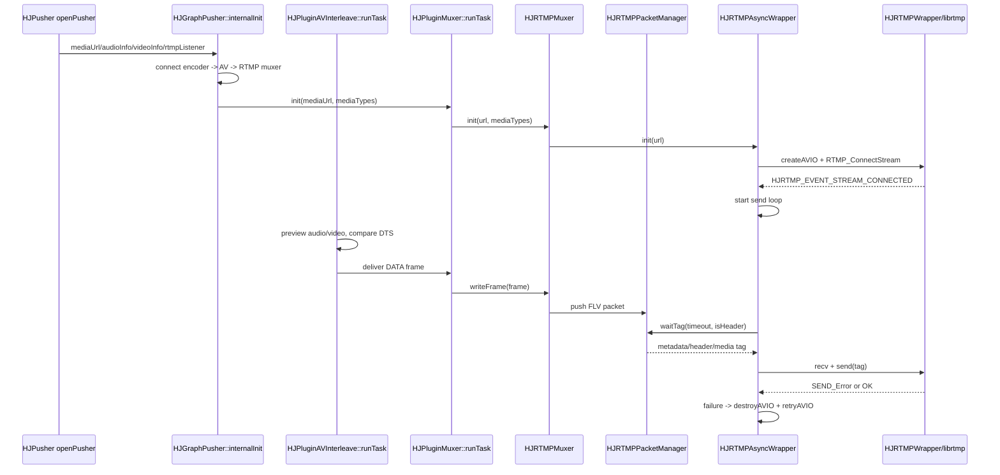

# Day 18 - Mux、RTMP 和时间戳交织

## 今日目标

第 18 天聚焦推流链路后半段：编码后的 AAC / H.264 / H.265 packet 不直接写网络，而是先进入 `HJPluginAVInterleave` 按 DTS 做音视频交织，再由 `HJPluginRTMPMuxer` 写入 `HJRTMPMuxer`，生成 FLV tag 后交给 `HJRTMPAsyncWrapper` / `HJRTMPWrapper` 通过 librtmp 发送。今天要能说明 RTMP 推流为什么看 DTS、FLV tag timestamp 如何归零、发送失败时为什么不能无限缓存。

## 阅读源码

- `.agents/skills/hjmedia-daily-study/references/28-day-plan.md`
- `studyDemo/day18_av_interleave.cpp`
- `studyDemo/study_demo_common.h`
- `docs/README_HJOHMuxer.md`
- `src/graphs/HJGraphPusher.cpp`
- `src/plugins/HJPluginAVInterleave.cpp`
- `src/plugins/HJPluginAVInterleave.h`
- `src/plugins/HJPluginMuxer.cpp`
- `src/plugins/HJPluginRTMPMuxer.cpp`
- `src/plugins/HJPluginRTMPMuxer.h`
- `src/media/muxer/HJBaseMuxer.h`
- `src/media/muxer/HJRTMPMuxer.cc`
- `src/media/muxer/HJRTMPAsyncWrapper.cc`
- `src/media/muxer/HJRTMPPacketManager.h`
- `src/media/muxer/HJRTMPPacketManager.cc`
- `src/media/muxer/flv/HJFLVUtils.h`
- `src/media/muxer/flv/HJFLVUtils.cc`
- `src/media/muxer/HJRTMPWrapper.cc`
- `third_party/librtmp/include/librtmp/rtmp.h`

## 源码观察

`HJGraphPusher::internalInit` 先创建 `HJPluginRTMPMuxer` 和 `HJPluginAVInterleave`，并连接 `m_avInterleave -> m_rtmp` 的 `HJMEDIA_TYPE_DATA` 输出。音频链路最终从 `m_audioEncoder -> m_avInterleave`，视频链路从 `m_videoEncoder -> m_avInterleave`。这说明 mux/RTMP 不是编码器内部职责，而是 Graph 装配出的独立后处理阶段。

`HJPluginAVInterleave::runTask` 的核心逻辑是分别 `preview()` 音频和视频队首，然后比较 `previewAudio->getDTS()` 与 `previewVideo->getDTS()`。音频 DTS 小于等于视频 DTS 时先 `receive()` 音频，否则取视频，最后 `deliverToOutputs(outFrame)`。这里选择 DTS 而不是 PTS，是因为 mux/网络写入需要保证压缩码流的解码/发送顺序稳定；PTS 表示展示时间，含 B 帧时可与 DTS 不同。

`HJPluginMuxer::runTask` 接收 interleave 后的 DATA 帧，状态 Ready 后调用 `m_muxer->writeFrame(inFrame)`。启动时 `m_dropping = true`，如果存在视频，会在 `dropping()` 中等待第一个关键帧后再真正写入，这避免 RTMP 接收端从非关键帧开始导致解码器无法初始化。

`HJPluginRTMPMuxer::createMuxer` 创建 `HJRTMPMuxer` 并调用 `setTimestampZero(true)`。`HJRTMPMuxer::waitStartDTSOffset` 会缓存开始阶段的帧；音视频都有时等待两路第一帧都到达，然后取两者较小 DTS 作为 `m_startDTSOffset`。`HJFLVPacket::init` 里保存 `m_pts = frame->m_pts - tsOffset`、`m_dts = frame->m_dts - tsOffset`，`HJFLVUtils::buildVideoTag` 写 FLV tag timestamp 时用 DTS，视频额外写 `ct_offset_ms = pts - dts`；音频 tag timestamp 也用 DTS。

`HJRTMPPacketManager::getTag` 负责按顺序生成 metadata、audio header、video header、普通媒体 tag。普通媒体 tag 发送前会等待第一个视频关键帧；队列积压时 `drop()` / `dropFrames()` 根据缓存时长和优先级丢包，优先处理低优先级视频帧，并可通过 `keepLastGop()` 保留最近 GOP。

`HJRTMPAsyncWrapper::run` 在独立 executor 中循环从 delegate 获取 tag，调用 `m_wrapper->recv()` 处理服务端消息，再调用 `m_wrapper->send()` 写 RTMP。`HJRTMPWrapper::send` 最终落到 `RTMP_Write`；发送、接收、连接失败会通知 `HJRTMPAsyncWrapper::onRTMPWrapperNotify`，该函数会延迟调度 `destroyAVIO()` + `retryAVIO()`。弱网下还会通过 `HJRTMP_EVENT_NET_BITRATE` 回传网络码率，并触发低码率超时重连或自适应码率通知。

## Mermaid 图

### 数据流

```mermaid
flowchart LR
    AEnc[HJPluginFDKAACEncoder<br/>AAC packet] --> AV[HJPluginAVInterleave::runTask]
    VEnc[HJPluginVideoOHEncoder<br/>H.264/H.265 packet] --> AV
    AV -->|按 getDTS 交织| MuxPlugin[HJPluginRTMPMuxer/HJPluginMuxer::runTask]
    MuxPlugin --> RTMPMuxer[HJRTMPMuxer::writeFrame]
    RTMPMuxer --> FLVPacket[HJFLVPacket::init<br/>pts/dts - startDTSOffset]
    FLVPacket --> PacketMgr[HJRTMPPacketManager::push/waitTag]
    PacketMgr --> Tags[metadata/header/media FLV tag]
    Tags --> Async[HJRTMPAsyncWrapper::run]
    Async --> Wrapper[HJRTMPWrapper::send]
    Wrapper --> LibRTMP[RTMP_Write]
    LibRTMP --> Server[RTMP Server]
```



### 控制流



## 关键概念

| 概念 | HJMedia 对应点 | 面试解释 |
|---|---|---|
| AV interleave | `HJPluginAVInterleave::runTask` | 音频和视频编码速度不同，不能各写各的；需要按 DTS 合成单一 packet 流交给 muxer |
| DTS | `HJMediaFrame::getDTS()`、`HJFLVPacket::m_dts` | 解码/发送顺序；RTMP/FLV tag 的主 timestamp 基于 DTS |
| PTS | `HJMediaFrame::m_pts`、`HJFLVPacket::m_pts` | 展示时间；视频 FLV tag 通过 composition time offset 表达 `PTS - DTS` |
| startDTSOffset | `HJRTMPMuxer::waitStartDTSOffset`、`HJRTMPPacketManager::waitStartDTSOffset` | 将首帧时间戳归零，避免推流从一个很大的采集时钟值开始 |
| metadata/header tag | `HJRTMPPacketManager::getTag` | RTMP 发送媒体帧前先发 FLV header、metadata、AAC/AVC/HEVC sequence header |
| 等关键帧 | `HJPluginMuxer::dropping`、`HJRTMPPacketManager::getTag` | 视频推流从关键帧开始，接收端才能初始化并解码后续 P/B 帧 |
| 队列丢帧 | `HJRTMPPacketManager::drop/dropFrames/keepLastGop` | 网络慢时不能无限缓存；优先丢低优先级视频帧，必要时保留最近 GOP |
| RTMP 重连 | `HJRTMPAsyncWrapper::onRTMPWrapperNotify/retryAVIO` | 连接、收发失败后异步销毁并重建连接，同时把失败通知上抛 |

## 音视频交织伪代码

```cpp
while (running) {
    audio = preview(audioInput);
    video = preview(videoInput);

    if (audio && (!video || audio.dts <= video.dts)) {
        out = receive(audioInput);
    } else if (video) {
        out = receive(videoInput);
    } else {
        return HJ_WOULD_BLOCK;
    }

    deliverToOutputs(out);
}
```

这段对应 `HJPluginAVInterleave::runTask`。要注意 tie-break：源码里音频 DTS 小于等于视频 DTS 时先输出音频，这能让 AAC 小包在同时间点更早进入 muxer。

## 时间戳模拟

| 类型 | 间隔 | DTS 示例 | PTS 示例 | 写入 RTMP/FLV 时的含义 |
|---|---:|---|---|---|
| Audio AAC | 20ms | 0, 20, 40, 60, 80 | 通常等于 DTS | tag timestamp = audio DTS - startDTSOffset |
| Video 30fps | 33ms | 0, 33, 66, 99 | 无 B 帧时等于 DTS | tag timestamp = video DTS - startDTSOffset |
| Video with B frame | 33ms | 0, 33, 66 | 0, 33, 99 | tag timestamp 仍用 DTS，`composition offset = PTS - DTS` |

### B 帧和 composition offset

含 B 帧时要区分“发送/解码顺序”和“显示顺序”。`DTS` 决定 packet 什么时候送去解码，`PTS` 决定解码后的画面什么时候显示。RTMP/FLV 视频 tag 的主 timestamp 通常写 DTS，同时额外写一个 `composition offset = PTS - DTS`，接收端可以用 `PTS = DTS + composition offset` 还原显示时间。

一个简化例子：

| 帧 | 发送/解码顺序 | DTS | 显示顺序 | PTS | composition offset |
|---|---:|---:|---:|---:|---:|
| I0 | 1 | 0 | 1 | 0 | 0 |
| P2 | 2 | 40 | 3 | 80 | 40 |
| B1 | 3 | 80 | 2 | 40 | -40 |

也就是说，mux/RTMP 可以按 DTS 顺序稳定发送 `I0 -> P2 -> B1`，但播放器不能按收到顺序直接显示，而是要按 PTS 显示成 `I0 -> B1 -> P2`。`composition offset` 的作用就是把“当前 tag 的解码时间”映射回“这帧应该展示的时间”。

对应 HJMedia 源码：

```cpp
int64_t ct_offset_ms = packet->m_pts - packet->m_dts;
int32_t time_ms = packet->m_dts - dts0ffset;
```

这里 `time_ms` 写入 FLV tag timestamp，表示 DTS；`ct_offset_ms` 写入视频 tag 的 composition time，表示 PTS 和 DTS 的差值。低延迟直播通常会尽量关闭 B 帧，让 `PTS == DTS`、`composition offset == 0`，这样编码、交织、发送和播放同步都更简单，延迟也更可控。

## RTMP 失败策略

```text
发送失败：
  HJRTMPWrapper::send 中 RTMP_Write 返回 <= 0，发出 HJRTMP_EVENT_SEND_Error。

重试条件：
  HJRTMPAsyncWrapper::onRTMPWrapperNotify 收到 CONNECT/SEND/RECV 失败事件后，
  用 getRetryInterval(m_retryCount) 延迟调度 destroyAVIO + retryAVIO。

丢帧条件：
  HJRTMPPacketManager 发现缓存 duration / videoDuration 超过阈值时，
  先丢低优先级视频帧，再按更高阈值处理 P 帧/I 帧前的旧包。

断开条件：
  连接失败、流连接失败、发送失败、接收失败、低码率持续超过限制，都可进入重连流程。

恢复条件：
  HJRTMP_EVENT_STREAM_CONNECTED 后重置 retry interval/retry time，并重新 start 发送循环。
  队列侧可通过 keepLastGop 保留最近可解码起点，避免恢复后继续发送过期旧帧。
```

## Demo 说明

`studyDemo/day18_av_interleave.cpp` 模拟了三件事：

1. `AvInterleaver` 按 DTS 从音频/视频队列弹出 packet，对应 `HJPluginAVInterleave::runTask`。
2. `FlvTimestampBuilder` 等待音视频第一帧后计算 `startDtsOffset`，并生成 `tagTimestamp = dts - offset`、`compositionOffset = pts - dts`，对应 `HJRTMPMuxer` 和 `HJFLVUtils` 的时间戳处理。
3. `RtmpSendStrategy` 模拟 `RTMP_Write` 失败、短期重试、连续失败后重连，以及队列过长时丢低优先级视频帧，对应 `HJRTMPAsyncWrapper` 和 `HJRTMPPacketManager` 的策略。

## 日志点

- `HJPluginAVInterleave::runTask`：记录 audio/video 队首 DTS、选择的输出类型、输入队列 size。
- `HJPluginMuxer::runTask`：记录 Ready/Stoped/Exception 状态、`m_dropping` 是否仍在等关键帧、`writeFrame` 返回值。
- `HJRTMPMuxer::waitStartDTSOffset`：记录首个 audio/video DTS、最终 offset、缓存帧数量。
- `HJFLVUtils::buildVideoTag`：记录 `time_ms`、`ct_offset_ms`、codec、key frame。
- `HJRTMPPacketManager::drop`：记录 cache duration、video duration、drop priority、drop count。
- `HJRTMPAsyncWrapper::run`：记录 `waitTag` 耗时、send 耗时、net kbps。
- `HJRTMPWrapper::send`：记录 `RTMP_Write` 返回值、错误码、失败事件。

## 风险与排查点

- 如果 interleave 按 PTS 而不是 DTS 写包，含 B 帧时发送顺序可能倒退，接收端会卡顿或报时间戳异常。
- 如果 `startDTSOffset` 没等齐音视频第一帧，可能出现首帧音画不同步或 tag timestamp 负值。
- 如果从非关键帧开始发送视频，播放端拿不到 SPS/PPS/VPS 和 IDR，可能黑屏直到下一个关键帧。
- 如果弱网下只重试不丢帧，队列持续增长会把直播变成高延迟“录播”；推流端必须优先保护实时性。
- 如果发送失败后重连但继续发旧 GOP，恢复后观众仍会看到过期内容；更合理的是保留最近关键帧起点。

## 验证方式

- 配置：`cmake -S studyDemo -B studyDemo/build`
- 编译：`cmake --build studyDemo/build --target day18_av_interleave`
- 运行：Windows/VS 构建产物为 `studyDemo/output/Debug/day18_av_interleave.exe`；单配置生成器通常为 `studyDemo/output/day18_av_interleave.exe`
- 预期：日志中先看到 `av-interleave pop-by-dts` 按 DTS 交织，再看到 `start-dts-offset-ready`；队列过长时丢低优先级 P 帧；B 帧输出 `ctsMs=33`；模拟 80ms 后网络发送失败时会打印 retry/reconnect 策略。

## 结论

第 18 天的重点不是“会调用 RTMP_Write”这么简单，而是要把编码 packet 变成一个可被接收端稳定解码和同步的传输流。HJMedia 里 Graph 负责把编码器、交织插件和 RTMP muxer 连接起来；`HJPluginAVInterleave` 负责按 DTS 合并音视频；`HJRTMPMuxer` / `HJRTMPPacketManager` 负责 FLV header、metadata、sequence header、首帧 offset、等关键帧和队列丢帧；`HJRTMPAsyncWrapper` / `HJRTMPWrapper` 负责异步网络发送、失败通知和重连。

## 问题解答

### 音频和视频的交织是指按照 DTS 的顺序交替发送吗？

基本可以这样理解，但“交替发送”不是严格的一帧音频、一帧视频，而是把两路已经编码好的 packet 按 DTS 顺序合成一条输出流。HJMedia 的 `HJPluginAVInterleave::runTask` 会分别 `preview()` 音频和视频队首，然后比较 `getDTS()`，谁的 DTS 更小就先 `receive()` 谁并 `deliverToOutputs()`。

例如：

```text
audio queue: A0 DTS=0, A1 DTS=20, A2 DTS=40, A3 DTS=60
video queue: V0 DTS=0, V1 DTS=33, V2 DTS=66

interleave output:
A0, V0, A1, V1, A2, A3, V2
```

这里 `A2` 和 `A3` 连续输出是正常的，因为交织按时间戳归并，不是机械的 `A/V/A/V`。源码中音频和视频 DTS 相同的判断是 `previewAudio->getDTS() <= previewVideo->getDTS()`，所以同 DTS 时音频优先。

### 含 B 帧时 composition offset 如何理解，offset 的作用是什么？

含 B 帧时要区分 DTS 和 PTS：`DTS` 决定 packet 什么时候送去解码，`PTS` 决定解码后的画面什么时候显示。RTMP/FLV 视频 tag 的主 timestamp 通常写 DTS，同时额外写 `composition offset = PTS - DTS`，播放器用 `PTS = DTS + composition offset` 还原显示时间。

简化例子：

```text
发送/解码顺序: I0, P2, B1
DTS:          0,  40, 80

显示顺序:     I0, B1, P2
PTS:          0,  40, 80
```

对应每帧：

| 帧 | DTS | PTS | composition offset |
|---|---:|---:|---:|
| I0 | 0 | 0 | 0 |
| P2 | 40 | 80 | 40 |
| B1 | 80 | 40 | -40 |

也就是说，mux/RTMP 按 DTS 顺序稳定发送，但播放器不能按收到顺序直接显示，而是要通过 composition offset 还原 PTS 后按显示时间排序。HJMedia 对应代码在 `HJFLVUtils::buildVideoTag`：

```cpp
int64_t ct_offset_ms = packet->m_pts - packet->m_dts;
int32_t time_ms = packet->m_dts - dts0ffset;
```

这里 `time_ms` 是 FLV tag timestamp，表示 DTS；`ct_offset_ms` 是 composition time，表示 PTS 和 DTS 的差值。低延迟直播通常关闭 B 帧，让 `PTS == DTS`、`composition offset == 0`，链路更简单，延迟更可控。

### FLV 如何区分音频帧和视频帧？

FLV 第一层通过 tag header 里的 `TagType` 区分音频、视频和 metadata：

```text
TagType = 8   -> Audio Tag
TagType = 9   -> Video Tag
TagType = 18  -> Script/Metadata Tag
```

HJMedia 对应代码在 `src/media/muxer/flv/HJFLVUtils.cc`：

```cpp
tag->w8(RTMP_PACKET_TYPE_AUDIO); // 8
tag->w8(RTMP_PACKET_TYPE_VIDEO); // 9
tag->w8(RTMP_PACKET_TYPE_INFO);  // 18
```

简化结构：

```text
FLV Tag
+----------+------------+-----------+----------+
| TagType  | DataSize   | Timestamp | Payload  |
+----------+------------+-----------+----------+
```

解析端先看 `TagType`：

```text
TagType=8  -> Payload 按音频格式解析，比如 AAC
TagType=9  -> Payload 按视频格式解析，比如 H.264/H.265
TagType=18 -> Payload 按 AMF metadata 解析
```

第二层再从 payload 头继续判断具体编码格式和帧语义。AAC 音频 payload 里会有 `SoundFormat/SoundRate/SoundSize/SoundType` 和 `AACPacketType`；H.264/H.265 视频 payload 里会有 `FrameType + CodecID`、packet type 和 composition time。因此可以总结为：FLV 第一层用 `TagType` 区分音频、视频和 metadata，第二层在 payload 内区分 AAC、H.264/H.265、关键帧、sequence header 和普通媒体帧。

## 面试复述

我阅读并用小 demo 复盘了 HJMedia 推流链路里的 mux/RTMP 阶段。编码后的 AAC 和视频 packet 会先进入 `HJPluginAVInterleave`，它预览音视频队首并按 DTS 选择先输出哪一路，因为 mux 和网络发送要保证解码顺序；PTS 更多用于展示时间，视频写 FLV tag 时用 `PTS - DTS` 作为 composition offset。RTMP muxer 会等待音视频首帧计算起始 DTS offset，把时间戳归零，并在发媒体帧前先发 metadata 和音视频 header。弱网或发送失败时，HJMedia 不是无限缓存，而是通过 packet manager 统计缓存时长、按优先级丢帧、保留最近 GOP，并由 async wrapper 做失败重试和重连。这个练习是源码分析和 C++ 模拟验证，不是我独立实现完整 RTMP 推流库。
