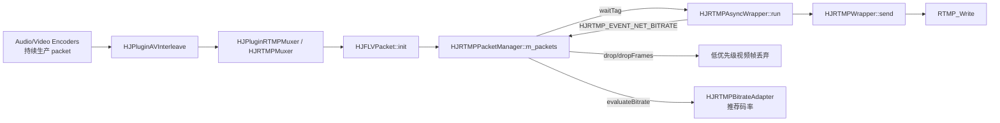
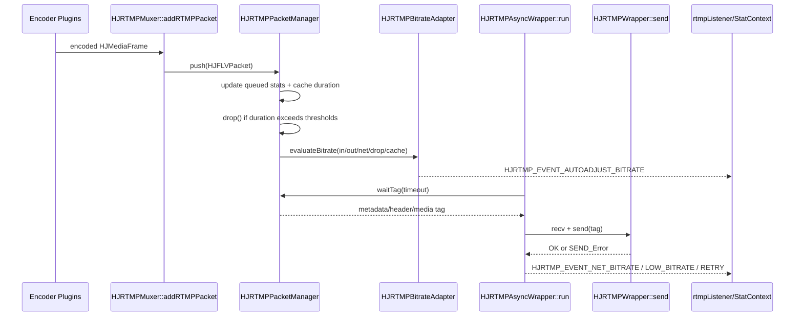

# Day 19 - 弱网队列堆积实践

## 今日目标

第 19 天聚焦推流端的弱网问题：编码端持续生产 AAC / H.264 / H.265 packet，网络端发送能力突然下降时，RTMP 队列会堆积，延迟和内存都会上涨。今天要通过源码和 demo 解释三类策略：阻塞编码、丢低优先级帧、降低码率，并说明为什么直播推流不能无限缓存。

## 阅读源码

- `.agents/skills/hjmedia-daily-study/references/28-day-plan.md`
- `study/week3-pusher-codec-rtmp-practice.md`
- `studyDemo/day19_network_backpressure.cpp`
- `studyDemo/study_demo_common.h`
- `src/media/muxer/HJRTMPPacketManager.h`
- `src/media/muxer/HJRTMPPacketManager.cc`
- `src/media/muxer/HJRTMPBitrateAdapter.h`
- `src/media/muxer/HJRTMPBitrateAdapter.cc`
- `src/media/muxer/HJRTMPAsyncWrapper.cc`
- `src/media/muxer/HJRTMPMuxer.cc`
- `src/media/muxer/HJRTMPUtils.h`
- `src/media/muxer/HJRTMPUtils.cc`
- `src/media/muxer/HJRTMPWrapper.cc`
- `src/plugins/HJPluginMuxer.cpp`

## 源码观察

`HJRTMPAsyncWrapper::run` 在独立 executor 中循环取 `HJRTMPMuxer::onAcquireMediaTag()` 返回的 FLV tag，然后调用 `HJRTMPWrapper::recv()` 和 `HJRTMPWrapper::send()`。`send()` 最终落到 `RTMP_Write`，如果写入慢或失败，网络发送端的吞吐会低于编码端产出速度。

`HJRTMPMuxer::addRTMPPacket` 把 `HJMediaFrame` 包成 `HJFLVPacket` 后推入 `HJRTMPPacketManager::push`。`HJRTMPPacketManager` 维护 `m_packets` 队列，并在 `getDuartion()` 中计算缓存的整体时间跨度、视频跨度、音频跨度。这个缓存时长比单纯 packet 数量更适合判断直播延迟，因为直播用户感知的是“当前画面比实时慢了多少毫秒”。

`HJRTMPPacketManager::drop` 是弱网下保护实时性的关键逻辑。队列时长超过 `m_dropThreshold` 时先丢低优先级视频帧；超过 `m_dropPFrameThreshold` 时提高到中优先级；整体 duration 超过 `m_dropIFrameThreshold` 时会进入更激进的丢帧路径。`dropFrames` 只在 `dropGuard` 之前删除旧包，尽量保留最近 GOP，让恢复后还有关键帧起点。

`HJRTMPPacketStats::update` 分别统计 queued、sent、dropped 三类数据，记录输入/输出帧数、码率、drop ratio、cache duration、delay 等。`HJRTMPMuxer::notifyStatLiveInfo` 会把 `outKbps`、`outFps`、`outDelay` 上报给业务层，用于监控推流质量。

`HJRTMPBitrateAdapter::evaluateBitrate` 根据 `inBitrate`、`outBitrate`、`netBitrate`、`dropRatio` 和 `queueDuration` 计算推荐码率。出现丢帧或队列超过阈值时进入降码率 evaluator；网络恢复且队列很短时再逐步升码率。这样可以避免只靠丢帧硬扛弱网。

`HJRTMPAsyncWrapper::checkNetBitrate` 处理低码率持续超时：当 `netkbps < m_lowBRLimited` 且持续超过 `m_lowBRTimeoutLimited`，会发出 `HJRTMP_EVENT_LOW_BITRATE` 并调度 `destroyAVIO()` + `retryAVIO()`。这说明弱网策略不止是队列内丢帧，也包括重连和网络质量事件上报。

## Mermaid 图

### 数据流



### 控制流



## 三种策略对比

| 策略 | 对应 demo | 优点 | 缺点 | 适合场景 |
|---|---|---|---|---|
| 阻塞编码 | `Strategy::BlockEncoder` | 不主动丢帧，输出内容最完整 | 上游采集/编码被网络拖住，实时性差，可能引发更大链路阻塞 | 文件上传、非实时任务 |
| 丢低优先级帧 | `Strategy::DropLowPriority` | 快速限制延迟和内存，保留关键帧/GOP 起点 | 画面可能跳帧，质量下降 | 直播推流、实时互动 |
| 降低码率 | `Strategy::AdaptiveBitrate` | 从源头降低后续包大小，减少持续丢帧 | 调整有滞后，码率过低会糊 | 网络持续变差但仍可发送 |

## Demo 说明

`studyDemo/day19_network_backpressure.cpp` 模拟 28 个 tick：

- 每个 tick 生产 1 个 AAC packet，每 2 个 tick 生产 1 个视频 packet。
- 0-5 tick 网络正常，6-18 tick 弱网，19 tick 后恢复。
- `BlockEncoder` 在队列时长超过高水位后暂停生产。
- `DropLowPriority` 按 queue duration 丢低/中优先级视频帧。
- `AdaptiveBitrate` 在丢帧或队列过长时降低推荐码率，网络恢复后逐步回升。

demo 输出的 summary 重点看：

```text
produced / sent / dropped / blockedTicks / bitrateChanges
peakQueuePackets / peakQueueDurationMs / finalKbps
```

这些指标对应源码中的 `HJRTMPPacketStats`、`HJRTMPStreamStats`、`HJRTMP_EVENT_DROP_FRAME`、`HJRTMP_EVENT_AUTOADJUST_BITRATE`。

## 调试定位案例

### 现象

弱网下推流持续一段时间后，观众端延迟明显上涨；本端内存上涨，RTMP 发送日志变慢，偶发断线重连。

### 可疑模块

- `HJRTMPAsyncWrapper::run`：发送循环是否被 `RTMP_Write` 阻塞。
- `HJRTMPPacketManager::m_packets`：FLV packet 队列是否持续增长。
- `HJRTMPPacketManager::drop/dropFrames`：是否启用丢帧，阈值是否过高。
- `HJRTMPBitrateAdapter::evaluateBitrate`：是否触发自动降码率。
- `HJRTMPMuxer::notifyStatLiveInfo`：业务层是否看到 outKbps/outDelay 异常。

### 源码入口

- `src/media/muxer/HJRTMPAsyncWrapper.cc`
- `src/media/muxer/HJRTMPWrapper.cc`
- `src/media/muxer/HJRTMPMuxer.cc`
- `src/media/muxer/HJRTMPPacketManager.cc`
- `src/media/muxer/HJRTMPBitrateAdapter.cc`
- `src/media/muxer/HJRTMPUtils.h`

### 日志点

- `HJRTMPAsyncWrapper::run`：`waitTag` 耗时、`send` 耗时、`netkbps`。
- `HJRTMPPacketManager::push`：`m_packets.size()`、`cacheDuration`、`dropCount`。
- `HJRTMPPacketManager::dropFrames`：丢弃 packet 的 DTS、priority、offset。
- `HJRTMPBitrateAdapter::evaluateBitrate`：`inBitrate/outBitrate/netBitrate/dropRatio/queueDuration/recommendedBitrate`。
- `HJRTMPMuxer::notifyStatLiveInfo`：`outKbps/outFps/outDelay`。

### 预期现象

弱网期间 queue duration 会先上涨；如果丢帧和降码率有效，queue duration 应该被压在阈值附近或逐步下降；网络恢复后队列应清空，码率可逐步回升。

### 可能原因

- `drop_enale` 配置拼写沿用源码 key，业务侧可能误填成 `drop_enable` 导致丢帧开关没有生效。
- 丢帧阈值过大，导致队列已经积累明显延迟才开始处理。
- 只启用重试/重连，没有启用丢帧和降码率。
- 上游编码码率高于弱网实际可承载码率，`netBitrate` 长期低于 `inBitrate`。
- 关键帧间隔太长，保留最近 GOP 时仍然保留了过多旧帧。

### 修复思路

- 打开并核对 `HJRTMPUtils::STORE_KEY_DROP_ENABLE`、`STORE_KEY_DROP_THRESHOLD`、`STORE_KEY_DROP_PFRAME_THRESHOLD`、`STORE_KEY_DROP_IFRAME_THRESHOLD`。
- 根据直播延迟目标调低队列丢帧阈值，优先丢低优先级视频帧。
- 接入 `HJRTMP_EVENT_AUTOADJUST_BITRATE`，把推荐码率反馈给视频编码器。
- 对低码率超时使用 `HJRTMP_EVENT_LOW_BITRATE` 触发重连，但重连后只保留最近 GOP。
- 在业务监控中同时看 outKbps、outDelay、dropRatio 和 reconnect count。

### 新风险

- 丢帧过 aggressive 会导致画面跳变、卡顿感增强。
- 降码率过快会导致画质明显变糊。
- 关键帧保留策略不当会导致恢复后黑屏或首帧无法解码。
- 频繁重连可能加重网络抖动和服务端压力。

### 验证方式

- 配置：`cmake -S studyDemo -B studyDemo/build`
- 编译：`cmake --build studyDemo/build --target day19_network_backpressure`
- 运行：Windows/VS 构建产物为 `studyDemo/output/Debug/day19_network_backpressure.exe`；单配置生成器通常为 `studyDemo/output/day19_network_backpressure.exe`
- 预期：日志中 `block-encoder` 出现 blocked tick；`drop-low-priority` 出现 `drop-video`；`adaptive-bitrate` 出现 `auto-adjust-bitrate-down/up`；最终 comparison 输出三种策略的 peak delay、drop count、final kbps。

## 问题解答

本节用于记录学习过程中的提问和回答。


### 第 19 天笔记中数据流每个阶段分别运行在哪个线程上？

`Audio/Video Encoders` 和 `HJPluginAVInterleave` 是各自插件的 `HJLooperThread`；`HJPluginRTMPMuxer / HJPluginMuxer`、`HJRTMPMuxer::writeFrame`、`HJRTMPMuxer::addRTMPPacket`、`HJRTMPPacketManager::push/drop` 运行在 Muxer 插件线程；`HJRTMPPacketManager::waitTag`、`HJRTMPAsyncWrapper::run`、`HJRTMPWrapper::send`、`RTMP_Write` 运行在 `HJRTMPAsyncWrapper` 创建的独立 RTMP executor 线程。网络事件如 `HJRTMP_EVENT_NET_BITRATE` 从 RTMP executor 线程产生，业务层 listener 是否切线程取决于上层封装。

这个线程划分解释了弱网问题的核心：编码和 muxer 线程还在持续 push packet，但 RTMP executor 线程发送变慢，跨线程队列 `HJRTMPPacketManager::m_packets` 就会堆积，所以需要在 muxer/packet manager 侧按缓存时长丢帧或触发降码率。

补充表：

| 数据流阶段 | 主要源码入口 | 运行线程 / 调度者 |
|---|---|---|
| Audio/Video Encoders 产出 encoded frame | `HJPluginFDKAACEncoder::runTask`、`HJPluginVideoOHEncoder::deliverToOutputs` 等 | 编码插件自己的 `HJLooperThread`，或 Graph 传入的共享 `HJLooperThread`。硬编底层可能还有平台 codec callback 线程，但进入 HJMedia 图后通过插件队列交给插件线程处理。 |
| `HJPluginAVInterleave` 音视频交织 | `src/plugins/HJPluginAVInterleave.cpp::runTask` | Interleave 插件的 `HJLooperThread`。它从音频/视频输入队列 `receive()`，再 `deliverToOutputs()` 到下游 muxer 输入队列。 |
| `HJPluginRTMPMuxer / HJPluginMuxer` 消费 frame | `src/plugins/HJPluginMuxer.cpp::runTask` | Muxer 插件的 `HJLooperThread`。`internalInit()` 没有外部 thread 时会设置 `createThread=true`，由 `HJPlugin::internalInit` 创建线程。 |
| `HJRTMPMuxer::writeFrame/addRTMPPacket` 封装 FLV packet | `src/media/muxer/HJRTMPMuxer.cc::writeFrame`、`addRTMPPacket` | 同步运行在 Muxer 插件线程中，因为它由 `HJPluginMuxer::runTask` 直接调用。 |
| `HJRTMPPacketManager::push/drop/evaluateBitrate` | `src/media/muxer/HJRTMPPacketManager.cc`、`HJRTMPBitrateAdapter.cc` | 主要运行在 Muxer 插件线程中。这里负责入队、统计 queue duration、按阈值丢帧、计算推荐码率。 |
| `HJRTMPPacketManager::waitTag` 出队 | `src/media/muxer/HJRTMPPacketManager.cc::waitTag` | RTMP async executor 线程调用。队列本身是跨线程边界：Muxer 插件线程 push，RTMP async 线程 wait/pop。 |
| `HJRTMPAsyncWrapper::run` 网络发送循环 | `src/media/muxer/HJRTMPAsyncWrapper.cc::run` | `HJRTMPAsyncWrapper` 构造时创建的独立 `HJExecutor`，名称形如 `*_rtmp_async_wrapper`。 |
| `HJRTMPWrapper::send -> RTMP_Write` | `src/media/muxer/HJRTMPWrapper.cc::send` | RTMP async executor 线程。弱网阻塞主要卡在这里，不应反向阻塞编码插件线程。 |
| `HJRTMP_EVENT_NET_BITRATE / LOW_BITRATE / RETRY` 事件 | `HJRTMPAsyncWrapper::run`、`checkNetBitrate`、`retryAVIO` | 事件从 RTMP async executor 线程产生；`HJRTMPMuxer::onRTMPWrapperNotify` 在该回调链上更新 `PacketManager` 的 net bitrate。业务 listener 是否切到 UI/业务线程，取决于上层是否再 repost。 |

因此 day19 数据流可以按线程切成三段：

1. 上游编码/交织插件线程：持续生产 encoded `HJMediaFrame`，通过插件队列交给 muxer。
2. Muxer 插件线程：把 frame 封装成 FLV packet，写入 `HJRTMPPacketManager::m_packets`，并做 queue duration、drop、bitrate adapter 计算。
3. RTMP async executor 线程：从 packet manager `waitTag()` 取 tag，执行 `recv/send/RTMP_Write`，并把网络码率、低码率、重连事件回传。

弱网时真正慢的是第 3 段网络发送线程；如果第 2 段无限入队不做丢帧/降码率，`m_packets` 会持续变长，表现为延迟和内存上涨。

## 结论

弱网推流的核心矛盾是实时性和完整性的冲突。播放器/观众更关心“看到接近实时的画面”，不是“所有历史帧都必须送到”。因此 HJMedia 的 RTMP 队列策略不是无限缓存，而是用 `HJRTMPPacketManager` 统计缓存时长和丢帧，用 `HJRTMPBitrateAdapter` 降低后续码率，用 `HJRTMPAsyncWrapper` 上报网络码率、低码率和重连事件。真正的排查重点是队列时长、输出码率、丢帧比例和重连次数，而不是只看当前是否还在发送。

## 面试复述

我阅读并用 demo 复盘了 HJMedia 的弱网推流处理。编码端持续产出 packet，网络端发送能力下降时，`HJRTMPPacketManager` 的队列会堆积，延迟和内存都会上涨。HJMedia 通过缓存时长判断是否需要丢帧，优先丢低优先级视频帧，并尽量保留最近 GOP；同时用 `HJRTMPBitrateAdapter` 根据输入/输出码率、网络码率、丢帧比例和队列时长调整推荐码率。对于持续低码率或收发失败，`HJRTMPAsyncWrapper` 会通知低码率、重试或重连事件。这个练习是源码分析和小型 C++ 模拟，用来说明直播推流不能无限缓存，以及弱网下如何在实时性、画质和完整性之间取舍。

