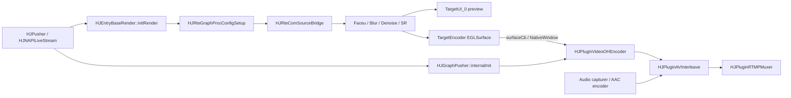
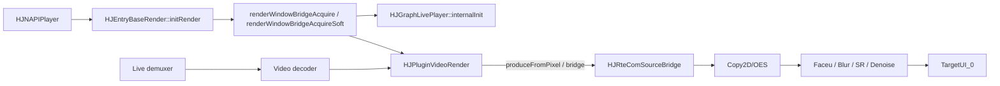
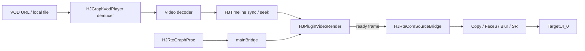
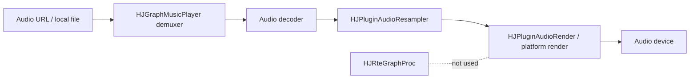
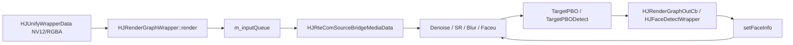
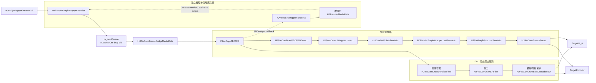
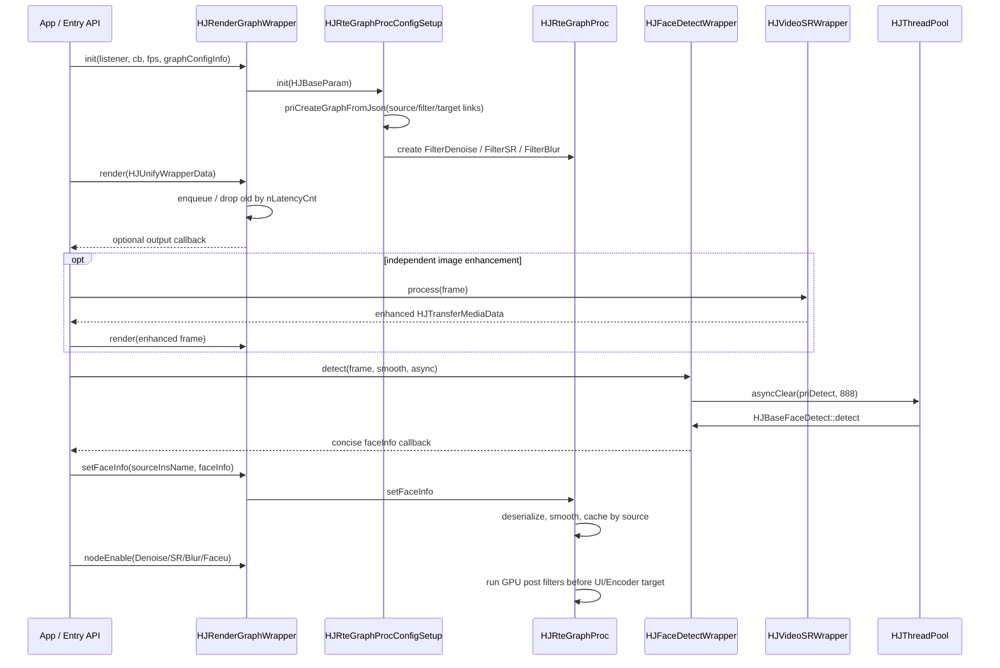

# Day 20 - 渲染 / 美颜 / AI 插入主链路

## 今日目标

第 20 天聚焦 HJMedia 中 GPU 后处理和 AI 推理的插入位置：视频主链路仍然是采集 / 解码帧进入渲染图，AI 检测不直接替代渲染节点，而是通过 PBO、wrapper 回调或独立推理输出，把控制数据或增强帧反馈给 RTE / Prio 渲染图。今天的练习目标是能讲清 Faceu、Blur、Gray、Denoise、SR、FaceDetect 在音视频链路中的位置和线程/队列风险。

## 阅读源码

- `.agents/skills/hjmedia-daily-study/references/28-day-plan.md`
- `studyDemo/day20_render_inference_overview.cpp`
- `studyDemo/study_demo_common.h`
- `src/comp/prio/HJPrioGraph.h`
- `src/comp/prio/HJPrioGraph.cpp`
- `src/comp/prio/HJPrioGraphProc.h`
- `src/comp/prio/HJPrioGraphProc.cpp`
- `src/comp/prio/HJPrioCom.h`
- `src/comp/prio/HJPrioComSourceBridge.h`
- `src/comp/prio/HJPrioComFaceu.h`
- `src/comp/prio/HJPrioComFBOBlur.h`
- `src/comp/prio/HJPrioComFBOGray.h`
- `src/comp/rte/HJRteGraph.h`
- `src/comp/rte/HJRteGraph.cpp`
- `src/comp/rte/HJRteGraphProc.h`
- `src/comp/rte/HJRteGraphProc.cpp`
- `src/comp/rte/HJRteGraphProcConfigSetup.cpp`
- `src/comp/rte/HJRteGraphSetupInfo.h`
- `src/comp/rte/HJRteGraphSetupInfo.cpp`
- `src/comp/rte/HJRteComDraw.h`
- `src/detect/utils/HJBaseFaceDetect.h`
- `src/detect/utils/HJBaseFaceDetect.cc`
- `src/detect/utils/HJBaseVideoSR.h`
- `src/detect/utils/HJBaseVideoSR.cc`
- `src/detect/utils/HJDetectUtils.h`
- `src/detect/utils/HJSRUtils.h`
- `src/entry/render/HJRenderGraphExport.h`
- `src/entry/render/HJRenderGraphExport.cpp`
- `src/entry/render/HJRenderFaceuExport.h`
- `src/entry/render/HJRenderContextExport.h`
- `src/entry/inference/HJFaceDetectExport.h`
- `src/entry/inference/HJFaceDetectExport.cpp`
- `src/entry/inference/HJInferenceContextExport.h`
- `src/entry/inference/HJVideoSRExport.h`
- `src/entry/inference/HJVideoSRExport.cpp`
- `src/entry/hsys/HJEntryBaseRender.cpp`
- `src/entry/player/hsys/verify/HJNAPIPlayer.cpp`
- `src/entry/pusher/hsys/verify/HJNAPILiveStream.cpp`
- `src/graphs/HJGraphPusher.cpp`
- `src/graphs/HJGraphLivePlayer.cpp`
- `src/graphs/HJGraphVodPlayer.cpp`
- `src/graphs/HJGraphMusicPlayer.cpp`
- `src/plugins/HJPluginVideoRender.cpp`

## 源码观察

`src/comp/prio` 是较早的优先级组件式渲染管线。`HJPrioGraph` 维护 `HJPrioCom` 队列，比较函数按 `getPriority()` 和插入 `getIndex()` 排序；`HJPrioComType` 把 `VideoBridgeSrc`、`VideoBeauty`、`VideoGray`、`VideoBlur`、`FaceU2D`、`GiftSeq2D` 等组件放在同一套优先级空间里。`HJPrioGraphProc` 持有 `HJPrioComSourceBridge` 和 `HJFacePointMgr`，提供 `openFaceu`、`openPBO`、`setFaceInfo`、`openEffect`、`closeEffect` 等控制面。

`src/comp/rte` 是更动态的渲染管线。`HJRteGraph` 把组件分为 sources、filters、targets 和 links；`HJRteGraphProcConfigSetup::constructGraph` 从 `graphConfigInfo` 反序列化 `HJRteGraphSetupInfo`，先创建 node，再按 link 连接。`HJRteGraphSetupInfo.cpp` 的默认 placeholder 图包含 `SourceBridgeMediaData`、`FilterCopy2D/OES`、`TargetPBODetect`、`FilterDenoise`、`FilterSR`、`FilterBlur`、`SourceFaceu`、`TargetUI_0`、`TargetEncoder` 等节点。

`HJRenderGraphWrapper::init` 是 render entry 的核心入口：它创建 `HJRteGraphProcConfigSetup`，把 fps、manual drive、`graphConfigInfo`、EGL context、输入/输出回调放入 `HJBaseParam`，再调用 `m_graphConfig->init(param)`。`HJRenderGraphWrapper::nodeCreate/nodeConnect/nodeEnable/nodeDelete` 是上层动态控制 RTE 图的薄封装；`setFaceInfo` 则把外部 AI 检测结果传入图内。

`HJRenderGraphWrapper::render` 接收 `HJUnifyWrapperData`，当前主要处理 NV12 输入，转换为 `HJTransferMediaDataYUVNV12` 后放入 `m_inputQueue`。源码里会按 `nLatencyCnt` 丢弃旧输入帧，说明 render entry 也有低延迟保护：GPU 渲染链路不应该无限追历史帧。

`HJFaceDetectWrapper::init` 根据 wrapper type 映射到 `HJFaceDetectType`，通过 `HJBaseFaceDetect::createFaceDetect` 选择 TNN、NCNN、iOS Vision、CoreML 等后端。`detect` 支持同步和异步；异步路径使用 `m_threadPool->asyncClear(..., 888)`，这意味着检测任务会清理旧任务，偏向保留最新帧，避免 AI 推理延迟堆积。

`HJFaceDetectWrapper::priDetect` 调用 `m_faceDetect->detect` 产出 `HJFaceDetectRet`，再调用 `cvtConcisePoints` 得到精简 faceInfo 字符串并通过回调吐出。`HJRteGraphProc::setFaceInfo(sourceInsName, width, height, faceInfo, debugPoint)` 会反序列化这些点位，经过 `HJMorePointSmooth` 平滑后按 source name 缓存，供 `SourceFaceu` 或其他依赖该 source 的节点读取。

`HJVideoSRWrapper` 和 `HJBaseVideoSR` 是另一类 AI 输出：它不是只产出控制数据，而是通过 `process` 输出增强后的 `HJTransferMediaData`。RTE 侧也有纯 GPU filter 形式的 `HJRteComDrawSRFilter` 和 `HJRteComDrawDenoiseFilter`，适合直接作为 filter node 插入渲染图。

## 数据流说明

主数据流仍然是视频帧或纹理从 source 进入 render graph。RTE 的 `SourceBridgeMediaData` 或 `SourceBridge` 提供主画面，先经过 Copy2D/OES 归一化，再分叉到 `TargetPBODetect`、UI、Encoder 或后处理 filter。AI 检测走旁路：PBO 从 GPU 侧读一份帧给 inference entry，检测结果回调出 faceInfo，再注入回 `HJRteGraphProc`。Faceu 节点本质上是一个依赖主 source faceInfo 的附加 source，Blur/SR/Denoise 则是可启停的 GPU filter。

因此 AI 插入点有两类：

| 插入类型 | 典型源码 | 输出 | 回到主链路的方式 |
|---|---|---|---|
| 检测 / 点位 | `HJFaceDetectWrapper`、`HJBaseFaceDetect` | faceInfo、rect、points | `HJRenderGraphWrapper::setFaceInfo` 注入 RTE，驱动 Faceu/Blur |
| 图像增强 / 超分 | `HJVideoSRWrapper`、`HJBaseVideoSR`、`HJRteComDrawSRFilter` | 增强后的 frame 或 texture | 作为独立输出帧，或作为 RTE filter node |
| GPU 后处理 | `HJRteComDrawDenoiseFilter`、`HJRteComDrawBlurCascadeFBO`、`HJPrioComFBOGray` | texture/FBO | source -> filter -> target 链内直接渲染 |

## 控制流说明

上层先调用 `renderContextInit` 或 `inferenceContextInit` 建立上下文，再创建 `HJRenderGraphWrapper` / `HJFaceDetectWrapper` / `HJVideoSRWrapper`。render graph 初始化时把 JSON 图或动态 node 参数传给 `HJRteGraphProcConfigSetup`；运行时可以通过 `nodeEnable` 控制 Blur、SR、Denoise、Faceu 等节点开关。

检测链路的控制流是：render graph 通过 PBO 或业务输入得到一帧，业务层调用 `HJFaceDetectWrapper::detect`；如果异步，则任务进入 `HJThreadPool::asyncClear`，旧任务被清理；检测完成后调用 concise callback；业务层再调用 `HJRenderGraphWrapper::setFaceInfo`；RTE graph 在线程安全区域缓存 faceInfo，并在后续 render pass 中让 Faceu 或保护性 Blur 看到新的状态。

## RTE 在各 Graph 中的作用

RTE 不是 `HJGraphPusher`、`HJGraphLivePlayer`、`HJGraphVodPlayer` 里的普通 plugin，它在这些产品入口旁边承担 GPU 子图职责。plugins 负责 `HJMediaFrame`、PCM、encoded packet、RTMP tag 这类媒体队列；RTE 负责 texture、FBO、EGL surface、PBO 读回和 GPU filter。二者通过 `HJOGRenderWindowBridge`、NativeWindow、`TargetEncoder` surface、`TargetPBO` callback、`HJTransferMediaData` 这些边界对象交换数据。

| 场景 | RTE 的位置 | 和 plugins 的连接方式 | 主要作用 |
|---|---|---|---|
| Pusher / 预览推流 | `HJNAPILiveStream` 先 `initRender` 创建 RTE，再创建 `HJGraphPusher` | RTE 的 `TargetEncoder` 提供 encoder surface；`HJGraphPusher` 的 video encoder 通过 `surfaceCb` 接入该 surface | 采集预览、Faceu/Blur/SR/Denoise、输出到 UI 和视频编码器 |
| LivePlayer | `HJNAPIPlayer` 先创建 RTE，再把 `mainBridge/softBridge` 传给 `HJGraphLivePlayer` | `HJPluginVideoRender` 消费 decoder 输出的 `HJMediaFrame`，调用 bridge 写入 RTE source | 播放画面渲染、软/硬解桥接、低延迟播放画面后处理、UI 输出 |
| VodPlayer | 和 LivePlayer 类似，但只有点播播放图，重点是 seek/pause/timeline 后的画面输出 | `HJGraphVodPlayer` 的 `HJPluginVideoRender` 使用 `mainBridge` 把已同步的视频帧送入 RTE | 点播渲染、seek 后新帧显示、可选后处理、UI 输出 |
| MusicPlayer | 不使用 RTE | 只有音频 demux/decode/resample/render plugins | RTE 不参与；这是纯音频图的边界案例 |
| 独立 Render/InferenceRender | `HJRenderGraphWrapper` 直接持有 `HJRteGraphProcConfigSetup` | 业务传入 `HJUnifyWrapperData`，RTE 通过 PBO 或 output callback 回传 CPU 数据 | 离屏处理、OBS/工具链输入输出、AI 检测/超分与 GPU filter 联动 |

### Pusher / 预览推流中的 RTE



在推流中，RTE 更像“视频采集到编码前的 GPU 处理层”。`HJNAPILiveStream` 会给 `HJGraphPusher` 传 `surfaceCb`；当编码器需要 surface 时，入口调用 `HJEntryBaseRender::setBaseNativeWindow(HJNodeClass_TargetEncoder, ...)` 把编码 surface 挂到 RTE 的 `TargetEncoder` 节点。这样 GPU 后处理后的纹理可以直接进入编码器，而不是先落回 CPU。

### LivePlayer 中的 RTE



直播播放图里，`HJGraphLivePlayer` 仍然负责网络输入、解复用、解码、丢帧策略和 A/V 同步；RTE 只接管最后的 GPU 渲染和后处理。关键桥接点是 `mainBridge` 和 `softBridge`：`HJNAPIPlayer` 从 RTE 拿 bridge 后放入 graph 参数，`HJPluginVideoRender` 在同步到 timeline 后把 `AVFrame` 像素送进 bridge，RTE 再从 `SourceBridge` 往 UI target 绘制。

### VodPlayer 中的 RTE



点播和直播的连接形态相似，但重点不同：VodPlayer 有暂停、恢复、seek、duration 等点播控制。`HJGraphVodPlayer` 内部的 `HJPluginVideoRender` 先按 `HJTimeline` 决定当前帧是否该渲染；只有通过同步的帧才写入 RTE bridge。RTE 本身不负责 seek，它负责把 seek 后到达的正确画面显示出来，并可在显示前做 GPU filter。

### MusicPlayer 中没有 RTE



MusicPlayer 是纯音频图，核心链路是 demux、decode、resample、audio render，不需要 texture/FBO/NativeWindow。这个边界很重要：不是所有 graph 都包含 RTE，只有涉及视频预览、视频播放、GPU 后处理、AI 视觉检测/增强时，RTE 才进入产品链路。

### 独立 Render / InferenceRender 中的 RTE



独立 render wrapper 不一定经过 `HJGraphLivePlayer` 或 `HJGraphPusher`，因此不要把它当成推流/直播播放主链路。业务直接把 `HJUnifyWrapperData` 喂给 `HJRenderGraphWrapper::render`，RTE 从 `m_inputQueue` 取 `HJTransferMediaData` 作为 source，再通过 PBO 或 output callback 把处理结果回传给业务或 AI 检测。这个模式更适合离屏处理、工具链、OBS 类输出和 AI 推理闭环；面试讲推流和直播播放时，应优先讲 `HJEntryBaseRender::m_graphProc` 这条产品入口持有的 RTE。

## Mermaid 图

### 数据流



#### 数据流节点说明

| 节点 | 代码/概念 | 作用 |
|---|---|---|
| `Input` | `HJUnifyWrapperData NV12` | 业务或产品入口送入 RTE 的原始视频输入，常见是 NV12 帧或可转成纹理的数据。 |
| `Render` | `HJRenderGraphWrapper::render` | render entry 的输入入口，把业务帧转成 RTE 可消费的数据并进入渲染队列。 |
| `Queue` | `m_inputQueue`、`nLatencyCnt` | 低延迟保护队列；输入堆积时丢旧帧，避免渲染图无限追历史画面。 |
| `Source` | `HJRteComSourceBridgeMediaData` | RTE 图里的主画面 source，把输入媒体数据暴露为后续 filter/target 可读取的纹理来源。 |
| `Copy` | `FilterCopy2D/OES` | 对 2D/OES 纹理做格式归一和基础拷贝，是主画面进入检测、filter、target 前的桥接层。 |
| `DetectPBO` | `HJRteComDrawPBOFBODetect` | 从 GPU 侧旁路读回一份画面，给 AI 检测使用；它不替代主渲染链路。 |
| `FaceDetect` | `HJFaceDetectWrapper::detect` | 调用人脸检测后端，产出人脸框、点位、置信度等检测结果。 |
| `FaceInfo` | `cvtConcisePoints faceInfo` | 检测结果的精简控制数据，用于驱动 Faceu 或隐私模糊策略。 |
| `SetFace` | `HJRenderGraphWrapper::setFaceInfo` | 业务层把检测结果回灌给 render wrapper 的入口。 |
| `RteFace` | `HJRteGraphProc::setFaceInfo` | RTE 图内部缓存并按 source name 管理 faceInfo，供 Faceu 节点按帧读取。 |
| `Faceu` | `HJRteComSourceFaceu` | Faceu 贴纸/特效 source；根据 faceInfo 生成贴纸纹理，并作为独立 source 画到 UI/Encoder target。 |
| `Denoise` | `HJRteComDrawDenoiseFilter` | GPU 降噪 filter，读取上游纹理，输出处理后的 FBO texture 给下游。 |
| `SRFilter` | `HJRteComDrawSRFilter` | RTE 图内的 GPU 超分 filter，属于渲染数据面的一段，不是独立 inference wrapper。 |
| `Blur` | `HJRteComDrawBlurCascadeFBO` | GPU 模糊/隐私保护 filter，通常位于主画面 filter 链后段，输出到 UI/Encoder target。 |
| `SRWrapper` | `HJVideoSRWrapper::process` | 独立推理增强路径；业务直接调用 inference wrapper 做 SR，输出增强后的 `HJTransferMediaData`，不是 RTE 图内普通 filter 节点。 |
| `Enhanced` | 增强后 `HJTransferMediaData` | 独立 SR wrapper 的单帧输出结果；可以保存、回调给业务，或由业务再次送入 `HJRenderGraphWrapper::render`，但连续直播回灌不是 graph 自动完成。 |
| `UI` | `TargetUI_0` | 显示目标；`Blur` 主画面分支和 `Faceu` source 分支会分别 draw 到这个 target 上。 |
| `Encoder` | `TargetEncoder` | 编码目标；推流场景下对应编码 surface，RTE 将处理后的画面画到这里供编码器消费。 |

### 控制流



## Demo 说明

`studyDemo/day20_render_inference_overview.cpp` 是一个 standalone C++17 模拟：

- `RenderGraphSimulator::render` 模拟 `HJRenderGraphWrapper::render` 的输入队列和 `nLatencyCnt` 丢旧帧逻辑。
- `RenderGraphSimulator::acquireForDetect` 模拟 `TargetPBODetect` 从 GPU 旁路拿帧给检测。
- `FaceDetectSimulator::detect` 模拟 `HJFaceDetectWrapper::detect` 产出人脸数量、置信度和 debug 点位开关。
- `chooseRenderDecision` 模拟业务如何根据 faceInfo 打开 Faceu、隐私 Blur、Denoise、SR。
- `RenderGraphSimulator::setFaceInfo` 模拟 `HJRenderGraphWrapper::setFaceInfo -> HJRteGraphProc::setFaceInfo` 的控制数据回灌。

这个 demo 的重点不是图像效果，而是说明“AI 检测结果是控制数据，GPU filter 是渲染数据面节点”。二者通过 source name、faceInfo、nodeEnable 连接起来。

## 风险与排查点

| 风险 | 可疑源码 | 排查方式 |
|---|---|---|
| AI 检测慢导致画面使用旧点位 | `HJFaceDetectWrapper::detect`、`asyncClear`、`HJRteGraphProc::setFaceInfo` | 打印检测输入 pts、回调时间、setFaceInfo 时间、render pass 时间 |
| render queue 堆积导致延迟 | `HJRenderGraphWrapper::render` 的 `m_inputQueue` 和 `nLatencyCnt` | 观察 queue size、dropSourceIdx、输入/输出帧号 |
| Faceu 贴纸跟不上主画面 | `HJRteComSourceFaceu`、`ParamFaceInfoSource`、`SourceFaceu.dependsOn` | 确认 sourceInsName 一致，faceInfo 是否为空，点位坐标和输入尺寸是否匹配 |
| Blur / SR / Denoise 开关后性能抖动 | `nodeEnable`、`HJRteComDrawSRFilter`、`HJRteComDrawDenoiseFilter` | 观察 renderAvgMs、fps、GPU 耗时，必要时降级或只对部分 target 启用 |
| 多 source 场景人脸信息串源 | `HJRteGraphProc::m_faceInfoBySource` | 所有 setFaceInfo 必须带正确 sourceInsName |

## 验证方式

```powershell
cmake --build studyDemo/build --target day20_render_inference_overview
.\studyDemo\output\Debug\day20_render_inference_overview.exe
```

如果使用单配置生成器，运行路径通常是：

```powershell
.\studyDemo\output\day20_render_inference_overview.exe
```

预期输出应包含：

- `RTE graph nodes`：列出 SourceBridgeMediaData、TargetPBODetect、FilterDenoise、FilterSR、FilterBlur、SourceFaceu、TargetUI/Encoder。
- `HJFaceDetectWrapper detect-callback`：不同帧的人脸数量和置信度。
- `HJRteGraphProc setFaceInfo`：根据检测结果打开或关闭 Faceu、privacyBlur、SR、Denoise。
- `HJRteGraph::renderFromBottomToTop draw`：说明主渲染链路继续输出到 UI/Encoder。
- `HJRenderGraphWrapper drop-old-input`：输入突发时按 `nLatencyCnt` 丢弃旧帧，说明 render entry 有低延迟保护。

本次验证结果：使用 `C:\Program Files\JetBrains\CLion 2026.1.2\bin\cmake\win\x64\bin\cmake.exe` 构建 `day20_render_inference_overview` 成功，运行 `studyDemo/output/Debug/day20_render_inference_overview.exe` 成功；输出包含 graph nodes、detect callback、setFaceInfo、draw 和 `drop-old-input` 日志。

## 问题解答

本节用于记录学习过程中的提问和回答。

### Day 20 要讲清的核心问题是什么？

核心不是“模型怎么训练”，而是“AI/GPU 后处理怎么插入实时音视频链路”。在 HJMedia 里，渲染图仍然负责主帧流；人脸检测通过 `HJFaceDetectWrapper` 输出 faceInfo，借 `HJRenderGraphWrapper::setFaceInfo` 回灌给 `HJRteGraphProc`；Faceu、Blur、SR、Denoise 等节点再根据控制数据和 node enable 状态参与渲染。这个说法和 `src/entry/render/HJRenderGraphExport.cpp`、`src/entry/inference/HJFaceDetectExport.cpp`、`src/comp/rte/HJRteGraphProc.cpp` 对应。

### Prio 和 RTE 的区别怎么说？

Prio 更像按优先级排序的一组渲染组件，`HJPrioComType` 直接表达 BridgeSrc、Beauty、Gray、Blur、FaceU、Gift 等组件顺序；RTE 更像动态图，显式区分 source、filter、target 和 link，可以通过 JSON 或 `nodeCreate/nodeConnect/nodeEnable` 动态改变拓扑。面试里可以说：Prio 便于理解后处理顺序，RTE 更适合动态配置、多 target 和运行时调整。

### RTE 在推流、直播播放等各个 graph 中起什么作用？

RTE 在这些 graph 里不是普通 plugin，而是视频图旁边的 GPU 渲染子图。推流时，RTE 位于采集/预览和视频编码器之间，负责把相机或 NativeWindow 输入做 Faceu、Blur、SR、Denoise 等 GPU 处理，然后输出到 UI 预览和 `TargetEncoder`；`HJGraphPusher` 仍负责 audio capture、audio/video encode、AV interleave 和 RTMP mux。直播播放和点播播放时，`HJGraphLivePlayer` / `HJGraphVodPlayer` 负责 demux、decode、timeline、丢帧和同步，`HJPluginVideoRender` 只是在正确时间把解码帧写入 `HJOGRenderWindowBridge`，RTE 再接管后续 texture/FBO 渲染到 UI。MusicPlayer 是纯音频图，不需要 RTE。

### 直播播放器的人脸特效是怎么实现的？是否使用独立 Render / InferenceRender 的 RTE？

直播播放器的人脸特效使用的是播放器入口自身持有的 RTE：`HJNAPIPlayer` 继承 `HJEntryBaseRender`，初始化时创建 `m_graphProc`，再把 `renderWindowBridgeAcquire()` 拿到的 `mainBridge/softBridge` 传给 `HJGraphLivePlayer`。解码后的帧先走 `HJGraphLivePlayer -> HJPluginVideoRender`，`HJPluginVideoRender` 在合适的 timeline 时刻把 `AVFrame` 写入 bridge，RTE 的 `SourceBridge` 再接管 GPU 渲染。

Faceu 的开关和点位回灌也都落在这一个 `m_graphProc` 上：`openFaceu(url)` 调用 `m_graphProc->nodeEnable(HJNodeClass_SourceFaceu, ..., true, url)`，启用 RTE 图中的 `HJRteComSourceFaceu`；`setFaceInfo(sourceInsName, w, h, faceInfo)` 调用 `HJRteGraphProc::setFaceInfo`，把检测到的人脸点位按 source name 缓存。`HJRteGraphProcConfigSetup::priSetEnableFaceu` 会给 `HJRteComSourceFaceu` 注入 `MoreFacePointAcquireFunc`，Faceu 节点每次 update 时取最新点位，再由 `HJFaceuInfo::draw` 画贴纸/特效纹理。

所以，直播播放器的人脸特效不需要经过独立 `HJRenderGraphWrapper::render` 那条 Render / InferenceRender RTE。那条独立入口是旁路/工具型能力。直播播放器主链路使用的是 `HJNAPIPlayer/HJEntryBaseRender` 已经创建的同一个 RTE 图；如果需要人脸检测，可以通过 `openNativeSource` 打开 PBO/ImageReceiver 从这个 RTE 读回画面，外部检测后再 `setFaceInfo` 回灌，而不是另起一个独立 Render RTE 来承载播放画面。

### Mermaid 图里为什么要单独画图像增强 / 超分和 GPU 后处理？

因为 HJMedia 里有两种增强形态：一种是 RTE 图内的 GPU filter，例如 `HJRteComDrawDenoiseFilter`、`HJRteComDrawSRFilter`、`HJRteComDrawBlurCascadeFBO`，它们在 texture/FBO 主链路里直接处理后输出到 UI 或 Encoder；另一种是 `HJVideoSRWrapper::process` 这类独立推理增强路径，输出增强后的 `HJTransferMediaData`，再由业务选择回灌 render 或作为独立结果使用。Mermaid 图需要把这两条路径分开，避免把“RTE 内超分 filter”和“独立 inference SR wrapper”混成同一个节点。

### 最终纹理/FBO 同时连到 UI 和 Encoder，和没有图像增强前的图有什么区别？

这里不应该理解成代码里存在一个 `Composite` 或 `FinalTexture` 节点。默认 placeholder 图的源码是把 `blur` 和 `faceu` 分别连接到同一个 target：`HJRteGraphSetupInfo.cpp` 中 `priConnectNode(cfg, blur, ui2D_0)`、`priConnectNode(cfg, faceu, ui2D_0)`，以及 `blur/faceu -> encoderTarget`。区别只在于主画面分支从原来的 `Copy/Blur -> Target` 变成 `Copy -> Denoise -> SR -> Blur -> Target`；Faceu 仍然是另一条 source 分支画到同一个 target。

### 从代码层面看，RTE 会把几个纹理先合成成一个最终结果吗？

不是以一个显式“合成节点”实现的。代码里更准确的模型是“目标缓冲区上的多次 draw”：`HJRteGraph::priRenderFromBottomToTop` 会对 target/filter 的每条前驱 link 递归取 `driftInfo`，然后调用 `i_end->render(i_link, driftInfo)`；`HJRteComDrawEGL::bind` 会 make current 并清屏，`HJRteComDrawEGL::render` 对每条 link 调 shader draw，最后 `unbind` swap。Faceu 纹理绘制使用 `HJOGCopyShaderStrip::draw`，里面启用 `glEnable(GL_BLEND)` 和 `glBlendFunc(GL_ONE, GL_ONE_MINUS_SRC_ALPHA)`，所以多个输入不是先生成一个名为 final texture 的对象，而是按 link 顺序画进同一个 target framebuffer/surface，最终显示或编码看到的是这个 target 上的累积结果。滤镜链本身会用 FBO 产出中间纹理，例如 `HJRteComDrawFBO::bind` 获取并 attach FBO，`HJRteComDrawDenoiseFilter::draw`、`HJRteComDrawSRFilter::draw` 把输入纹理处理成下一段可用的 FBO texture；但这和 Faceu 叠加到 UI/Encoder target 是两层概念。

### Mermaid 数据流图每个节点分别代表什么？

已在 `## Mermaid 图` 的 `#### 数据流节点说明` 表格中逐项补充。阅读时先按图看数据走向，再用表格把节点映射回源码类、入口函数和真实职责；重点是区分主画面 GPU filter 链、AI 检测控制数据回灌、独立 SR wrapper、以及 UI/Encoder target 上的多次 draw。

### 独立推理增强路径应该如何理解？

这条路径要和 RTE 图内 `HJRteComDrawSRFilter` 分开理解。RTE 图内 SR 是一个 filter node，属于 `Copy -> Denoise -> SR -> Blur -> Target` 这条 GPU 渲染数据面；而独立推理增强路径是 entry/inference 侧的 wrapper 调用：业务创建 `HJVideoSRWrapper`，`init` 时选择 NCNN RealESRGAN、RealCUGAN、MindSpore、CoreML、VTFrameProcessor 等后端，`process` 时把 `HJUnifyWrapperData` 转成 `HJTransferMediaData`，再调用 `m_videoSR->process`。处理完成后通过 `HJVideoSROutputCb` 返回增强后的 `HJTransferMediaData`。

所以“独立”有两层含义：第一，它不挂在 `HJGraphLivePlayer` / `HJGraphPusher` 的 plugin 链上，也不是 RTE graph 里的普通 link；第二，它的输出不会自动进入 UI 或 Encoder，业务可以选择保存结果、回调给上层，或者再把增强帧送回 `HJRenderGraphWrapper::render`。`HJInferenceEntryJni.cpp` 里的 demo 就是这种模式：读图片，构造 `HJUnifyWrapperData`，同步调用 `g_srWrapper->process(input, true)`，从 callback 拿 `g_srOutput`，最后保存成 jpg。

### RTE 图内超分和独立推理增强在实现上有什么区别？

| 对比点 | RTE 图内超分 `HJRteComDrawSRFilter` | 独立推理增强 `HJVideoSRWrapper` |
|---|---|---|
| 所在层 | `src/comp/rte`，是 RTE graph 的 filter node | `src/entry/inference`，是 inference entry 的 wrapper |
| 输入 | 上游 RTE link 传来的 OpenGL texture / `driftInfo` | 业务传入的 `HJUnifyWrapperData`，内部转成 `HJTransferMediaData` |
| 核心实现 | 初始化 `HJOGShaderFilterSREasu`、`HJOGShaderFilterSRRcas`、`HJOGShaderFilterSRSharpen`，在 `draw` 里用 FBO 和 shader 做 EASU/RCAS/锐化 | `init` 里创建 `HJBaseVideoSR::createVideoSR(type)`，可选 NCNN RealESRGAN、RealCUGAN、MindSpore、CoreML、VTFrameProcessor 等模型后端 |
| 输出 | 下游继续拿 FBO texture，直接进入 `Blur`、`TargetUI_0`、`TargetEncoder` 等 RTE 节点 | 通过 `HJVideoSROutputCb` 返回增强后的 `HJTransferMediaData`，是否保存或回灌 render 由业务决定 |
| 调度 | 跟随 RTE 图的渲染调度，在 `HJRteGraph::priRenderFromBottomToTop` 中按 link 被拉起 | `process(input, true)` 同步执行，或 `process(input, false)` 通过 `HJThreadPool::asyncClear(..., 889)` 异步执行 |
| 延迟定位 | 面向实时预览/播放/推流，避免离开 GPU 渲染链路 | 更像工具型/离线型或业务旁路处理，模型耗时更重，输出不自动进入播放/推流主链路 |

一句话区分：RTE 图内超分是“渲染图里的 GPU filter”，目标是让当前渲染链路继续往下画；独立推理增强是“业务调用模型 wrapper 得到一帧增强媒体数据”，目标是把增强结果交给业务再决定下一步。

### 独立推理增强只得到一帧增强媒体数据，它能优化直播中的连续过程吗？

单看 `HJVideoSRWrapper`，它只能处理一次输入并通过 callback 返回一帧增强后的 `HJTransferMediaData`；它不自动订阅直播帧、不维护播放时钟，也不会自动把结果送进 `TargetUI_0` 或 `TargetEncoder`。这条路径能不能用于直播连续增强，关键不是“能不能循环调用”，而是 `HJSRRet::m_elapseMs` 是否小于直播帧预算：30fps 一帧约 33ms，60fps 一帧约 16.7ms。如果一次独立 SR 推理耗时 80ms，那么在 30fps 下已经跨过约 2.4 帧，在 60fps 下跨过约 4.8 帧；这时即使 callback 返回了增强帧，也很可能已经晚于当前播放/推流时钟，继续回灌会造成延迟、卡顿或时间戳错位，工程上通常只能丢弃过期结果或降级使用原帧。

源码也支持这个判断：`HJSRRet` 里专门有 `m_elapseMs`，NCNN、MindSpore、CoreML、VTFrameProcessor 等 SR 后端都会用 `HJCurrentSteadyMS()` 记录推理耗时；Android JNI 示例还把 callback 里的 `i_ret.m_elapseMs` 存成 `g_srElapseMs` 并打印日志。`HJVideoSRWrapper::process(input, false)` 的异步分支使用 `HJThreadPool::asyncClear(..., 889)`，说明它更偏向“只保留最新待处理帧”，避免慢推理把队列越积越长，但代价是中间帧会被跳过，并不保证直播每一帧都增强。

所以它对直播连续过程的优化不是自动的，也不是当前 `HJGraphLivePlayer` / `HJGraphPusher` 主链路已有能力。只有在 `m_elapseMs` 稳定低于帧预算，或者业务主动做低频抽帧、ROI/人脸 crop、关键帧/截图/封面增强、后台缓存增强，并配套队列上限、过期丢弃、时间戳对齐和原帧兜底时，它才适合作为直播旁路优化。真正要对直播每帧稳定做实时画质增强，应优先用 RTE 图内 `HJRteComDrawSRFilter`，因为它在 GPU texture/FBO 渲染链路中直接处理当前帧，省掉独立模型 wrapper 的 CPU/媒体数据转换、callback 回灌和时钟对齐成本。

## 结论

GPU/AI 在 HJMedia 中不是单独悬空的模块，而是通过 entry wrapper 接入产品层，通过 RTE/Prio 图接入渲染数据面。AI 检测输出 faceInfo 这种控制数据，驱动 Faceu、隐私 Blur 或点位绘制；超分、降噪、灰度、模糊则更多表现为 GPU filter node，直接处理 texture/FBO。实时链路里最重要的工程约束是低延迟：检测任务要避免堆积，render input queue 要能丢旧帧，node enable 要能按性能预算动态降级。

## 面试复述

我阅读并用小型 C++ demo 复盘了 HJMedia 的渲染和 AI 插入链路。渲染侧通过 `HJRenderGraphWrapper` 初始化 RTE graph，图里有 source、filter、target 和 link；输入帧进入 `m_inputQueue` 后会按延迟限制丢旧帧。AI 检测侧通过 `HJFaceDetectWrapper` 选择 TNN、NCNN、Vision、CoreML 等后端，检测完成后输出精简 faceInfo，再由 `setFaceInfo` 注入 `HJRteGraphProc`。Faceu 节点依赖这份 faceInfo 做贴纸或点位效果，Blur、Denoise、SR 等 GPU filter 则作为 RTE 节点插在主画面到 UI/Encoder 的路径上。这个练习是源码分析和链路模拟，用来说明实时音视频中 AI 结果如何回灌渲染图，以及为什么要关注检测延迟、队列堆积和 GPU filter 性能预算。
