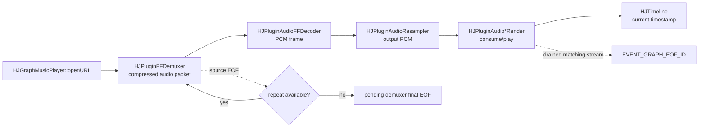
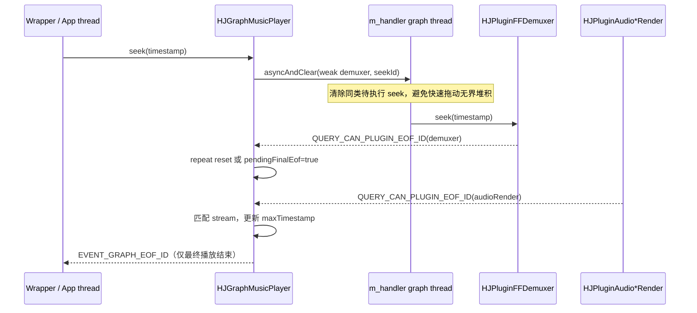

# Day 22：选择主项目点——HJGraphMusicPlayer 源码分析与验证

日期：2026-07-14
学习主题：把 MusicPlayer 的源码分析、架构梳理和小型验证，整理成可信的面试项目点。

## 今日结论

我选择 `HJGraphMusicPlayer` 作为主项目点。它不是“我独立开发的完整播放器”，而是我对 HJMedia 开源仓库完成的源码阅读、架构走读与 standalone C++ 验证练习。这个边界需要在简历和面试中明确说出。

可用的一句话：**我围绕 HJMedia 的 `HJGraphMusicPlayer` 做了源码分析和 C++ 验证练习，梳理了 `demux -> decode -> resample -> render` 音频链路，并重点核对了异步 seek、repeat 和最终 EOF 的状态边界。**

## 阅读范围与源码入口

| 路径 | 本次确认的事实 |
|---|---|
| `docs/Readme_MusicPlayer.md` | MusicPlayer 是纯音频 graph；主链路是 demuxer、decoder、resampler、render。 |
| `docs/architecture/HJGraphMusicPlayer.md` | seek 由 graph handler 串行化；demuxer EOF 与最终播放 EOF 是不同语义。 |
| `docs/architecture/HJGraphMusicPlayer_AudioContextGuide.md` | 播放进度依赖 render/timeline，修改播放器前要先审计线程与 teardown 边界。 |
| `src/graphs/HJGraphMusicPlayer.h` | graph 持有音频线程、render 线程、timeline、四个插件和 EOF/repeat 状态。 |
| `src/graphs/HJGraphMusicPlayer.cpp` | `internalInit` 组装链路；`seek` 使用 `m_handler->asyncAndClear`；`registerQueryHandler_canPluginEof` 协调 repeat 与最终 EOF。 |
| `studyDemo/day03_music_player_pipeline.cpp`、`day05_bounded_frame_queue.cpp`、`day13_seek_flush_eof_debug.cpp` | 已完成的独立小型练习，分别对应播放链路、反压和 seek/flush/EOF 陈旧数据风险。 |

## 主项目点

### 选择理由

MusicPlayer 的范围适中，却能覆盖 C++ 音视频岗位常见的四类追问：媒体管线、线程/队列、播放状态、EOF 与资源释放。它同时有明确的真实源码入口，能够避免只背概念。

### 我实际完成的工作

1. 从 `HJGraphMusicPlayer::internalInit` 追踪 graph 如何创建并连接 demuxer、audio decoder、audio resampler、audio render。
2. 对照 `openURL`、`pause`、`resume`、`seek` 阅读控制路径，确认 seek 并不直接在 API 调用线程执行。
3. 阅读 `registerQueryHandler_canPluginEof`：demuxer 源耗尽可触发 repeat/reset；只有 audio render 消费到最终边界才上报 `EVENT_GRAPH_EOF_ID`。
4. 用已有 standalone demo 复现并解释队列反压和 seek 后陈旧帧/陈旧 EOF 的风险；本节新增 `day22_star_project_point.cpp`，把每一项面试陈述绑定到源码或 demo 证据。

### STAR 表达

| STAR | 可以这样说 |
|---|---|
| S（背景） | 在学习 HJMedia 跨平台 C++ 多媒体框架时，我选择纯音频 `HJGraphMusicPlayer` 作为主线，因为它能串起 graph、plugin、异步控制和播放结束边界。 |
| T（任务） | 我的任务是把文档和源码整理成一条可验证、能经受追问的 MusicPlayer 架构案例。 |
| A（行动） | 我追踪了 `internalInit/openURL/pause/resume/seek` 与 EOF handler，画出四段插件链；并通过独立 C++ demo 练习反压、weak_ptr 任务和 seek/flush/EOF 风险。 |
| R（结果） | 我得到了一组带源码路径的笔记和可运行小 demo，能准确解释 seek 合并、render 驱动进度、repeat 与最终 EOF 的区别。 |

## Mermaid 图

### 数据流

`demuxer EOF` 只表示没有更多压缩包；render 侧真正消费到尾部后，才是用户可见的最终播放结束。

### 控制流

## 关键实现理解与风险

| 主题 | 源码观察 | 风险与应对 |
|---|---|---|
| seek | `seek()` 捕获 `HJPluginFFDemuxer::Wtr`，再向 `m_handler` 投递 `asyncAndClear`。 | seek 是异步的；调用方不能把 API 返回当作已完成 seek。任务中使用 weak_ptr，仍应结合 `done()` 审计 teardown。 |
| pause/resume | pause 同时暂停 `HJTimeline` 和 audio render；resume 反向恢复。 | 时间线不是 decode 速度，而应与 render 的真实消费保持一致。 |
| repeat/EOF | `m_playbackStateMutex` 保护 repeat 计数、pending EOF、播放完成、最大时间戳。 | 不能将 demuxer EOF 直接映射成 UI 播放结束，否则可能截断 render 队列里的尾部 PCM。 |
| release | `internalRelease()` 释放插件、timeline、线程与 handler。 | 文档提示 `close()` 不应被过度理解为可复用的完整 teardown 契约。 |

## 运行练习

`studyDemo/day22_star_project_point.cpp` 输出两部分：

- 一段严谨的 STAR 项目叙述；
- “陈述 → 源码/练习证据 → 安全说法”的账本，以及五个高频追问答案。

该 demo 不依赖完整 HJMedia 编译产物，目的是检验表达边界，而不是替代真实音频播放。

## 面试复述

“我以 HJMedia 的 `HJGraphMusicPlayer` 做过源码分析和架构走读。它把 demux、音频解码、重采样和音频渲染组装成 graph；我特别关注 `seek` 通过 handler 的 `asyncAndClear` 合并请求，以及 demuxer 源 EOF 和 render 最终播放 EOF 的区分。为了验证理解，我写了不依赖框架的 C++ 小 demo 来练习队列反压和 seek/flush/EOF 的陈旧数据问题。这里我描述的是源码分析和验证练习，不把它说成我独立实现了完整播放器。”

## 问题解答

本节用于记录学习过程中的提问和回答。

### 为什么选择 MusicPlayer 作为主项目点？

它以较小范围覆盖媒体管线、插件/线程、状态控制和 EOF 边界；并且 `HJGraphMusicPlayer.cpp` 有明确可核对的实现入口。作为项目表达，应说明这是对 HJMedia 的源码分析与练习验证，而不是宣称独立开发完整产品。

### demuxer EOF 和最终播放 EOF 有什么区别？

前者表示源端不再提供压缩 packet，后者表示 render 已消费到对应流的末尾。`HJGraphMusicPlayer::registerQueryHandler_canPluginEof` 先在 demuxer 分支处理 repeat 或标记 pending 状态，再在 audio render 分支满足匹配条件时报告 `EVENT_GRAPH_EOF_ID`。

## 后续可追问

- `asyncAndClear` 的清理范围和执行时机具体由 `HJLooperThread` 如何保证？
- seek 与 audio render 队列 flush 的完整协作路径是什么？
- `close()`、`done()`、wrapper 析构在各平台上的职责边界是否一致？
