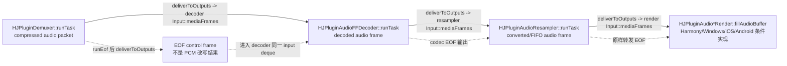
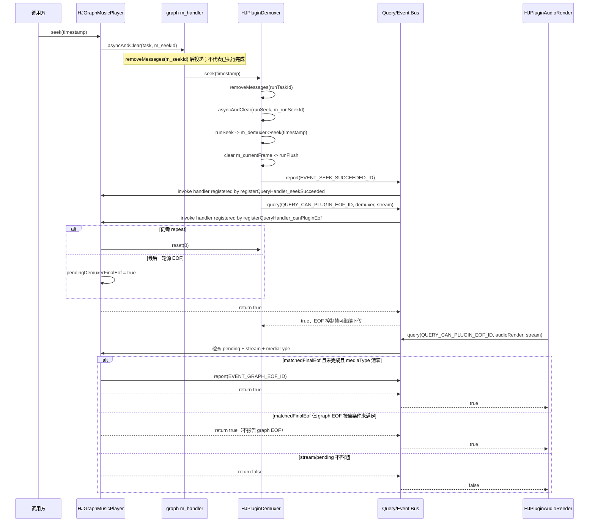

# Day 23：HJGraphMusicPlayer 简历项目描述

日期：2026-07-15
学习主题：把 Day 22 选定的 MusicPlayer 主项目点，整理成可信、可追问、可核验的三版简历描述。

## 今日任务

- 写简短版、普通版、技术强化版三种描述。
- 每一版都明确链路、技术点、难点和收益。
- 把经历限定为“开源源码分析 + 问题定位训练 + standalone C++ 验证”，不虚构商业交付、线上事故或性能数字。

## 阅读与实践范围

### 文档与源码

- `.agents/skills/hjmedia-daily-study/references/28-day-plan.md` — Day 23 任务与验收标准。
- `studyNote/22-resume-project-point.md` — Day 22 已选择 `HJGraphMusicPlayer` 作为主项目点。
- `docs/Readme_MusicPlayer.md`
- `docs/architecture/HJGraphMusicPlayer.md`
- `docs/architecture/HJGraphMusicPlayer_AudioContextGuide.md`
- `src/graphs/HJGraphMusicPlayer.h`
- `src/graphs/HJGraphMusicPlayer.cpp`
- `src/graphs/HJGraph.cpp`
- `src/plugins/HJPlugin.cpp`
- `src/plugins/HJPluginDemuxer.cpp`
- `src/plugins/HJPluginAudioFFDecoder.cpp`
- `src/plugins/HJPluginAudioResampler.cpp`
- `src/plugins/HJPluginAudioRender.cpp`
- `src/utils/HJThread/HJLooperThread.cpp`

### 已完成的独立练习

| 练习 | 本次可以支撑的表述 | 不能扩大成什么 |
|---|---|---|
| `studyDemo/day03_music_player_pipeline.cpp` | 模拟并解释 demux、decode、resample、render 与两类 EOF | 不能说成真实播放器产品实现 |
| `studyDemo/day05_bounded_frame_queue.cpp` | 比较有界队列的阻塞、拒绝和丢弃策略 | 不能声称修改了 HJMedia 生产队列 |
| `studyDemo/day13_seek_flush_eof_debug.cpp` | 模拟 seek 后陈旧帧/陈旧 EOF，并比较 broken/fixed 场景 | `generation gate` 是练习方案，不是已确认的 MusicPlayer 现有机制 |
| `studyDemo/day22_star_project_point.cpp` | 用 STAR 和证据账本约束项目所有权边界 | 不能把源码阅读包装成商业交付经历 |

## 四项信息检查

| 维度 | 本项目点采用的内容 |
|---|---|
| 链路 | `HJPluginFFDemuxer -> HJPluginAudioFFDecoder -> HJPluginAudioResampler -> 平台 audio render` |
| 技术点 | Graph/Plugin 连接、消费者输入队列、两层 handler 异步 seek、repeat/final EOF 协调 |
| 难点 | API 返回不等于 seek 完成；demuxer 源 EOF 不等于 render 已播放完成；练习结论不能冒充生产实现 |
| 收益 | 形成可运行 C++17 小程序、Mermaid 链路图、源码证据表和可复述材料；不编造业务指标 |

## 三版简历描述

### 简短版

> 基于 HJMedia 开源代码开展 MusicPlayer 源码分析与 C++ 验证，梳理 demux -> decode -> resample -> render 插件链，围绕异步 seek 与分阶段 EOF 做问题定位练习，并以独立小程序沉淀可运行案例和源码走读材料。

适用位置：一页简历中的单条项目概述。这里已经包含链路、异步 seek 技术点、EOF 难点和可运行材料这一收益。

### 普通版

> **HJMedia MusicPlayer 源码分析与实践验证（个人学习项目）**
> 以 `HJGraphMusicPlayer` 为主线完成开源源码分析与个人实践：从 `internalInit` 追踪 demux、音频解码、重采样到平台 render 的插件链和消费者输入队列，分析两层 handler 异步 seek 及 demuxer/render 的 EOF 协作；通过 standalone C++17 demo 模拟播放链、有界队列反压和 seek 后陈旧帧/EOF 风险，形成可编译案例、Mermaid 图和源码证据表。

适用位置：项目经历主体。标题主动标明“个人学习项目”，正文把源码动作、练习动作和产出分开。

### 技术强化版

> **HJMedia MusicPlayer 架构分析与 C++ 验证**
> 作为个人开源源码分析与验证，我围绕 `HJGraphMusicPlayer::internalInit` 与 `HJGraph::connectPlugins` 核对四段音频链，继续下钻 `HJPlugin::deliver/receive` 的下游输入队列语义；追踪 `HJGraphMusicPlayer::seek -> graph Handler::asyncAndClear -> HJPluginDemuxer::seek -> demux Handler::asyncAndClear -> HJPluginDemuxer::runSeek`，以及 `QUERY_CAN_PLUGIN_EOF_ID` 下 repeat/pending EOF 到 render 最终确认的控制路径；编写 standalone C++17 练习对比有界队列策略和 seek 陈旧帧/EOF 场景，产出可运行验证与逐项源码证据。

适用位置：面向 C++ 音视频岗位的技术版简历。它更容易引出源码追问，因此必须熟悉下节所有 symbol。

## 源码依据

| 分类 | 路径与 symbol | 源码确认的事实 | 支撑的安全表述 |
|---|---|---|---|
| 条件路径 | `src/graphs/HJGraphMusicPlayer.cpp` — `HJGraphMusicPlayer::internalInit` | 三次 `connectPlugins` 依次建立 demuxer -> decoder -> resampler -> audio render；render 实现受 HarmonyOS/Windows/iOS/Android 宏控制，其他分支返回 `HJErrNotSupport`。 | 我追踪了 MusicPlayer 在受支持平台编译分支中的四段音频插件链；不声称完成四平台实测。 |
| 源码确认 | `src/graphs/HJGraph.cpp` — `HJGraph::connectPlugins` | 分别调用源插件 `addOutputPlugin` 与目标插件 `addInputPlugin`。 | 我核对了 graph 边如何同时登记到上下游插件。 |
| 源码确认 | `src/plugins/HJPlugin.cpp` — `HJPlugin::deliver/receive/deliverToOutputs` | 上游调用下游 `deliver`，帧进入目标插件 `Input::mediaFrames`；目标 `receive` 取帧并通知上游 output updated。 | 我分析了消费者侧输入队列的数据交接和反向唤醒。 |
| 源码确认 | `src/plugins/HJPluginDemuxer.cpp` — `runTask/deliverToOutputs`；`HJPluginAudioFFDecoder.cpp` — `runTask`；`HJPluginAudioResampler.cpp` — `runTask`；`HJPluginAudioRender.cpp` — `fillAudioBuffer` | demuxer 投递音频/EOF，decoder 取输入并投递输出，resampler 取帧并投递转换/FIFO 输出，render 从输入取帧填充音频缓冲。 | 四段链不是从类名推测，而是由连接和实际帧交接共同确认。 |
| 源码确认 | `src/graphs/HJGraphMusicPlayer.cpp` — `seek`；`src/utils/HJThread/HJLooperThread.cpp` — `Handler::asyncAndClear` | graph 用 `m_seekId` 清理同 ID 待处理消息再投递 weak demuxer 任务；`asyncAndClear` 的实现是 `removeMessages(id)` 后 `postDelayed`，而 graph `seek` 没有检查其布尔返回值。 | seek 是异步请求；`HJ_OK` 不能解释成 seek 完成，也不能单凭该返回值保证任务已入队。 |
| 源码确认 | `src/plugins/HJPluginDemuxer.cpp` — `seek/runSeek` | demuxer 再清理自身 `runTaskId`，以 `m_runSeekId` 投递 `runSeek`；成功后清当前帧、调用 `runFlush` 并报告 `EVENT_SEEK_SUCCEEDED_ID`。 | 我追踪了 graph handler 到 demuxer handler 的第二层 seek 控制。 |
| 条件路径 | `src/plugins/HJPluginDemuxer.cpp` — `runEof`；`src/plugins/HJPluginAudioRender.cpp` — `fillAudioBuffer`；`src/graphs/HJGraphMusicPlayer.cpp` — `registerQueryHandler_canPluginEof` | demuxer EOF 查询触发 repeat reset 或 pending final EOF；audio render 读到 EOF 后再次查询，只有 pending、stream 匹配、尚未完成且清除 audio 位后 `m_mediaType == 0` 时才报告 `EVENT_GRAPH_EOF_ID`。 | 我在纯音频输入/MusicPlayer 范围内区分了源耗尽与 graph 最终播放完成；不把含未清除 mediaType 的输入泛化到主结论。 |
| 实践验证 | `studyDemo/day03_music_player_pipeline.cpp`、`day05_bounded_frame_queue.cpp`、`day13_seek_flush_eof_debug.cpp` | 独立小程序分别演示播放链、队列策略和 seek 陈旧数据场景。 | 我写了模拟练习来验证理解，不说成修改了 HJMedia 生产代码。 |

## Mermaid 图

### 数据流



实线是媒体帧主路径，虚线是沿同一消费者队列传播的 EOF 控制帧，不表示 decoder/resampler 把 EOF 改写成 PCM。主边由 `HJGraphMusicPlayer::internalInit` 的三次 `connectPlugins` 建立，并由各插件 `runTask`/`deliverToOutputs` 与 `HJPlugin::deliver/receive` 的可执行代码确认。平台 render 类型是条件路径，不应写成单一通用实现或四平台实测结论。

### 控制流



本日没有继续跨越 wrapper/entry 追踪 `EVENT_GRAPH_EOF_ID` 如何转换成上层业务回调，因此图在 Event Bus 处结束，不把未核对的上层边画成事实。

## 可被追问的问题

### 1. 四段链路是从文档抄的吗？

不是。`HJGraphMusicPlayer::internalInit` 的三次 `connectPlugins` 建立主边，`HJGraph::connectPlugins` 再落到上下游插件登记；各插件 `runTask` 和 `deliverToOutputs` 证明帧确实沿这些边交接。

### 2. 帧队列到底在哪一侧？

`HJPlugin::deliver` 先根据源 key 找到目标插件自己的 `Input`，再写入 `input->mediaFrames`；因此这里核对到的是消费者侧输入队列。`receive` 取出后会通知上游 `onOutputUpdated()`。

### 3. `asyncAndClear` 是否会取消所有旧 seek？

不能这样绝对表述。源码确认它先 `removeMessages(id)`，再投递新消息，因此能清理同 ID 的待处理消息；已经进入执行的任务不应在没有更多证据时声称会被取消。

另外，`HJGraphMusicPlayer::seek` 没有检查 `asyncAndClear` 的布尔返回值，所以 API 返回 `HJ_OK` 既不代表 seek 完成，也不能单靠这一返回值证明任务成功入队。

### 4. 为什么 demuxer EOF 不是最终结束？

demuxer 分支还可能执行 repeat reset；最后一轮只先记录 pending。audio render 真正取到对应 stream 的 EOF 后再次查询，graph 才可能报告 `EVENT_GRAPH_EOF_ID`。

### 5. `day13` 的 generation gate 是 HJMedia 现有设计吗？

不是本日源码确认的 MusicPlayer 机制。它是 standalone 调试练习里的防陈旧数据方案，只能说“模拟并比较”，不能写成“HJMedia 已采用”。

### 6. 项目收益为什么没有性能百分比？

本次没有商业运行数据。可核验收益是形成了可编译 demo、源码证据、链路图和面试讲解材料；虚构延迟、内存或崩溃率指标会让描述无法经受追问。

## 表达风险与替换

| 不建议写 | 原因 | 建议替换 |
|---|---|---|
| “独立开发 HJMedia 音乐播放器” | 与实际所有权不符 | “围绕 HJGraphMusicPlayer 完成源码分析与 standalone 验证” |
| “解决线上 seek 旧帧问题” | 只有模拟练习，没有线上事件证据 | “用 broken/fixed demo 模拟 seek 陈旧帧与 EOF 风险” |
| “优化播放器性能 30%” | 没有基准、设备和测量数据 | “形成有界队列策略对比及可运行验证” |
| “`asyncAndClear` 取消所有旧 seek” | 源码只确认清理同 ID 待处理消息 | “清理同 ID 待处理消息后投递新 seek” |

## Demo 设计与验证

`studyDemo/day23_resume_description.cpp` 将每版描述拆成链路、技术点、难点、收益和能力边界，并执行以下审计：

1. 五个字段不能为空。
2. 每版必须绑定有效的源码确认或实践验证 ID。
3. 能力边界必须同时出现“源码分析”和“standalone”。
4. 遇到虚构商业交付、线上事故或性能收益的禁用措辞时返回失败。
5. 三版全部通过才以退出码 `0` 结束。

构建运行命令：

```powershell
$cmake = 'C:\Program Files\JetBrains\CLion 2026.1.2\bin\cmake\win\x64\bin\cmake.exe'
& $cmake -S studyDemo -B studyDemo/build
& $cmake --build studyDemo/build --config Debug --target day23_resume_description
.\studyDemo\output\Debug\day23_resume_description.exe
```

本次验证结果：CMake configure 成功；当前 Codex 进程的 `Path/PATH` 重复项曾使直接 MSBuild 启动失败，改由单一子进程启动构建后 target 编译成功。可执行文件退出码为 `0`，简短版、普通版、技术强化版均输出 `PASS`，汇总为 `failed=0 versions=3`。

## 待验证边界

- `EVENT_GRAPH_EOF_ID` 从 graph event bus 到各平台 wrapper/UI 回调的完整路径，本日未跨层追踪。
- 各平台 audio render 的设备缓冲细节，本日只核对公共 `HJPluginAudioRender::fillAudioBuffer` 和 graph 的条件创建分支，没有做真机播放验证。

## 面试复述

“我围绕 HJMedia 的 `HJGraphMusicPlayer` 做过开源源码分析和 standalone C++ 验证。我从 `internalInit` 追踪了 demux、音频解码、重采样到平台 render 的插件链，也下钻了消费者输入队列。控制侧重点看了 graph 与 demuxer 两层 handler 的异步 seek，以及 demuxer 源 EOF、repeat 和 render 最终 EOF 的协作。我用小程序模拟了播放链、有界队列和 seek 陈旧数据风险，产出是可运行 demo、图和源码证据；这不是我独立交付完整播放器的经历。”

## 问题解答

本节用于记录第 23 天学习过程中的后续提问和回答；当前尚无额外技术提问。

## 结论

第 23 天最终采用 MusicPlayer 单一主线，不再混入未逐项核验的 Pusher 描述。三版文本都包含链路、技术点、难点与可核验收益，并把源码确认、实践验证和待验证边界分开，能够回答“读了什么、做了什么、难点在哪里、结果如何”四类追问。
