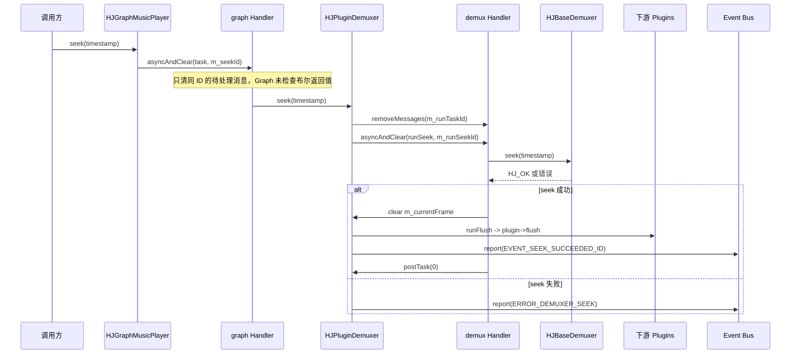

# Day 24：HJMedia 50 个面试问答

日期：2026-07-15
学习主题：把前三周的源码分析与 standalone C++ 练习整理成可追问、可核验、不过度包装的面试题库。

## 今日任务

- 完成 50 个问答，覆盖 C++、音频、视频、播放器、推流和工程六类。
- 每个回答至少落到真实源码 symbol、链路、风险或验证方式之一。
- 用一张真实推流数据流图复盘媒体主链，用一张真实 seek 控制流图复盘异步控制。
- 扩充 `studyDemo/day24_interview_question_bank.cpp`，自动审计题数、分类、编号与证据字段。

## 阅读范围

### 计划与既有练习

- `.agents/skills/hjmedia-daily-study/references/28-day-plan.md` — Day 24 目标、产出与验收。
- `study/week4-interview-job-ready-practice.md` — 六类题目范围。
- `studyNote/16-audio-capture-aac.md`、`17-video-capture-codec.md`、`18-rtmp-muxer-timestamp.md`、`week3-review.md` — 只用于定位需要复核的 symbol，结论仍回到源码确认。
- `studyDemo/day05_bounded_frame_queue.cpp`、`day13_seek_flush_eof_debug.cpp`、`day16_pcm_aac_frame_calc.cpp`、`day17_video_codec_headers.cpp`、`day18_av_interleave.cpp`、`day19_network_backpressure.cpp` — 回答中的实践验证锚点。

### 本日复核的源码

- C++ / 线程：`src/utils/HJMacros.h`、`HJObject.h`、`HJUtilitys.h`、`HJSyncObject.h`、`HJError.h`、`HJLog.h`、`HJFLog.h`、`src/utils/HJThread/HJLooperThread.cpp`、`HJMessageQueue.cpp`、`src/core/HJMediaNode.h`。
- Plugin / 队列：`src/plugins/HJPlugin.cpp`、`HJMediaFrameDeque.cpp`、`HJPluginDemuxer.cpp`、`HJPluginAudioResampler.cpp`、`HJPluginAudioRender.cpp`、`HJPluginAVDropping.cpp`、`HJPluginAVInterleave.cpp`、`HJPluginMuxer.cpp`。
- 音视频：`src/media/HJMediaInfo.h`、`HJAudioConverter.cc`、`src/media/codec/HJAEncFDKAAC.cc`、`src/media/codec/hsys/HJVEncOHCodec.cc`、`src/plugins/hsys/HJPluginVideoOHEncoder.cpp`。
- Graph / 网络：`src/graphs/HJGraph.cpp`、`HJGraphMusicPlayer.cpp`、`HJGraphLivePlayer.cpp`、`HJGraphVodPlayer.cpp`、`HJGraphPusher.cpp`、`src/media/muxer/HJRTMPMuxer.cc`、`HJRTMPPacketManager.cc`、`HJRTMPAsyncWrapper.cc`。
- 工程：`CMakeLists.txt`、`studyDemo/CMakeLists.txt`。

## 回答方法

面试时按四句组织，避免背成孤立概念：

1. 先给定义或结论。
2. 再落到 HJMedia 的路径与 symbol。
3. 说明边界、条件或风险。
4. 最后给日志点、demo 或验证方法。

示例：不要只答“`weak_ptr` 防循环引用”，而要补充“`HJPlugin::deliverToOutputs` 从弱引用 `lock()` 下游，失败就不再交付；异步任务也常捕获 Wtr，不能把这扩大成所有生命周期问题都自动安全”。

## 源码依据

| 证据组 | 路径与 symbol | 源码确认的事实 | 支撑题号 |
|---|---|---|---|
| E1 | `src/utils/HJMacros.h` — `HJ_DECLARE_PUWTR`、`HJ_AUTO_LOCK`、`HJ_AUTOU_LOCK`；`src/utils/HJObject.h` — `HJObject::sharedFrom` | 宏生成 shared/unique/weak 别名；两类锁宏分别展开为 `lock_guard`/`unique_lock`；`sharedFrom` 调用 `shared_from_this` 后动态转换。 | 1、2、5 |
| E2 | `src/utils/HJUtilitys.h` — `HJOnceToken::~HJOnceToken`；`src/utils/HJSyncObject.h` — `init/done` | OnceToken 析构执行清理函数；同步对象在 init 失败时 release 并回到 NONE，done 先置 Done 再 release。 | 4、10、47 |
| E3 | `src/utils/HJThread/HJLooperThread.cpp` — `Handler::asyncAndClear`、`HJLooperThread::beforeDone/internalRelease`；`HJMessageQueue.cpp` — `enqueueMessage/next/removeMessages` | `asyncAndClear` 只清同 ID 待处理消息；队列按 `when` 插入与取出；线程退出会 quit 后 join。 | 7、8、31 |
| E4 | `src/core/HJMediaNode.h` — `HJMediaNode::asyncSelf`；`src/plugins/HJPlugin.cpp` — `postTask/deliver/receive/deliverToOutputs`；`HJMediaFrameDeque.cpp` — `deliver/receive/dropFrames/flush` | Node 用锁和 `m_isBusy` 防重复投递；Plugin 把帧写入目标 Input 队列，消费后反向唤醒；队列同步维护帧与时长统计。 | 3、6、9、12、25、28 |
| E5 | `src/media/HJMediaInfo.h` — `HJAudioInfo`；`src/media/codec/HJAEncFDKAAC.cc` — `init/run` | 音频信息保存声道、每样本字节数、采样率和每帧样本数；AAC-LC 分支设 1024 samples，并把 PCM 送入 FDK 后封装 packet。 | 11、13、14 |
| E6 | `src/media/HJAudioConverter.cc` — `HJAudioConverter::convert`；`src/plugins/HJPluginAudioResampler.cpp` — `internalInit/processMediaFrame`；`HJPluginAudioRender.cpp` — `internalInit/fillAudioBuffer` | 输入格式变化时重建 SwrContext；可选 FIFO 重新分帧；render 缺帧填静音，完整消费后更新 timeline，EOF 先查询 graph。 | 15-18 |
| E7 | `src/media/HJMediaInfo.h` — H.264/H.265 NAL 枚举；`src/media/codec/hsys/HJVEncOHCodec.cc` — `getFrame`；`src/plugins/hsys/HJPluginVideoOHEncoder.cpp` — `internalInit/internalRelease` | H.264 枚举含 SPS/PPS，H.265 含 VPS/SPS/PPS；Harmony 编码器缓存 codec data，并在同步帧前拼接；Surface 回调负责交付/释放 NativeWindow。 | 19-23 |
| E8 | `src/graphs/HJGraphLivePlayer.cpp` — `internalInit/registerQueryHandler_canDeliverToOutputs`；`src/plugins/HJPluginAVDropping.cpp` — `runTask/tryDropFrames` | Live 图在 demux 后连接 dropping；音频、视频、render 队列阈值共同控制放行，堵塞时才尝试按队列规则追帧。 | 24-26、29、30 |
| E9 | `src/graphs/HJGraphMusicPlayer.cpp` — `internalInit/pause/resume/seek/registerQueryHandler_canPluginEof`；`src/plugins/HJTimeline.cpp` — `setTimestamp/getTimestamp/pause/play` | Music 图连接四段音频链；seek 经 graph handler；repeat/final EOF 在 demux 与 render 两阶段协调；timeline 区分暂停与运行计算。 | 27、31、33-36 |
| E10 | `src/plugins/HJPluginDemuxer.cpp` — `seek/runSeek/runEof/deliverToOutputs` | demuxer seek 清 runTask 消息，再投递 runSeek；成功后清 current frame、flush 下游并报告事件；EOF 经 query 决定是否下传。 | 32、33 |
| E11 | `src/graphs/HJGraphPusher.cpp` — `internalInit`；`src/plugins/HJPluginAVInterleave.cpp` — `runTask`；`HJPluginMuxer.cpp` — `runTask/dropping` | Pusher 的音频/视频条件链接入 AVInterleave；交织比较两路 DTS；含视频的 muxer 等到关键帧才放行。 | 37-40 |
| E12 | `src/media/muxer/HJRTMPMuxer.cc` — `addFrame/addRTMPPacket/waitStartDTSOffset`；`HJRTMPPacketManager.cc` — `push/drop/dropFrames/waitTag`；`HJRTMPAsyncWrapper.cc` — `onRTMPWrapperNotify/retryAVIO/getRetryInterval` | RTMPMuxer 对齐起始 DTS、生成 FLV packet 并入发送队列；队列按 duration/priority 丢包；错误事件触发带上限间隔的异步重试。 | 41-44 |
| E13 | `CMakeLists.txt`；`src/utils/HJError.h`；`HJLog.h`；`HJFLog.h`；`studyDemo/CMakeLists.txt` | 平台宏和入口子目录受 CMake 条件控制；正值结果与负值错误分族；日志携带定位信息并支持 fmt；学习 demo 是独立 C++17 targets。 | 45、46、48-50 |

## Mermaid 图

### 数据流

```mermaid
flowchart LR
    AudioCapture["HJPluginAudioOHCapturer<br/>HJGraphPusher::internalInit<br/>HarmonyOS 且 audioInfo"]
    AudioResampler["HJPluginAudioResampler<br/>PCM convert + optional FIFO"]
    AACEncoder["HJPluginFDKAACEncoder<br/>HJAEncFDKAAC::run"]
    VideoEncoder["HJPluginVideoOHEncoder<br/>HarmonyOS 且 videoInfo"]
    Interleave["HJPluginAVInterleave::runTask<br/>按 DTS 选择队首"]
    PluginMuxer["HJPluginRTMPMuxer<br/>HJPluginMuxer::runTask"]
    RTMPMuxer["HJRTMPMuxer::addRTMPPacket<br/>HJFLVPacket"]
    PacketQueue["HJRTMPPacketManager::push<br/>发送队列与分级丢包"]

    AudioCapture -->|"PCM：connectPlugins 条件边"| AudioResampler
    AudioResampler -->|"目标格式 PCM"| AACEncoder
    AACEncoder -->|"AAC packet"| Interleave
    VideoEncoder -->|"H.264/H.265 packet：HarmonyOS 条件边"| Interleave
    Interleave -->|"DTS 已交织的 A/V frame"| PluginMuxer
    PluginMuxer -->|"m_muxer->writeFrame"| RTMPMuxer
    RTMPMuxer -->|"HJFLVPacket::init 后 push"| PacketQueue
```



主边由 `HJGraphPusher::internalInit` 的 `connectPlugins`、各 Plugin 的 `deliverToOutputs/receive`、`HJPluginMuxer::runTask` 和 `HJRTMPMuxer::addRTMPPacket` 共同确认。采集与视频硬编边明确受 `HarmonyOS` 及媒体信息是否存在约束；图没有把非 Harmony 平台尚未追踪的外部输入补成事实。`HJRTMPPacketManager` 的丢包/码率回调属于队列控制侧效应，不画成媒体内容被“重写”。

### 控制流



该图只画到已核对的 Event Bus。`HJGraphMusicPlayer::seek` 返回 `HJ_OK` 表示请求路径没有同步报错，不表示底层 seek 已完成；而且它没有检查 `asyncAndClear` 的布尔返回值，因此不能仅凭 API 返回值断言任务已经成功入队。

## 50 个面试问答

### C++（1-10）

### 1. `HJ_DECLARE_PUWTR` 统一了哪些指针别名？

它展开为 `Ptr = std::shared_ptr<Class>`、`Utr = std::unique_ptr<Class>`、`Wtr = std::weak_ptr<Class>`。这只统一类型写法，不自动决定所有权；是否持有强引用仍要看成员类型与赋值。验证时可看 `HJPlugin` 输出边使用 Wtr，而 Graph 的 `m_plugins` 保存 Ptr。证据：E1、E4。

### 2. `sharedFrom(this)` 为什么要求对象已由 `shared_ptr` 管理？

`HJObject::sharedFrom` 实际调用 `ptr->shared_from_this()`，再做 `dynamic_pointer_cast`。因此对象必须已经进入 `enable_shared_from_this` 的共享所有权控制块；否则不能把裸 `this` 安全升级为共享指针。面试不要说它“接管裸指针”，它只是取得已有共享所有权。证据：E1。

### 3. Plugin 拓扑为什么使用 `weak_ptr` 保存相邻插件？

`HJPlugin::deliverToOutputs` 和 `receive` 都先对相邻插件弱引用执行 `lock()`，成功才交付帧或反向唤醒。这样连接边不会单独延长对方生命周期，也降低上下游互相强持有形成环的风险。边界是：弱引用只能避免持有与解引用问题，任务内仍需检查 `lock()`，不能替代状态同步。证据：E4。

### 4. `HJOnceToken` 如何体现 RAII？

构造时可执行进入动作，析构时执行 `m_onDestructed`。所以函数提前 `return` 或中途 `break` 时，栈展开仍会运行清理回调；`HJScheduler::sync` 就用它保证 semaphore notify。风险是清理 lambda 捕获引用时，被捕获对象必须活到 token 析构。证据：E2，以及 `src/utils/HJExecutor.cc — HJScheduler::sync`。

### 5. `HJ_AUTO_LOCK` 与 `HJ_AUTOU_LOCK` 有什么区别？

前者展开为 `std::lock_guard`，适合进入作用域即持锁、退出即释放；后者展开为 `std::unique_lock`，支持条件变量等待、手动解锁等更灵活操作。`HJRTMPPacketManager::waitTag` 用 unique lock 配合 `condition_variable::wait_for`。验证时重点看锁保护的数据，而不是只数宏出现次数。证据：E1、E12。

### 6. `HJMediaFrameDeque` 如何保证队列与统计一致？

`deliver/receive/dropFrames/flush` 都在同步锁内同时修改 deque、EOF 数量、音频样本/时长和视频帧/关键帧计数。取帧时先从容器删除，再调用 `eraseFrame` 扣减统计。排查负数或延迟异常时，应同时打印 frame 类型、队列长度、audioSamples/sampleRate 和 videoKeyFrames。证据：E4。

### 7. `asyncAndClear` 能取消所有旧任务吗？

不能。实现只调用 `removeMessages(id)`，再 `postDelayed` 新任务；被清理的是同一 Handler、同一 message id 且尚在队列里的消息。已经开始执行的任务以及不同 ID 的任务不在此保证内。可用 `day08_task_queue_handler` 验证同 ID 合并语义。证据：E3。

### 8. `HJMessageQueue` 如何按时间调度消息？

`enqueueMessage` 按 `when` 把消息插入单链表，必要时唤醒阻塞队列；`next` 比较队首 `when` 与 steady time，未到期就计算等待时间，到期才返回。target 已失效的消息会被回收并跳过。风险是消息执行耗时过长仍会阻塞同一 looper 后续消息。证据：E3。

### 9. `HJMediaNode` 如何防止重复调度自身？

`asyncSelf` 在递归锁内检查 scheduler 和 `m_isBusy`；未忙才置 true 并调用 `asyncAlwaysTask`，投递失败会恢复 false。这里的 `m_isBusy` 是受锁保护的普通 bool，不应答成原子变量。节点的 `proRun` 退出路径还必须负责把 busy 恢复，常见做法是 RAII。证据：E4，以及 `src/core/HJMediaNode.h — setIsBusy`。

### 10. `HJSyncObject` 的 `init/done` 生命周期如何收口？

`init` 在生产锁内执行 `internalInit`；失败会调用 `internalRelease` 并回到 `HJSTATUS_NONE`，成功才进入 `Inited` 并执行 `afterInit`。`done` 先执行锁外的 `beforeDone`，再在锁内置 `Done`，最后调用 `internalRelease`。源码注释明确提醒 `beforeDone` 可能重复且非线程安全，派生类需要幂等设计。证据：E2。

### 音频（11-18）

### 11. PCM 字节率由哪些参数决定？

计算式是 `sampleRate × channels × bytesPerSample`。源码中 `HJAudioInfo` 保存三项参数，`HJPluginAudioRender::internalInit` 先算 `bytesPerFrame = channels × bytesPerSample`，再按采样率计算回调帧数，因此该公式可从实际缓冲计算推出。以 48 kHz、双声道、16 bit 为例是 192000 B/s。证据：E5、E6；数值可用 `day16_pcm_aac_frame_calc` 验证。

### 12. 为什么队列既统计 `audioDuration` 又统计 `audioSamples`？

压缩音频帧可以直接累加 frame duration；PCM 队列则可用 `audioSamples × 1000 / sampleRate` 得到更稳定的毫秒数。`HJPlugin::reportFrameDequeInfo` 优先使用 samples/sampleRate，缺失时才退回 duration。风险是重采样输入的 sampleRate 可能变化，所以队列代码也明确记录当前 frame 的采样率。证据：E4。

### 13. FDK AAC-LC 每帧输入样本数是多少？

在当前 `HJAEncFDKAAC::init` 的 `AOT_AAC_LC` 分支中，`m_samplePerFrame` 设为 1024；若类型是另一分支则代码预留 2048。回答要限定为“当前 AAC-LC 实现”，不要说所有 AAC 配置永远都是 1024。编码输出的 `HJAudioInfo::sampleCnt` 也被设为该值。证据：E5。

### 14. PCM 怎样进入 AAC 编码器并产出 packet？

`HJAEncFDKAAC::run` 从输入 AVFrame 取得连续数据，配置 FDK 输入/输出 buffer descriptor，把 `numInSamples` 设为输入字节数除以元素大小，再调用 `aacEncEncode`。成功后复制音频信息、写入 codec params，并用输入 PTS/DTS 封装 AVPacket。`HJPluginFDKAACEncoder::runTask` 再循环 `getFrame` 并 `deliverToOutputs`。证据：E5，以及 `src/plugins/HJPluginFDKAACEncoder.cpp — runTask`。

### 15. 重采样何时重建 `SwrContext`？

`HJAudioConverter::convert` 比较输入与缓存源信息；声道布局、sample format 或 sample rate 任一变化，就释放旧 SwrContext 并按目标/源参数重新 `swr_alloc_set_opts2`、`swr_init`。实际转换前还用 `swr_get_delay` 估算输出样本数。排查爆音或速度异常时要记录新旧三组格式字段。证据：E6。

### 16. `AudioResampler` 为什么可选 FIFO？

初始化参数 `fifo` 为真时，会按目标 `audioInfo->m_sampleCnt` 初始化 `HJAudioFifo`。转换后的 PCM 先进入 FIFO，再由 `getFrame` 输出固定粒度帧，适合 AAC 这类希望稳定输入样本数的下游；MusicPlayer 初始化 resampler 时没有设置 fifo，而 Pusher 在 AAC 编码前设置为 true。证据：E6、`HJGraphPusher::internalInit`、`HJGraphMusicPlayer::internalInit`。

### 17. 音频渲染无帧时为什么填静音？

`fillAudioBuffer` 在预缓冲不足或 `receiveInputFrame` 取不到帧时，将设备请求的剩余缓冲 `memset` 为 0，并上报 START_BUFFERING。这样不会把未初始化内存交给设备，同时保留回调节奏。它不是“伪造一帧有 PTS 的媒体数据”，因此不会在这条分支推进 timeline。证据：E6。

### 18. render 何时推进 timeline、何时确认 EOF？

只有一帧 PCM 的 `m_bufferPos` 达到完整 buffer size 后，render 才用该帧 streamIndex、PTS 和 speed 调用 `timeline->setTimestamp`。遇到 EOF 控制帧则先查询 `QUERY_CAN_PLUGIN_EOF_ID`，graph 同意后调用 `onPlaybackCompleted`，而不是把 EOF 当 PCM 拷贝。风险是 demux EOF 与用户听到结束之间仍有下游缓存。证据：E6、E9。

### 视频（19-26）

### 19. H.264 与 H.265 参数集在源码中如何区分？

NAL 枚举中 H.264 使用 SPS/PPS，H.265 使用 VPS/SPS/PPS；两者还分别定义 IDR/IRAP 与 SEI 类型。参数集用于构造 codec params 和关键帧前的 header，但今天没有重新走读每个 parser 的位级语法，所以不扩展到字段级解释。验证可看 `day17_video_codec_headers` 的两种 header cache。证据：E7。

### 20. Harmony 硬编的 codec-data 怎样处理？

`HJVEncOHCodec::getFrame` 遇到 `AVCODEC_BUFFER_FLAGS_CODEC_DATA` 时，把输出复制到 `m_headerBuf` 并生成 `m_keyCodecParams`，返回 `HJ_WOULD_BLOCK`，不把它作为普通视频画面下发。这样参数集与后续同步帧分开处理。风险点是同步帧分支直接访问 `m_headerBuf`，首个同步帧前必须已经收到有效 codec data。证据：E7。

### 21. 为什么同步帧需要拼接参数集？

当前 Harmony 编码实现的 SYNC_FRAME 分支新建 buffer，把 `m_headerBuf` 放前面、编码帧数据放后面，并把 codec params 写入 `HJVideoInfo`。这样送往 mux/接收端的关键起点携带初始化信息。这里只能回答当前输出封装行为，不能泛化成所有容器都必须每个 IDR 重复参数集。证据：E7。

### 22. PTS 与 DTS 在链路中分别解决什么问题？

`HJPluginAVInterleave::runTask` 明确比较两路队首的 DTS，选择更早需要进入下游的一路；音频 render 完整消费帧后则用 PTS 推进播放 timeline。因此可回答为：DTS 在当前交织链决定发送/解码顺序，PTS 在播放侧代表展示时间。存在 B 帧时两者可能不同；低延迟配置中相同也不能把概念合并。证据：E6、E11。

### 23. Harmony 视频编码为什么使用 Surface 输入？

`HJPluginVideoOHEncoder::internalInit` 从 `HJVEncOHCodec` 取得 `NativeWindow`，通过 `surfaceCb(window,width,height,true)` 交给上游；编码器的新输出 buffer 回调再触发 `runTask` 拉取 packet。释放时调用 `surfaceCb(window,0,0,false)` 解除上游引用。这是 `HarmonyOS` 条件路径，不是跨平台统一接口。证据：E7。

### 24. LivePlayer 如何选择软解与 Harmony 硬解？

`HJGraphLivePlayer::internalInit` 根据 `deviceType` 组装不同 decoder。`HJDEVICE_TYPE_NONE` 创建 FF decoder；`HJDEVICE_TYPE_OHCODEC` 的主硬解创建在 `#if defined(HarmonyOS)` 内，同时还创建 soft decoder/render 作为只取首帧的分支。面试要把“运行时 deviceType”和“编译时 HarmonyOS”两个条件一起说出。证据：E8。

### 25. 直播追帧为什么要保留关键帧边界？

`HJMediaFrameDeque::dropFrames` 遇到 flush/EOF 控制帧立即停止；丢视频时至少保留一个关键帧，并在音频时长已达标且队头回到关键帧后停止。原因是从不可独立解码的预测帧开始并不能可靠恢复画面。该队列策略由 `HJPluginAVDropping::tryDropFrames` 在 backlog 超阈值时触发。证据：E4、E8。

### 26. 为什么 video decoder 不能无限向 render 投递？

Live 图把 `m_canVideoDecoderDeliverToOutput` 定义为 render 队列小于 2 帧；query handler 对主 decoder 使用该条件。render 消费导致 frame count 减少时，event handler 再通知 decoder 继续运行。这是反压闭环，可限制解码后帧堆积与延迟，而不是忙循环轮询。证据：E8。

### 播放器（27-36）

### 27. MusicPlayer 的真实主链路是什么？

`HJGraphMusicPlayer::internalInit` 三次 `connectPlugins` 建立 `FFDemuxer → AudioFFDecoder → AudioResampler → 平台 AudioRender`。render 类由 HarmonyOS、Windows、iOS、Android 编译分支选择，其余平台返回 `HJErrNotSupport`。主链还由各 Plugin 的 `runTask` 与 `deliverToOutputs` 确认帧确实沿连接交付。证据：E4、E9。

### 28. Plugin 帧队列位于生产者还是消费者？

`HJPlugin::deliver` 在目标插件中按上游 key 找到 `Input`，写入 `input->mediaFrames`；`receive` 从这个 Input 队列取帧，随后调用上游 `onOutputUpdated`。所以这里是消费者管理输入队列，连接同时在源的 Output 和目的的 Input 注册。证据：E4，以及 `src/graphs/HJGraph.cpp — connectPlugins`。

### 29. LivePlayer 为什么在 demuxer 后插入 AVDropping？

源码连接是 `demuxer → dropping`，然后分别进入音频和视频链。dropping 在下游不能接收时暂存当前帧，并在输入音频时长超阈值后调用队列丢帧策略；Graph 用 300 ms 音频、30 帧视频等当前阈值控制放行。产品目标是优先收敛直播延迟，不是保证每帧完整播放。证据：E8。

### 30. Live、VOD、Music 三类 Graph 的核心取舍是什么？

`HJGraphPlayer::createGraph` 明确创建三种不同实现；差异由各自 `internalInit` 和 handler 证明。Live 有 AVDropping 与更积极的 backlog 阈值，遇到 demux EOF 会 reset；VOD 有音视频双链、seek/repeat/final EOF；Music 是纯音频四段链并维护运行时 repeats。可用 `day11_player_graph_compare` 做结构复述，但具体结论以三个 Graph 源码为准。证据：E8-E10。

### 31. `MusicPlayer::seek` 为什么是异步请求？

API 在 Graph 同步锁内只把捕获 weak demuxer 的任务投到 graph Handler，然后立即返回 `HJ_OK`。真正的 seek 之后还会进入 demuxer 自己的 Handler，所以调用线程不直接执行 I/O 定位。连续请求能清掉同 seek ID 的待处理消息；但 Graph 没检查 `asyncAndClear` 的 bool 返回，`HJ_OK` 更不能解释成 seek 完成。证据：E3、E9。

### 32. demuxer seek 成功后清理哪些状态？

`HJPluginDemuxer::seek` 先移除普通 runTask 消息，再按 runSeekId 投递 `runSeek`。底层 `m_demuxer->seek` 成功后，代码清空 `m_currentFrame`，调用 `runFlush` 把 clear frame 传给下游，并报告 `EVENT_SEEK_SUCCEEDED_ID`，随后重新 `postTask`。排查旧帧要逐段确认这条控制链和各输入队列 flush。证据：E10；broken/fixed 场景见 `day13_seek_flush_eof_debug`。

### 33. 为什么 demuxer EOF 不等于播放完成？

demuxer 的 EOF 只说明源已读完；decoder、resampler、render 队列仍可能有帧。Music 图在 demuxer 查询时决定 repeat 或标记 pending final EOF；等 audio render 真正取到同 stream EOF 后，才可能上报 `EVENT_GRAPH_EOF_ID`。这就是 source EOF 和 playback EOF 的区别。证据：E6、E9、E10。

### 34. MusicPlayer repeat 与 final EOF 如何协调？

demuxer EOF 到达时递增 currentRepeatNumber；`repeats==0` 或尚未达到目标次数就调用 demuxer reset，否则置 `m_pendingDemuxerFinalEof`。render EOF 还必须匹配最后 streamIndex，清除 audio media type 后才报告 graph EOF。`setRepeats` 可在 pending 但尚未完成时恢复 reset，说明 repeat 是运行时状态而非只读初始化参数。证据：E9。

### 35. timeline 如何在暂停和播放时计算当前时间？

`setTimestamp` 记录 streamIndex、媒体 timestamp、speed 与 steady time。运行时 `getTimestamp` 返回 `m_timestamp + (now-m_sysTimestamp)×speed`；暂停时直接返回冻结后的 `m_timestamp`。`pause` 先把已经流逝的系统时间折算进媒体时间，`play` 再重置系统基准。证据：E9。

### 36. `pause/resume` 的调用顺序为什么重要？

当前 MusicPlayer 的 `pause` 先置 paused、暂停 timeline，再暂停 audio render；`resume` 先恢复 render，再让 timeline play。这样恢复时设备消费与时钟推进顺序是显式的。今天只确认源码调用顺序，没有做真实音频设备上的竞态测试；设备回调边界仍需平台验证。证据：E9。

### 推流（37-44）

### 37. Pusher 音频链路如何组装？

有 audioInfo 时，Graph 创建 audio thread、AudioResampler、FDK AAC Encoder，并连接 `resampler → encoder → AVInterleave`；在 HarmonyOS 编译分支还创建 AudioOHCapturer，形成 `capture → resampler` 条件边。resampler 初始化时设置 `fifo=true`，用于向 AAC 提供稳定粒度输入。非 Harmony 的采集入口本日源码未确认，不补画。证据：E11。

### 38. Pusher 视频硬编链在哪些条件下成立？

`videoInfo != nullptr` 且编译 `HarmonyOS` 时创建 `HJPluginVideoOHEncoder`，并连接到 AVInterleave；初始化参数包含 surfaceCb 和 videoInfo。非 Harmony 分支在这段 Graph 中没有对应 video encoder 创建代码，因此不能把 Harmony 链说成跨平台默认。证据：E7、E11。

### 39. AVInterleave 如何决定先发音频还是视频？

它分别 `preview` 音频和视频输入队首。如果两路都有数据，选择 DTS 小的一路执行 `receive` 并 `deliverToOutputs`；只有一路启用时直接选择该路。若已声明双流但其中一路暂时为空，当前轮返回 `HJ_WOULD_BLOCK`，等待另一输入更新。可用 `day18_av_interleave` 验证乱序输入的稳定输出。证据：E11。

### 40. Muxer 为什么要从关键视频帧开始写？

`HJPluginMuxer::initMuxer` 把 `m_dropping` 设为 true；若媒体类型含视频，`dropping` 只有遇到 video key frame 才转为 false。此前到达的音频或非关键视频会被跳过，避免新流从不可独立解码的位置开始。音频-only 模式会立即关闭该门控。证据：E11。

### 41. RTMPMuxer 如何等待音视频起始时间基准？

`HJRTMPMuxer::waitStartDTSOffset` 先把到达帧存入 `m_framesQueue`。音视频双路时，找到首个 audio 和 video frame 后取两者 DTS 最小值作为 offset，再把暂存帧逐个转成 RTMP packet；单路则直接用当前帧 DTS。这样两路共用起始基准，但它不替代上游按 DTS 交织。证据：E12。

### 42. 编码帧怎样变成待发送 FLV tag？

Plugin muxer 调用 `m_muxer->writeFrame`，RTMPMuxer 转入 `addFrame/addRTMPPacket`。后者用 `HJFLVPacket::init(frame, tsOffset)` 封装，再推入 `HJRTMPPacketManager`；发送侧 `waitTag/getTag` 先生成 metadata、音视频 header，随后从 packet queue 构建 tag。该队列是编码 packet 到网络 wrapper 之间的缓冲边界。证据：E12。

### 43. 弱网时为什么不能无限缓存？

`HJRTMPPacketManager::push` 每次入队都统计 duration 并调用 `drop`。根据 video/总 duration 与三档阈值，代码按 packet priority 分级删除旧包，并通过 listener 报告丢帧；运行超过统计窗口后还会结合入/出/网络码率、drop ratio 和队列时长给出自适应码率。无限缓存只会持续增加延迟和内存。验证见 `day19_network_backpressure`。证据：E12。

### 44. RTMP 断线重试采用什么退避策略？

连接、建流、发送或接收错误会在 executor 上延迟执行 `destroyAVIO → retryAVIO → createAVIO`。间隔按 `pow(1.4933043,n)` 增长，并封顶为默认间隔的 50 倍；连接成功后重置 interval 和 retryTime。重要风险是 `retryAVIO` 中基于 `m_retryTimeLimited` 的超时终止代码当前被注释，所以不能声称源码一定在 60 秒停止重试。证据：E12。

### 工程（45-50）

### 45. HJMedia 如何区分平台编译分支？

顶层 CMake 根据 WIN32、ANDROID、IOS、MACOSX、LINUX、HarmonyOS 添加 `WIN32_LIB`、`ANDROID_LIB`、`IOS_LIB`、`MACOS_LIB`、`LINUX_LIB`、`Harmony_LIB`。源码再用这些或构建系统提供的平台宏选择实现。跨平台修改至少要核对 CMake 分支、源文件宏与目标平台依赖三处，不能只在当前 Windows 编过。证据：E13。

### 46. 顶层 CMake 如何裁剪产品入口和可选能力？

`HJ_ENABLE_TNN` 在 Windows 默认 ON、其他平台默认 OFF，`HJ_ENABLE_RENDER_PRIO` 默认 OFF。`DISABLE_HJPLAYER/HJPUSER/HJRENDER/HJINFERENCE` 控制相应 entry 子目录，其中 inference 关闭时 detect 与 Harmony inferenceRender 也不会加入。注意源码中的选项名是 `DISABLE_HJPUSER`，拼写必须与 CMake 保持一致。证据：E13。

### 47. Plugin 生命周期的状态保护落在哪里？

基础状态机在 `HJSyncObject::init/done`；`HJPlugin::init/done` 复用它并在成功后报告 `EVENT_STATUS_UPDATED_ID`。Plugin 的 `internalInit` 还创建或接入 Handler，`beforeDone` 先置 quitting，`internalRelease` 再停止自有线程、清 Handler。调用 `runTask` 前还会检查 Inited/Done/Stopped 状态。证据：E2、E4。

### 48. `HJLog` 与 `HJFLog` 的职责有什么不同？

`HJLog*` 宏把 level、文件、行号、函数和 tag 交给日志实例；`HJFLog*` 先用 fmt 生成字符串，再调用对应 HJLog。定位 Plugin 卡点时应打印 plugin 名、route、输入队列 size、PTS/DTS、ret 与耗时；高频 runTask 需使用周期日志或采样，避免日志本身放大卡顿。证据：E13。

### 49. `HJ_WOULD_BLOCK` 为什么不是错误？

`HJError.h` 把 `HJ_EOF/HJ_WOULD_BLOCK/HJ_IDLE` 等定义为正值 result，把 `HJErr*` 定义为负值 error。Plugin `runTask` 取不到帧或暂不能投递时返回 WOULD_BLOCK，表示等待新输入/下游唤醒，而不是进入异常状态。调用方不能简单写 `ret != HJ_OK` 就全部记为错误。证据：E13，以及各 Plugin `runTask`。

### 50. 没有统一 CTest 时怎样验证学习结论？

本仓库学习目录为每一天建立独立 C++17 target，并打开较严格警告；第 24 天 demo 自动检查 50 题、1-50 连续编号、六类数量和非空证据字段。技术行为则由小 demo 模拟，例如队列反压、seek 陈旧帧、AAC frame size、DTS 交织与弱网堆积。它们验证理解与边界，不等价于生产框架全链集成测试。证据：E13。

## Demo 说明

文件：`studyDemo/day24_interview_question_bank.cpp`

它执行三类审计：

1. 题目总数必须为 50，编号必须连续且唯一。
2. 分类数量必须为 C++ 10、音频 8、视频 8、播放器 10、推流 8、工程 6。
3. 每题的问题、源码锚点和复习落点不得为空。

默认打印全部问题；也可传分类或编号进行抽题：

```powershell
./studyDemo/output/Debug/day24_interview_question_bank.exe 音频
./studyDemo/output/Debug/day24_interview_question_bank.exe 31
```

构建与运行：

```powershell
$cmake = 'C:\Program Files\JetBrains\CLion 2026.1.2\bin\cmake\win\x64\bin\cmake.exe'
& $cmake -S studyDemo -B studyDemo/build
& $cmake --build studyDemo/build --config Debug --target day24_interview_question_bank
./studyDemo/output/Debug/day24_interview_question_bank.exe
```

本次验证结果：CMake configure 成功，MSVC Debug target 在 `/W4 /permissive- /utf-8` 配置下编译和链接成功，生成 `studyDemo/output/Debug/day24_interview_question_bank.exe`。直接调用和 `Start-Process` 两种运行方式均被当前 Windows Application Control 策略以 “An Application Control policy has blocked this file” 拦截，因此没有伪造运行输出或退出码。作为补充，静态审计确认 note 有 50 个连续编号题目，demo 有 50 条题目记录，六个期望分类计数之和为 50；实际运行仍需在允许执行本地新编译程序的环境完成。

## 观察、风险与验证

- 源码确认：Plugin 数据队列在消费者 Input 侧，消费后反向唤醒上游；这与旧 Node 体系的“消费者持有输入 storage”方向一致，但本日回答只引用 Plugin 可执行路径。
- 条件路径：Pusher 的 AudioOHCapturer、VideoOHEncoder 与 LivePlayer 的 OHCodec 主解码器受 HarmonyOS 宏约束；没有把它们写成所有平台默认。
- 源码确认：`HJGraphMusicPlayer::seek` 是两层 Handler 异步控制，API 返回不等于完成；Graph 当前还忽略第一次 `asyncAndClear` 的 bool 返回。
- 源码确认：RTMP retry interval 有指数退避与间隔上限；配置的 retry time limit 检查当前被注释，终止时限待实现或另查上层策略。
- 实践验证：standalone demo 能验证题库完整性与若干机制模型，不能替代 Harmony 真机编码/渲染、真实 RTMP 服务端和全平台构建。

验收时执行：

```powershell
rg -n "^### ([1-9]|[1-4][0-9]|50)\." studyNote/24-interview-qa.md
rg -n "^## 源码依据|^## Mermaid 图|^### 数据流|^### 控制流|^## 问题解答" studyNote/24-interview-qa.md
```

## 面试复述

“我把 HJMedia 的源码学习整理成了 50 个可追问问答，覆盖 C++ 所有权与异步队列、PCM/AAC/重采样、视频参数集与硬编、三类 Player 的反压和 seek/EOF、Pusher 的 DTS 交织与 RTMP 弱网队列，以及 CMake、日志和错误码。回答不是只背概念：例如 MusicPlayer seek 我能从 graph Handler 追到 demuxer Handler、底层 seek、flush 和成功事件；Pusher 我会明确 Harmony 条件链，并能解释 AVInterleave、关键帧门控、RTMP 队列丢包和重试边界。我做的是开源源码分析与 standalone C++ 验证，不把它夸大成独立交付整个框架。”

## 问题解答

### 第 24 天应该怎样开始，而不是直接背 50 个答案？

先运行题库 demo 确认 50 题完整，再按“C++ → 音频 → 视频 → 播放器 → 推流 → 工程”逐类复述。每题强制说出一个源码 symbol 和一个边界；答不出时回到本笔记的 E1-E13 证据组，而不是补一个听起来合理但未核对的实现。

本节继续记录第 24 天学习过程中的后续提问；新增回答需同步绑定源码或明确标为待验证。

## 结论

第 24 天产物形成了 50 个带源码落点的问答，并用真实 Pusher 数据流和 MusicPlayer seek 控制流串起此前分散知识。可用于面试的安全边界是：源码确认的行为直接复述，平台/配置门控明确说条件，standalone demo 只称为理解验证；未走到实现边界的内容不补全成框架事实。
