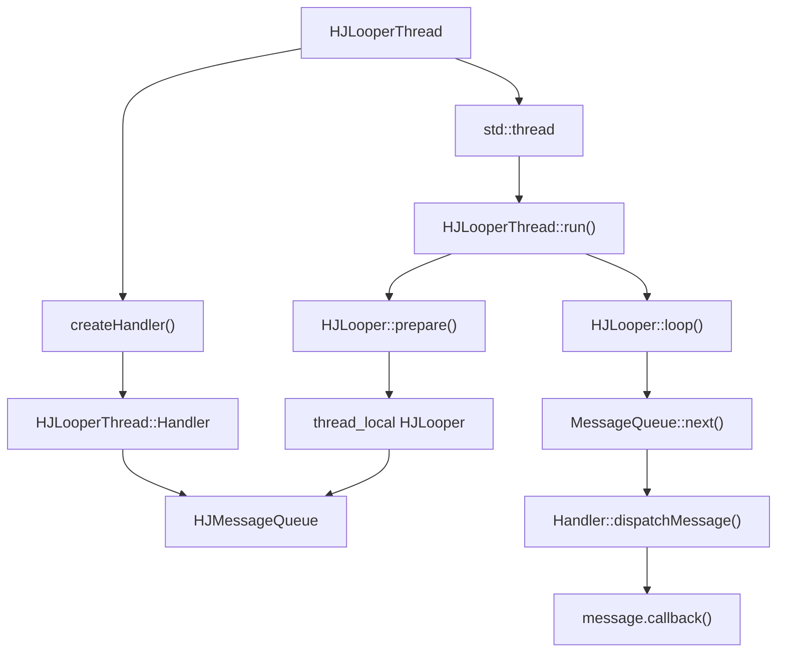
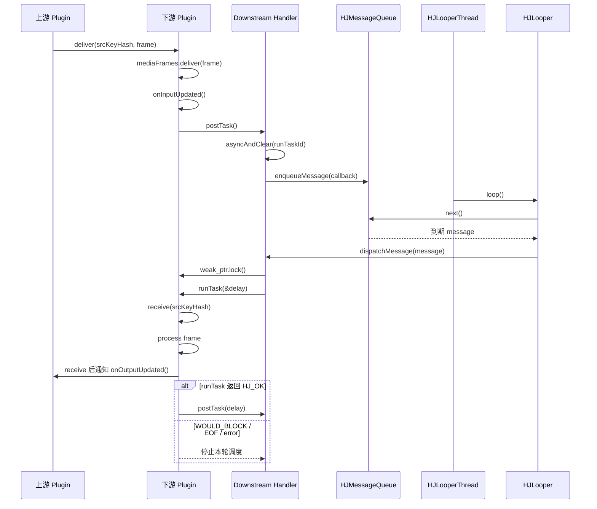

# HJLooperThread 实现说明：从线程循环到 Plugin 调度

本文用于单独理解 `HJLooperThread`：它怎么创建线程、怎么跑消息循环、`Handler` 如何投递任务，以及它在 `HJPlugin` 中如何驱动 `runTask()`。

对应源码：

- `src/utils/HJThread/HJLooperThread.h`
- `src/utils/HJThread/HJLooperThread.cpp`
- `src/utils/HJThread/HJLooper.h`
- `src/utils/HJThread/HJLooper.cpp`
- `src/utils/HJThread/HJHandler.h`
- `src/utils/HJThread/HJHandler.cpp`
- `src/utils/HJThread/HJMessageQueue.h`
- `src/utils/HJThread/HJMessageQueue.cpp`
- `src/plugins/HJPlugin.h`
- `src/plugins/HJPlugin.cpp`

## 1. 先建立直觉

可以先把 `HJLooperThread` 理解成 HJMedia 自己实现的一套简化版 Android Handler 线程模型：

```text
HJLooperThread
  = 一个 std::thread
  + 线程内唯一的 HJLooper
  + HJLooper 持有的 HJMessageQueue
  + 可对外创建 HJLooperThread::Handler
```

外部代码一般不直接操作 `HJLooper` 和 `HJMessageQueue`，而是拿到一个 `Handler`：

```cpp
auto thread = HJLooperThread::quickStart("audioThread");
auto handler = thread->createHandler();

handler->async([] {
    // 这段代码会在 audioThread 线程上执行
});
```

最短理解：

- `HJLooperThread` 负责启动和停止一条线程。
- `HJLooper` 负责在线程里不断取消息。
- `HJMessageQueue` 负责按时间顺序保存消息。
- `HJHandler` 负责把 lambda 包装成消息并投递到队列。
- `HJPlugin` 用 `Handler` 把自己的 `runTask()` 串行调度到目标线程。

## 2. 为什么需要它

媒体链路里很多事情不能在调用方线程直接做：

- 解复用、解码、重采样、渲染可能耗时。
- 同一个插件内部状态需要串行访问，避免多线程重入。
- `seek()`、`flush()`、`done()` 这类控制动作要和旧任务有确定顺序。
- 某些任务需要延迟调度，例如等待下游队列腾空间后再跑。

所以 HJMedia 不让上游 `deliver()` 直接同步调用下游 `runTask()`，而是：

```text
上游 deliver(frame)
  -> 下游输入队列入队
  -> 下游 postTask()
  -> Handler 把 runTask 消息投递到 HJLooperThread
  -> LooperThread 稍后串行执行 runTask()
```

这就是 `HJLooperThread` 在 plugin 系统里的核心价值：让插件业务在指定线程上异步、串行、可取消地执行。

## 3. 关键类关系



核心关系是：

1. 每个 `HJLooperThread` 启动一条 `std::thread`。
2. 这条线程内部调用 `HJLooper::prepare()` 创建 `thread_local` 的 `HJLooper`。
3. `HJLooper` 内部持有一个 `HJMessageQueue`。
4. `createHandler()` 会把这个 `HJLooper` 绑定到 `Handler`。
5. 之后所有 `handler->async(...)` 都会把任务投递到这个 `HJLooper` 的队列里。

## 4. HJLooperThread 如何启动

常用入口是：

```cpp
auto thread = HJLooperThread::quickStart(name);
```

源码逻辑：

```cpp
HJLooperThread::Ptr HJLooperThread::quickStart(const std::string& name, size_t identify)
{
    auto thread = std::make_shared<HJLooperThread>(name, identify);
    int ret = thread->init();
    if (ret != HJ_OK) {
        return nullptr;
    }

    return thread;
}
```

`quickStart()` 只是一个便捷封装，真正启动发生在 `internalInit()`：

```cpp
int HJLooperThread::internalInit(HJKeyStorage::Ptr i_param)
{
    int ret = HJSyncObject::internalInit(i_param);
    if (ret != HJ_OK) {
        return ret;
    }
    if (m_quitting.load()) {
        return HJErrAlreadyDone;
    }

    m_thread = std::thread([](HJLooperThread* thread) {
        gThreadId = gThreadCount.fetch_add(1);
        thread->run();
    }, this);

    return HJ_OK;
}
```

这里有两个重点：

- `gThreadId` 是 `thread_local`，每条 `HJLooperThread` 线程都有自己的 id。
- 新线程真正执行的是 `thread->run()`。

## 5. run() 做了什么

`HJLooperThread::run()` 是线程入口：

```cpp
void HJLooperThread::run()
{
    HJLooper::prepare();

    int ret = SYNC_PROD_LOCK([this] {
        CHECK_DONE_STATUS(HJErrAlreadyDone);
        m_looper = HJLooper::myLooper();
        return HJ_OK;
    });
    if (ret < 0) {
        return;
    }

    HJLooper::loop();
}
```

按顺序看：

1. `HJLooper::prepare()`：为当前线程创建一个 looper。
2. `m_looper = HJLooper::myLooper()`：把当前线程的 looper 保存到 `HJLooperThread` 对象里。
3. `HJLooper::loop()`：进入无限消息循环。

也就是说，`HJLooperThread` 启动后并不是执行某个固定业务函数，而是一直等待队列里的消息。业务逻辑来自别人投递进来的 callback。

## 6. HJLooper::prepare()

`HJLooper` 使用 `thread_local` 保存当前线程自己的 looper：

```cpp
static thread_local HJLooper::Ptr sThreadLocal{};
```

`prepare()` 的关键逻辑：

```cpp
void HJLooper::prepare()
{
    if (HJLooperThread::currentThread() < 0) {
        throw std::runtime_error("Only on HJLooperThread can Looper be created");
    }
    if (sThreadLocal != nullptr) {
        throw std::runtime_error("Only one Looper may be created per thread");
    }
    sThreadLocal = std::make_shared<HJLooper>();
}
```

这说明：

- 普通线程不能随便创建 `HJLooper`，必须是 `HJLooperThread` 启动出来的线程。
- 一条线程只能有一个 `HJLooper`。
- `HJLooper::myLooper()` 取到的是当前线程自己的 looper，不是全局单例。

## 7. HJLooper::loop()

`loop()` 是消息循环：

```cpp
void HJLooper::loop()
{
    const auto me = myLooper();
    if (me == nullptr) {
        throw std::runtime_error("No Looper");
    }

    for (;;) {
        if (!loopOnce(me)) {
            return;
        }
    }
}
```

每次 `loopOnce()` 做三件事：

```cpp
bool HJLooper::loopOnce(const Ptr me)
{
    auto msg = me->mQueue->next(); // might block
    if (msg == nullptr) {
        return false;
    }

    auto target = msg->target.lock();
    if (target == nullptr) {
        return true;
    }

    target->dispatchMessage(msg);
    msg->recycleUnchecked();
    return true;
}
```

解释：

1. `mQueue->next()` 从消息队列取下一条到期消息；如果没有消息，会阻塞等待。
2. 消息的 `target` 是一个 weak handler；handler 还活着才分发。
3. `dispatchMessage()` 执行 callback。
4. 执行完后回收消息。

因此，一条 `HJLooperThread` 上的任务天然是串行的：同一时间只会从队列取出一条消息并执行。

## 8. HJMessageQueue 如何保存消息

`HJMessageQueue` 里核心字段是：

```cpp
HJMessage::Ptr mMessages{};
```

它不是 `std::queue`，而是一个按 `when` 时间排序的单链表。每个 `HJMessage` 里有：

```cpp
int what;
uint64_t when;
HJHandlerWtr target;
HJRunnable callback;
HJMessage::Ptr next;
```

投递消息时：

```cpp
bool HJMessageQueue::enqueueMessage(HJMessage::Ptr msg, uint64_t when)
{
    msg->when = when;

    if (mMessages == nullptr || when == 0 || when < mMessages->when) {
        msg->next = mMessages;
        mMessages = msg;
    } else {
        // 按 when 插入到链表中间
    }

    if (needWake) {
        nativeWake(mPtr);
    }
}
```

取消息时：

```cpp
HJMessage::Ptr HJMessageQueue::next()
{
    for (;;) {
        nativePollOnce(ptr, nextPollTimeoutMillis);

        const uint64_t now = HJCurrentSteadyMS();
        HJMessage::Ptr msg = mMessages;
        if (msg != nullptr) {
            if (now < msg->when) {
                nextPollTimeoutMillis = msg->when - now;
            } else {
                mMessages = msg->next;
                msg->next = nullptr;
                return msg;
            }
        } else {
            nextPollTimeoutMillis = -1;
        }

        if (mQuitting) {
            dispose();
            return nullptr;
        }
    }
}
```

关键点：

- 消息按执行时间 `when` 排序。
- 没有到期消息时，线程阻塞等待。
- 有新消息插到队头时，会 `nativeWake()` 唤醒线程。
- `quit(false)` 会清空消息并唤醒队列，让 `next()` 返回 `nullptr`，从而退出 `loop()`。

## 9. HJHandler 做了什么

`HJHandler` 是投递任务的入口。

### 9.1 异步投递

```cpp
bool HJHandler::postDelayed(HJRunnable r, int what, uint64_t delayMillis)
{
    return sendMessageDelayed(getPostMessage(r)->setWhat(what), delayMillis);
}
```

`getPostMessage(r)` 把 lambda 放进 `HJMessage::callback`：

```cpp
HJMessage::Ptr HJHandler::getPostMessage(HJRunnable r)
{
    auto m = HJMessage::obtain();
    m->callback = r;
    return m;
}
```

然后：

```cpp
bool HJHandler::enqueueMessage(HJMessageQueue::Ptr queue, HJMessage::Ptr msg, uint64_t uptimeMillis)
{
    msg->target = SHARED_FROM_THIS;
    return queue->enqueueMessage(msg, uptimeMillis);
}
```

所以 handler 投递任务的本质是：

```text
lambda
  -> HJMessage.callback
  -> HJMessage.target = 当前 Handler
  -> HJMessageQueue 按 when 排序入队
```

### 9.2 dispatchMessage()

消息被 looper 取出后，会走：

```cpp
void HJHandler::dispatchMessage(HJMessage::Ptr msg)
{
    if (msg->callback != nullptr) {
        msg->callback();
    }
    else {
        handleMessage(msg);
    }
}
```

HJMedia 里 plugin 大量使用 callback lambda，因此通常是直接执行 `msg->callback()`。

### 9.3 同步执行 runWithScissors()

`sync()` 最终会调用：

```cpp
int HJHandler::runWithScissors(Run r, uint64_t timeout)
```

逻辑是：

- 如果当前已经在目标 looper 线程上，直接执行 `r()`。
- 否则把任务投递到目标线程，然后当前线程等待任务完成。

这适合需要“调用返回时状态已经更新”的控制动作，但要注意不能从 looper 自己的线程里做会互相等待的同步调用。

## 10. HJLooperThread::Handler 增强了什么

`HJLooperThread::Handler` 继承 `HJHandler`，加了更贴近业务的封装：

```cpp
bool async(HJRunnable task, int id = 0, uint64_t delayMillis = 0);
bool asyncAndClear(HJRunnable task, int id = 1, uint64_t delayMillis = 0);
int sync(Run task);
bool runOrAsync(HJRunnable task, int id = 0);
int runOrSync(Run task);
int genMsgId();
```

最关键的是 `asyncAndClear()`：

```cpp
bool HJLooperThread::Handler::asyncAndClear(HJRunnable task, int id, uint64_t delayMillis)
{
    removeMessages(id);
    if (task) {
        return postDelayed(task, id, delayMillis);
    }
    return true;
}
```

含义是：

```text
先删掉队列里同 id 的旧任务
再投递一个新任务
```

这对 plugin 很重要，因为同一个插件可能连续收到很多 `deliver()` 或 `onOutputUpdated()`，如果每次都排一个 `runTask()`，任务队列会堆积。`asyncAndClear()` 能保证同一个 plugin 的同类调度消息最多保留一个。

## 11. Plugin 初始化时如何拿到 Handler

`HJPlugin::internalInit()` 支持两个参数：

```cpp
HJLooperThread::Ptr thread = nullptr;
bool createThread = false;
```

源码逻辑：

```cpp
GET_PARAMETER(HJLooperThread::Ptr, thread);
GET_PARAMETER(bool, createThread);

if (thread == nullptr && createThread) {
    m_thread = HJLooperThread::quickStart(getName());
    thread = m_thread;
}

if (thread != nullptr) {
    m_handler = thread->createHandler();
    m_runTaskId = m_handler->genMsgId();
}
```

分两种情况：

### 11.1 Graph 提供共享线程

例如 `HJGraphMusicPlayer` 会创建：

```cpp
m_audioThread = HJLooperThread::quickStart("audioThread_x");
m_renderThread = HJLooperThread::quickStart("renderThread_x");
```

然后插件初始化参数里传入：

```cpp
(*param)["thread"] = m_audioThread;
```

此时多个音频插件可以共享同一条 audio looper thread。

### 11.2 Plugin 自己创建线程

很多插件派生类会写：

```cpp
GET_PARAMETER(HJLooperThread::Ptr, thread);
(*param)["createThread"] = (thread == nullptr);
return HJPlugin::internalInit(param);
```

含义是：

- 如果 graph 已经传入共享线程，就用共享线程。
- 如果没传线程，就让 plugin 自己创建私有 `HJLooperThread`。

## 12. Plugin 的 postTask() 如何调度 runTask()

`HJPlugin::postTask()` 是 plugin 接入 `HJLooperThread` 的核心：

```cpp
void HJPlugin::postTask(int64_t i_delay)
{
    auto [handler, runTaskId] = m_handlerSync.consLock([this] {
        return std::make_tuple(m_handler, m_runTaskId);
    });

    if (handler != nullptr) {
        Wtr wPlugin = SHARED_FROM_THIS;
        handler->asyncAndClear([wPlugin] {
            auto plugin = wPlugin.lock();
            if (plugin) {
                int64_t delay = 0;
                if (plugin->runTask(&delay) == HJ_OK) {
                    plugin->postTask(delay);
                }
            }
        }, runTaskId, i_delay);
    }
}
```

这里有几个关键设计：

### 12.1 使用 weak_ptr 防止旧任务访问已释放插件

```cpp
Wtr wPlugin = SHARED_FROM_THIS;
```

lambda 执行时再：

```cpp
auto plugin = wPlugin.lock();
if (plugin) {
    ...
}
```

如果 plugin 已经释放，旧消息不会访问野指针。

### 12.2 使用 asyncAndClear 防止 runTask 消息堆积

```cpp
handler->asyncAndClear(..., runTaskId, i_delay);
```

同一个 plugin 的 `runTaskId` 是初始化时生成的：

```cpp
m_runTaskId = m_handler->genMsgId();
```

所以同一个插件重复 `postTask()` 时，会先清掉旧的同 id 调度消息，再放新的。

### 12.3 runTask 返回 HJ_OK 会继续自调度

```cpp
if (plugin->runTask(&delay) == HJ_OK) {
    plugin->postTask(delay);
}
```

这不是递归调用。`postTask(delay)` 会重新投递一条消息到队列里，等 looper 下一轮再执行。

可以理解为：

```text
runTask 处理一小步
  -> 如果还能继续处理，返回 HJ_OK
  -> postTask(delay) 再安排下一小步
  -> 如果没数据/下游满/EOF/错误，返回非 HJ_OK，停止本轮自循环
```

## 13. Plugin 什么时候触发 postTask()

`HJPlugin` 里有多个入口会触发 `postTask()`：

```cpp
void HJPlugin::afterInit()
{
    postTask();
}

int HJPlugin::deliver(...)
{
    input->mediaFrames.deliver(frame);
    onInputUpdated();
}

void HJPlugin::onInputUpdated()
{
    postTask();
}

void HJPlugin::onOutputUpdated()
{
    postTask();
}

int HJPlugin::flush(...)
{
    input->mediaFrames.flush(true);
    onInputUpdated();
}
```

实际链路是：

```text
初始化完成
  -> afterInit()
  -> postTask()

收到上游帧
  -> deliver()
  -> 输入队列入队
  -> onInputUpdated()
  -> postTask()

下游消费了一帧，腾出空间
  -> receive()
  -> upstream.onOutputUpdated()
  -> upstream.postTask()

flush
  -> 清输入队列并插入 clear frame
  -> onInputUpdated()
  -> postTask()
```

## 14. 一帧数据在 Plugin + LooperThread 中的流动



这个图能解释一个关键点：`deliver()` 和 `runTask()` 通常不在同一个调用栈里。`deliver()` 只是把帧放进下游队列，并触发调度；真正处理发生在下游绑定的 looper 线程上。

## 15. 为什么 receive() 会通知上游

`HJPlugin::receive()` 里有一段：

```cpp
auto plugin = input->plugin.lock();
if (plugin) {
    plugin->onOutputUpdated();
}
```

意思是：当前插件从输入队列消费了一帧，说明它给上游腾出了空间，于是通知上游“你可以继续尝试生产/投递了”。

这和反压模型有关：

```text
下游队列满
  -> 上游 runTask 可能返回 WOULD_BLOCK
  -> 下游消费一帧
  -> receive() 通知上游 onOutputUpdated()
  -> 上游 postTask()
  -> 上游再次尝试 deliver
```

所以 `HJLooperThread` 不只是做异步执行，它也支撑了插件链路里的“生产者/消费者唤醒”。

## 16. Graph 中如何使用 HJLooperThread

以播放器为例，Graph 通常会创建几类线程：

```text
Graph 控制线程：处理 open / seek / close 等控制任务
audioThread：处理 demux/audio decode/resample/render 等音频任务
renderThread：处理视频渲染或视频相关任务
```

例如 `HJGraphMusicPlayer` 有：

```cpp
HJLooperThread::Ptr m_audioThread{};
HJLooperThread::Ptr m_renderThread{};
HJLooperThread::Handler::Ptr m_handler{};
HJLooperThread::Ptr m_thread{};
```

初始化时：

```cpp
m_thread = HJLooperThread::quickStart(getName());
m_handler = m_thread->createHandler();

m_renderThread = HJLooperThread::quickStart("renderThread_x");
m_audioThread = HJLooperThread::quickStart("audioThread_x");
```

Graph 自己的 `m_handler` 用来串行处理控制请求，比如 seek：

```cpp
m_handler->asyncAndClear([wDemuxer, i_timestamp] {
    auto demuxer = wDemuxer.lock();
    if (demuxer) {
        demuxer->seek(i_timestamp);
    }
}, ...);
```

Plugin 则通过初始化参数拿到对应的 audio/render thread，然后在自己的 `postTask()` 里调度 `runTask()`。

## 17. async / asyncAndClear / sync / runOrAsync 的区别

| 方法 | 行为 | 典型用途 |
|---|---|---|
| `async(task, id, delay)` | 直接投递一条异步任务 | 普通异步执行 |
| `asyncAndClear(task, id, delay)` | 先删除同 id 旧任务，再投递新任务 | plugin `runTask()`、seek 这类只保留最新任务的场景 |
| `sync(task)` | 投递到目标线程并等待完成 | 控制动作需要返回前完成 |
| `runOrAsync(task)` | 如果已在目标线程就直接跑，否则异步投递 | 避免同线程无意义排队 |
| `runOrSync(task)` | 如果已在目标线程就直接跑，否则同步等待 | 同步控制逻辑，且避免自线程死等 |

最常见的是 `asyncAndClear()`，因为 plugin 调度非常容易被频繁触发。

## 18. 关闭流程

`HJLooperThread::~HJLooperThread()` 会调用：

```cpp
done();
```

`beforeDone()`：

```cpp
int HJLooperThread::beforeDone()
{
    m_quitting.store(true);

    auto looper = getLooper();
    if (looper != nullptr) {
        if (looper->isCurrentThread()) {
            return HJErrNotSupport;
        }
        looper->quit();
    }

    return HJSyncObject::beforeDone();
}
```

然后 `internalRelease()`：

```cpp
void HJLooperThread::internalRelease()
{
    if (m_thread.joinable()) {
        m_thread.join();
    }

    HJSyncObject::internalRelease();
}
```

关闭顺序是：

```text
done()
  -> beforeDone()
    -> m_quitting = true
    -> looper->quit()
      -> queue.quit(false)
      -> 清空消息并唤醒队列
  -> HJLooper::loop() 退出
  -> internalRelease()
    -> join std::thread
```

注意：如果在 looper 自己的线程里调用 `done()`，`beforeDone()` 会返回 `HJErrNotSupport`，避免自己 join 自己或破坏当前消息循环。

## 19. 常见误区

### 误区 1：postTask() 会立刻执行 runTask()

不一定。`postTask()` 只是投递消息。真正执行发生在目标 `HJLooperThread` 下一次从队列取到这条消息时。

### 误区 2：runTask() 返回 HJ_OK 是最终成功

在 plugin 调度里，`HJ_OK` 更像是“这一轮推进了一步，还可以继续调度”。所以 `postTask()` 看到 `HJ_OK` 会继续投递下一轮。

### 误区 3：asyncAndClear 会取消正在执行的任务

不会。它只能删除队列里还没执行的同 id 消息。已经被 looper 取出、正在执行的 callback 不能被取消。

### 误区 4：Handler 持有 Plugin，能保证 Plugin 不释放

不是。plugin 的 `postTask()` 特意捕获 `weak_ptr`，执行时再 `lock()`。这说明旧任务不能延长 plugin 生命周期，plugin 释放后旧任务会自动跳过。

### 误区 5：一个 Plugin 一定有自己的线程

不一定。插件可能复用 graph 传入的共享线程，也可能在没有传线程时通过 `createThread=true` 自建线程，还有少数插件会直接禁用或重写调度方式。

## 20. 从浅到深的阅读路线

如果你要重新读源码，建议按这个顺序：

1. `HJLooperThread::quickStart()`：看线程如何被创建。
2. `HJLooperThread::run()`：看线程启动后怎么创建 looper 并进入循环。
3. `HJLooper::loop()` / `loopOnce()`：看消息如何被取出和分发。
4. `HJHandler::postDelayed()` / `dispatchMessage()`：看 lambda 如何变成消息并执行。
5. `HJMessageQueue::enqueueMessage()` / `next()`：看延迟消息和阻塞等待。
6. `HJPlugin::internalInit()`：看 plugin 如何拿到 handler。
7. `HJPlugin::postTask()`：看 plugin 如何调度 `runTask()`。
8. 某个具体插件的 `runTask()`，比如 `HJPluginAudioFFDecoder::runTask()` 或 `HJPluginAVDropping::runTask()`。

## 21. 面试表达

问：`HJLooperThread` 在 HJMedia 中解决了什么问题？

答：它提供了一套 Handler/Looper 风格的异步串行调度模型。每个 `HJLooperThread` 内部启动一条 `std::thread`，在线程里创建 `HJLooper` 和 `HJMessageQueue`，外部通过 `Handler` 把任务投递进去。插件收到帧后不会直接同步处理，而是通过 `postTask()` 把 `runTask()` 投递到绑定的 looper 线程，保证插件内部状态在同一线程串行推进，同时支持延迟调度、清理旧任务和 close 后 weak_ptr 跳过旧回调。

问：为什么 plugin 使用 `asyncAndClear()` 调度 `runTask()`？

答：因为 `deliver()`、`flush()`、`onOutputUpdated()` 都可能频繁触发 `postTask()`。如果每次都排一个消息，队列会堆积大量重复的 `runTask()`。`asyncAndClear()` 会先删除同 id 的旧消息，再投递新消息，保证同一个 plugin 的待执行调度任务最多保留一个，从而降低无意义唤醒和旧任务干扰。

问：`deliver()` 和 `runTask()` 是什么关系？

答：`deliver()` 是上游把帧写入下游输入队列的入口，它通常运行在调用方线程；`runTask()` 是下游插件真正消费队列和处理业务的入口，它通过 `Handler` 运行在插件绑定的 `HJLooperThread` 上。两者之间通过输入队列和 `postTask()` 解耦。

## 22. 一句话总结

`HJLooperThread` 是 HJMedia 插件系统的线程调度底座：它把“收到帧”与“处理帧”拆开，让插件通过队列交接数据，通过 handler 串行执行 `runTask()`，并用 `asyncAndClear`、`weak_ptr`、`quit/join` 处理重复调度、生命周期和线程退出问题。
