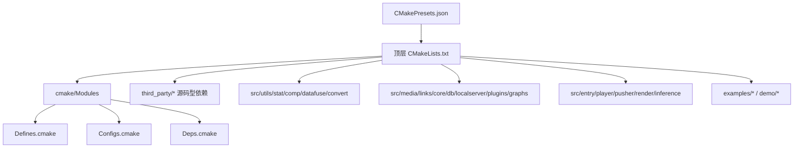
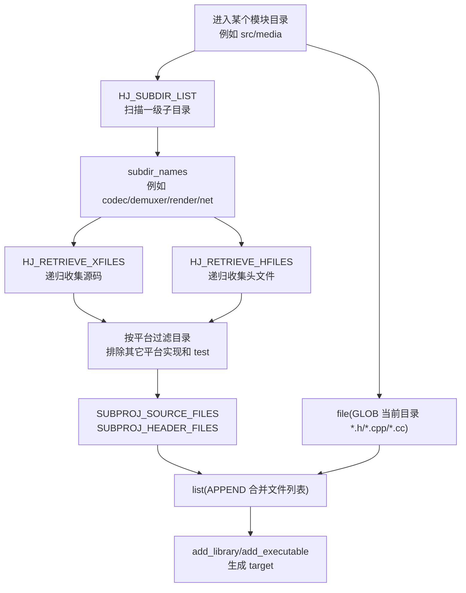
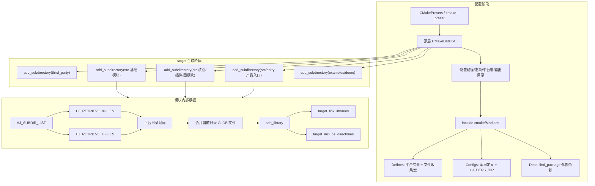

# HJMedia CMake 架构学习笔记

## 1. 总体结论

HJMedia 的 CMake 架构是一个典型的“顶层统一配置 + 子目录模块化 target + 通用宏收集源码”的结构。

核心链路：

```text
CMakePresets.json
  -> 顶层 CMakeLists.txt
    -> 设置全局路径、平台宏、编译选项、输出目录
    -> include(cmake/Modules/*.cmake)
    -> add_subdirectory(third_party/*)
    -> add_subdirectory(src/*)
    -> add_subdirectory(src/entry/*)
    -> add_subdirectory(examples/* / demo/*)
```

大多数 `src/*/CMakeLists.txt` 都复用同一套模板：

```text
set(PROJ_NAME xxx)
  -> include_directories(...)
  -> set(xxx_INCLUDE_DIRS ...)
  -> HJ_SUBDIR_LIST(...)
  -> HJ_RETRIEVE_XFILES(...)
  -> HJ_RETRIEVE_HFILES(...)
  -> file(GLOB 当前目录源码和头文件)
  -> list(APPEND 子目录源码和头文件)
  -> MAKE_COMMON_CONFIG()
  -> add_library(...)
  -> target_link_libraries(...)
  -> target_include_directories(... INTERFACE ...)
  -> HJ_CONFIG_FRAMEWORK(...)
  -> set_target_properties(... 输出目录 ...)
  -> ProjFolder(... IDE 分组 ...)
```

## 2. 顶层 CMake 入口

顶层入口是 `CMakeLists.txt`，它负责决定整个工程“怎么构建”和“构建哪些模块”。

### 2.1 基础信息和选项

```cmake
cmake_minimum_required(VERSION 3.15.0)
project(HJMedia)

option(HJ_ENABLE_TNN "Enable TNN support" ON/OFF)
option(HJ_ENABLE_RENDER_PRIO "Enable Render Prio support" OFF)
```

含义：

| 配置 | 职责 |
|---|---|
| `project(HJMedia)` | 定义工程名 |
| `HJ_ENABLE_TNN` | 是否启用 TNN 推理支持，Windows 默认 ON，其它平台默认 OFF |
| `HJ_ENABLE_RENDER_PRIO` | 是否启用 Prio 渲染管线 |

### 2.2 全局路径

```cmake
set(HJ_ROOT_PATH ${CMAKE_SOURCE_DIR})
set(HJ_EXTERNALS_PATH ${HJ_ROOT_PATH}/externals)
set(HJ_THIRDPARTY_PATH ${HJ_ROOT_PATH}/third_party)
set(HJ_OUT_PATH ${PROJECT_BINARY_DIR}/out/libs)
set(CMAKE_MODULE_PATH ${HJ_ROOT_PATH}/cmake ${HJ_ROOT_PATH}/cmake/Modules/)
```

这些路径是后续所有模块 CMake 的基础：

| 变量 | 含义 |
|---|---|
| `HJ_ROOT_PATH` | 仓库根目录 |
| `HJ_EXTERNALS_PATH` | 预编译/平台外部依赖目录，即 `externals` |
| `HJ_THIRDPARTY_PATH` | 源码型三方库目录，即 `third_party` |
| `HJ_OUT_PATH` | 统一产物输出目录 |
| `CMAKE_MODULE_PATH` | `find_package` 和自定义 CMake 模块搜索路径 |

### 2.3 引入通用 CMake 模块

```cmake
include(UtilsMacros)
include(UtilsHelp)
include(CopyUtils)
include(BuildSets)
include(warnings)
```

其中最关键的是 `BuildSets`。它继续引入：

```cmake
include(Defines)
include(Configs)
include(Deps)
```

作用拆开看：

| 文件 | 主要职责 |
|---|---|
| `cmake/Modules/UtilsMacros.cmake` | 设置平台库名前缀/后缀、系统和 CPU 标识 |
| `cmake/Modules/UtilsHelp.cmake` | 提供 `ProjFolder` 等辅助函数 |
| `cmake/Modules/BuildSets.cmake` | 聚合 `Defines`、`Configs`、`Deps` |
| `cmake/Modules/Defines.cmake` | 设置平台变量，定义源码收集宏、Framework 配置宏、通用编译配置宏 |
| `cmake/Modules/Configs.cmake` | 设置全局编译定义和依赖根目录 |
| `cmake/Modules/Deps.cmake` | 通过 `find_package` 查找 externals/third_party 依赖 |

## 3. 平台分支

顶层 CMake 会按平台设置宏、编译选项和系统变量。

```text
Windows   -> WIN32_LIB, C++17, /Zi, WorkDirResource
Android   -> ANDROID_LIB, -fPIC, C++17, Android ABI
iOS       -> IOS_LIB, Xcode 属性, Apple Framework 相关设置
macOS     -> MACOS_LIB, -fPIC, Xcode 属性, WorkDirResource
Linux     -> LINUX_LIB, -fPIC, C++17
HarmonyOS -> Harmony_LIB, C++17, arm64-v8a, OHOS/Harmony 相关设置
```

`Defines.cmake` 还会设置更细的跨平台变量：

| 平台 | 平台变量 | 平台目录 |
|---|---|---|
| Windows | `WINDOWS` | `wsys` / `windows` |
| Android | `ANDROID` | `asys` / `android` |
| iOS | `IOS` | `isys` / `ios` |
| macOS | `MACOSX` | `msys` / `mac` |
| Linux | `LINUX` | `lsys` / `linux` |
| HarmonyOS | `HarmonyOS` | `harmony` |

这些变量后面会影响：

- 哪些子目录源码会被收集
- 哪些 include 目录会暴露
- 哪些系统库会被链接
- 哪些 entry/demo 会参与构建

## 4. 顶层模块组织图

### 4.1 构建入口图



### 4.2 主要 add_subdirectory 顺序

简化后的顶层顺序：

```text
third_party/yyjson

src/utils
src/stat
src/comp
src/datafuse
src/convert

third_party/sonic
third_party/soundtouch
third_party/librtmp
third_party/fdk-aac
third_party/zlib
third_party/lz4
third_party/sqlite

Windows/macOS:
  third_party/glfw
  third_party/imgui
  third_party/implot
  third_party/imgui-node-editor
  third_party/ImFileDialog
  third_party/ImGuiFileDialog

src/media
src/links
src/core
src/db
src/localserver
src/plugins
src/graphs

src/entry/player
src/entry/pusher
src/entry/render
src/entry/inference
src/detect
HarmonyOS:
  src/entry/inferenceRender

Windows:
  src/platform
  examples/windows/*
  demo/faceu/pc/HJFaceuUI

Windows/macOS:
  src/gui
  examples/windows/XMediaTools
  examples/windows/XMediaTest
  examples/windows/HJMediaGraphicUI

iOS:
  examples/ios/HJMediaUI
  examples/ios/HJPlayerDemo
```

注意：这不是纯粹的“从底层到高层”顺序。比如 `src/plugins` 和 `src/graphs` 之间存在互相链接的情况，CMake 允许 target 后续再解析依赖；真正的最终链接发生在 entry 或 demo target 上。

## 5. 模块 target 模板

以 `src/graphs/CMakeLists.txt` 为例：

```cmake
set(PROJ_NAME HJGraphs)

include_directories(${CMAKE_CURRENT_SOURCE_DIR})
include_directories(${CMAKE_CURRENT_SOURCE_DIR}/include)

HJ_SUBDIR_LIST(subdir_names ${CMAKE_CURRENT_SOURCE_DIR})
HJ_RETRIEVE_XFILES(SUBPROJ_SOURCE_FILES ${subdir_names})
HJ_RETRIEVE_HFILES(SUBPROJ_HEADER_FILES ${subdir_names})

file(GLOB HEADER_FILES "${CMAKE_CURRENT_SOURCE_DIR}/*.h")
file(GLOB SOURCE_FILES "${CMAKE_CURRENT_SOURCE_DIR}/*.cc" "${CMAKE_CURRENT_SOURCE_DIR}/*.cpp")
list(APPEND HEADER_FILES ${SUBPROJ_HEADER_FILES})
list(APPEND SOURCE_FILES ${SUBPROJ_SOURCE_FILES})

MAKE_COMMON_CONFIG()

add_library(${PROJ_NAME} STATIC ${SOURCE_FILES} ${HEADER_FILES})

target_link_libraries(${PROJ_NAME} PRIVATE ...)
target_include_directories(${PROJ_NAME} INTERFACE ${${PROJ_NAME}_INCLUDE_DIRS})

HJ_CONFIG_FRAMEWORK(${PROJ_NAME})

set_target_properties(${PROJ_NAME} PROPERTIES
    ARCHIVE_OUTPUT_DIRECTORY ${ARCHIVE_output}
    LIBRARY_OUTPUT_DIRECTORY ${library_output}
    RUNTIME_OUTPUT_DIRECTORY ${runtime_output})

ProjFolder(${PROJ_NAME} "src")
```

这个模板在 `src/utils`、`src/media`、`src/plugins`、`src/core`、`src/db`、`src/localserver`、`src/graphs` 等模块里反复出现。

## 6. 头文件和源码是如何被收集的

这是这个项目 CMake 的重点。

### 6.1 总流程图



### 6.2 第一步：扫描一级子目录

宏定义：

```cmake
MACRO(HJ_SUBDIR_LIST result curdir)
  FILE(GLOB children RELATIVE ${curdir} ${curdir}/*)
  SET(dirlist "")
  FOREACH(child ${children})
    IF(IS_DIRECTORY ${curdir}/${child})
      LIST(APPEND dirlist ${child})
    ENDIF()
  ENDFOREACH()
  SET(${result} ${dirlist})
ENDMACRO()
```

作用：

```text
输入：当前模块目录
输出：当前模块下的一级子目录名列表
```

例子：

```text
src/media
  -> capture
  -> codec
  -> com
  -> datasource
  -> demuxer
  -> io
  -> muxer
  -> net
  -> render
  -> sei
```

调用后：

```text
subdir_names = capture codec com datasource demuxer io muxer net render sei
```

### 6.3 第二步：递归收集源码

函数：

```cmake
function(HJ_RETRIEVE_XFILES out_files)
    file(GLOB_RECURSE files RELATIVE ${CMAKE_CURRENT_SOURCE_DIR}
        "${dirname}/*.cmake"
        "${dirname}/*.hpp"
        "${dirname}/*.c"
        "${dirname}/*.cpp"
        "${dirname}/*.cc"
        "${dirname}/*.m"
        "${dirname}/*.mm"
    )
    ...
endfunction()
```

它收集的文件类型：

| 类型 | 说明 |
|---|---|
| `.c` | C 源码 |
| `.cpp` / `.cc` | C++ 源码 |
| `.m` | Objective-C 源码 |
| `.mm` | Objective-C++ 源码 |
| `.hpp` | 头文件，但这里被放进源码文件收集函数 |
| `.cmake` | CMake 文件，主要用于 IDE 分组显示 |

注意：`.hpp` 被放进 `HJ_RETRIEVE_XFILES`，`.h` 被放进 `HJ_RETRIEVE_HFILES`。这不是语义最干净的分法，但对 CMake target 来说问题不大，因为头文件加入 target 主要用于 IDE 展示，不会被当作源文件编译。

### 6.4 第三步：递归收集头文件

函数：

```cmake
function(HJ_RETRIEVE_HFILES out_files)
    file(GLOB_RECURSE files RELATIVE ${CMAKE_CURRENT_SOURCE_DIR}
        "${dirname}/*.h"
    )
    ...
endfunction()
```

它只收集 `.h`。

### 6.5 第四步：平台目录过滤

`HJ_RETRIEVE_XFILES` 和 `HJ_RETRIEVE_HFILES` 都会做同一套平台过滤。

核心逻辑：

```cmake
if(WIN32)
    HJ_CHECK_SUBSTR(invalid_dir ${filter_dir} "asys" "isys" "msys" "osys" "lsys" "hsys" "test")
elseif(IOS)
    HJ_CHECK_SUBSTR(invalid_dir ${filter_dir} "asys" "wsys" "msys" "lsys" "hsys" "test")
elseif(MACOSX)
    HJ_CHECK_SUBSTR(invalid_dir ${filter_dir} "asys" "isys" "wsys" "lsys" "hsys" "test")
elseif(ANDROID)
    HJ_CHECK_SUBSTR(invalid_dir ${filter_dir} "wsys" "isys" "msys" "osys" "lsys" "hsys" "test")
elseif(HarmonyOS)
    HJ_CHECK_SUBSTR(invalid_dir ${filter_dir} "asys" "wsys" "isys" "msys" "osys" "lsys" "test")
endif()
```

过滤表：

| 当前平台 | 会排除的目录关键字 |
|---|---|
| Windows | `asys`、`isys`、`msys`、`osys`、`lsys`、`hsys`、`test` |
| iOS | `asys`、`wsys`、`msys`、`lsys`、`hsys`、`test` |
| macOS | `asys`、`isys`、`wsys`、`lsys`、`hsys`、`test` |
| Android | `wsys`、`isys`、`msys`、`osys`、`lsys`、`hsys`、`test` |
| HarmonyOS | `asys`、`wsys`、`isys`、`msys`、`osys`、`lsys`、`test` |

因此，如果当前构建 HarmonyOS：

```text
src/plugins/hsys       会保留
src/plugins/asys       会排除
src/plugins/wsys       会排除
src/plugins/isys       会排除
src/plugins/test       会排除
```

如果当前构建 Windows：

```text
src/plugins/wsys       会保留
src/plugins/hsys       会排除
src/plugins/asys       会排除
src/plugins/isys       会排除
src/plugins/test       会排除
```

### 6.6 第五步：当前目录文件额外收集

每个模块还会单独收集当前目录下的顶层文件：

```cmake
file(GLOB HEADER_FILES "${CMAKE_CURRENT_SOURCE_DIR}/*.h")
file(GLOB SOURCE_FILES "${CMAKE_CURRENT_SOURCE_DIR}/*.cc" "${CMAKE_CURRENT_SOURCE_DIR}/*.cpp")
```

原因是 `HJ_SUBDIR_LIST` 只拿一级子目录，不包含当前目录本身。

所以需要两部分合并：

```text
当前目录 *.h/*.cpp/*.cc
  +
子目录递归收集到的文件
  =
最终 target 文件列表
```

合并语句：

```cmake
list(APPEND HEADER_FILES ${SUBPROJ_HEADER_FILES})
list(APPEND SOURCE_FILES ${SUBPROJ_SOURCE_FILES})
```

## 7. 文件收集的完整例子

以 `src/media` 为例，简化流程如下：

```text
src/media/CMakeLists.txt
  |
  |-- HJ_SUBDIR_LIST
  |     得到：
  |       capture codec com datasource demuxer io muxer net render sei
  |
  |-- HJ_RETRIEVE_XFILES
  |     在这些子目录中递归找：
  |       *.c *.cpp *.cc *.m *.mm *.hpp *.cmake
  |     并按平台过滤：
  |       asys/wsys/isys/hsys/msys/lsys/osys/test
  |
  |-- HJ_RETRIEVE_HFILES
  |     在这些子目录中递归找：
  |       *.h
  |     并按平台过滤
  |
  |-- file(GLOB 当前目录)
  |     找：
  |       src/media/*.h
  |       src/media/*.cpp
  |       src/media/*.cc
  |
  |-- list(APPEND)
  |     合并当前目录文件 + 子目录文件
  |
  |-- add_library(HJMedia STATIC ...)
```

图示：

```text
src/media
  HJMedia.cpp / HJMedia.h         <- file(GLOB 当前目录)
  codec/
    *.cpp / *.h                   <- HJ_RETRIEVE_XFILES/HFILES
    hsys/                         <- HarmonyOS 保留，其它平台多半排除
  capture/
    *.cpp / *.h
    hsys/
  render/
    *.cpp / *.h
    hsys/
  demuxer/
  muxer/
  net/
  io/
```

## 8. target 类型：STATIC 和 SHARED

项目里大致有两类 target。

### 8.1 中间模块多数是 STATIC

例如：

```cmake
add_library(HJUtils STATIC ...)
add_library(HJMedia STATIC ...)
add_library(HJPlugins STATIC ...)
add_library(HJGraphs STATIC ...)
```

这些模块是框架内部积木，最终会被 entry 或 demo 链接。

典型层次：

```text
HJUtils
HJStat
HJComp
HJDataFuse
HJMedia
HJCore
HJPlugins
HJGraphs
```

### 8.2 产品入口多数是 SHARED

例如 `src/entry/player/CMakeLists.txt`：

```cmake
set(PROJ_NAME HJMediaPlayer)
add_library(${PROJ_NAME} SHARED ${SOURCE_FILES} ${HEADER_FILES})
```

入口层需要生成给外部平台调用的动态库，例如：

```text
HJMediaPlayer
HJPusher
HJRender
HJInference
```

它们会链接大量内部静态库：

```text
HJMediaPlayer
  -> HJGraphs
  -> HJPlugins
  -> HJMedia
  -> HJComp
  -> HJUtils
  -> FFmpeg / fdk-aac / yyjson / spdlog / platform libs
```

## 9. include 目录传播机制

模块里通常有两种 include 写法。

### 9.1 编译当前模块用

```cmake
include_directories(${CMAKE_CURRENT_SOURCE_DIR})
include_directories(${CMAKE_CURRENT_SOURCE_DIR}/include)
```

这是目录级 include，会影响当前 CMakeLists 所在目录下的 target。

### 9.2 给依赖方使用

```cmake
set(${PROJ_NAME}_INCLUDE_DIRS ${CMAKE_CURRENT_SOURCE_DIR})
target_include_directories(${PROJ_NAME} INTERFACE ${${PROJ_NAME}_INCLUDE_DIRS})
```

`INTERFACE` 的意思是：

```text
当前 target 自己不靠这行编译
链接当前 target 的其它 target 会继承这些 include 目录
```

例如 `HJGraphs` 暴露 `src/graphs` 后，依赖它的 entry 层可以直接 include：

```cpp
#include "HJGraphMusicPlayer.h"
```

## 10. 依赖查找和链接

### 10.1 find_package 来源

顶层设置：

```cmake
set(CMAKE_MODULE_PATH ${HJ_ROOT_PATH}/cmake ${HJ_ROOT_PATH}/cmake/Modules/)
```

所以 `find_package(LIBFFMPEG REQUIRED)` 会去找：

```text
cmake/Modules/FindLibFFMPEG.cmake
```

依赖查找集中在 `cmake/Modules/Deps.cmake`：

```text
LIBSPDLOG
LIBMINICORO
LIBMINIAUDIO
LIBSTB
LIBCPPHTTPLIB
LIBREFLCPP
LIBYUV
LIBOPENSSL
LIBFFMPEG
LIBMBEDTLS
LIBSQLITEORM
LIBNCNN
LIBMINDSPORE
LIBX264
...
```

### 10.2 target_link_libraries

每个模块通过 `target_link_libraries` 声明依赖。

例如 `HJGraphs`：

```text
HJGraphs
  -> HJPlugins
  -> HJMedia
  -> HJDataFuse
  -> HJComp
  -> HJStat
  -> HJUtils
  -> LIBFFMPEG
  -> LIBSPDLOG
  -> yyjson
  -> LIBREFLCPP
  -> LIBMINIAUDIO
```

例如 `HJMediaPlayer`：

```text
HJMediaPlayer
  -> HJDataFuse
  -> HJMediaDBKit
  -> HJConvert
  -> HJLinks
  -> HJGraphs
  -> HJPlugins
  -> HJComp
  -> HJMedia
  -> HJStat
  -> HJUtils
  -> FFmpeg / fdk-aac / spdlog / minicro / platform frameworks
```

## 11. 输出目录

顶层统一设置：

```cmake
set(library_output ${HJ_OUT_PATH})
set(ARCHIVE_output ${HJ_OUT_PATH})
set(runtime_output ${HJ_OUT_PATH})
```

每个模块再设置：

```cmake
set_target_properties(${PROJ_NAME} PROPERTIES
    ARCHIVE_OUTPUT_DIRECTORY ${ARCHIVE_output}
    LIBRARY_OUTPUT_DIRECTORY ${library_output}
    RUNTIME_OUTPUT_DIRECTORY ${runtime_output})
```

三类输出：

| 属性 | 对应产物 |
|---|---|
| `ARCHIVE_OUTPUT_DIRECTORY` | 静态库 `.lib` / `.a` |
| `LIBRARY_OUTPUT_DIRECTORY` | 动态库 `.so` / `.dylib` |
| `RUNTIME_OUTPUT_DIRECTORY` | 可执行程序 / Windows `.dll` |

Windows 和 Android 下，`HJ_OUT_PATH` 会追加架构名：

```text
${PROJECT_BINARY_DIR}/out/libs/${ARCHS_NAME}
```

例如：

```text
build-windows-x64/out/libs/x64
build_harmony/out/libs
```

## 12. Apple Framework 处理

模块里常见：

```cmake
HJ_CONFIG_FRAMEWORK(${PROJ_NAME})
```

入口层可能使用：

```cmake
HJ_CONFIG_FRAMEWORK_EX(${PROJ_NAME})
```

这两个函数只在 `APPLE` 为真时生效，主要设置：

```text
FRAMEWORK TRUE
Info.plist
PUBLIC_HEADER
RESOURCE
INSTALL_NAME_DIR
OUTPUT_NAME
```

Windows、Android、HarmonyOS 下基本不会有实际效果。

## 13. IDE 分组

每个模块最后常见：

```cmake
ProjFolder(${PROJ_NAME} "src")
```

作用是给 Visual Studio / Xcode 这类 IDE 的 target 分组，不影响编译结果。

例如：

```text
src
  HJUtils
  HJMedia
  HJPlugins
  HJGraphs
```

## 14. 用一张图总结 CMake 架构



## 15. 学习时最重要的理解点

1. 顶层 `CMakeLists.txt` 决定平台、依赖、模块启用顺序。
2. `cmake/Modules/Defines.cmake` 是理解源码收集机制的关键文件。
3. 大多数 `src/*` 模块都通过同一套模板自动收集源码。
4. 平台目录不是靠每个模块手工排除，而是在 `HJ_RETRIEVE_XFILES/HFILES` 里统一过滤。
5. 当前目录源码和子目录源码是分两步收集再合并的。
6. 中间层大多编译成 `STATIC`，产品入口层通常编译成 `SHARED`。
7. `target_include_directories(... INTERFACE ...)` 决定其它模块能否方便 include 当前模块头文件。
8. `Deps.cmake` 和 `FindLIB*.cmake` 决定 externals 中的预编译依赖如何被找到。

## 16. 一句话复述

HJMedia 的 CMake 架构是：顶层 CMake 先根据平台设置全局变量和依赖，再通过 `add_subdirectory` 进入各模块；每个模块使用统一宏扫描子目录、按平台过滤源码、合并当前目录文件，最后生成静态库或动态库，并通过 `target_link_libraries` 串起整个多媒体框架。
