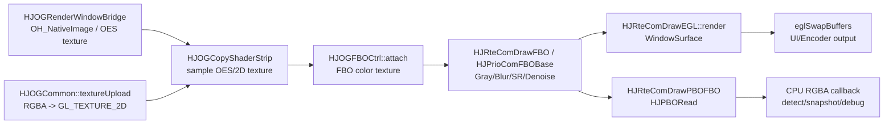
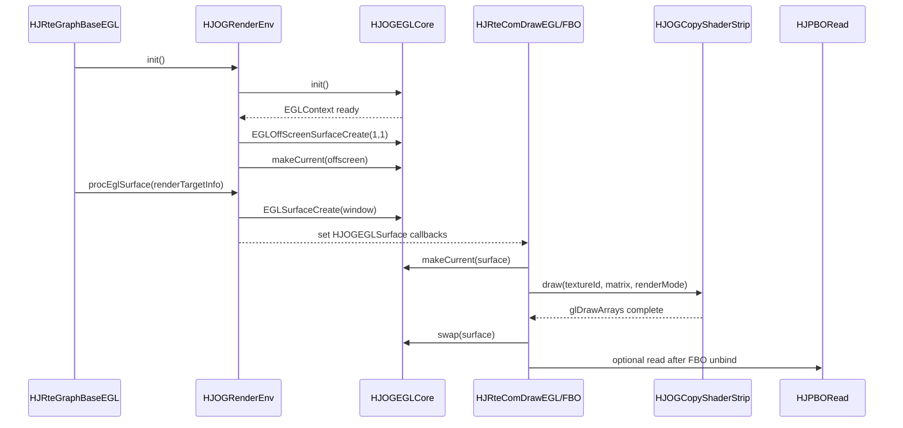

# HJMedia OpenGL API 项目实践笔记

## 今日阅读

- `study/opengl-api-project-practice-plan.md`
- `src/comp/graphic/hsys/HJOGEGLCore.cpp`
- `src/comp/graphic/hsys/HJOGRenderEnv.cpp`
- `src/comp/graphic/HJOGEGLSurface.cpp`
- `src/comp/graphic/HJOGCommon.cpp`
- `src/comp/graphic/HJOGShaderProgram.cpp`
- `src/comp/graphic/HJOGCopyShaderStrip.cpp`
- `src/comp/graphic/HJOGFBOCtrl.cpp`
- `src/comp/graphic/HJPBORead.cpp`
- `src/comp/graphic/HJPBOReadWrapper.cpp`
- `src/comp/utils/HJFBOCtrlPool.cpp`
- `src/comp/prio/HJPrioComFBOBase.cpp`
- `src/comp/prio/HJPrioComSourceSeries.cpp`
- `src/comp/rte/HJRteComDraw.cpp`
- `src/comp/rte/HJRteComDrawSRFilter.cpp`
- `src/comp/rte/HJRteComDrawDenoiseFilter.cpp`

## 核心结论

HJMedia 使用 OpenGL 的重点不是通用 3D 渲染，而是移动端视频渲染和 GPU 后处理。它的核心链路可以概括为：

1. `HJOGEGLCore` 创建 EGLDisplay、EGLContext、WindowSurface / PbufferSurface。
2. `HJOGRenderEnv` 在渲染线程中维护 Surface 队列，并按 fps 调度每个输出目标。
3. 视频或图片进入纹理：Harmony 外部帧常走 `GL_TEXTURE_EXTERNAL_OES`，普通 RGBA 和 FBO 中间结果走 `GL_TEXTURE_2D`。
4. `HJOGShaderProgram` 编译、链接 shader；`HJOGCopyShaderStrip` 用矩形顶点和纹理坐标把输入纹理画到目标。
5. `HJOGFBOCtrl` 把“目标”切换为离屏 FBO，滤镜组件把输入纹理处理成新的输出纹理。
6. `HJPBORead` 用双 PBO 做 GPU 到 CPU 的延迟回读。

## API 与源码映射

| API 类别 | 代表 API | HJMedia 源码入口 | 学习重点 |
|---|---|---|---|
| EGL 初始化 | `eglGetDisplay`, `eglInitialize`, `eglChooseConfig`, `eglCreateContext` | `HJOGEGLCore::init` | 上下文必须先在渲染线程 ready |
| Surface 管理 | `eglCreateWindowSurface`, `eglCreatePbufferSurface`, `eglMakeCurrent`, `eglSwapBuffers` | `HJOGEGLCore::EGLSurfaceCreate`, `EGLOffScreenSurfaceCreate`, `makeCurrent`, `swap` | 没有窗口时使用 offscreen surface 保持 GL 环境可用 |
| 纹理 | `glGenTextures`, `glBindTexture`, `glTexParameteri`, `glTexImage2D` | `HJOGCommon::textureCreate`, `textureUpload`, `HJOGRenderWindowBridge::init` | 2D 纹理和 OES 纹理的输入来源不同 |
| Shader | `glCreateShader`, `glCompileShader`, `glLinkProgram`, `glUseProgram`, `glUniform*` | `HJOGShaderProgram`, `HJOGBaseShader`, `HJOGCopyShaderStrip` | 业务效果主要落在 fragment shader 和 uniform |
| 顶点绘制 | `glBufferData`, `glVertexAttribPointer`, `glDrawArrays` | `HJOGCopyShaderStrip::init/draw`, `HJOGPointShader` | 视频画面基本是一个 triangle strip 矩形 |
| FBO | `glBindFramebuffer`, `glFramebufferTexture2D`, `glCheckFramebufferStatus` | `HJOGFBOCtrl::init/attach/detach` | 离屏处理是滤镜链串联的基础 |
| PBO | `glReadPixels`, `glMapBufferRange`, `glUnmapBuffer` | `HJPBORead::read` | 双缓冲读回降低直接同步等待 |

## 数据流说明

### EGL 到窗口输出

`HJRteGraphBaseEGL::init` 或 `HJPrioGraphBaseEGL::init` 创建 `HJOGRenderEnv`。`HJOGRenderEnv::priCoreInit` 初始化 EGL core，并创建 1x1 pbuffer 作为 offscreen surface。外部传入窗口时，`HJOGRenderEnv::priUpdateEglSurface` 创建 `HJOGEGLSurface`，内部保存 `makeCurrent` 和 `swap` 回调。真正绘制时，`HJRteComDrawEGL::bind` 调用 `makeCurrent`，`render` 设置 viewport 并调用 shader，`unbind` 调用 `swap`。

### Texture / Shader / FBO 链

外部视频帧通过 OES texture 进入，或者 CPU RGBA 数据通过 2D texture 进入。`HJOGCopyShaderStrip` 使用矩形顶点和纹理坐标采样输入 texture。如果目标是屏幕，输出到当前 EGLSurface；如果目标是滤镜，先由 `HJOGFBOCtrl::attach` 绑定 FBO，draw 后 `detach`，FBO 的 color attachment texture 就成为下游输入。

### PBO 回读链

`HJRteComDrawPBOFBO::unbind` 在 FBO 绘制完成后触发 `priReadPBO`。`HJPBORead::read` 使用两个 PBO 轮转：当前 PBO 调用 `glReadPixels`，下一 PBO 调用 `glMapBufferRange` 读取上一帧数据。第一帧没有上一帧可读，因此返回 `HJ_WOULD_BLOCK`。

## Mermaid 图

### 数据流



### 控制流



## Demo 说明

| Demo | 对应源码 | 验证点 |
|---|---|---|
| `studyDemo/day29_egl_surface_lifecycle.cpp` | `HJOGEGLCore.cpp`, `HJOGRenderEnv.cpp`, `HJOGEGLSurface.cpp` | 模拟 offscreen surface、window surface、makeCurrent/draw/swap/destroy |
| `studyDemo/day30_texture_shader_fbo_chain.cpp` | `HJOGCommon.cpp`, `HJOGShaderProgram.cpp`, `HJOGCopyShaderStrip.cpp`, `HJOGFBOCtrl.cpp`, `HJRteComDraw.cpp` | 模拟 OES/2D 纹理、shader draw、FBO attach/detach、滤镜链 |
| `studyDemo/day31_pbo_readback_pipeline.cpp` | `HJPBORead.cpp`, `HJPBOReadWrapper.cpp`, `HJRteComDraw.cpp` | 模拟双 PBO 延迟一帧读取和 `HJ_WOULD_BLOCK` |

## 风险和定位点

- EGLContext 必须在执行 GL API 的线程上 current，否则纹理、FBO、shader 操作都可能失败。
- WindowSurface 销毁前需要释放并清空 current 状态，否则下一次创建 surface 可能失败。
- FBO 尺寸变化时必须重新创建或从池中重新获取，否则 viewport 和 color attachment 尺寸会不匹配。
- PBO 不是完全无阻塞；如果 GPU 还没写完，`glMapBufferRange` 仍可能等待。
- `GL_TEXTURE_EXTERNAL_OES` 的 shader 和 `GL_TEXTURE_2D` shader 不一样，不能混用采样器。

## 问题解答

### HJMedia 这个项目用到了 OpenGL 哪些 API？

主要是 EGL 上下文/Surface、2D/OES 纹理、shader 编译链接与 uniform、VAO/VBO 顶点绘制、FBO 离屏渲染、blend/scissor 状态、PBO 回读。具体入口集中在 `src/comp/graphic`、`src/comp/prio`、`src/comp/rte`。

### 为什么这个计划不能只学 OpenGL API？

因为 HJMedia 中的 OpenGL API 都服务于真实媒体链路：OES texture 来自 Harmony NativeImage，FBO 服务滤镜链，EGLSurface 对应 UI/编码输出目标，PBO 服务 GPU 到 CPU 的回读。脱离这些类只背 API，无法判断线程、Surface、纹理类型、尺寸变化和生命周期问题。

## 面试复述

我针对 HJMedia 的 OpenGL 部分做的是源码分析和小型 C++ 模拟验证。这个项目里 OpenGL 主要用于视频纹理渲染和 GPU 后处理：Harmony 侧先用 EGL 创建上下文和 Surface，外部视频帧以 OES texture 进入，普通图片和 FBO 中间结果用 2D texture；`HJOGCopyShaderStrip` 负责把纹理画到窗口或 FBO，Prio/RTE 再通过多个 FBO 串接灰度、模糊、超分、降噪等效果；需要 CPU 获取像素时通过双 PBO 做延迟回读，减少直接 `glReadPixels` 的阻塞。

## 验证

本次已完成验证：

- 配置：`"C:\Program Files\JetBrains\CLion 2026.1.2\bin\cmake\win\x64\bin\cmake.exe" -S studyDemo -B studyDemo/output`
- 构建：`day29_egl_surface_lifecycle`、`day30_texture_shader_fbo_chain`、`day31_pbo_readback_pipeline` 均通过。
- 运行：三个 demo 均运行成功。
- 输出检查：
  - day29 输出包含 `eglCreatePbufferSurface`、`eglCreateWindowSurface`、`eglMakeCurrent`、`eglSwapBuffers`、surface change/destroy。
  - day30 输出包含 OES texture、2D texture、shader program、FBO attach/detach、filter texture 输出和 screen swap。
  - day31 输出包含第一帧 `HJ_WOULD_BLOCK`，后续帧按双 PBO 读取上一帧数据。

复现命令：

```powershell
cmake --build studyDemo/output --target day29_egl_surface_lifecycle
cmake --build studyDemo/output --target day30_texture_shader_fbo_chain
cmake --build studyDemo/output --target day31_pbo_readback_pipeline
```

如果 `studyDemo/output` 未配置，则先运行：

```powershell
cmake -S studyDemo -B studyDemo/output
```
