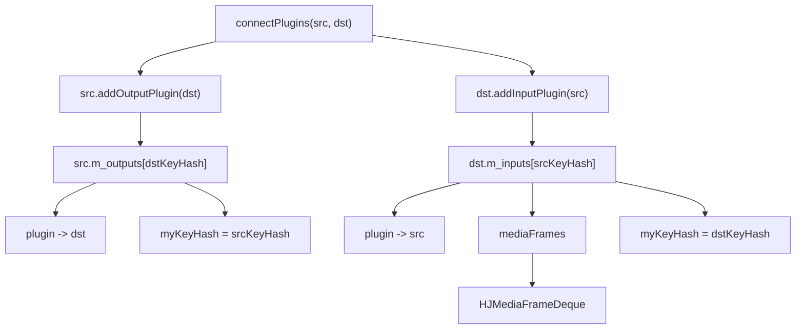
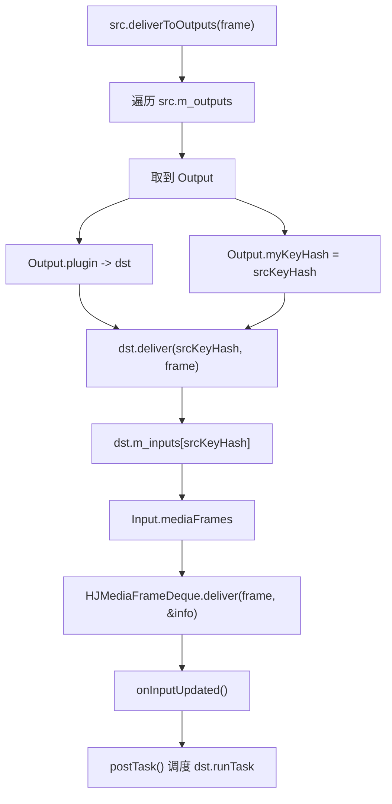

# 第 1 周学习笔记：项目地图、C++ 基础补强和 MusicPlayer 主链路

对应计划：`study/week1-music-player-practice.md`

## 本周目标

- 建立 HJMedia 项目全局地图
- 理解基础 C++ 概念在项目中的使用：智能指针、RAII、锁、队列
- 掌握 MusicPlayer 主链路：`openURL -> demux -> decode -> resample -> render -> timeline`
- 能用面试语言讲清纯音频播放器的基本架构

## 本周关键问题

- HJMedia 是什么？主要模块如何分层？
- Graph、Plugin、Thread、Timeline 分别负责什么？
- `shared_ptr` / `weak_ptr` / RAII 在项目中解决什么问题？
- demux、decode、resample、render 分别做什么？
- demuxer EOF 和最终播放 EOF 有什么区别？

## Day 1：项目全局地图

### 今日阅读

- [ ] `README.md`
- [ ] `CHANGELOG.md`
- [ ] `CMakeLists.txt`
- [ ] `CMakePresets.json`
- [ ] `src/graphs/CMakeLists.txt`

### 今日实践

- 项目分层图：

```text
entry
  -> graphs
    -> plugins / core / media / comp
      -> third_party / externals
```

- 顶层目录职责表：

| 目录 | 职责 | 我是否理解 |
|---|---|---|
| `src/graphs` | 图编排层，负责把插件、核心节点和组件按业务场景组装成完整媒体链路，如 MusicPlayer、Pusher、Live/Vod Player。 | 是 |
| `src/plugins` | 平台插件层，封装采集、解码、渲染、编码等底层能力，按 Harmony / Android / iOS / Windows 等平台拆分实现。 | 是 |
| `src/core` | 核心运行时层，提供 Node、Graph、Task、Scheduler、Context 等基础抽象，负责调度、连接、反压和生命周期管理。 | 是 |
| `src/media` | 媒体能力层，包含采集、解复用、编解码、封装、网络、渲染等通用媒体处理模块。 | 是 |
| `src/comp` | 组件层，提供可组合的图形和渲染处理组件，如 OpenGL、Prio 管线、RTE 管线和辅助工具。 | 是 |
| `src/entry` | 产品入口层，把各模块组装成对外能力入口，分为 pusher、player、render、inference 等业务线。 | 是 |

### 今日总结


### 还没懂的问题


## Day 2：C++ 智能指针和对象生命周期

### 今日阅读

- [ ] `src/utils/HJObject.h`
- [ ] 搜索 `HJ_DECLARE_PUWTR`
- [ ] 搜索 `sharedFrom`

### 今日实践

- `shared_ptr` / `weak_ptr` demo（5 个子 Demo）：

```text
demo 文件：studyDemo/day02_smart_ptr_demo.cpp（可编译运行）
编译：进入 studyDemo/，cmake -S . -B output && cmake --build output
目标：day02_smart_ptr_demo.exe，产物输出到 studyDemo/output/

Demo 1：Ptr/Utr/Wtr 类型别名（HJ_DECLARE_PUWTR）
  验证：DECLARE_PUWTR 宏展开为三个 using 别名
    using Ptr = std::shared_ptr<cls>;    // 共享所有权
    using Utr = std::unique_ptr<cls>;    // 独占所有权，禁止拷贝只可 move
    using Wtr = std::weak_ptr<cls>;      // 弱引用，不增加引用计数
  实测：
    - shared_ptr 拷贝后引用计数 +1，离开作用域自动 -1
    - unique_ptr 被 move 后原指针自动置 nullptr
    - weak_ptr 创建后引用计数不变，lock() 才临时增加引用计数

Demo 2：sharedFrom(this) + enable_shared_from_this
  验证：在成员函数内部获取类型正确的派生类 shared_ptr
  技术点：
    - enable_shared_from_this<T> 提供 shared_from_this()，但返回 shared_ptr<基类>
    - sharedFrom(this) 内部用 dynamic_pointer_cast<T> 安全向下转型
    - 工厂方法 creates<T>(args...) 统一用 std::make_shared 创建对象
  注意：creates<T> 是模板静态多态（编译期泛型），不是 CRTP（Curiously Recurring Template Pattern）
    - CRTP 要求派生类把自己作为模板参数传给基类：class A : public Base<A>
    - creates<T> 的行为是"为任意类型 T 生成 shared_ptr<T>"，不限制继承关系

Demo 3a：weak_ptr 打破循环引用（正确做法）
  场景：父节点用 shared_ptr 持有子节点，子节点用 weak_ptr 持有父节点
  验证：
    - weak_ptr 持有父节点不增加引用计数
    - parent.reset() 后 Parent 能正常析构（引用计数归零）
    - child->showFamily() 调用 weak_ptr.lock() 检测到父节点已销毁，返回 nullptr

Demo 3b：循环引用对比（如果不使用 weak_ptr）
  场景：双方都用 shared_ptr 互指
  后果：即使 bp 和 bc 离开作用域，引用计数始终 > 1，两个对象永远不析构 -> 内存泄漏
  总结：父持子用 shared_ptr，子持父必须用 weak_ptr，这是项目中 Graph-Node 双向引用的核心约定

Demo 4：unique_ptr 所有权转移
  验证：std::move 转移所有权后原指针变为 nullptr，新指针接管对象生命周期

代码结构亮点：
  - 手工实现 enable_shared_from_this_ext<T> 模拟 HJObject 的 SFINAE 兼容层
  - 用 MusicPlayer : HJObject 演示派生类的 sharedFrom(this) 向下转型
  - 用 Node 类（含 m_parent[Wtr] + m_child[Ptr]）演示正确的双向引用模式
  - 用 BadNode 做反例，直观展示循环引用导致的内存泄漏
```

- RAII demo（3 个子 Demo）：

```text
demo 文件：studyDemo/day02_raii_demo.cpp（可编译运行）
编译：进入 studyDemo/，cmake -S . -B output && cmake --build output
目标：day02_raii_demo.exe，产物输出到 studyDemo/output/

Demo 1：ScopeGuard 作用域守卫（模拟 HJOnceToken）
  核心原理：构造时注册析构回调，对象离开作用域时自动执行回调
  C++ 保证：无论正常 return、提前 return、break、continue 还是抛异常，
            局部对象的析构函数一定会被调用
  对应 HJMedia 用法：
    HJOnceToken token(nullptr, [&] { setIsBusy(false); });
    // 函数退出时自动清理 busy 状态，不可能忘记
  实现细节：
    - 两参数构造：onConstructed（构造回调）+ onDestructed（析构回调）
    - 单参数构造：传入 nullptr 跳过构造回调，只注册析构清理
    - 禁止拷贝、禁止移动（和 HJOnceToken 保持一致）
  验证结果：proRun() 结束后 isBusy 自动恢复为 false，无需手动调用

Demo 2：RAII 自动锁（lock_guard / unique_lock）
  对应 HJMedia 宏：
    - HJ_AUTO_LOCK(mtx)  -> std::lock_guard<std::recursive_mutex>  构造时 lock，析构时 unlock
    - HJ_AUTOU_LOCK(mtx) -> std::unique_lock<std::recursive_mutex> 更灵活，可提前 unlock
  关键区别：
    - lock_guard：轻量，不可手动 unlock，离开作用域自动释放（简单场景首选）
    - unique_lock：可以手动 unlock/lock，支持延迟锁定（需要灵活控制锁范围时使用）
    - recursive_mutex：同一线程可多次 lock（允许递归调用），普通 mutex 第二次 lock 会死锁
  验证结果：构造时自动加锁，离开作用域时自动释放，不可能忘记 unlock

Demo 3：异常安全（RAII 保证资源不泄漏）
  场景：processWithException() 中途 throw，FileHandle 是栈上局部对象
  验证结果：异常传播过程中，栈展开调用 FileHandle 析构函数，文件被自动关闭
  关键认知：try-catch 只能捕获异常，不会自动释放资源；RAII 在栈展开时自动清理

代码结构亮点：
  - 用 TaskRunner 模拟 proRun()，演示 busy 状态的 ScopeGuard 惯用法
  - FileHandle 实现完整的禁止拷贝 + 支持移动 + noexcept 标注
  - 注释中保留早期 return/throw 测试路径，方便自查
```

### 今日总结

智能指针方面：

1. HJ_DECLARE_PUWTR 是 HJMedia 最核心的类型基础设施宏，定义了每个类统一使用的 Ptr/Utr/Wtr 别名，避免裸指针到处散落。
2. shared_ptr 解决"多个持有者共享一个对象"的问题，引用计数自动管理生命周期。适合 Graph 持有 Plugin、Node 持有邻接节点等共享场景。
3. weak_ptr 是 shared_ptr 的"观察者"，不增加引用计数。核心用途是打破双向引用中的循环（如 Node 之间的父子关系、Plugin 回指 Graph）。
4. sharedFrom(this) 封装了 dynamic_pointer_cast + shared_from_this()，解决成员函数内获取类型正确的派生类 shared_ptr 的问题。
5. unique_ptr 独占所有权，禁止拷贝（只能移动），适合明确单一所有权的临时对象或内部资源句柄。
6. creates<T>(Args&&...) 是模板静态多态工厂，非 CRTP。CRTP 是"派生类作为基类模板参数"的编译期多态模式。

RAII 方面：

1. ScopeGuard/HJOnceToken 利用 C++ 析构确定性执行的特点，保证无论函数如何退出（正常、提前、异常），清理逻辑一定执行。这是防止状态泄漏的最可靠手段。
2. lock_guard / unique_lock 让锁的生命周期和对象作用域绑定，构造即加锁、析构即解锁，从根本上杜绝 forget-unlock。
3. RAII 的异常安全保证：栈展开过程中所有局部对象的析构函数都会被调用，资源自动回收。这比 try-catch-finally 或 goto-cleanup 模式更可靠。
4. 禁止拷贝 + 支持移动 + noexcept 标注是 HJMedia 资源类（如 FileHandle）的标准三件套，防止双重释放和资源所有权混乱。

### 面试表达

1. 为什么 HJMedia 大量使用 shared_ptr 而不是裸指针？
   答：音视频框架中对象的生命周期很复杂 —— Graph 持有 Plugin，Plugin 可能回指 Graph，
   多个 Node 共享同一个数据源。裸指针无法回答"谁负责释放"，shared_ptr 通过引用计数
   让最后一个持有者自动释放，weak_ptr 则用作"观察者"打破循环引用。HJ_DECLARE_PUWTR 宏
   为每个类统一生成 Ptr/Utr/Wtr 别名，整个项目的指针写法一致，降低心智负担。

2. sharedFrom 和 shared_from_this 有什么区别？
   答：shared_from_this()（C++ 标准库提供）返回 shared_ptr<当前类>，对于基类调用
   只能拿到 shared_ptr<HJObject>，丢失了派生类信息。sharedFrom(this)（HJMedia 封装）
   内部用 dynamic_pointer_cast 安全向下转型为 shared_ptr<T>，调用方拿到的是类型正确的
   派生类 shared_ptr。这是项目中"在 HJObject 成员函数中拿到派生类指针"的标准做法。

3. RAII 在 HJMedia 中有哪些典型应用？
   答：三个最典型的场景——
   (1) HJOnceToken：proRun() 中设置 isBusy=true，用 ScopeGuard 保证退出时自动恢复 false，
       防止节点被重入或死锁。
   (2) HJ_AUTO_LOCK / HJ_AUTOU_LOCK：锁的生命周期绑定到代码块，构造加锁、析构解锁，
       杜绝手动 unlock 遗漏。
   (3) 资源句柄管理：FileHandle、Socket、解码器等资源类在析构函数中释放底层资源，
       即使中途抛异常也能安全释放。

## Day 3：MusicPlayer 文档导读

### 今日阅读

- [x] `docs/Readme_MusicPlayer.md`
- [x] `docs/architecture/HJGraphMusicPlayer_AudioContextGuide.md`
- [x] `docs/architecture/HJGraphMusicPlayer.md`

### 今日实践

MusicPlayer 数据链路：

```text
openURL -> Demuxer -> AudioDecoder -> AudioResampler -> AudioRender -> Timeline

每一步：
  1. Demuxer：从媒体源读取压缩音频包 (packet)，协议无关
  2. AudioDecoder：压缩包 -> PCM 原始帧
  3. AudioResampler：PCM 格式/采样率/通道数转换，保证输出格式和 Render 匹配
  4. AudioRender：消费 PCM，写入平台音频硬件，驱动播放进度
  5. Timeline：把 Render 的播放进度暴露给 Graph 和上层调用者
```

MusicPlayer 控制链路：

```text
| 操作              | 同步/异步 | 实际路径                            |
|-------------------|-----------|-------------------------------------|
| openURL()         | 异步      | 转发给 Demuxer 异步打开              |
| pause()           | -         | 暂停 Timeline + 暂停 Render 播放     |
| resume()          | -         | 恢复 Render 播放 + 重启 Timeline     |
| seek()            | 异步      | 投递到 Graph 自己的 Handler 线程串行化 |
| switchAudioTrack()| 直接      | 轻量级直接调 Demuxer 切换            |
| setRepeats()      | 直接      | 更新 Graph 层循环策略（在 EOF 时生效） |
| close()           | 弱语义    | 不是完整释放，不要假设 pipeline 已清空  |
```

`openURL -> 播放结束` 伪代码：

```cpp
// 1. 打开音源
musicPlayer.openURL("song.mp3");
// -> demuxer 异步打开文件，读取头信息，解析音频流参数

// 2. 初始化插件链
// graph 创建 demuxer、decoder、resampler、render 四个插件
// 用 connect(demuxer, decoder) -> connect(decoder, resampler)
//    -> connect(resampler, render) 串联
// 每个插件的输入缓冲区由 downstream 端管理（consumer 侧持有 inStorage）

// 3. 正常播放循环（逐帧推拉驱动）
while (!done) {
    // demuxer 读取一个压缩包 -> decoder 解码为 PCM 帧
    // resampler 转换格式 -> render 消费 PCM 写入硬件
    // render 更新 timeline，每消费一帧推进一次播放时间
}

// 4. Demuxer 到达 EOF（源数据读完）
// demuxer 产出 EOF 帧，沿 DAG 向下游传播
// graph 检查 repeat 策略：
if (repeats > 0) {
    // 重置 demuxer，从头再读
    demuxer.reset();
    repeats--;
    // 继续循环
} else {
    // 标记 final EOF pending：等待 render 侧消费完所有缓冲帧
}

// 5. Final playback EOF（render 消费完所有帧到达终端条件）
// render 报告最终完成
// graph 记录 lastValidTimestamp
// 后续 getCurrentTimestamp() 永远返回这个值（不继续增长）
// 播放真正结束
```

### 今日总结

1. MusicPlayer 的音频处理链是 demuxer → decoder → resampler → render 四段式，每段有明确的输入/输出边界。

2. 数据流和控制流是分离的：音频帧沿插件链单向流动（数据流），而 pause/resume/seek 等操作由 Graph 层协调（控制流）。


3. seek() 是异步的：不直接在调用线程执行，而是投递到 Graph 自己的 Handler 线程串行化，快速连续 seek 会被合并。

4. 两个 EOF 必须区分：
   - Demuxer EOF：源数据读完了（但缓冲帧可能还没播完）
   - Final playback EOF：Render 侧真正播完了最后一帧
   两者之间的 gap 是解码缓冲/重采样延迟。

5. Timeline 由 Render 驱动：播放时间取决于用户实际听到的位置，而非解码器的读取位置。这意味着 pause 时时间停止、buffering 时时间暂停。

6. 线程模型核心：Graph control thread 隔离控制操作、audio worker thread 跑解码/重采样计算、render thread 驱动硬件输出。teardown 时必须检查 delayed task 和 stale callback。

### 还没懂的问题

- HJTimeline 具体怎么从 Render 获取进度？是回调还是轮询？
- Render 侧"terminal condition"的具体判断逻辑是什么？
- Demuxer EOF 帧沿 DAG 传播时，每个下游节点如何处理它？
- Graph 自己的 Handler 线程和 HJThread subsystem 的 LooperThread 是什么关系？

## Day 4：HJGraphMusicPlayer 源码入口

### 今日阅读

- [x] src/graphs/HJGraphMusicPlayer.h
- [x] src/graphs/HJGraphMusicPlayer.cpp
- [x] src/graphs/HJGraph.h
- [x] src/graphs/HJGraph.cpp

### 成员变量职责表

| 成员变量 | 职责 | 线程 / 生命周期风险 |
|---|---|---|
| m_audioInfo | 音频配置信息（采样率、声道数） | 在 internalInit 设置，之后只读 |
| m_audioThread | 音频解码线程，传给 decoder/resampler | 与 renderThread 独立，解码慢不阻塞渲染 |
| m_renderThread | 音频渲染线程，驱动 PCM 写入硬件 | 不可阻塞；解码/控制线程不直接操作硬件 |
| m_timeline | 播放进度时间线，支持 pause/play/seek | render 消费驱动；多线程读，SYNC_PROD_LOCK 保护写 |
| m_demuxer | FFmpeg 解复用器，解析容器读取压缩包 | 异步操作；回调用 weak_ptr 避免悬空 |
| m_audioDecoder | 音频解码器，压缩包 -> PCM 帧 | 数据在 m_audioThread 流通 |
| m_audioResampler | PCM 重采样器，匹配 render 格式 | 跟在 decoder 后同一线程 |
| m_audioRender | 渲染器（WASAPI/OHAudio/AudioUnit/AAudio） | 在 m_renderThread 运行 |
| m_handler | 消息处理器，投递异步任务（seek 等） | asyncAndClear 支持去重合并 |
| m_thread | Graph 控制线程 | 与 audio/render 线程隔离 |

### 类继承体系

`
HJObject
  +-- HJSyncObject           (init/done + SYNC_CONS/PROD_LOCK)
        +-- HJGraph          (插件/线程集合 + 事件/查询总线)
              +-- HJGraphPlayer  (标准播放器纯虚接口)
                    +-- HJGraphMusicPlayer
`

### internalInit 流程

6 个步骤：

1. 参数解析：audioInfo, repeats, mediaUrl, prerollDurationMs, pcmCallbackIntervalMs

2. 创建 4 插件并 connectPlugins 串联：
   demuxer -> audioDecoder -> audioResampler -> audioRender
   connectPlugins = i_src->addOutputPlugin + i_dst->addInputPlugin

3. 创建 3 线程：m_thread(控制) + m_renderThread + m_audioThread

4. 创建 Timeline：m_timeline = HJTimeline::Create(...)

5. 逆序 init 插件（render 先启动硬件，demuxer 最后）：
   m_audioRender->init(timeline) -> resampler -> decoder -> demuxer(mediaUrl)

6. 注册 9 个 handler：
   query: hasAudio, canDeliverToOutputs(反压), canPluginEof
   event: pluginNotify, mediaType, seekSucceeded, streamOpened, statusUpdated, audioDuration

### 调用链记录

`	ext
internalInit:
  参数解析 -> 创建4插件+connect串联 -> 创建3线程+1timeline
  -> 逆序init(render/resampler/decoder/demuxer) -> 注册9个handler

openURL:
  SYNC_CONS_LOCK -> CHECK_DONE_STATUS -> m_demuxer->openURL(i_url)
  只读检查 m_demuxer 指针，复杂操作委托 demuxer 异步执行

pause:
  SYNC_PROD_LOCK(独占写锁，阻塞所有其他操作)
  -> m_paused.store(true)
  -> m_timeline->pause()
  -> m_audioRender->setPause(true)
  三态统一修改，保证原子性

resume:
  SYNC_PROD_LOCK
  -> m_paused.store(false)
  -> m_audioRender->setPause(false)
  -> m_timeline->play()
  与 pause 完全对称

seek:
  SYNC_CONS_LOCK(共享读锁)
  -> m_demuxer 转 weak_ptr
  -> m_handler->asyncAndClear(..., m_seekId) 投递控制线程
  -> 立即返回（异步执行），快速连续 seek 自动去重合并
`

### 关键设计要点

1. 读写锁分离：SYNC_CONS_LOCK(共享读) / SYNC_PROD_LOCK(独占写)
2. 三层线程架构：控制(m_thread) + 解码(m_audioThread) + 渲染(m_renderThread)
3. WeakPtr 异步安全：异步回调捕获 weak_ptr 避免延长生命周期
4. 两阶段 EOF：demuxer EOF(读完) -> render EOF(消费完)
5. 反压：decoder+render 缓冲 <=600ms 才允许 demuxer 继续投递

### 今日总结

1. HJGraphMusicPlayer 继承 HJSyncObject -> HJGraph -> HJGraphPlayer
2. internalInit 按 参数->插件链->线程->timeline->init->handler 顺序初始化
3. connectPlugins 串联 DAG：demuxer->decoder->resampler->render
4. 写操作(pause/resume/close)用 SYNC_PROD_LOCK，读操作(openURL/seek)用 SYNC_CONS_LOCK
5. 异步 seek 用 asyncAndClear 投递控制线程，支持去重

## Day 5：队列和生产者消费者实践

### 今日阅读

- [x] `src/plugins/doc/HJPlugin.md`
- [x] `src/plugins/doc/HJMediaFrameDeque.md`
- [x] `src/plugins/HJPlugin.h`
- [x] `src/plugins/HJPlugin.cpp`
- [x] `src/plugins/HJMediaFrameDeque.h`
- [x] `src/plugins/HJMediaFrameDeque.cpp`

### 今日实践

```text
demo 文件：studyDemo/day05_bounded_frame_queue.cpp

验证的问题：
1. 生产者比消费者快时，队列为什么会堆积。
2. 队列满时可以选择返回 Full、阻塞等待、丢弃旧帧或触发上游反压。
3. preview 只查看队头，不改变队列；receive 才真正弹出并更新统计。
4. flush 必须同时清空数据和统计信息。
5. close 必须唤醒等待中的消费者，否则消费者可能永久阻塞。

是否有容量限制：
- demo 的 BoundedFrameQueue 有固定 capacity，用来练习“上层反压”。
- HJMediaFrameDeque 自身没有固定 capacity 字段，它只负责保存帧、统计 audioDuration / videoFrames / keyFrames，并提供 dropFrames / flush / receive / preview。
- 真正“能不能继续投递”的判断通常在 Graph / Plugin 查询里做，比如 HJGraphMusicPlayer 注册 canDeliverToOutputs 查询，控制 demuxer 是否继续向下游投递。

满队列时如何处理：
- tryDeliver 返回 Full：生产者不写入，稍后重试，适合演示反压。
- deliverDropOldest 丢掉最旧帧：适合低延迟场景，但真实视频压缩帧不能随便丢，必须考虑关键帧边界。
- waitReceive + close：消费者阻塞等待数据，close 时被唤醒退出。

和 HJMedia frame queue 的关系：
- HJPlugin::addInputPlugin 会在消费者侧为上游插件创建输入队列。
- 上游调用 deliverToOutputs(frame)，实际会调用下游 input queue 的 deliver。
- 下游 runTask 中通过 receive 取帧处理，再继续 deliverToOutputs 给更下游。
- HJMediaFrameDeque 还维护统计：audioDuration、audioSamples、videoFrames、videoKeyFrames、dequeSize。这些统计用于反压、丢帧策略和状态上报。
```

### HJMediaFrameDeque 关键接口理解

| 接口 | 作用 | 学习要点 |
|---|---|---|
| `deliver(frame, &info)` | 追加一帧并更新统计 | `frame == nullptr` 直接失败；EOF 会增加 `m_eofCount` |
| `preview(&info)` | 查看队头但不弹出 | 适合先判断帧类型或时间戳 |
| `receive(&info)` | 弹出队头并扣减统计 | 消费者真正处理帧的入口 |
| `store(frame)` | 缓存一帧到 `m_cached` | 类似“退回/暂存”一个控制帧或待处理帧 |
| `dropFrames(duration, &info)` | 按音频时长阈值丢帧 | 遇到 flush/EOF 停止；视频队列至少保留一个关键帧 |
| `flush(storeClearFrame)` | 清空队列和统计 | 可选择缓存 clear frame 通知后续逻辑 |

### 插件队列调用链

```text
Graph 构建期:
  src->addOutputPlugin(dst)
  dst->addInputPlugin(src)
    -> 在 dst 侧创建 Input
    -> Input 内部持有 HJMediaFrameDeque

运行期:
  上游 runTask()
    -> deliverToOutputs(frame)
      -> 下游 deliver(srcKeyHash, frame)
        -> Input.mediaFrames.deliver(frame, &info)
        -> postTask() 调度下游 runTask

  下游 runTask()
    -> receive(srcKeyHash, &size)
      -> Input.mediaFrames.receive(&info)
    -> 处理 frame
    -> deliverToOutputs(outFrame)
```

### HJMediaFrameDeque和HJPlugin的流程图





### 今日总结

- 这一天把“队列”从抽象概念落到了 HJMedia 的真实职责：它不只是容器，更是线程解耦、统计维护、反压判断和控制状态承载点。
- `HJPlugin` 负责把输入队列挂到消费者侧，`HJMediaFrameDeque` 负责安全地存、取、预览、丢帧和清空，Graph 负责决定什么时候该继续投递。
- demo 里三种策略对应三类场景：返回 Full 练习反压，drop-oldest 练习低延迟取舍，阻塞消费练习典型生产者/消费者协作。

1. 队列是解耦线程和处理速度的核心设施。demuxer、decoder、resampler、render 不需要在同一个调用栈里同步完成，生产者只负责投递，消费者按自己的线程节奏取帧。
2. 队列一定要配合反压，否则生产者过快会导致内存增长、延迟变大，最终播放端听到/看到的是很久以前的帧。
3. HJMediaFrameDeque 本身不是一个“固定容量队列”，它更像带统计能力的帧容器；容量控制和是否继续投递由 Graph / Plugin 层根据队列时长、帧数和业务状态决定。
4. 满队列策略没有唯一答案：播放器通常倾向反压和等待，直播/推流为了低延迟可能选择丢帧，但视频压缩帧必须保留关键帧边界。
5. `preview` 和 `receive` 的区别很重要：`preview` 不改变状态，`receive` 会弹出并扣减统计。错误使用会导致重复消费或统计不准。
6. `flush` 不只是清空数据，还要清空统计和控制状态；seek、stop、切流时如果 flush 不完整，旧帧可能穿透到新播放周期。

### 面试表达

1. 为什么音视频框架需要队列？
   答：音视频链路里每一段速度不同，demux 可能很快，decode 受 CPU 影响，render 又受硬件时钟驱动。队列把这些阶段解耦，让生产者和消费者可以运行在不同线程，同时通过队列长度或缓存时长做反压，避免某一段阻塞整条链路。

2. HJMediaFrameDeque 和普通 `std::queue` 有什么区别？
   答：普通队列只保存元素，HJMediaFrameDeque 保存的是媒体帧，并且同步维护 audioDuration、audioSamples、videoFrames、videoKeyFrames、EOF/control 状态等统计。这些统计会被插件和图层用于反压、丢帧、flush 和状态上报。

3. 队列满了应该怎么办？
   答：取决于业务。点播播放器更适合反压，让上游暂停生产；实时直播可能为了低延迟丢弃旧帧；视频压缩帧不能无脑丢，需要保留关键帧边界。HJMedia 里队列本身不写死策略，而是由 Plugin / Graph 查询下游状态后决定是否继续投递或丢帧。

4. 为什么 flush/close 要唤醒消费者？
   答：消费者可能正阻塞等待新帧。如果 close 或 flush 后不唤醒，它会一直卡在等待条件上，导致线程无法退出，进而影响 done/teardown 的同步释放。


## Day 6：音频插件链实践复述

### 今日阅读

- [x] `src/plugins/doc/HJTimeline.md`
- [x] `src/plugins/doc/HJPluginDemuxer.md`
- [x] `src/plugins/doc/HJPluginAudioFFDecoder.md`
- [x] `src/plugins/doc/HJPluginAudioResampler.md`
- [x] `src/plugins/doc/HJPluginAudioRender.md`

### 插件职责表

| 插件 | 输入 | 输出 | 职责 | 可能失败点 |
|---|---|---|---|---|
| Demuxer | URL / 本地文件 / 网络源 | 压缩音频 packet、控制帧、EOF | 异步 open/reset/seek，读取容器数据，按媒体类型投递到下游；下游反压时缓存 1 帧等待重试 | open 失败、seek 失败、getFrame 失败、旧 init 任务晚到、EOF 是否允许传播要听 Graph 策略 |
| Audio Decoder | 压缩音频 packet、flush、EOF | PCM audio frame、decoder EOF | 基于 FFmpeg codec 把压缩音频解码成 PCM；flush 时按 streamInfo 重建 codec；一个输入包可能输出 0/N 帧 | streamInfo 缺失、codec init/run/getFrame 失败、flush 后 codec 未正确重建、EOF 输入和 EOF 输出时机混淆 |
| Resampler | 解码后的 PCM、flush、EOF | 目标格式 PCM，或 FIFO 打包后的固定粒度 PCM | 把采样率、采样格式、声道布局转换成 render 需要的 `HJAudioInfo`；可选 FIFO 重打包；flush 清空 converter/FIFO 状态 | converter 失败、FIFO addFrame 失败、seek/flush 时残留半包、误以为一帧输入必然一帧输出 |
| Audio Render | 目标格式 PCM、clear/flush、EOF | 平台音频输出、timeline 更新时间、rendered PCM 事件 | 消费 PCM 写入音频设备；处理 preroll/buffering、pause/resume、mute/volume、EOF stop；完整消费一帧后推进 Timeline | 设备 init/release 失败、callback 线程与 handler 线程竞态、preroll 不足导致静音填充、EOF 需要 Graph 确认、timeline 更新过早或过晚 |
| Timeline | render 提交的 streamIndex/PTS/speed，pause/play/flush | 当前播放进度、play/pause/update 通知 | 保存播放锚点，用 steady clock 按 speed 外推当前时间；pause 时冻结，play 时恢复；streamIndex 防止旧流回退时间线 | flush 后没有有效锚点、旧 streamIndex 被拒绝、listener 回调重入风险、误把 timeline 当调度器或队列 |

### 音频帧从 demuxer 到 render 的伪代码

```cpp
// Graph 构建期
connect(demuxer, decoder);
connect(decoder, resampler);
connect(resampler, render);

// Demuxer handler 线程
packet = demuxer.getFrame();
if (packet.isEOF()) {
    if (graph.canPluginEof(demuxer)) {
        demuxer.deliverToOutputs(packet);
    }
} else if (graph.canDeliverToOutputs(demuxer, packet)) {
    demuxer.deliverToOutputs(packet);
} else {
    demuxer.cacheCurrentFrame(packet); // 只缓存 1 帧，等待下次重试
}

// Decoder handler 线程
packet = decoder.receive();
if (packet.isFlush()) {
    decoder.rebuildCodec(packet.streamInfo);
} else if (packet.isEOF()) {
    decoder.drainCodecAndForwardEOF();
} else {
    decoder.send(packet);
    while (auto pcm = decoder.receiveDecodedFrame()) {
        decoder.deliverToOutputs(pcm);
    }
}

// Resampler handler 线程
pcm = resampler.receive();
if (pcm.isFlush()) {
    resampler.resetConverterAndFifo();
    resampler.forwardFlush();
} else if (pcm.isEOF()) {
    resampler.forwardEOF();
} else {
    converted = converter.convert(pcm);
    if (fifoEnabled) {
        fifo.add(converted);
        while (auto packed = fifo.getFrame()) {
            resampler.deliverToOutputs(packed);
        }
    } else {
        resampler.deliverToOutputs(converted);
    }
}

// AudioRender 设备回调 / render 线程
frame = render.receive();
if (frame.isEOF() && graph.canPluginEof(render)) {
    render.stopStreamForEof();
} else {
    render.copyPcmToDeviceBuffer(frame);
    if (frame.fullPayloadConsumed()) {
        timeline.setTimestamp(frame.streamIndex, frame.pts, frame.speed);
    }
}
```

### 控制语义

1. `openURL/reset/seek` 对 Demuxer 来说都是异步效果，真正工作在 handler 线程上串行执行；快速重复操作会通过 message id 合并或丢弃旧任务。
2. Demuxer 有 generation/stale-init 保护：旧 demuxer 被 quit 后，晚到的旧 init 不能重新创建旧数据源。
3. 反压不是 `HJMediaFrameDeque` 自己决定的固定容量策略，而是 Graph/Plugin 通过查询下游状态决定是否继续投递；Demuxer 只保存一个当前未投递帧。
4. flush 不是普通数据帧。Decoder 收到 flush 可能重建 codec，Resampler 收到 flush 要清 converter/FIFO，Render 收到 clear/flush 要刷新 timeline。
5. EOF 分阶段传播：Demuxer EOF 表示源读完，Decoder EOF 表示 codec drain 完，Render EOF 才接近用户实际听完；是否最终完成由 Graph 查询策略确认。
6. Timeline 由 Render 推进，不由 Demuxer 或 Decoder 推进。这样 `getCurrentTimestamp()` 更接近实际播放头，而不是文件读取位置。

### Day 6 demo

```text
demo 文件：studyDemo/day06_audio_plugin_chain.cpp
编译：cmake -S studyDemo -B studyDemo/output && cmake --build studyDemo/output --target day06_audio_plugin_chain
运行：studyDemo/output/day06_audio_plugin_chain.exe

demo 验证点：
1. Demuxer open/seek 会切换 stream generation，旧帧不能回退 timeline。
2. 下游队列满时，Demuxer 不丢帧，而是缓存 1 帧并等待下次重试。
3. Decoder 不是一进一出：每个 packet 在 demo 中输出两个 PCM frame。
4. Resampler 可选 FIFO 打包：两个短 PCM frame 合并成一个 render-friendly frame。
5. Render 只有在完整消费 PCM 后才推进 timeline。
6. flush 会清空 decoder/resampler/render 的中间状态，并让 timeline 失效直到新帧到来。
7. EOF 沿链路传播，但 final playback EOF 在 Render 消费完最后一帧后才成立。
```

### 今日总结

1. 音频插件链不是简单函数调用链，而是多个 handler/thread 上通过输入队列、控制帧和 Graph 查询协作的 pipeline。
2. Demuxer 负责“读源和投递 packet”，Decoder 负责“压缩包到 PCM”，Resampler 负责“PCM 格式归一化和重打包”，Render 负责“实际播放和时间线推进”。
3. 每个插件只应该做本阶段的数据路径职责；是否允许 EOF、是否继续投递、repeat/seek 等策略属于 Graph。
4. `streamIndex` 是 seek/reset 后防止旧帧污染新播放周期的关键字段，Timeline 和 Demuxer 都依赖它做 generation 防护。
5. 以后排查 MusicPlayer 卡顿/无声/EOF 不触发时，要按链路分层看：源是否打开、packet 是否出来、codec 是否输出、resampler 是否打包、render 是否真的消费、timeline 是否更新。

### 面试表达

1. demux、decode、resample、render 的区别是什么？
   答：demux 是从容器里拆出压缩音频包，不改变编码内容；decode 是把 AAC/MP3 等压缩包解成 PCM；resample 是把 PCM 的采样率、采样格式和声道布局转成设备需要的格式；render 是把最终 PCM 写入音频设备，并用实际消费进度推进播放时间线。

2. 为什么播放进度由 AudioRender 更新，而不是由 Demuxer 或 Decoder 更新？
   答：Demuxer/Decoder 只说明数据被读到或解出来，不代表用户已经听到。AudioRender 更接近硬件播放头，只有它完整消费 PCM 后更新 Timeline，`getCurrentTimestamp()` 才能反映真实播放进度。

3. seek/flush 时每个阶段要注意什么？
   答：Demuxer 要异步 seek 并清掉当前缓存帧；Decoder 要按新的 streamInfo 重建或 flush codec；Resampler 要清 converter/FIFO 的半包；Render 要清播放侧状态并刷新 timeline。只清队列不清内部状态会导致旧帧穿透到新播放周期。

## Day 7：本周复盘

### 10 个面试问答

1. HJMedia 是什么？代码按什么层次组织？
   答：HJMedia 是一个跨平台 C++ 多媒体框架，面向 pusher、player、render/inference 和 MusicPlayer 等产品链路。读代码时可以按 `entry -> graphs -> plugins/core/media/comp -> third_party/externals` 建立层次感：entry 是产品入口，graphs 做业务编排，plugins/core/media/comp 提供运行时、媒体能力和可组合处理单元，第三方库提供底层能力。

2. 为什么项目要用 Graph 和 Plugin，而不是把逻辑都写在一个 Player 类里？
   答：Graph 负责业务级编排，例如创建链路、连接插件、处理 seek/repeat/EOF/反压策略；Plugin 只负责一个处理阶段，例如 demux、decode、resample、render。这样职责边界清楚，插件可以复用，Graph 也能从全局视角处理控制逻辑。

3. MusicPlayer 的主数据链路是什么？
   答：`openURL -> demuxer -> audio decoder -> audio resampler -> audio render -> timeline`。Demuxer 从容器或网络源里读压缩 packet，Decoder 解成 PCM，Resampler 统一采样率/格式/声道并可能重打包，AudioRender 写入设备，Timeline 记录用户实际听到的播放进度。

4. MusicPlayer 的数据流和控制流为什么要分开？
   答：数据流是音频帧沿插件链路单向传递；控制流是 openURL、pause、resume、seek、repeat、close 等操作。控制操作需要 Graph 串行化和全局协调，尤其 seek/flush/EOF 不能让单个插件自行决定，否则容易出现旧帧穿透、EOF 过早或状态不同步。

5. 为什么播放进度应该由 AudioRender 推进，而不是 Demuxer 或 Decoder？
   答：Demuxer 只说明数据被读到，Decoder 只说明数据被解出来，都不代表用户已经听到。AudioRender 最接近硬件播放头，只有它完整消费 PCM 后推进 Timeline，`getCurrentTimestamp()` 才接近真实播放进度。

6. Demuxer EOF 和 final playback EOF 有什么区别？
   答：Demuxer EOF 表示源已经没有新的压缩包；final playback EOF 表示下游 decoder/resampler/render 缓冲里的数据也已经被消费完。两者之间通常有时间差，因为队列、解码器、重采样 FIFO、音频设备缓冲都可能还持有数据。

7. 音视频框架为什么需要 frame queue？
   答：队列用于解耦不同线程和不同处理速度。Demuxer、Decoder、Resampler、Render 不需要在同一个调用栈里同步执行；队列还能承载 preview/receive/flush/drop、缓冲统计和反压判断，是异步媒体链路的核心连接点。

8. HJMedia 为什么大量使用 `shared_ptr`、`weak_ptr` 和 `HJ_DECLARE_PUWTR`？
   答：Graph、Node、Plugin 之间存在共享所有权和双向引用。`shared_ptr` 表达共享持有，`weak_ptr` 表达观察关系并打破循环引用，`HJ_DECLARE_PUWTR` 为每个类统一生成 `Ptr/Utr/Wtr`，降低指针语义混乱。

9. RAII 在 HJMedia 里解决什么问题？
   答：RAII 把资源释放绑定到对象生命周期。典型场景包括 `HJOnceToken` 在 `proRun()` 退出时恢复 busy 状态，`HJ_AUTO_LOCK` / `HJ_AUTOU_LOCK` 自动释放锁，以及文件、codec、设备、线程等资源在异常或提前返回时仍能被释放。

10. 如果 MusicPlayer 无声、卡住或 EOF 不触发，应该怎么排查？
    答：按链路逐段确认：源是否打开、demuxer 是否产出 packet、decoder 是否产出 PCM、resampler 是否输出目标格式、render 是否真正消费、timeline 是否更新、EOF 是否传到每个阶段、seek/flush 后是否有旧帧或半包残留。

### 3 分钟 MusicPlayer 介绍稿

HJMedia 是一个跨平台 C++ 多媒体框架，产品链路包括推流、播放、渲染/推理和 MusicPlayer。第一周我重点看的是 MusicPlayer，因为它只处理音频，是一条最短但完整的播放链路，适合用来理解这个项目的 Graph、Plugin、队列和生命周期模型。

MusicPlayer 的数据链路可以概括为 `demuxer -> decoder -> resampler -> render -> timeline`。Demuxer 负责从文件或网络源读取容器数据，拆出压缩音频 packet；Decoder 把 AAC/MP3 这类压缩数据解成 PCM；Resampler 把 PCM 转成音频设备需要的采样率、采样格式和声道布局，也可能用 FIFO 把小帧重打包；AudioRender 把最终 PCM 写入音频设备；Timeline 则记录播放进度。

这条链路里最重要的点是：播放进度不应该由 Demuxer 或 Decoder 推进，而应该由 Render 推进。因为读到数据、解出数据都不等于用户已经听到，只有 Render 侧完整消费 PCM 后，时间线才接近真实播放头。

控制链路和数据链路是分开的。音频帧沿插件链路单向流动，但 openURL、pause、resume、seek、repeat、close 由 Graph 协调。Graph 从全局视角决定是否继续投递、是否允许 EOF 传播、seek 时如何 flush 各阶段状态。这个分离可以避免单个插件承担它看不到的业务策略。

EOF 也要分两层理解。Demuxer EOF 只是源数据读完了，但 decoder、resampler、render 和队列里可能还有缓存；final playback EOF 必须等 Render 消费完最后的 PCM 后才成立。所以排查 EOF 问题时不能只看源是否读完，要沿链路检查 EOF 是否被每一段正确处理。

C++ 基础在这条链路里也很具体：`shared_ptr` 管理 Graph/Plugin/Node 的共享生命周期，`weak_ptr` 防止双向引用形成循环，RAII 保证锁、busy 状态和资源句柄能自动清理，frame queue 解耦生产者和消费者并支撑反压。理解这些以后，再读更复杂的 Player 或 Pusher 链路会容易很多。

### 本周最重要的 5 个收获

1. 读大型音视频项目要先建立分层地图。先看 entry 和 graph，再往 plugin/core/media/comp 下钻，比直接搜索某个函数更稳定。
2. MusicPlayer 是理解 HJMedia 的最小完整链路：它覆盖数据流、控制流、队列、异步、EOF、seek/flush 和 timeline。
3. Graph 和 Plugin 的边界很关键：Graph 管策略和拓扑，Plugin 管单阶段处理，不能把全局策略塞进局部插件。
4. 播放进度、EOF、flush 都不能只看“数据有没有产生”，必须看“下游有没有真正消费”和“内部状态有没有清干净”。
5. 智能指针、RAII、锁和队列不是孤立 C++ 知识点，它们直接对应 HJMedia 的生命周期、安全释放、线程同步和反压机制。

### 下周要补的问题

1. `HJThread`、`HJHandler`、`HJTask`、`HJScheduler`、`HJExecutor` 之间的职责边界和调用关系。
2. Plugin 的 `init -> start -> process -> stop -> release` 生命周期在多线程 teardown 时如何保证安全。
3. 真实播放器问题中，如何通过日志证明 seek、flush、EOF 已经到达每个阶段，而不是卡在某个插件或队列里。

### Day 7 demo

```text
demo 文件：studyDemo/day07_week1_review.cpp
编译：cmake -S studyDemo -B studyDemo/output && cmake --build studyDemo/output --target day07_week1_review
运行：studyDemo/output/day07_week1_review.exe

demo 验证点：
1. 输出 10 个第一周高频面试卡片，每个卡片绑定一个主题和源码/文档路径。
2. 输出一份 3 分钟 MusicPlayer 介绍稿，可直接照着练习口述。
3. 输出第一周自检清单，覆盖项目地图、MusicPlayer 链路和 C++ 基础。
4. 输出带入第 2 周的问题，衔接线程、任务队列、插件生命周期和 teardown。
```
