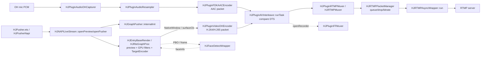
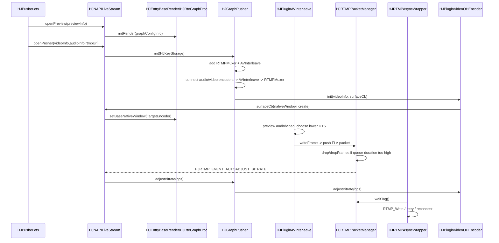

# Day 21 - 第三周复盘：Pusher、编码、RTMP 与弱网

日期：2026-07-13

## 今日目标

第 21 天是 Week 3 收束日，目标不是继续扩展新模块，而是把第 15-20 天读过的推流链路串成可复述、可排查、可面试回答的一套材料：

- 20 个推流 / 编码 / RTMP 面试问答。
- 5 分钟直播推流系统讲稿。
- 一个“弱网推流内存上涨”的问题定位案例。
- 一个 standalone C++17 复盘 demo：`studyDemo/day21_pusher_review.cpp`。

## 今日阅读

| 路径 | 关注点 |
|---|---|
| `.agents/skills/hjmedia-daily-study/references/28-day-plan.md` | Day 21 的产出和验收标准 |
| `study/week3-pusher-codec-rtmp-practice.md` | Week 3 每日主题和复盘范围 |
| `studyNote/15-pusher-graph.md` | Pusher API、Graph、插件链路、实时性目标 |
| `studyNote/16-audio-capture-aac.md` | PCM 字节数、AAC-LC 1024 samples/channel、FDK-AAC |
| `studyNote/17-video-capture-codec.md` | Surface 硬编码、SPS/PPS/VPS、IDR、PTS/DTS |
| `studyNote/18-rtmp-muxer-timestamp.md` | AV interleave、FLV tag、RTMP 发送、时间戳归零 |
| `studyNote/19-weak-network-queue-practice.md` | RTMP packet queue、丢帧、自动降码率、线程边界 |
| `studyNote/20-render-inference-overview.md` | RTE、GPU filter、AI 检测、faceInfo 回灌 |
| `src/entry/pusher/hsys/verify/HJNAPILiveStream.cpp` | `openPreview/openPusher` 如何创建 RTE、构造参数、处理 RTMP 事件 |
| `src/graphs/HJGraphPusher.cpp` | `internalInit` 如何连接 audio/video encoder、`HJPluginAVInterleave`、`HJPluginRTMPMuxer` |
| `src/plugins/HJPluginAVInterleave.cpp` | `runTask` 如何预览 audio/video 队首并按 DTS 输出 |
| `src/media/codec/HJAEncFDKAAC.cc` | AAC-LC 初始化、1024 samples/channel、FDK-AAC 输入参数 |
| `src/media/codec/hsys/HJVEncOHCodec.cc` | Harmony 硬编码器 Surface、H.264/H.265 mime、GOP、ROI 参数 |
| `src/media/muxer/HJRTMPPacketManager.cc` | 缓存时长、`drop/dropFrames/keepLastGop`、`HJRTMP_EVENT_DROP_FRAME` |
| `src/media/muxer/HJRTMPBitrateAdapter.cc` | `evaluateBitrate` 如何根据丢帧和队列时长降/升码率 |
| `src/entry/render/HJRenderGraphExport.cpp` | render input queue、`nLatencyCnt`、`setFaceInfo` |
| `src/entry/inference/HJFaceDetectExport.cpp` | 检测结果如何通过 wrapper 回调给业务层 |
| `src/comp/rte` | RTE source/filter/target/link 和 `TargetEncoder` 位置 |

## 核心复盘

### Pusher 主链路

`HJNAPILiveStream::openPreview` 先初始化 RTE 预览和 GPU 图，必要时创建 `TargetEncoder` 目标。`openPusher` 再把 `HJVideoInfo`、`HJAudioInfo`、`HJMediaUrl`、`surfaceCb`、`rtmpListener` 放进 `HJKeyStorage`，交给 `HJGraphPusher::init`。

`HJGraphPusher::internalInit` 的固定出口是：

```text
HJPluginAVInterleave -> HJPluginRTMPMuxer
```

有音频时再接：

```text
HJPluginAudioOHCapturer -> HJPluginAudioResampler -> HJPluginFDKAACEncoder -> HJPluginAVInterleave
```

有视频时接：

```text
HJPluginVideoOHEncoder -> HJPluginAVInterleave
```

录制不是重建主链路，而是在运行期通过 `openRecorder` 新增：

```text
HJPluginAVInterleave -> HJPluginFFMuxer
```

### 编码与时间戳

音频侧要先把 PCM 和 AAC 区分清楚。PCM 是采集到的原始样本，S16 stereo 的字节数公式是：

```text
bytes = samplesPerChannel * channels * bytesPerSample
```

48k / stereo / S16 下，AAC-LC 常见 1024 samples/channel 输入就是 `1024 * 2 * 2 = 4096` bytes。FDK-AAC 看到的 `numInSamples` 是按 sample 元素数计算，S16 stereo 时对应 2048。

视频侧在 Harmony 上通过硬编码 Surface 输入。`HJVEncOHCodec` 根据 `HJVideoInfo::m_codecID` 选择 `video/avc` 或 `video/hevc`，创建 `OH_VideoEncoder` 后拿到 `NativeWindow`。上游 RTE / 渲染链把处理后的画面写入该 Surface，编码器输出 H.264/H.265 packet。

SPS/PPS/VPS 是解码参数集，IDR 是恢复点。推流时关键帧必须携带或能关联这些 codec header，否则接收端从该点开始也无法正常解码。`HJPluginAVInterleave::runTask` 按 DTS 合并音视频，因为 mux/RTMP 写出的是压缩码流的发送/解码顺序；PTS 更多服务于播放端显示时间。

### RTMP 与弱网

`HJPluginRTMPMuxer` 把 interleave 后的 packet 交给 `HJRTMPMuxer`，后者构造 FLV tag 并通过 `HJRTMPPacketManager` 排队。发送线程在 `HJRTMPAsyncWrapper::run` 中取 tag，最终调用 `HJRTMPWrapper::send` / `RTMP_Write`。

弱网时慢的是 RTMP async executor 的发送能力，编码和 muxer 仍可能持续入队。如果不处理，`HJRTMPPacketManager::m_packets` 会堆积，表现为内存增长和直播延迟增长。因此 HJMedia 使用缓存时长、丢帧比例、网络码率等指标做三类处理：

| 策略 | 源码对应 | 适用场景 | 风险 |
|---|---|---|---|
| 丢低优先级视频帧 | `HJRTMPPacketManager::drop/dropFrames` | 队列时长超过阈值，需要快速压延迟 | 画面跳变，过度丢帧会影响观感 |
| 保留最近 GOP | `HJRTMPPacketManager::keepLastGop` | 重连或队列恢复后需要可解码起点 | GOP 太长时仍可能保留较多历史帧 |
| 自动降码率 | `HJRTMPBitrateAdapter::evaluateBitrate` -> `HJRTMP_EVENT_AUTOADJUST_BITRATE` -> `HJGraphPusher::adjustBitrate` | 网络持续承载不了当前码率 | 码率下调有滞后，画质下降 |

### RTE / AI 插入点

RTE 不是 `HJGraphPusher` 内部普通 plugin。它更像视频采集/预览/编码前的 GPU 子图，通过 `TargetEncoder` 和 `surfaceCb` 与 `HJPluginVideoOHEncoder` 连接。Faceu、Blur、SR、Denoise 这类 GPU filter 在 texture/FBO 链路里执行；人脸检测通过 `HJFaceDetectWrapper` 输出 faceInfo，再由 `HJRenderGraphWrapper::setFaceInfo` 或 `HJEntryBaseRender::setFaceInfo` 回灌给 RTE 节点。

实时链路的共同约束是不能无限堆积：RTMP packet queue 不能无限缓存，render input queue 也会通过 `nLatencyCnt` 丢旧帧，AI 异步检测也偏向保留最新任务。

## Mermaid 图

### 数据流



### 控制流



## 20 个面试问答

### 1. Pusher 主链路从哪里开始？

从 Harmony TS / NAPI 入口进入，`HJNAPILiveStream::openPusher` 构造 `HJVideoInfo`、`HJAudioInfo`、`HJMediaUrl` 和回调，再调用 `HJGraphPusher::init`。预览和 GPU 图通常由 `openPreview` 先建好。

### 2. `HJGraphPusher::internalInit` 最核心的拓扑是什么？

固定出口是 `HJPluginAVInterleave -> HJPluginRTMPMuxer`。音频分支接入 `AudioOHCapturer -> AudioResampler -> FDKAACEncoder -> AVInterleave`，视频分支接入 `VideoOHEncoder -> AVInterleave`。

### 3. 音频 PCM 字节数如何计算？

`samplesPerChannel * channels * bytesPerSample`。48k、双声道、S16、1024 samples/channel 的 PCM 输入是 4096 bytes。

### 4. AAC-LC 的 1024 samples/channel 表示什么？

表示每个声道一帧输入通常消耗 1024 个采样点；帧时长由 `1024 / sampleRate` 决定，声道数只影响字节数，不改变这一帧的时间长度。

### 5. PCM frame 和 AAC packet 有什么区别？

PCM frame 是编码器输入的原始音频样本，大小可由采样参数计算。AAC packet 是压缩后的输出，大小由码率、编码器和内容决定，不能等同于 PCM 输入大小。

### 6. Harmony 视频编码为什么不是普通 raw frame 输入？

`HJVEncOHCodec` 通过 `OH_VideoEncoder_GetSurface` 拿到 `NativeWindow`，上游 RTE 或渲染链把画面写入编码 Surface，硬编码器从 Surface 消费图像。

### 7. SPS/PPS/VPS 的作用是什么？

它们是 H.264/H.265 解码参数集。接收端从关键帧开始解码时需要这些参数，否则可能黑屏或无法初始化解码器。

### 8. IDR 为什么重要？

IDR 是关键恢复点，后续帧不依赖 IDR 之前的参考帧。推流首帧、重连恢复、GOP 保留都依赖关键帧作为可解码起点。

### 9. PTS 和 DTS 怎么区分？

DTS 是解码/发送顺序，PTS 是显示顺序。低延迟直播常让两者接近，但含 B 帧时两者可能不同。

### 10. `HJPluginAVInterleave` 为什么按 DTS 选包？

它负责把已编码 packet 写向 mux/RTMP，必须保证压缩码流解码顺序稳定，所以比较 audio/video 队首的 `getDTS()`。

### 11. RTMP/FLV timestamp 如何归零？

`HJRTMPMuxer` 会等待起始 DTS offset，普通媒体 tag 的 timestamp 使用 `packet dts - startDTSOffset`，视频再用 composition offset 表达 `PTS - DTS`。

### 12. 为什么推流要等待视频关键帧？

如果从非关键帧开始发，接收端可能缺少 codec header 和参考帧。`HJPluginMuxer` 和 `HJRTMPPacketManager` 都有等待关键帧或保留 GOP 的逻辑。

### 13. 弱网时为什么不能无限缓存？

直播追求实时性。无限缓存会让延迟持续增长，用户看到的是很久以前的画面，同时内存也会上涨。

### 14. 弱网优先丢什么？

优先丢低优先级视频帧，尽量不丢音频和关键帧，并保留最近 GOP，让网络恢复后仍能从关键帧继续解码。

### 15. 自动降码率如何闭环？

`HJRTMPPacketManager` 调 `HJRTMPBitrateAdapter::evaluateBitrate` 得到推荐码率，发 `HJRTMP_EVENT_AUTOADJUST_BITRATE`；`HJNAPILiveStream` 收到后调用 `m_graphPusher->adjustBitrate(bps)`。

### 16. 只重连不丢帧可以吗？

不够。重连解决连接状态，不能解决发送吞吐长期低于编码产出的矛盾。仍需要丢帧、降码率和保留最近 GOP。

### 17. 录制分支如何接入？

`HJGraphPusher::openRecorder` 运行期创建 `HJPluginFFMuxer`，连接 `m_avInterleave -> m_muxer`，因此录制复用 interleave 后的统一 packet 流。

### 18. RTE 在 Pusher 中的位置是什么？

RTE 位于采集/预览和视频编码器之间，负责 Faceu、Blur、SR、Denoise 等 GPU 处理，并把结果输出到 UI 和 `TargetEncoder`。

### 19. AI 检测结果如何影响渲染？

检测 wrapper 输出 faceInfo，业务层通过 `setFaceInfo` 回灌给 RTE，Faceu 或隐私 blur 节点按 source name 读取这些控制数据。

### 20. 面试中如何描述这段学习经历？

可以说是阅读 HJMedia 源码、梳理 Pusher/Codec/RTMP 架构，并用 standalone C++ demo 验证交织、队列和弱网策略；不要说成独立实现了完整推流框架。

## 5 分钟讲稿

第一分钟先讲入口。HJMedia 的推流不是单个函数直接写 RTMP，而是 Harmony TS API 通过 NAPI 进入 `HJNAPILiveStream`。`openPreview` 负责搭建预览和 RTE 渲染图，`openPusher` 负责把音视频参数、RTMP URL 和回调整理成 `HJKeyStorage`，交给 `HJGraphPusher`。

第二分钟讲 Graph。`HJGraphPusher::internalInit` 固定创建 `AVInterleave` 和 `RTMPMuxer`，这是推流出口。有音频时接入采集、重采样和 FDK-AAC 编码；有视频时接入 Harmony 硬编码器。录制或语音识别是从已有链路上动态加分支，而不是改写主链路。

第三分钟讲编码。音频侧要理解 PCM 与 AAC 的区别：PCM 是原始样本，AAC 是压缩 packet；AAC-LC 常见输入节奏是每声道 1024 samples。视频侧要理解 Surface 硬编码、SPS/PPS/VPS、IDR、PTS/DTS。推流端必须保证关键帧和 codec header 可用，才能让接收端从关键点恢复。

第四分钟讲封装和 RTMP。音频 AAC packet 和视频 H.264/H.265 packet 先进入 `HJPluginAVInterleave`，它按 DTS 交织成单路输出。RTMP muxer 再生成 FLV metadata、sequence header 和普通媒体 tag，并把 timestamp 归零。网络发送由 async wrapper 执行，底层最终调用 librtmp 的写接口。

第五分钟讲弱网。弱网时发送线程变慢，但编码和 muxer 还在生产，RTMP packet queue 会堆积。HJMedia 不能无限缓存，而是根据 queue duration、drop ratio、net bitrate 做丢帧、保留最近 GOP、自动降码率和重连。这个取舍体现了直播系统的核心矛盾：实时性优先于完整保留每一帧。

## 弱网推流内存上涨定位案例

### 现象

直播推流运行一段时间后，在弱网下观众端延迟持续增加，本端内存上涨，偶发 `SEND_Error` 或重连，恢复网络后仍可能继续发送过期画面。

### 可疑模块

| 模块 | 可疑点 |
|---|---|
| `HJRTMPAsyncWrapper::run` | `RTMP_Write` 发送慢或失败 |
| `HJRTMPPacketManager::m_packets` | FLV packet 队列持续增长 |
| `HJRTMPPacketManager::drop/dropFrames` | 丢帧开关未生效或阈值太高 |
| `HJRTMPBitrateAdapter::evaluateBitrate` | 未触发自动降码率 |
| `HJNAPILiveStream` rtmp listener | 业务层未把自动码率事件反馈给编码器 |

### 源码入口

- `src/media/muxer/HJRTMPAsyncWrapper.cc`
- `src/media/muxer/HJRTMPWrapper.cc`
- `src/media/muxer/HJRTMPMuxer.cc`
- `src/media/muxer/HJRTMPPacketManager.cc`
- `src/media/muxer/HJRTMPBitrateAdapter.cc`
- `src/entry/pusher/hsys/verify/HJNAPILiveStream.cpp`
- `src/graphs/HJGraphPusher.cpp`

### 日志点

- `HJRTMPPacketManager::push`：packet type、DTS、queue size、cache duration。
- `HJRTMPPacketManager::dropFrames`：drop priority、drop count、left packet size。
- `HJRTMPBitrateAdapter::evaluateBitrate`：in/out/net bitrate、drop ratio、queue duration、recommended bitrate。
- `HJRTMPAsyncWrapper::run`：`waitTag` 耗时、send 耗时、net kbps、retry count。
- `HJNAPILiveStream` rtmp listener：`HJRTMP_EVENT_DROP_FRAME`、`HJRTMP_EVENT_AUTOADJUST_BITRATE`、`HJRTMP_EVENT_LIVE_INFO`。

### 预期现象

弱网开始后 queue duration 可能短暂上升；丢帧和降码率生效后，queue duration 应该被压在阈值附近或逐步下降。网络恢复后，发送应从最近可解码 GOP 恢复，而不是继续发送很久以前的历史帧。

### 可能原因

- `dropEnable` 配置未传入或 key 写错，导致丢帧逻辑没有启用。
- 丢帧阈值过高，队列已经明显积压才开始处理。
- 只做重连，没有做丢帧和降码率。
- 上游编码码率长期高于当前网络承载能力。
- GOP 太长，保留最近 GOP 仍保留了过多历史帧。
- `HJRTMP_EVENT_AUTOADJUST_BITRATE` 没有真正落到 `HJGraphPusher::adjustBitrate`。

### 修复思路

- 核对 `HJRTMPUtils::STORE_KEY_DROP_ENABLE`、`STORE_KEY_DROP_THRESHOLD`、`STORE_KEY_DROP_PFRAME_THRESHOLD`、`STORE_KEY_DROP_IFRAME_THRESHOLD`。
- 按直播延迟目标收紧队列时长阈值，优先丢低优先级视频帧。
- 接通 `HJRTMP_EVENT_AUTOADJUST_BITRATE` 到 `HJPluginVideoOHEncoder::adjustBitrate`。
- 对持续低码率或发送失败触发 retry/reconnect，但重连后只保留最近 GOP。
- 在业务监控中同时看 `outKbps`、`outDelay`、`dropRatio`、`reconnectCount`。

### 新风险

- 丢帧过 aggressive 会造成画面跳变。
- 降码率过快会让画质突然变差。
- GOP 保留策略不当可能导致恢复后黑屏。
- 频繁重连可能加重服务端压力或网络抖动。

### 验证方式

- 运行 `studyDemo/day21_pusher_review.cpp`，观察 DTS 交织和弱网队列模拟输出。
- 真实链路中人为限速，检查 queue duration 是否上涨后被压住。
- 验证 `DROP_FRAME`、`AUTOADJUST_BITRATE`、`LIVE_INFO` 是否上报。
- 验证编码器实际码率是否跟随推荐值变化。
- 网络恢复后确认观众端不会继续看到过期很久的画面。

### 面试复述

弱网推流不是简单“失败就重连”。真正的问题是编码端持续生产，网络端发送能力下降，导致 RTMP packet 队列堆积。我的排查路径会先看 `HJRTMPAsyncWrapper` 的发送耗时和 `HJRTMPPacketManager` 的 queue duration，再看丢帧和自动降码率是否生效。合理策略是优先保护实时性：丢低优先级视频帧、保留最近 GOP、必要时降码率和重连，避免无限缓存把直播变成高延迟录播。

## 今日 Demo

文件：`studyDemo/day21_pusher_review.cpp`

demo 做了四件事：

1. 打印 Week 3 推流链路地图和对应源码入口。
2. 输出 20 个复盘问答，帮助快速自测。
3. 模拟 `HJPluginAVInterleave::runTask` 按 DTS 输出 audio/video packet。
4. 模拟弱网下 `HJRTMPPacketManager` 丢低优先级视频帧，以及 `HJRTMPBitrateAdapter` 自动降码率。

构建运行：

```powershell
cd D:\PROJECT\temp\HJMedia
cmake --build studyDemo/build --target day21_pusher_review
.\studyDemo\output\Debug\day21_pusher_review.exe
```

如果是单配置生成器，运行路径通常是：

```powershell
.\studyDemo\output\day21_pusher_review.exe
```

## 问题解答

### 第 21 天要如何复盘第三周？

不要按天背笔记，而要串成一条工程链路：产品 API 进入 `HJNAPILiveStream`，`HJGraphPusher` 组装音视频编码和 RTMP 出口，`HJPluginAVInterleave` 按 DTS 合并 packet，`HJRTMPPacketManager` 处理 FLV tag 队列、丢帧和码率建议，RTE/AI 则位于视频进入编码器前后的 GPU/控制数据侧链。复盘材料落在 `studyNote/week3-review.md` 和 `studyDemo/day21_pusher_review.cpp`。

## 实践结果

本日新增/更新：

- `studyNote/week3-review.md`
- `studyDemo/day21_pusher_review.cpp`

预期 demo 输出包含：

- `Week 3 pipeline map`
- `20 review questions`
- `5-minute pusher talk outline`
- `DTS interleave simulation`
- `Weak-network queue simulation`
- `HJRTMPPacketManager::drop drop-low-priority-video`
- `HJRTMPBitrateAdapter::evaluateBitrate auto-adjust-down`

## 结论

第三周的主线可以概括为：Pusher 是实时生产型图，音频从 PCM 到 AAC，视频从 GPU/Surface 到 H.264/H.265，编码 packet 先按 DTS 交织，再封装成 FLV/RTMP 发送。弱网下的核心不是“保证每一帧都发出去”，而是在实时性、画质和完整性之间取舍：丢低优先级视频帧、保留最近 GOP、自动降码率、必要时重连。

## 面试复述

我阅读 HJMedia 推流相关源码后，把链路理解为一个实时生产型 Graph：Harmony 入口先建立预览和 RTE 渲染图，`openPusher` 再创建 `HJGraphPusher`。图内音频走采集、重采样、FDK-AAC 编码，视频走 RTE 处理后的硬编码 Surface，音视频 packet 进入 `HJPluginAVInterleave` 按 DTS 交织，再由 RTMP muxer 生成 FLV tag 并异步发送。弱网时重点看 RTMP packet queue 的缓存时长和发送吞吐，不能无限缓存，而要丢低优先级视频帧、保留最近 GOP、自动降码率和重连。我的练习是源码分析和 C++ 模拟验证，重点是能讲清架构边界、时间戳语义和弱网排查思路。
