# 第1周学习笔记：项目与基础能力建立

## 本周学习目标

- 熟悉 HJMedia 项目的整体定位、目录结构和主要模块。
- 建立 C++ 多媒体开发所需的基础知识框架。
- 理解 pusher / player / musicPlayer / audioMixer 等主要链路的基本流程。
- 形成从入口模块开始阅读代码、记录问题和整理调用关系的习惯。
- 了解项目新增的 AI 推理、萌颜、人脸保护、本地缓存、桌面 GUI 等扩展能力。

---

## 第1天笔记：了解项目背景与整体定位

### 学习记录

#### 1. HJMedia 项目定位

记录内容：

- HJMedia 是什么类型的项目？
- 它主要解决什么问题？
- 当前主要活跃的平台是什么？

笔记：
- 是一个跨平台 C++ 多媒体框架（由花椒直播开发），当前版本 v1.0.7
- 解决直播推流、直播播放、点播播放、纯音频播放、混音处理、AI 萌颜等多媒体场景
- 优先支持鸿蒙平台（HarmonyOS），同时兼容 Android/iOS/Windows/macOS/Linux

#### 2. Pusher 链路理解

Pusher 高层流程：

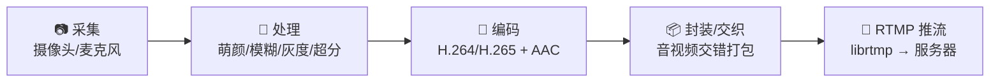

记录内容：

- 采集的数据可能来自哪里？
- 编码前可能做哪些处理？
- 为什么推流前需要编码和封装？

笔记：
- 视频来自摄像头，音频来自麦克风
- 美颜（FaceU 萌颜贴纸）、灰度、模糊（人脸保护场景）、超分（SR）
- 压缩传输大小，降低带宽成本；适配 RTMP 等传输协议

#### 3. Player 链路理解

Player 高层流程：

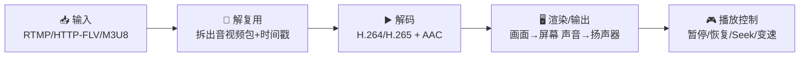

记录内容：

- 播放链路和推流链路的方向有什么不同？
- 解复用和解码分别解决什么问题？
- 渲染在播放链路中承担什么职责？

笔记：
- 播放是将远端的视频拉取到本地进行播放，推流是将视频推送到远端服务器
- 解复用负责把容器/协议中的 AVPacket，按音视频轨道和时间戳拆出来；解码负责把 AVPacket 转成可渲染/播放的 AVFrame
- 渲染负责把解码后的 AVFrame，按正确时间送到输出设备，让用户真正看见画面、听见声音

#### 4. 更多产品链路（v1.0.6+）

**MusicPlayer 链路：**

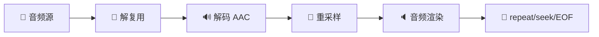

特点：纯音频播放，支持 repeat（重复播放）、seek（跳转）、EOF（播放结束处理）。

**AudioMixer 链路：**

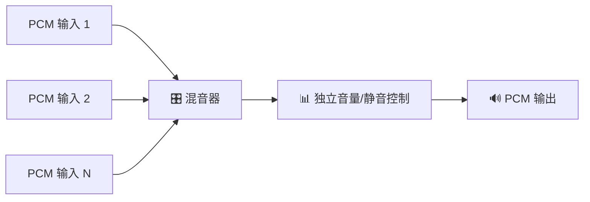

特点：多路音频混合，每路可独立控制音量和静音。

**Inference / FaceU（AI 推理 + 萌颜）：**

无人脸时自动触发人脸保护（画面模糊）。

### 当日关键词

| 关键词 | 我的理解 | 是否需要后续深入 |
| --- | --- | --- |
| 采集 | 从物理设备采集到原始的音视频数据 | 需要 |
| 编码 | 把 YUV 原始视频帧压缩成 H.264/H.265 等码流 | 需要 |
| 解码 | 将 H.264/H.265 等压缩码流还原成 YUV 这类原始视频帧 | 需要 |
| 封装 | 把编码后的音视频数据按协议或容器格式组织起来，方便传输和识别 | 需要 |
| 解复用 | 从容器或协议中拆出音频包、视频包和对应时间戳 | 需要 |
| RTMP | 一种常见的直播推流协议，用于把音视频流推送到服务器 | 需要 |
| 渲染 | 把解码后的音视频数据按正确时间送到屏幕和扬声器输出 | 需要 |
| 时间戳 | 标记音视频数据应该在什么时候播放，用于控制播放节奏和音画同步 | 需要 |
| 萌颜(FaceU) | 基于人脸检测的实时贴纸/特效渲染，跟随人脸运动 | 需要 |
| 人脸检测 | 从视频帧中定位人脸位置和关键点（眼睛、鼻子、嘴巴等） | 需要 |
| 混音(AudioMixer) | 将多路 PCM 音频混合成一路输出，每路可独立控制 | 需要 |
| SEI | 视频流中的补充增强信息，可携带自定义数据（如歌词、打赏信息） | 需要 |
| M3U8 | HLS 直播/点播的索引文件格式，项目支持带切换的 M3U8 素材 | 需要 |
| NAPI | HarmonyOS 上 C++ 与 ArkTS（JavaScript）的桥接层 | 需要 |
| 推理(Inference) | AI 模型在设备端的推理计算，项目用于人脸检测 | 需要 |
| 超分(SR) | Super Resolution，通过 AI 模型提升画面分辨率 | 需要 |

### 当日问题

1. RTMP协议具体是什么？

   答：RTMP 是基于 TCP 的实时音视频传输协议。它的具体内容包括：先建立 TCP 连接，再完成 C0/C1、S0/S1/S2、C2 握手；握手后通过 connect、createStream、publish/play 等命令建立推流或拉流会话；真正传输时会把控制消息、metadata、音频数据和视频数据组织成 RTMP Message，再拆成 Chunk 分块发送。常见推流数据组合是 H.264 视频、AAC 音频、FLV Tag 风格封装，再通过 RTMP Chunk 持续传给服务器。

2. 这个项目使用是硬编码还是软编码，二者有什么区别？

   答：从项目定位看，HJMedia 是跨平台 C++ 多媒体框架，编码能力通过组件或插件接入，支持多种方式。HarmonyOS 平台优先使用硬件编码（VideoOHEncoder），也支持软件编码方式。硬编码是使用系统或芯片提供的专用编码器，优点是速度快、功耗低，移动端直播常用；软编码是使用 CPU 和软件编码库完成压缩，优点是参数更灵活、画质调优空间更大，但更耗 CPU 和电量。

3. 在这个项目中RTMP的接入是怎么实现，需要去关注底层的TCP协议吗？

   答：本项目的 RTMP 接入封装在 HJRTMPMuxer、HJRTMPAsyncWrapper 和 HJRTMPWrapper 中。上层把编码后的 HJMediaFrame 交给 HJRTMPMuxer，Muxer 将其转成 HJFLVPacket，并通过 HJRTMPPacketManager 排队、补 metadata/audio header/video header；HJRTMPAsyncWrapper 异步取出 tag，最后由 HJRTMPWrapper 调用 librtmp 的 RTMP_SetupURL、RTMP_Connect、RTMP_ConnectStream、RTMP_Write 完成连接和发送。因此初期不需要重点关注底层 TCP，TCP 细节主要由 librtmp 和系统 socket 处理；当前更应该关注媒体帧如何封装成 RTMP 可发送的数据，以及项目如何处理队列、重试、统计和丢帧。

4. CHANGELOG 中我最感兴趣的版本更新

   - **v1.0.7（MessageBus 模块）**：Graph 和 Plugin 之间的类型安全同步消息调用机制。想知道这个机制如何解决了之前 Graph 和 Plugin 通信的问题。
   - **v1.0.6（音乐播放器+混音器）**：纯音频链路和推流/播放视频链路的架构差异是什么？混音器如何管理多路 PCM 输入？
   - **v1.0.2（萌颜功能）**：推流端和播放端同时支持萌颜，两端的实现位置有什么不同？人脸检测的多后端（ncnn/tnn/mindspore/CoreML）如何切换？

### 当日总结

- 今天主要建立了对 HJMedia 项目的整体认识：它是一个面向直播推流和直播播放的跨平台 C++ 多媒体框架，v1.0.7 已经扩展到了音乐播放、混音、AI 萌颜等更多场景。Pusher 链路是"采集 → 处理 → 编码 → 封装/交织 → RTMP 推流"，Player 链路是"输入/解复用 → 解码 → 渲染/输出 → 播放控制"。新增的 MusicPlayer 和 AudioMixer 让框架覆盖了更多音频场景。
- 通过梳理关键词，初步区分了编码/封装/解复用/解码/渲染的职责，以及萌颜、人脸检测、SEI、超分等 HJMedia 特有概念。
- 从 CHANGELOG 可以看到项目从 v1.0.0（基础推流）到 v1.0.7（MessageBus+音乐播放控制）的清晰演进路径。
- 目前还不需要深入底层 TCP 实现，更应该先关注项目中的媒体链路和模块边界。

---

## 第2天笔记：熟悉顶层目录结构

### 学习记录

#### 1. 顶层目录职责表

| 目录 | 主要职责 | 我的理解 | 优先级 |
| --- | --- | --- | --- |
| `src/core` | 核心运行时、图和节点基础抽象、播放器状态机、时间轴处理 | 模块负责搭建和调度媒体处理流程，包含 HJContext、HJGraphBase、HJMediaNode、HJMediaPlayer、HJTimelineHandler 等关键基类 | ★★★★★ |
| `src/graphs` | 端到端媒体流水线图编排 | 5 种 Graph：Pusher、LivePlayer、VodPlayer、MusicPlayer、AudioMixer。决定"数据怎么流" | ★★★★★ |
| `src/entry/pusher` | 推流入口模块（hsys+bridge+verify） | 面向产品的推流 API 入口，供 Harmony/Android 等平台调用 | ★★★★★ |
| `src/entry/player` | 播放入口模块（asys+hsys+isys+bridge+verify） | 面向产品的播放 API 入口，包含多平台支持 | ★★★★★ |
| `src/media` | 媒体类型、数据结构（capture/codec/demuxer/muxer/render/net/datasource/io/sei） | 提供媒体帧、媒体信息、编解码、解复用、封装等底层能力，11 个子模块 | ★★★★ |
| `src/comp` | 可组合媒体组件 | 把底层能力包装成可连接的业务组件，包含 graphic/prio/rte/utils 四个子模块 | ★★★★ |
| `src/plugins` | 插件式后端实现 | hsys（Harmony）、asys（Android）、isys（iOS）、wsys（Windows）各平台适配 | ★★★★ |
| `src/entry/hsys` | Harmony 通用入口（NAPI 导出） | 定义了 C++ 如何通过 NAPI 暴露给 ArkTS，理解 Harmony 集成的关键 | ★★★★ |
| `src/detect` | 多后端 AI 人脸检测 | 支持 ncnn/tnn/mindspore/CoreML/Vision 五种后端，可插拔架构 | ★★★ |
| `src/entry/render` | 渲染入口模块（asys+faceu） | 渲染管线入口，与萌颜处理相关 | ★★★ |
| `src/entry/inference` | AI 推理入口模块 | AI 推理的入口封装 | ★★★ |
| `src/entry/inferenceRender` | Harmony 推理+渲染整合 | 将推理和渲染流程在 Harmony 上合并管理 | ★★★ |
| `src/localserver` | 本地 HTTP 缓存服务 | 缓存管理、块文件管理、HTTP 下载器、本地 HTTP 服务器。支持边下边播 | ★★★ |
| `src/db` | 媒体数据库管理 | 基于 sqlite_orm，管理媒体信息和 Block 状态 | ★★ |
| `src/gui` | 桌面 GUI 框架 | 基于 ImGui，仅 Windows/macOS | ★★ |
| `src/convert` | 格式转换工具 | 非 macOS/iOS 平台编译 | ★★ |
| `src/utils` | 基础工具 | 线程封装 HJThread、平台工具（asys/hsys/osys/base） | ★★★ |
| `third_party` | 第三方源码依赖 | 20+ 个库（librtmp/fdk-aac/yyjson/spdlog/imgui/glfw 等），通过 depsync 管理 | ★ |
| `externals` | 按平台组织的预编译库 | ffmpeg/libyuv/mbedtls/openssl/x264/x265/ncnn/opencv 等 | ★ |
| `examples/harmony` | HarmonyOS 示例和 API 集成 | 包含 hjpusher、hjplayer、hjmediautils 三个 HAR 包 | ★★★ |
| `examples/windows` | Windows 演示/工具项目 | 8 个项目（HJMainUI、HJMediaUI、XMediaTools 等） | ★★ |
| `docs` | 架构/设计/产品/交付文档 | 包含 architecture/、plans/、product/、delivery/ | ★★★ |
| `cmake` | CMake 模块 | 40+ 个 FindXXX 脚本 + BuildSets/Configs/Utils 等 | ★ |

#### 2. 模块关系理解

初步关系（数据流方向）：

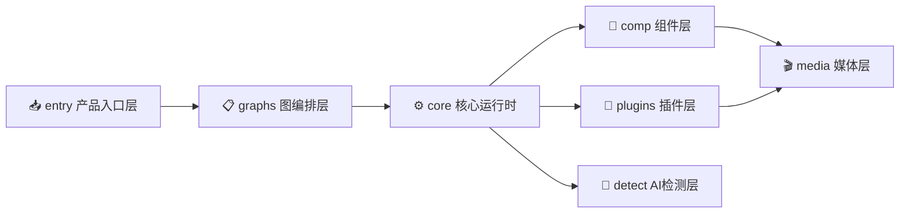

详细关系（三层架构 + 模块分解）：

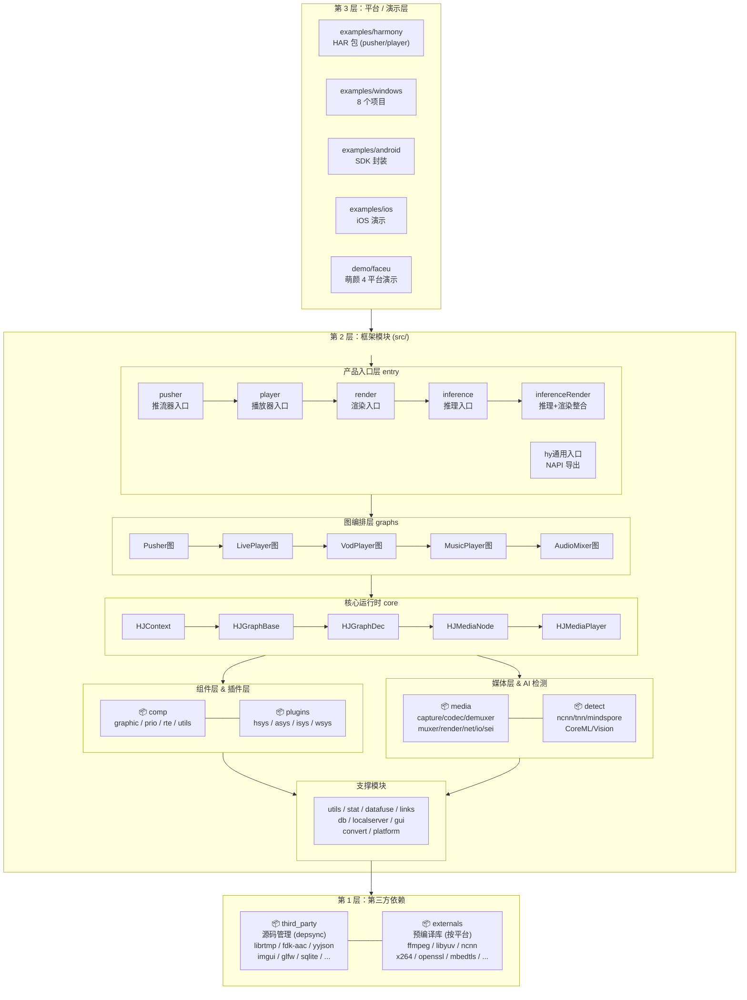

记录内容：

- `entry` 层主要负责什么？
  对外暴露 SDK API（如 Harmony 端的 NAPI 接口），将平台调用转换为内部 Graph 调用。

- `graphs` 层主要负责什么？
  决定数据流拓扑——什么组件按什么顺序连接，以及整个链路的生命周期管理。

- `comp` 层主要负责什么？
  提供可复用的业务组件，每个组件完成一个独立的媒体处理环节（编码、解码、渲染、前处理等）。

- `plugins` 和平台适配有什么关系？
  Plugin 是平台相关实现的具体载体。同一个功能（如音频渲染）在 Harmony、Android、iOS、Windows 上有不同的 Plugin 实现，上层 Graph 和 Comp 通过统一接口调用，不需要感知平台差异。

#### 3. 优先阅读目录

| 优先级 | 目录 | 原因 |
| --- | --- | --- |
| 1 | `src/core` | 所有模块的基类和核心运行时都在这里。理解 HJGraphBase 和 HJMediaNode 是看懂整个流水线的前提 |
| 2 | `src/graphs` | 5 种 Graph 展示了完整的业务场景数据流，是理解"产品功能如何被组装"的最佳入口 |
| 3 | `src/entry/pusher` + `src/entry/player` | 产品层入口，能看到 API 如何映射到内部调用，是追踪链路的第一站 |
| 4 | `src/comp/prio` + `src/comp/rte` | 这两条渲染管线是萌颜和图像处理的核心，理解它们能看懂框架最复杂的部分 |
| 5 | `src/plugins/hsys` | Harmony 平台的插件实现，是用 C++ 调用鸿蒙系统 API 的模板代码 |

### 当日问题

1. src/media 下的 11 个子模块分别是什么关系？

   答：media 按功能分目录：capture（采集原始数据）、codec（编解码）、com（通信）、datasource（数据源）、demuxer（解复用）、io（I/O）、muxer（封装）、net（网络）、render（渲染）、sei（SEI 处理）、test（测试）。它们之间是数据流上下游关系：capture→codec→muxer 构成推流方向，demuxer→codec→render 构成播放方向。

2. src/comp 下的 graphic/prio/rte/utils 四个子模块如何分工？

   答：graphic 是底层 OpenGL 基础（Shader、FBO、PBO、EGL），prio 是基于 FBO 的 GPU 后处理管线（萌颜/模糊/灰度/礼物/分屏），rte 是更现代的实时渲染引擎（超分/降噪/桥接），utils 是 FaceU 相关的工具。

3. examples 和 demo 有什么不同？

   答：examples 按平台组织的完整示例/HAR 包（harmony/android/ios/windows），demo 目前只有 faceu（萌颜 SDK 跨平台演示）。

### 当日总结

- 今天理清了项目的完整目录结构，核心层次链是 **entry → graphs → core → comp/plugins/media**。entry 是 API 入口，graphs 编排数据流，comp 和 plugins 提供具体的处理能力。
- 3 层体系非常清晰：第1层是第三方依赖（third_party+externals），第2层是框架模块（src/下的 18+ 个目录），第3层是平台/演示层（examples+demo）。
- 萌颜功能涉及多层：entry/render（入口）→ comp/prio 或 comp/rte（处理管线）→ src/detect（AI 人脸检测）→ comp/graphic（OpenGL 渲染）→ plugins（平台适配）。
- 目前最需要优先阅读的 5 个目录是：core、graphs、entry/pusher、entry/player、comp/prio。

---

## 第3天笔记：复习现代 C++ 基础

### 学习记录

#### 1. 类与对象

记录内容：

- 构造函数和析构函数在项目中如何使用？
- 类的成员变量和成员函数如何体现职责？
- 是否存在明显的接口类或抽象基类？

笔记：

HJMedia 项目广泛使用了面向对象设计，常见模式如下：

**构造函数**：大多数类的构造函数负责初始化核心成员变量。例如 HJContext 的构造函数初始化日志系统、环境变量和消息总线。部分类使用带参数的构造函数注入依赖。

**虚析构函数**：基类（如 HJGraphBase、HJMediaNode）都声明了虚析构函数，确保通过基类指针删除派生类对象时正确调用派生类析构函数。

**抽象基类**：项目大量使用抽象基类定义接口契约：
- `HJGraphBase` → `HJGraphDec` → 具体 Graph（Pusher/LivePlayer/VodPlayer/MusicPlayer）
- `HJMediaNode` → 各种具体 Node（HJNodeADecoder、HJNodeVDecoder、HJNodeARender 等）
- `HJPrioCom` / `HJRteCom` → 各种具体 Component
- Plugin 基类 → 各平台 Plugin 实现

**成员函数体现职责**：每个类的 public 方法基本就是该类的功能清单。例如 HJMediaPlayer 的 public 方法直接对应播放器 API（open/close/pause/resume/seek/setMute 等）。

#### 2. 继承与多态

记录内容：

- 哪些类使用了虚函数？
- 哪些类通过基类指针或引用使用？
- override 出现在哪些地方？

笔记：

| 类 / 文件 | 基类 | 派生类 | 主要职责 |
| --- | --- | --- | --- |
| `HJGraphBase` | — | HJGraphPusher、HJGraphLivePlayer、HJGraphVodPlayer、HJGraphMusicPlayer、HJGraphAudioMixer | 定义图的生命周期和节点管理接口 |
| `HJGraphDec` | HJGraphBase | HJGraphLivePlayer、HJGraphVodPlayer | 解码图基类，增加解码相关控制 |
| `HJMediaNode` | — | HJNodeADecoder、HJNodeVDecoder、HJNodeARender、HJNodeVRender 等 | 定义节点的 I/O 和生命周期 |
| `HJPrioCom` | — | HJPrioComFaceu、HJPrioComFBOBlur、HJPrioComFBOGray 等 | 前处理组件基类 |
| `HJRteCom` | — | HJRteComDraw、HJRteComSourceBridge、HJRteComSourceFaceu 等 | 实时引擎组件基类 |

**虚函数使用**：HJGraphBase 中的虚函数包括 createNode、connectNode、start/stop 等，派生类通过 override 实现具体行为。Plugin 系统也有类似的生命周期虚函数（init/start/process/stop/release）。

**基类指针**：Graph 内部通过 `std::shared_ptr<HJMediaNode>` 管理节点，通过基类指针调用多态接口。HJPrioGraph 通过 `HJPrioCom*` 基类指针管理所有前处理组件。

**override 关键字**：项目中大量使用 `override` 关键字（C++11 特性），几乎所有派生类的虚函数重写都标记了 override，便于编译期检查。

#### 3. 智能指针使用记录

| 文件 / 类 | 智能指针类型 | 管理对象 | 我的理解 |
| --- | --- | --- | --- |
| HJGraphBase | `std::shared_ptr` | HJMediaNode 节点 | 多个节点可能被 Graph 和组件同时引用，用 shared_ptr 管理生命周期 |
| HJGraphBase | `std::weak_ptr` | 反向引用/回调 | 避免循环引用（如节点持有指向 Graph 的回调） |
| HJContext | `std::unique_ptr` | 独占资源（如环境、线程池） | Context 是唯一所有者 |
| 各入口类 | `std::shared_ptr` | Graph 实例 | 入口层持有 Graph 的 shared_ptr，生命周期由入口控制 |

**项目智能指针使用特点**：
- `shared_ptr` 是主力，用于管理 Graph、Node、Plugin、MediaFrame 等核心对象的生命周期
- `unique_ptr` 用于管理独占资源（文件句柄、缓冲区、特定配置）
- `weak_ptr` 较少见，用于需要打破循环引用的场景
- 项目中很少看到裸指针 `new/delete`，基本都使用智能指针

#### 4. C++ 阅读问题清单

| 问题 | 影响阅读的原因 | 后续解决方式 |
| --- | --- | --- |
| 复杂的模板用法（如 sfinae、enable_if） | 部分工具类和容器使用了模板，增加理解难度 | 先跳过模板细节，关注功能行为 |
| lambda 捕获列表和闭包 | 项目中大量使用 lambda 作为回调，捕获列表复杂 | 重点理解 lambda 的生命周期和 this 捕获 |
| 移动语义和完美转发 | 在帧传递和队列操作中有使用 | 理解 move 语义何时触发，避免复制开销 |
| 多线程同步（mutex、condition_variable） | 帧队列和状态管理中大量使用 | 关注锁的粒度和死锁风险 |
| reinterpret_cast / static_cast 等类型转换 | 在媒体帧类型转换和平台 API 调用中常见 | 理解各种 cast 的适用场景和风险 |

### 当日问题

1. 项目中是否使用了 C++17 特性？

   答：是的，CMakeLists.txt 中明确设置了 `-std=c++17`（各平台均有对应设置）。项目中可以看到 `if constexpr`、`std::optional`、结构化绑定、折叠表达式、`std::variant` 等 C++17 特性的使用。

2. 项目中是否存在循环依赖问题？

   答：从目录结构看，core 依赖 media 和 utils，graphs 依赖 core 和 comp，entry 依赖 graphs。整体是单向依赖，架构清晰。但关注到 comp 和 plugins 之间可能存在复杂的相互引用，需要后续留意。

### 当日总结

- 今天系统复习了阅读 HJMedia 项目代码所需的 C++ 知识。项目大量使用了继承和多态（抽象基类 + override）、智能指针（主要是 shared_ptr）、lambda 回调等现代 C++ 特性。
- 关键基类体系：**Graph（HJGraphBase → 具体 Graph）**、**Node（HJMediaNode → 具体 Node）**、**Com（HJPrioCom / HJRteCom → 具体组件）**、**Plugin（基类 → 各平台实现）**。
- 项目使用 C++17 标准，代码组织规范，大部分地方可以靠类名和目录名推断职责。
- 后续阅读中遇到复杂的模板或多线程代码先标记、不深挖，以建立整体流程理解为主。

---

## 第4天笔记：学习音视频基础概念

### 学习记录

#### 1. 视频基础概念

| 概念 | 我的理解 | 项目中可能对应的位置 |
| --- | --- | --- |
| 帧 | 视频的最小单位，每一幅静态图像就是一帧。连续播放形成动态画面 | `src/media` 中的 HJMediaFrame 类 |
| 分辨率 | 一帧图像的宽×高像素数，如 1920×1080（1080p） | HJMediaFrame 中的 width/height 字段 |
| 帧率 | 每秒显示的帧数，单位 fps。帧率越高画面越流畅 | HJComVideoCapture 中的采集参数配置 |
| 码率 | 每秒钟编码输出的数据量，单位 bps/kbps。码率越高画质越好 | HJComVideoEncoder 中的编码参数配置 |
| 关键帧(I帧) | 包含完整图像数据的帧，不依赖其他帧就能解码。是随机访问的起点 | 视频编码中的 GOP 间隔配置 |
| GOP | Group of Pictures，两个关键帧之间的帧组。GOP 越小视频越可随机访问 | HJComVideoEncoder 中的 GOP 配置 |

#### 2. 音频基础概念

| 概念 | 我的理解 | 项目中可能对应的位置 |
| --- | --- | --- |
| 采样率 | 每秒对模拟音频信号的采样次数，如 44100Hz（CD 音质）、48000Hz（视频常用） | HJComAudioCapture 中的采集参数 |
| 声道数 | 音频通道数量：单声道(1)、立体声(2)、5.1 环绕声(6)等 | HJMediaFrame audio 数据的 channel 字段 |
| 采样格式 | 每个采样点的编码格式，如 16-bit 整数、32-bit 浮点 | HJComAudioResampler 中的数据格式转换 |
| 音频帧 | 音频处理的基本单位，AAC 编码固定每帧 1024 个采样点 | HJComAudioFrameCombine 中的拼帧处理 |
| 音频码率 | 音频编码的数据量，AAC 常见 128kbps（高质量） | HJComAudioEncoder 中的编码参数 |

#### 3. 时间戳相关概念

| 概念 | 我的理解 | 为什么重要 |
| --- | --- | --- |
| PTS | Presentation Time Stamp，显示时间戳，决定帧什么时候被显示 | 播放时按 PTS 决定渲染时机，控制画面节奏 |
| DTS | Decode Time Stamp，解码时间戳，决定帧什么时候被解码 | 存在 B 帧时，解码顺序和显示顺序不同，DTS 和 PTS 会不一致 |
| 时间戳 | 音视频帧的时间标记，用 pts/dts 表示，单位通常为微秒或毫秒 | 音画同步、播放速度控制、Seek 操作都依赖精确的时间戳 |
| 音画同步 | 音频和视频按各自的时间戳协调播放，避免声音比画面快或慢 | 项目中通过时间轴（HJTimeline）和缓冲管理来控制同步 |
| 延迟 | 从数据产生到被播放出来的时间差，直播场景延迟尤其重要 | 推流端通过带宽适配和动态追帧策略控制延迟 |

#### 4. 常见格式和协议

| 格式 / 协议 | 类型 | 我的理解 | 是否需要深入 |
| --- | --- | --- | --- |
| H.264 | 视频编码格式 | 目前最广泛使用的视频编码，兼容性好，压缩率较高 | 需要 |
| H.265 | 视频编码格式 | H.264 的继任者，同画质下码率降低 30-50%，但编码更复杂 | 需要 |
| AAC | 音频编码格式 | 目前最广泛使用的音频编码，项目中使用 fdk-aac 编解码器 | 需要 |
| FLV | 封装格式 | Adobe 的容器格式，适合直播场景，RTMP 推流实际使用 FLV Tag 封装 | 需要 |
| MP4 | 封装格式 | 最通用的媒体容器格式，项目推流录制使用 MP4 | 需要 |
| M3U8 | 索引/播放列表 | HLS 直播/点播的索引文件，项目支持带切换的 M3U8 素材 | 需要 |
| RTMP | 传输协议 | 基于 TCP 的直播推流协议，使用 librtmp 库实现 | 需要 |
| HTTP-FLV | 传输协议 | 通过 HTTP 传输 FLV 流，兼容性好，常替代 RTMP 用于播放 | 需要 |
| HLS | 传输协议 | 苹果的 HTTP Live Streaming 协议，切片 + M3U8 索引 | 了解即可 |

#### 5. HJMedia 特有概念

| 概念 | 我的理解 | 项目中可能对应的位置 |
| --- | --- | --- |
| SEI | 补充增强信息，在视频码流中的特定位置嵌入自定义数据 | `src/media/sei`、`docs/sei_handling_design.md`、player 的 seiCall 回调 |
| 萌颜(FaceU) | 基于人脸关键点的动态贴纸渲染，人脸转动时贴纸跟随 | `src/comp/prio/HJPrioComFaceu`、`src/comp/rte/HJRteComSourceFaceu`、`src/comp/utils/HJFacePointMgr` |
| 人脸保护 | 在无人直播状态下检测不到人脸时自动模糊画面 | `src/comp/prio/HJPrioComFBOBlur`、配合检测模块 |
| 超分(SR) | 通过 AI 模型将低分辨率画面提升为高分辨率 | `src/comp/rte/HJRteComDrawSRFilter` |
| ROI 编码 | 对视频帧的特定区域（如人脸）使用更高质量编码 | `src/plugins/hsys/HJPluginVideoOHEncoder`（HarmonyOS 支持） |

### 流程理解

#### 摄像头画面推到 RTMP 服务器

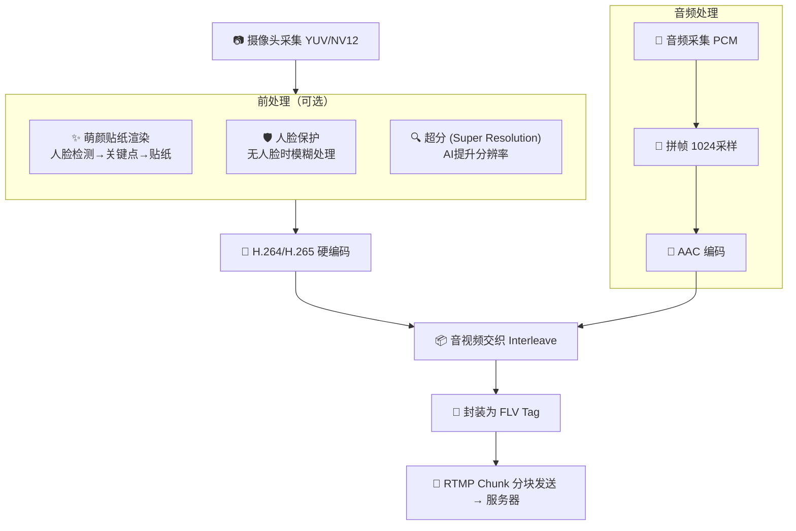

#### 从地址播放视频

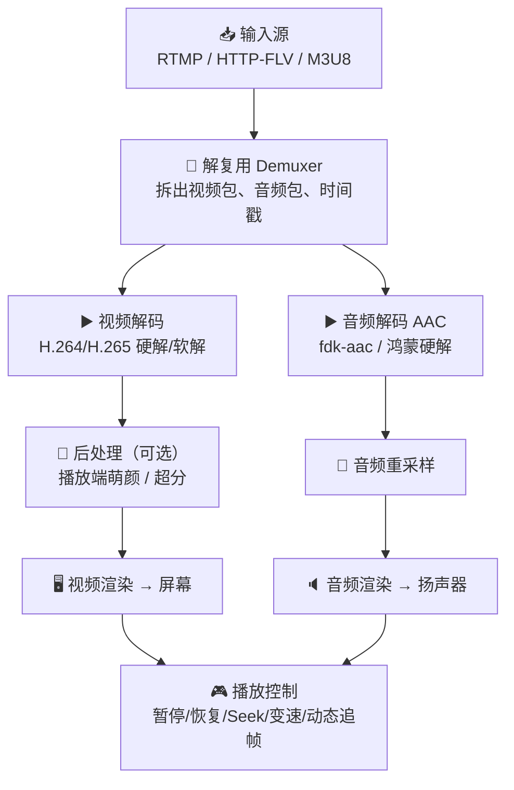

### 当日问题

1. 编码和封装的区别是什么？

   答：编码是将原始数据（YUV 视频、PCM 音频）压缩成编码格式（H.264、AAC），解决"怎么压缩数据"的问题；封装是把编码后的码流按容器格式（FLV、MP4）组织成文件或流，解决"怎么组织和存储数据"的问题。项目中编码由 HJComVideoEncoder/HJComAudioEncoder 完成，封装由 HJComMuxer 或 RTMP 封装流程完成。

2. 解复用和解码的区别是什么？

   答：解复用（Demuxer）将容器/协议拆成独立的音频包和视频包（保持压缩状态），编码后的数据量小；解码（Decoder）将压缩的包还原成可渲染的原始帧（YUV/PCM），数据量大。项目中解复用由 HJComDemuxer 完成，解码由 HJNodeVDecoder/HJNodeADecoder 完成。

3. 萌颜在推流端和播放端的工作位置有什么不同？

   答：推流端的萌颜在**编码之前**进行，采集到的原始画面先经过人脸检测和贴纸渲染再编码，远端播放器直接看到带萌颜的画面；播放端的萌颜在**解码之后、渲染之前**进行，解码后的画面再经过萌颜处理再渲染。代码中分别对应 `src/comp/prio`（前处理管线）和播放端的后处理流程。

### 当日总结

- 今天系统学习了音视频基础概念，建立了从帧/分辨率/帧率→编码/封装→推流/播放的完整知识链条。特别关注了 HJMedia 特有的概念（SEI、萌颜、人脸保护、超分、ROI）。
- 两种流程图画出来了：推流方向（采集→前处理→编码→交织→RTMP），播放方向（输入→解复用→解码→后处理→渲染）。可以清晰地看到两者是"对称"的数据流方向。
- 萌颜在推流端和播放端的差异值得后续深入：推流端在编码前处理，播放端在解码后处理，代码路径完全不同。

---

## 第5天笔记：初步阅读 Pusher 入口链路

### 学习记录

#### 1. 重点文件 / 类记录

| 文件 / 类 | 主要职责 | 我看到的关键方法 | 疑问 |
| --- | --- | --- | --- |
| `src/entry/pusher/hsys/HJPusher.cpp/h` | Pushser Harmony 入口，NAPI 导出 | contextInit、createPusher、destroyPusher、openPreview、closePreview、setWindow、openPusher、closePusher、setMute、openRecorder、closeRecorder | Harmony NAPI 的具体绑定逻辑在哪里？ |
| `src/entry/pusher/hsys/bridge/` | 平台桥接层 | Napi 函数定义、同步/异步调用处理 | bridge 如何桥接 NAPI 和内部 C++ 实现？ |
| `src/entry/pusher/hsys/verify/` | 验证/测试代码 | 各种验证场景 | verify 算不算正式的测试，还是仅为调试使用？ |
| `src/entry/hsys/HJNativeExportCommon.cpp/h` | Harmony 通用 NAPI 导出工具 | 注册导出函数、线程安全包装 | 如何管理多个导出模块的注册？ |
| `src/entry/hsys/HJEntryBaseRender.cpp/h` | Harmony 渲染入口基类 | 渲染初始化、Surface 绑定 | 推流器和播放器是否共用这个渲染基类？ |
| `src/entry/hsys/ThreadSafeFunctionWrapper.cpp/h` | NAPI 线程安全函数包装 | 异步回调的线程安全调用 | NAPI 线程模型是怎样的？ |
| `src/entry/render/asys/` | Android 渲染入口 | setSurface、renderFrame | Android 渲染入口只在 pushser 启动时使用？ |

#### 2. 推流启动流程初步整理

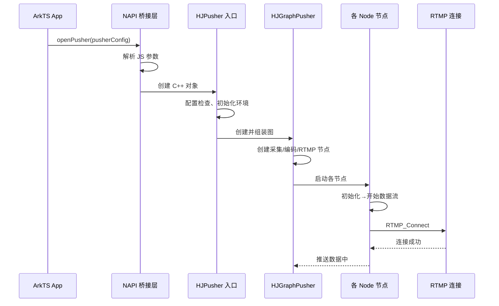

记录内容：

- **推流入口在哪里？**
  `src/entry/pusher/hsys/HJPusher.cpp` 是 Harmony 平台的推流入口。Platform 层的 C++ 代码通过 NAPI 导出，供 ArkTS 调用。

- **初始化参数在哪里传入？**
  通过 `contextInit` 静态方法（日志配置），`createPusher` 创建实例，`openPusher` 传入 PusherConfig（推流 URL、编码参数、分辨率等）。

- **图或组件在哪里创建？**
  `createPusher` 过程中创建 Graph 实例，`openPusher` 时 Graph 开始启动和连接节点。

- **RTMP 输出可能在哪里完成？**
  在 `src/media/muxer` 中（HJRTMPMuxer、HJRTMPWrapper），由 HJGraphPusher 中的 RTMP 相关节点调用。

#### 3. 不理解的函数或类

| 函数 / 类 | 所在文件 | 不理解的点 | 后续跟进 |
| --- | --- | --- | --- |
| NAPI 绑定宏/函数 | `HJPusher.cpp` | Harmony NAPI 的 napi_property_descriptor 具体如何工作 | 第4周学习 Harmony 集成时深入 |
| HJGraphPusher | `src/graphs/` | 具体的节点装配顺序和配置流程 | 第2周重点阅读 |
| HJComVideoCapture | `src/comp/` | 具体如何调用摄像头 API | 第2周重点阅读 |
| HJComRTMP | `src/comp/` | 推流重试机制和拥塞丢包策略具体怎么实现 | 第2周重点阅读 |
| MessageBus | `src/core/` v1.0.7 新增 | Graph 和 Plugin 之间的消息调用机制 | 第2/3周阅读 |

### 当日问题

1. NAPI 是什么？

   答：Native API，HarmonyOS 上 C++ 和 ArkTS（JavaScript）之间互相调用的桥接层。本质上和 Node.js 的 N-API 类似。项目中通过注册 napi_property_descriptor、处理 napi_callback 来实现 JS 对 C++ 的调用。HJPusher 中通过 NAPI 导出了 contextInit/createPusher/openPusher 等方法。

2. 验证目录（verify）和测试目录（test）有什么区别？

   答：verify 位于 entry 下（如 `src/entry/pusher/hsys/verify`），看起来是面向特定 Harmony 平台的验证代码，可能在模拟器或真机上运行来验证功能正确性。test 位于各底层模块下（如 `src/db/test`、`src/localserver/test`），是正式的单元测试。

3. 推流器支持同时推流和录制吗？

   答：支持，README 特性中提到"推流过程中随时短视频录制"，通过 openRecorder 开启 MP4 录制功能，不影响同时推流。

### 当日总结

- 今天初步阅读了 pusher 入口链路，形成了"ArkTS API → NAPI 桥接层 → pusher 入口 → Graph 组装 → 各节点启动"的调用链路理解。
- Harmony 平台的 NAPI 导出体系值得重点关注，整个 `src/entry/hsys` 目录定义了通用的 NAPI 导出工具（HJNativeExportCommon、ThreadSafeFunctionWrapper），pusher 和 player 都基于它构建。
- 入口层主要职责是：参数解析、生命周期管理、调用 Graph 层完成实际功能。不直接处理媒体数据。
- 第2周阅读 pusher 时，应该从 HJGraphPusher 开始，重点看它的节点装配逻辑和各组件/插件的连接方式。

---

## 第6天笔记：初步阅读 Player 入口链路

### 学习记录

#### 1. 重点文件 / 类记录

| 文件 / 类 | 主要职责 | 我看到的关键方法 | 疑问 |
| --- | --- | --- | --- |
| `src/entry/player/hsys/HJPlayer.cpp/h` | Player Harmony 入口 | contextInit、createPlayer、destroyPlayer、setWindow、openPlayer（含 SEI 回调）、closePlayer、exitPlayer、setMute、preloadUrl | exitPlayer 和 closePlayer 有什么区别？ |
| `src/entry/player/hsys/bridge/` | Player 平台桥接层 | Napi 函数定义，将 JS 调用桥接到 C++ | 和 pusher 的 bridge 是否有共享部分？ |
| `src/entry/player/hsys/verify/` | Player 验证代码 | 播放流程验证 | 推流和播放的 verify 测试用例有什么不同？ |
| `src/entry/player/asys/` | Android 播放器入口 | Android JNI 封装 | Android 和 Harmony 入口的代码差异有多大？ |
| `src/entry/player/isys/` | iOS 播放器入口 | iOS 封装 | iOS 还在开发中吗？ |
| `src/core/HJMediaPlayer.cc/h` | 播放器核心状态机 | open、close、pause、resume、seek、setMute、getStatus | 状态机有多少种状态？状态转换图是什么？ |
| `src/entry/inference/asys/` | Android 推理入口 | 推理初始化、模型加载 | 推理模块和播放器的耦合关系？ |

#### 2. 播放启动流程初步整理

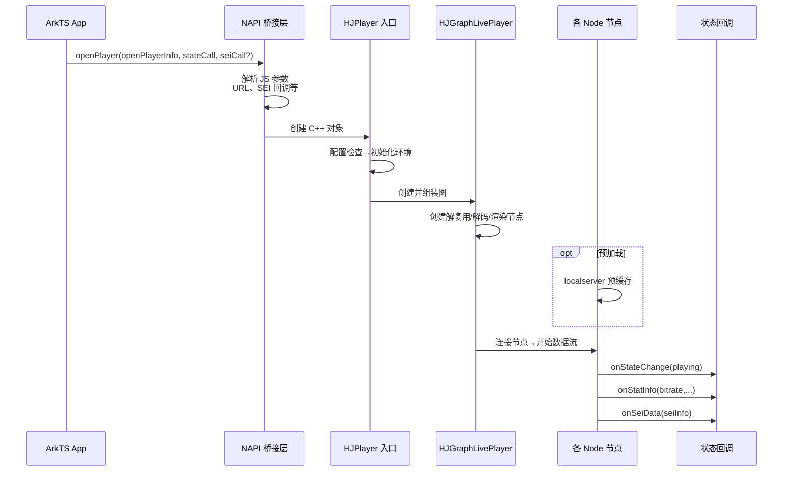

记录内容：

- **播放入口在哪里？**
  `src/entry/player/hsys/HJPlayer.cpp` 是 Harmony 平台的播放入口。根据不同平台（asys/isys/hsys）有不同的入口实现。

- **播放地址或输入源在哪里传入？**
  通过 `openPlayer` 的 OpenPlayerInfo 参数传入（URL 或本地路径），或者 `preloadUrl` 预加载。

- **播放控制状态如何体现？**
  通过 stateCall 回调（状态变更通知上层）、statCall（统计信息）、seiCall（SEI 数据）。播放器核心状态机在 HJMediaPlayer 中实现。

- **解复用、解码、渲染分别可能在哪里完成？**
  解复用：src/media/demuxer + HJComDemuxer；解码：src/media/codec + HJNodeVDecoder/HJNodeADecoder；渲染：src/media/render + HJNodeVRender/HJNodeARender。具体由 Graph 层决定哪个节点使用哪个实现。

#### 3. Pusher 与 Player 对比

| 对比项 | Pusher | Player |
| --- | --- | --- |
| 数据流方向 | 采集 → 处理 → 编码 → 推送到远端（内部→外部） | 接收远端 → 解复用 → 解码 → 渲染（外部→内部） |
| 入口职责 | 管理采集、编码、推流、录制的生命周期 | 管理解复用、解码、渲染、播放控制的生命周期 |
| 主要组件 | Capturer、Encoder、Muxer、RTMP | Demuxer、Decoder、Render、Preloader |
| 状态控制 | 推流状态（preview/pushing/recording） | 播放状态（loading/playing/paused/stopped/eof） |
| 平台依赖 | 相机/麦克风采集、硬编码需平台支持 | 硬解码、渲染输出需平台支持 |
| 萌颜集成 | 编码前（src/comp/prio 前处理管线） | 解码后（需额外组件） |

**相同点**：
1. 都使用 entry → graphs → core → comp/plugins 的层次调用
2. 都通过 NAPI 导出给 Harmony ArkTS 使用
3. 都共享 src/entry/hsys 中的通用 NAPI 工具

**不同点**：
1. 数据流方向完全相反
2. Pusher 涉及采集设备（相机/麦克风），Player 涉及渲染输出设备（屏幕/扬声器）
3. Pusher 的萌颜在编码前（前处理），Player 的萌颜在解码后（后处理）

#### 4. 不理解的函数或类

| 函数 / 类 | 所在文件 | 不理解的点 | 后续跟进 |
| --- | --- | --- | --- |
| HJGraphLivePlayer vs HJGraphVodPlayer | `src/graphs/` | 两种 player graph 的节点配置有什么差异？ | 第3周重点阅读 |
| HJMediaPlayer 状态机 | `src/core/HJMediaPlayer.cc` | 完整的状态转换图 | 第3周阅读 |
| preloadUrl 实现 | `src/localserver/` | 预加载和边下边播的关系 | 第3周阅读 |
| SEI 回调 | `src/media/sei/` | SEI 数据如何在码流中嵌入和解析 | 第3周阅读 |
| inferenceRender 整合 | `src/entry/inferenceRender/` | 推理和渲染如何协同工作 | 第3周阅读 |

### 当日问题

1. 播放器支持哪些输入协议？

   答：支持 HTTP-FLV、RTMP、M3U8（HLS，含带切换的变体）。覆盖了目前直播和点播的主流协议。

2. 播放器有几种 Graph 类型？

   答：至少 3 种：HJGraphLivePlayer（直播）、HJGraphVodPlayer（点播）、HJGraphMusicPlayer（纯音频）。直播和点播的解复用/解码逻辑有差异（直播需要动态追帧，点播需要 Seeks/变速支持）。

3. exitPlayer 和 closePlayer 的区别？

   答：closePlayer 是关闭当前播放（释放资源但保留播放器实例），exitPlayer 是完全退出（销毁播放器实例）。对应 API 文档中 destroyPlayer 和 closePlayer 的区分。

### 当日总结

- 今天阅读了 player 入口链路，对比了 pusher 和 player 的架构差异。两者遵循相同的 entry → graphs → core → comp/plugins 层次结构，但数据流方向完全相反。
- Player 的状态管理比 Pusher 更复杂（支持暂停/恢复/Seek/变速/预加载/自动重连），对应 HJMediaPlayer 状态机。
- Player 的萌颜后处理路径和 Pusher 的前处理路径完全不同，对应代码位于不同的组件中。
- 播放器有 3 种 Graph 变体（Live/Vod/Music），分别针对不同播放场景优化。
- inference 和 inferenceRender 模块和 player 的关系需要后续深入了解——它们提供了播放端 AI 能力（如萌颜后处理）。

---

## 第7天笔记：整理本周学习成果与复盘

### 本周总结

#### 1. 项目整体理解

HJMedia 是花椒直播开源的跨平台 C++ 多媒体框架（v1.0.7），以 HarmonyOS 为首要平台，延伸支持 Android/iOS/Windows/macOS/Linux。核心产品链路包括：

- **Pusher**：采集 → 前处理 → 编码 → RTMP 推流（支持录制）
- **Player**：输入 → 解复用 → 解码 → 渲染（直播/点播/纯音频三种 Graph 变体）
- **MusicPlayer**：纯音频播放链，支持 repeat/seek/EOF
- **AudioMixer**：多路 PCM 输入混音
- **Inference/FaceU**：AI 人脸检测 + 萌颜渲染

项目采用**图驱动流水线模型**，数据流由组件（Node/Com/Plugin）组装成图（Graph），支持 5 种 Graph 类型。图层的核心基类在 `src/core`，具体业务组装在 `src/graphs`，处理单元在 `src/comp` 和 `src/plugins`。

版本演进路线清晰（v1.0.0 推流 → v1.0.1 播放 → v1.0.2 萌颜 → v1.0.5 硬编码硬解 → v1.0.6 音乐播放器/混音器 → v1.0.7 MessageBus），每个版本都在之前基础上增加核心能力。

#### 2. 目录结构理解

项目的三层架构：

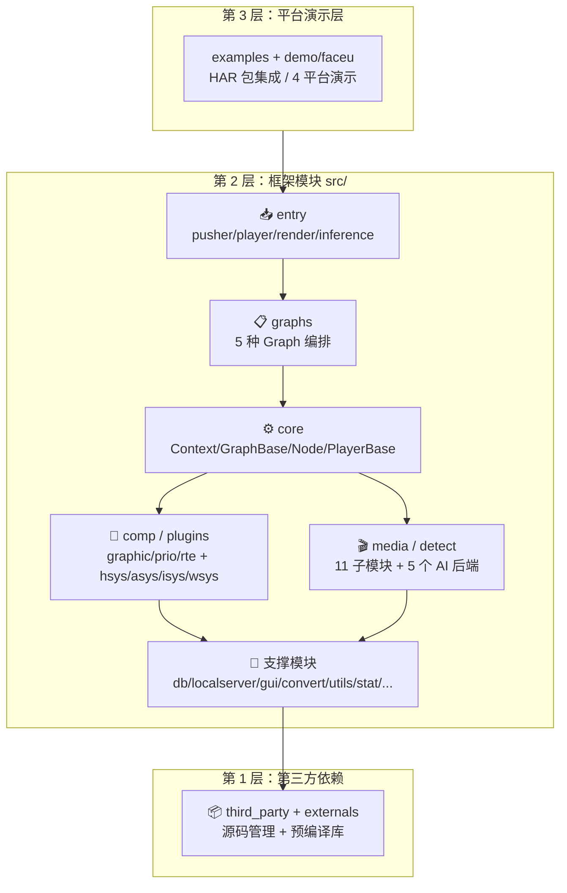

关键层次调用关系：**entry → graphs → core → comp/plugins/media/detect**，整体是单向依赖，架构清晰。

#### 3. Pusher 流程理解

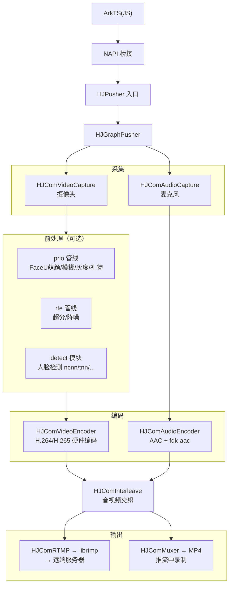

#### 4. Player 流程理解

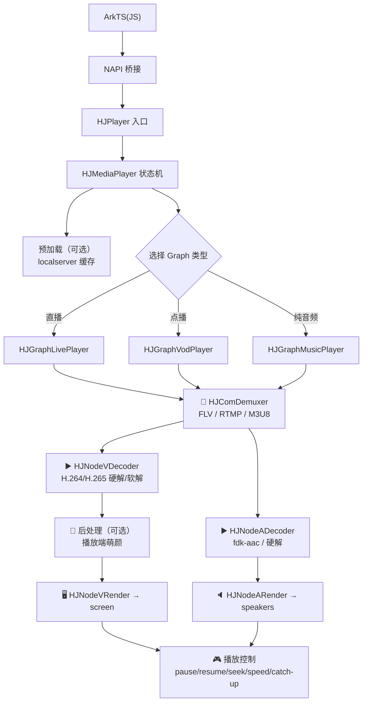

#### 5. C++ 薄弱点

| 薄弱点 | 具体表现 | 下周如何补齐 |
| --- | --- | --- |
| 模板元编程 | enable_if、SFINAE 相关代码理解困难 | 先标记，不做深入。模板主要用在工具层和容器 |
| 多线程细节 | condition_variable 的各种等待策略 | 关注 HJMediaFrameDeque 的线程安全实现 |
| 移动语义深入 | std::move 的性能影响和右值引用传递链 | 理解基本场景即可，不影响流程阅读 |
| 类型转换 | reinterpret_cast 在平台 API 中的大量使用 | 重点是理解转换目的，不纠结语法细节 |

#### 6. 音视频薄弱点

| 薄弱点 | 具体表现 | 下周如何补齐 |
| --- | --- | --- |
| H.264/H.265 码流结构 | NAL Unit、SPS/PPS 的具体含义 | 遇到相关代码时再深入学习 |
| AAC 编码细节 | ADTS 头、Raw Block 结构 | 阅读 HJComAudioEncoder 时学习 |
| RTMP 协议细节 | Chunk 分块策略、不同 Message Type | 阅读 HJRTMPMuxer 时学习 |
| YUV 色彩空间 | NV12/NV21/I420 区别和转换 | 阅读视频采集代码时学习 |

### 本周问题清单

| 优先级 | 问题 | 所属方向 | 下周跟进方式 |
| --- | --- | --- | --- |
| 高 | Pusher 图(HJGraphPusher)的节点装配顺序是什么？ | 第2周 | 阅读 src/graphs/HJGraphPusher 源码 |
| 高 | 萌颜前处理(prio)和后处理(rte)两条管线的具体切换逻辑？ | 第2周 | 阅读 src/comp/prio 和 src/comp/rte |
| 高 | 硬编码(HJPluginVideoOHEncoder)参数如何配置？ | 第2周 | 阅读 plugins/hsys 编码器实现 |
| 中 | 播放器的 3 种 Graph 如何根据输入 URL 选择？ | 第3周 | 阅读 HJMediaPlayer 和图创建逻辑 |
| 中 | MessageBus 的消息传递机制 | 第2/3周 | 阅读 MessageBus 相关代码 |
| 中 | 本地缓存(localserver)的边下边播流程 | 第3周 | 阅读 src/localserver |
| 低 | NAPI 导出的详细配置 | 第4周 | 阅读 src/entry/hsys |
| 低 | CMake 平台分支的具体条件 | — | 阅读 CMakeLists.txt 平台配置 |

### 第2周学习重点

| 优先级 | 文件 / 目录 | 学习目的 |
| --- | --- | --- |
| 1 | `src/graphs/HJGraphPusher.cpp/h` | 理解推流图的节点装配和数据流拓扑 |
| 2 | `src/comp/prio/` → HJPrioGraph、HJPrioComFaceu 等 | 理解前处理渲染管线（萌颜等） |
| 3 | `src/comp/rte/` → HJRteGraph、HJRteComDraw 等 | 理解实时渲染引擎（超分/降噪） |
| 4 | `src/media/muxer/` → HJRTMPMuxer、HJRTMPWrapper | 理解 RTMP 输出链路 |
| 5 | `src/detect/` → ncnn/tnn/mindspore | 理解多后端人脸检测的可插拔架构 |

### 第1周自评

| 项目 | 评分（1-5） | 说明 |
| --- | --- | --- |
| 项目定位理解 | ★★★★☆ | 理解了 5 条产品链路和版本演进，但对 MusicPlayer/AudioMixer 的理解还需代码验证 |
| 目录结构理解 | ★★★★☆ | 30+ 个目录的职责已基本理清，但 src/comp/rte 和 prio 的具体分工需要继续深入 |
| Pusher 流程理解 | ★★★★☆ | 高层流程清晰，但还缺少组件层面调用细节的理解 |
| Player 流程理解 | ★★★☆☆ | 理解了播放链路和 3 种 Graph 类型，但状态机细节还不清楚 |
| C++ 阅读准备 | ★★★☆☆ | 基础 C++ 17 够用，但模板和多线程方面还需要边看边学 |
| 音视频基础理解 | ★★★★☆ | 基础概念已建立，H.264 码流结构和 RTMP 协议细节需要深入 |

### 下周行动计划

1. 第2周目标：深入理解 Pusher 完整链路，从 HJGraphPusher 开始，追踪数据流到每个组件和插件。
2. 重点关注 prio 管线的萌颜处理逻辑和 detect 模块的人脸检测调用链。
3. 同时关注 MessageBus（v1.0.7 新增）的实现，理解 Graph 和 Plugin 之间的消息机制。

---

## 本周输出物完成情况

| 输出物 | 是否完成 | 文件 / 位置 | 备注 |
| --- | --- | --- | --- |
| 项目理解总结 | ✅ | 写在 Day7 总结中 | 5 条产品链路 + 版本演进 |
| 顶层目录职责表 | ✅ | Day2 笔记 | 30+ 个目录完整列出 |
| HJMedia 模块关系图 | ✅ | Day2 笔记 | 3 层架构 + 层次调用关系 |
| 音视频关键词表 | ✅ | Day1 + Day4 笔记 | 16 个通用概念 + 5 个 HJMedia 特有概念 |
| HJMedia 特有概念说明 | ✅ | Day4 笔记 | SEI/萌颜/人脸保护/超分/ROI |
| Pusher 高层流程图 | ✅ | Day4 + Day7 笔记 | 含萌颜前处理分支 |
| Player 高层流程图 | ✅ | Day4 + Day7 笔记 | 含 3 种 Graph 分支 |
| C++ 阅读问题清单 | ✅ | Day3 笔记 | 4 个主要问题 |
| 第1周问题清单 | ✅ | Day7 笔记 | 8 个问题按优先级排序 |
| 第2周学习重点 | ✅ | Day7 笔记 | 5 个最优先阅读目录 |
